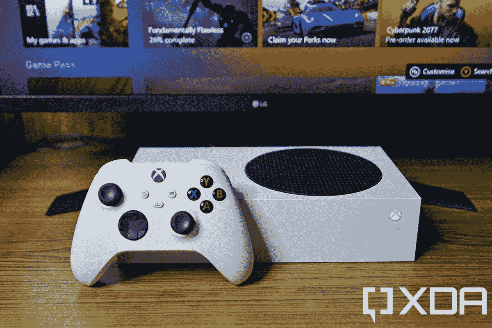
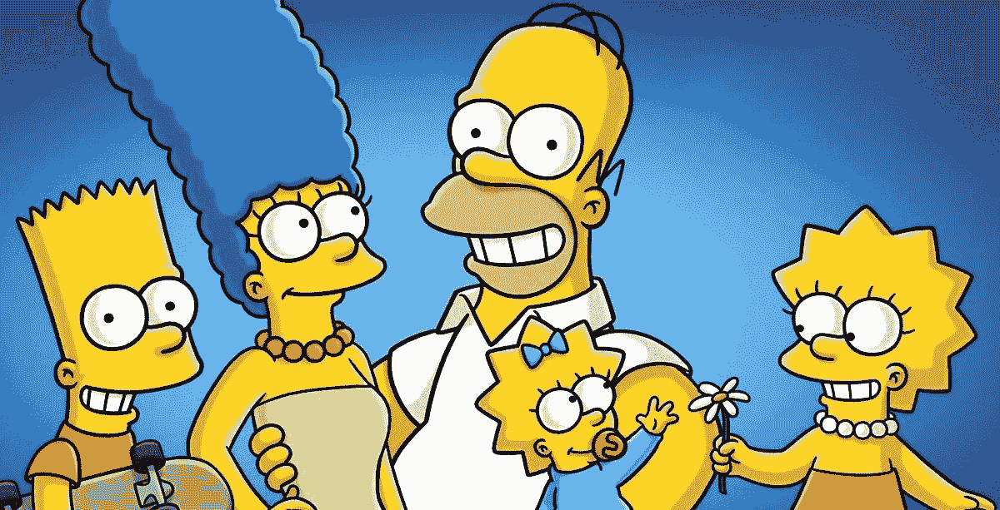

# 这是微软花 687 亿美元可以买到的东西。而不是动视

> 原文：<https://www.xda-developers.com/microsoft-activision-blizzard-buy-roundup/>

微软周一宣布，它将收购动视暴雪，这是一家游戏发行商，推出了《T2 使命召唤》、《撞车 Bandicoot》、《魔兽世界》、《守望先锋》( Overwatch)、以及许多其他热门游戏系列。这不仅是微软历史上最大的一笔收购，2016 年它以 260 亿美元收购了 LinkedIn，现在排名第二，也是整个视频游戏行业最大的交易之一。

然而，微软本可以花 687 亿美元在很多其他事情上，而不是一家以[职场骚扰](https://news.bloomberglaw.com/daily-labor-report/activision-blizzard-sued-by-california-over-frat-boy-culture)而闻名的公司。

**1。几乎地球上每个人的游戏通行证。** Xbox Game Pass 是微软的全接入订阅服务，用于玩游戏和流媒体游戏，基本层可以访问 Xbox 或 PC 游戏(但不能同时访问这两种游戏)[每月费用为 9.99 美元](https://www.microsoft.com/en-US/store/b/compare-xbox-game-pass-plans)。据估计，目前地球上的人口约为 79 亿，所以每个月给每个人发放游戏通行证大约需要 780 亿美元。这比 687 亿美元略高，但至少有一些人对电子游戏不感兴趣。

**2。超过 2.29 亿台 Xbox 系列游戏机。Xbox S 系列是目前最便宜的 Xbox 游戏机，零售价为 299 美元，你可以用动视暴雪 687 亿美元的收购价购买 229，765，886 台。你会剩下 86 美元，你可以花在一两个游戏上。**

 <picture></picture> 

The Xbox Series S

**3。还清 3%的助学贷款债务。**美国美联储[估计](https://www.cnbc.com/2021/09/09/america-has-1point73-trillion-in-student-debtborrowers-from-these-states-owe-the-most.html)2021 年第二季度，美国人欠下总计 1.73 万亿美元的学生贷款。动视暴雪的收购价格不会对这一点产生巨大的影响，但是，嘿，每一点都有帮助。

**4。超过 14 亿份 *Just Dance 2022* 。**通常零售价为 49.99 美元，微软可以把 *Just Dance* 作为礼物送给中国或印度的所有人(可惜不是两国)。现在亚马逊上的 Switch 版本为 24.99 美元，所以如果微软动作快，该公司可能会向大约两倍的人分发 Just Dance。不要太在意大约只有 1 亿台任天堂 Switch 游戏机存在。

**5。超过 80 亿个巨无霸。我在当地麦当劳吃的巨无霸(价格因地点而异)价格是 8.49 美元，所以 687 亿美元将支付 80 亿多一点的巨无霸。*百胜。***

**6。我的旧手机。**我正试图出售在抽屉里找到的一部旧 LG 手机，但没人要。微软肯定有足够的钱，我觉得公司应该收购。

 <picture></picture> 

Microsoft could have bought *The Simpsons* and the *X-Men* film franchise, if Disney didn't get to them first.

**7。几乎所有的福克斯娱乐业务。**华特·迪士尼公司于 2019 年完成了对福克斯娱乐业务的收购，总价格[达到 713 亿美元](https://www.cbsnews.com/news/disney-fox-deal-valued-at-71-3-billion-approved-by-shareholders/)。这比微软为激活暴雪支付的费用略高，但如果微软首席执行官塞特亚·纳德拉在他的沙发垫里找找零钱，他可能会补上差额。

8。超过 18 亿盒 HP 65 三色墨水。打印机墨水很贵，但是有了这么多钱，微软可以购买足够的惠普 XL 三色墨水来打印至少 10 或 20 张全彩页面。

9。差不多三艘 Sprint 航母。 [T-Mobile 在 2020 年完成了对移动无线网络 Sprint 的收购](https://www.reuters.com/article/us-sprint-corp-m-a-t-mobile-us-idUSKBN21J5Q2)，这笔交易估计在 230 亿美元左右。微软本可以为这个价格支付三倍于 T31 的价格。想象一下，如果 Xbox Game Pass 包含无限的手机数据，那会是什么样子。

10。一些国际空间站。通常被描述为有史以来建造的最昂贵的单个物体，[到 2010 年，国际空间站](https://en.wikipedia.org/wiki/International_Space_Station#Cost)(包括几个航天飞机轨道飞行器的成本)的账单是 1500 亿美元，该站继续维护到今天。微软的 687 亿美元肯定不够购买整个国际空间站，但微软可能会购买一些空间站的模块。也许是那辆 [Canadarm](https://en.wikipedia.org/wiki/Mobile_Servicing_System#Canadarm2) ？

*你会如何花费 687 亿美元？请在评论中告诉我们。*