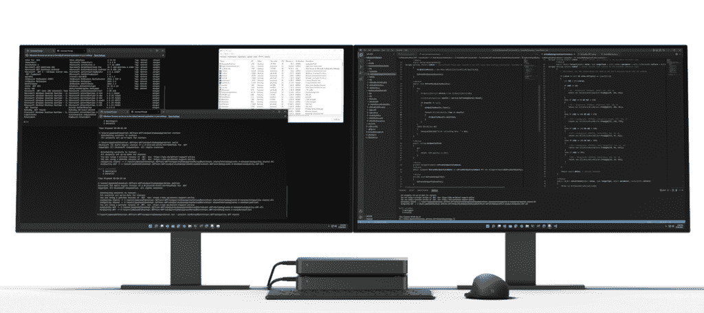

# 微软版本 2022 实际上让 Windows 粉丝非常兴奋

> 原文：<https://www.xda-developers.com/microsoft-build-2022-windows-editorial/>

微软刚刚结束了它的 [Build 2022](https://www.xda-developers.com/tag/microsoft-build-2022/) 开发者大会，坦率地说，它非常好，即使你是一个 Windows 粉丝。我通常会直言不讳地批评 Build——以及其他微软会议——以及对该公司桌面操作系统持续缺乏关注。但是每当我对自己关心的事情提出批评时，没有什么比承认自己错了更让我开心的了。

该公司从一开始就明确表示，它不会谈论 Windows 功能更新，并承诺在 Build 为开发人员带来令人兴奋的消息。我预计这将围绕像 WinUI 这样的东西，但事实上，开发者新闻确实会转化为让每个人都兴奋的东西。

例如，微软宣布了一系列在 Arm 上运行的 Windows、在 [Windows 11](https://www.xda-developers.com/windows-11/) 上运行的第三方小工具、对微软商店的修改等等。那太多了。

## 为什么微软在构建时不谈论 Windows，为什么它应该谈论

雷德蒙德公司上一次在 Build 舞台上真正谈论 Windows 功能是在 2017 年。Joe Belfiore 展示了一大堆将在 Windows 10 秋季 Creators 更新中发布的功能。事实上，当其中一些功能没有发布时，微软决定降低透明度是解决办法，而不是仅仅承认一些功能被推迟，但这是另一个故事了。

在 2018 年至 2020 年的建设中，信息似乎很清楚:微软不再关心 Windows。现在是蔚蓝公司。这是该公司增长最快的领域，也是它的发展方向。Windows 不会去任何地方，但如果微软要写标题，标题将是 Azure。

2021 年有点不一样。在家办公的热潮导致了个人电脑市场的复苏，突然之间，微软想再次用 Windows 做一些令人兴奋的事情。在大约 9 个月的时间里，它为 6 月份的发布组装了 Windows 11，但仍然没有进行构建。

今年，你可能会期待 Windows 11 版本 22H2。毕竟，Windows 又回来了，这更是一个优先事项，没有理由专门推出它。但是，事实并非如此。

Build 是开发者秀，微软想强调的是，这个消息是针对开发者的。虽然谷歌和苹果在他们的展会上展示了更多与消费者相关的新闻，但微软不想再这样做了。当然，这是不谈论 Windows 的一个非常方便的方法，因为所有的 Azure 新闻几乎都是一样的。

我也不同意这种观点。消费者新闻*是*开发者新闻。再过一周多，苹果将在 WWDC 发布新版 iOS、iPadOS、macOS、watchOS 和 tvOS。你可以收听看看今年秋天你的 iPhone 会有什么新功能。是针对开发者的吗？大概不会。你实际上可以为你的应用程序定制的新特性，编码示例，或者类似的东西，几乎没有什么作用。谷歌 I/O 主题演讲也是如此。

但这也是为什么这对开发者来说仍然很重要的原因。它显示了平台的发展势头。微软不展示 Windows 的特性一直是一个信号，表明 Windows 根本不是优先考虑的。你可以观看任何谷歌 I/O 或 WWDC 的主题演讲，然后离开，毫无疑问，谷歌正在全力以赴地开发 Android，而苹果正在全力以赴地开发 iOS。如果他们全包，那么作为一名开发人员，你也应该全包。

尽管如此，即使没有讨论 Windows 11 的功能更新，我认为微软还是举办了一场坚实的 Windows 秀。

## 有很多新的视窗产品在生产中

该节目自 2020 年虚拟化以来一直与众不同。即使没有 Windows talk，过去也有关于其他产品的讨论，如“OneNote 的新功能”、“Edge 的新功能”、“Outlook 的新功能”、“OneDrive 的新功能”等。这些会议都不存在了。希望当这些活动回归到面对面时，这种情况会有所改变，为了让人们说服他们的老板提供资源来参加，必须提供真正的价值。请记住，当 Build 在现场时，一张门票的成本几乎是 2500 美元，这还不包括旅行和住宿。

不过，虽然没有讨论面向消费者的新功能，但 Windows 新闻实际上相当重要。

### 终于认真对待 Arm64 了

自从 2016 年 12 月宣布在 Arm 上安装 Windows 以来，我一直是这个概念的粉丝。传统上，Windows 主要运行在 x86 处理器上；整个生态系统都是围绕英特尔构建的。支持新架构的想法让我很兴奋。

该平台起步缓慢。直到最近，高通的硬件一直很缺乏，但更重要的是，微软一直把它当作二等公民对待。例如，当 Arm PCs 上的第一个[Windows](https://www.xda-developers.com/best-windows-on-arm/)发布时，你甚至不能编译一个原生应用程序，除非它是 UWP。稍后将支持将 Win32 应用程序编译为 Arm64 原生版本。另一个例子是，x64 仿真支持直到 2021 年 10 月 Windows 11 发布时才到来。

Arm 上的 Windows 是构建公告的重要组成部分。微软的标题叫做 Project Volterra，尽管对我来说，最重要的公告是 Arm 原生开发工具链。还有其他东西比如。NET 6，经典。NET Framework、VC++，以及更多原生运行在 Arm 上的软件，微软也将发布 Visual Studio 2022 的 Arm64 版本。随着 Android 和 Hyper-V 的 Windows 子系统已经在 Arm 上，一切都准备就绪。

这是一件大事，因为 Visual Studio 2022 是微软提供的最复杂的应用程序之一。软件开发只需要一台 Arm 上的 Windows 机器的想法是疯狂的，这表明了微软的承诺。

 <picture></picture> 

Project Volterra

这就是沃尔泰拉计划的由来。Volterra 实际上是硬件。这是微软的一款新的开发设备，使用骁龙处理器，这就是我们所知道的全部。虽然它不像去年宣布的 Arm64 dev box。去年骁龙 7c 驱动的开发套件是用于测试应用程序，而不是构建它们。

这一个是关于建立人工智能体验的。微软表示，几乎所有未来的个人电脑都将拥有神经处理单元，就像内置在骁龙芯片组中的那种。结合 Azure 使用新的混合循环模式，开发人员将能够使用 Volterra 来构建这些新的人工智能应用程序。

高通一直在推动人工智能的角度为手臂有一段时间了。事实上，Arm 上的 Windows 最初的价值主张是蜂窝连接和电池寿命。但现在，WOA 个人电脑的基本型号几乎都只有 Wi-Fi，电池寿命也没有兑现承诺。然而，圣地亚哥公司一直在谈论它的人工智能引擎在人工智能任务方面比英特尔好多少。

当微软第一次在 Windows 11 中重新引入插件的概念时，你只能使用它提供的插件。今年晚些时候，任何开发人员都将能够在他们的 Win32 应用程序或 PWA 中构建小部件。

在一次会议上，该公司简要地提到，它正在探索窗口上显示小部件的其他地方。这意味着我们可能会看到窗口小部件回归桌面，就像最近 Insider 预览版中添加搜索栏一样。

### 你可以从 Microsoft 商店恢复应用

这很有趣，因为它开始感觉所有新的东西都已经存在于以前的 Windows 版本中了。从 Windows 8 时代回归的一个功能是在全新安装的 Windows 11 上恢复应用程序的能力。

当然，这只适用于你从微软商店下载的应用。Windows 不能完全去为你获取谷歌浏览器，所以你必须自己处理。

这个功能在手机上已经存在很久了。当你去升级你的手机时，很容易自动安装你的所有应用程序。现在，微软正试图在 Windows 上实现这一目标。

好消息是，现在任何人都可以在微软商店里放一个应用程序，不需要修改。微软还宣布将取消 Win32 应用程序的等待名单。

### Android 改进的 Windows 子系统

Android 的 Windows 子系统越来越好。首先，它现在运行在 Android 12.1 上。然而，一个大消息是，它和 Windows 11 上的亚马逊应用商店将在五个新的国家得到支持。

虽然 WSA 目前仅在美国可用，但它将进入法国、德国、意大利、日本和英国。可惜时间线是“年底前”。

### 微软商店中的广告

好吧，所以我们都没有对广告感到兴奋，这没关系。尽管如此，微软投资商店的想法才是最重要的。它为开发者提供了通过其市场发布应用的发明和机会。

首先，开发者将能够在商店中为他们的应用做广告，你需要成为一个公开的开发者才能做到这一点。这在应用市场和搜索引擎中很常见。

网络上还有一个新的弹出商店功能。开发者可以在那里为他们的应用做广告，可能是在他们自己的网站上，你可以从那里直接安装。

最后，微软商店列表将显示在 Windows 搜索结果中。这实际上不是一个广告，但它仍然是一个下载应用程序的行动号召。

明确地说，广告并不坏，我这么说是因为这可能是我们许多人听到“广告”这个词时的第一反应。广告对于繁荣的商业生态系统是必要的，所以这都是好东西。

## 微软 2022 版令人兴奋

就像我说的，没有谈论 Windows 11 版本 22H2，或者它将提供的功能。这很好，即使时间已经排好了。但总而言之，对于像我这样的 Windows 爱好者来说，微软 Build 2022 是一场激动人心的表演。

自平台推出以来，微软对 Arm 上的 Windows 表现出了前所未有的兴趣。事实上，它是作为激发英特尔创新的一种方式推出的，当时英特尔主要生产陈旧的产品。但随着苹果在使用 Arm 处理器方面表现如此出色，似乎一项重大投资已经准备就绪。

如果你只是想知道 Windows 11 的下一个新功能，这不是给你看的节目。但是，如果你只是一个平台的粉丝和它的发展方向，Build 2022 太棒了。