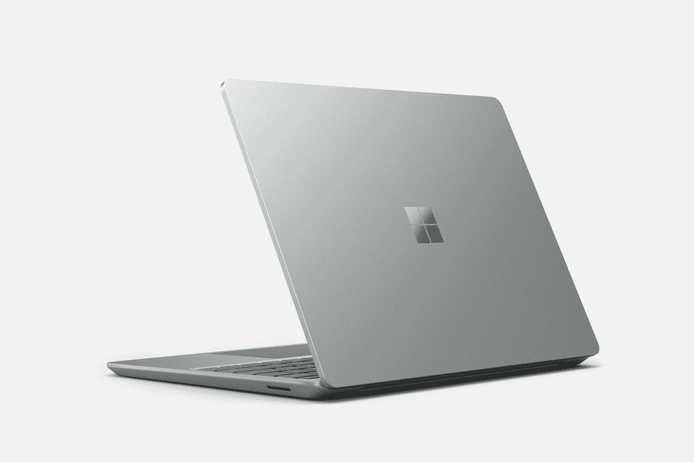

# 微软对新款 Surface 笔记本电脑 Go 2 和 Razer Blade 14 打折

> 原文：<https://www.xda-developers.com/microsoft-discount-surface-laptop-go-2/>

随着返校季进入高潮，各公司正试图用一些科技产品折扣来吸引买家，微软商店目前正在提供一些引人注目的折扣。其中最引人注目的是几个月前刚刚推出的预算导向型设备 Surface Laptop Go 2。

Surface Laptop Go 2 采用 3:2 宽高比的 12.4 英寸显示屏，高端的设计，以及英特尔酷睿 i5-1135G7 处理器带来的稳定性能，对于预算紧张的任何人来说都是一款非常好的设备。通常，它的起价为 599.99 美元，顶层配置的价格为 799.99 美元，但现在你可以优惠 100 美元，使最贵的配置成为非常诱人的 699.99 美元。其他配置的折扣较小，但仍然是很好的机会。这个折扣在百思买是匹配的，所以你可以在你喜欢的任何地方购买。

 <picture></picture> 

Surface Laptop Go

##### 微软 Surface Laptop Go 2

Surface Laptop Go 2 是一款功能非常强大的经济型设备，设计出众，非常适合学校使用。

如果你想要更高端一点的东西，微软商店的 [Surface Pro 8](https://www.xda-developers.com/surface-pro-8-review/) 也要便宜 360 美元。这一特定折扣适用于采用英特尔酷睿 i5-1135G7 处理器的型号，并且您还可以获得 8GB 内存和 512GB 固态硬盘存储。此外，你看到的是一个非常清晰的 13 英寸显示屏，支持触摸和笔。通常这款机型售价 1399.99 美元，现在只要 1039.99 美元。其他配置也会打折扣，但幅度没有这么大。然而，如果你想用 Surface Pro 键盘购买，你可以在百思买用该设备和键盘的捆绑包[获得 350 美元，尽管你的存储空间有限，只有 256GB。](https://shop-links.co/1782546893910226842?u1=c6ea9ca8-342e-40ed-b3f6-3bb13906fcf5)

 <picture></picture> 

Surface Pro 8

##### 微软 Surface Pro 8

Surface Pro 8 是微软的旗舰平板电脑，拥有 120 赫兹的超高清 13 英寸显示屏，以及其他高端规格。

最后，微软仍然对最新的 Razer Blade 14 游戏笔记本电脑提供很大的折扣，而且这款是微软商店的独家产品。这不是微软第一次提供这种折扣，但如果你想买这款笔记本电脑，它仍然是最好的地方。Razer Blade 14 配备了强大的 AMD 锐龙 9 6900HX 处理器以及 Nvidia GeForce RTX 3070 Ti 显卡，外加 165Hz 刷新率的四高清显示屏。这是一款非常棒的游戏机，仍然有点便携，虽然通常的 2，599.99 美元有点高，但现在你可以花 2，299.99 美元买到它，这是一笔非常划算的交易。

 <picture></picture> 

Razer Blade 14

##### 雷蛇之刃 14

Razer Blade 14 是一款功能强大但小巧的游戏笔记本电脑，非常适合想要一台可以随身携带的游戏设备的学生。

除了这些亮点，微软网站上还有一些其他交易，尽管不是所有的都非常有趣。例如，如果你购买精选的游戏笔记本电脑，HTC Vive Pro 2 耳机可以节省 100 美元。这里有一些你可能会喜欢的:

虽然我们肯定会建议先看看精彩的部分，但上面的列表中有一些不错的交易，你可能会喜欢。无论哪种方式，如果你正在寻找一些返校装备，这些都是很好的选择。