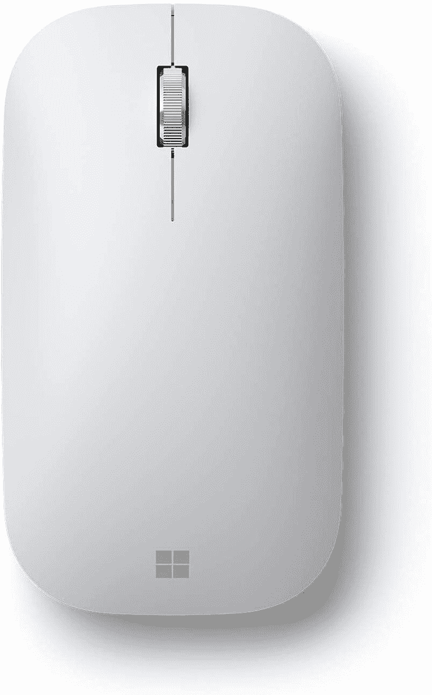
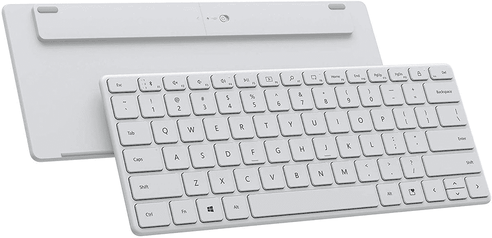

# 微软的现代键盘和鼠标正在销售

> 原文：<https://www.xda-developers.com/microsoft-modern-keyboard-mouse-sale/>

当你想到个人电脑配件时，微软可能不是第一个想到的公司，这个领域通常由罗技、雷蛇和海盗船主导。然而，微软确实销售一些键盘、鼠标和其他设备，这些设备的视觉设计与其最近的 Surface 产品相同。由于亚马逊网上商店的新销售，现在你可以以比平时更好的价格买到三款微软最好的个人电脑配件。

大多数微软的个人电脑配件都在亚马逊上销售，但是折扣最大的是该公司的 Erganomic Mouse、Modern Mobile Mouse 和 Designer Compact 键盘。[人体工程学鼠标](https://www.amazon.com/dp/B08J8DHVQC?tag=xda-4qjqns3-20&ascsubtag=UUxdaUeUpU5819&asc_refurl=https%3A%2F%2Fwww.xda-developers.com%2Fmicrosoft-modern-keyboard-mouse-sale%2F&asc_campaign=Short-Term)或多或少是你的标准桌面蓝牙鼠标，具有更大的设计以便于抓握，铝制滚轮和定制每个按钮功能的软件(不过只在 Windows 上)。同时，[现代移动鼠标](https://www.amazon.com/Microsoft-Modern-Mobile-Mouse-KTF-00056/dp/B08J8C7THG?tag=xda-4qjqns3-20&ascsubtag=UUxdaUeUpU5819&asc_refurl=https%3A%2F%2Fwww.xda-developers.com%2Fmicrosoft-modern-keyboard-mouse-sale%2F&asc_campaign=Short-Term)有一个更扁平的设计，更容易放在包和口袋里，没有定制能力。

 <picture></picture> 

Microsoft Bluetooth Ergonomic Mouse

##### 微软蓝牙人体工程学鼠标

这款无线鼠标有四种颜色，但白色的是目前最便宜的，价格为 24.74 美元。

 <picture></picture> 

Microsoft Modern Mobile Mouse

##### 微软现代移动鼠标

微软更小巧的蓝牙鼠标以 17.49 美元的价格出售，有白色、黑色、薄荷色和桃红色。

 <picture></picture> 

Microsoft Designer Keyboard Compact

##### Microsoft Designer 紧凑型键盘

这种小 chiclet 风格的键盘最多支持 3 个设备，看起来像苹果的魔法键盘。它只卖 45.50 美元。

最后，微软 Designer 紧凑型键盘的售价为 45.50 美元，比通常的 50-54 美元的价格低，比最初的建议零售价低 24.49 美元。它的设计类似于苹果的[魔法键盘](https://www.apple.com/shop/product/MK2A3LL/A/magic-keyboard-us-english)，具有笔记本电脑风格的 chiclet 薄膜键，并且能够在内存中存储多达三个蓝牙连接。还有一个专用的输入键，可以在 Windows 上调出表情符号/符号选择器。微软正在出售黑白两种颜色。

如果你一直在寻找一些简约的电脑配件，也许是为了搭配你的新 [Surface Go 3](https://www.xda-developers.com/microsoft-surface-go-3-review/) 或 [Surface Laptop Studio](https://www.xda-developers.com/surface-laptop-studio-review/) ，这些都是不会超出你预算的好选择。尽管它们显然是为 Windows 设计的，但这些附件使用标准的蓝牙连接，因此它们可以与任何接受蓝牙鼠标和键盘的设备一起工作。这包括大多数个人电脑、安卓平板电脑、iPads 和无数其他设备。

对于更具点击感的键盘选项，请查看我们对[最佳机械键盘](https://www.xda-developers.com/best-mechanical-keyboards/)的综述，其中我们收集了各个价格范围内的一些最佳选项。