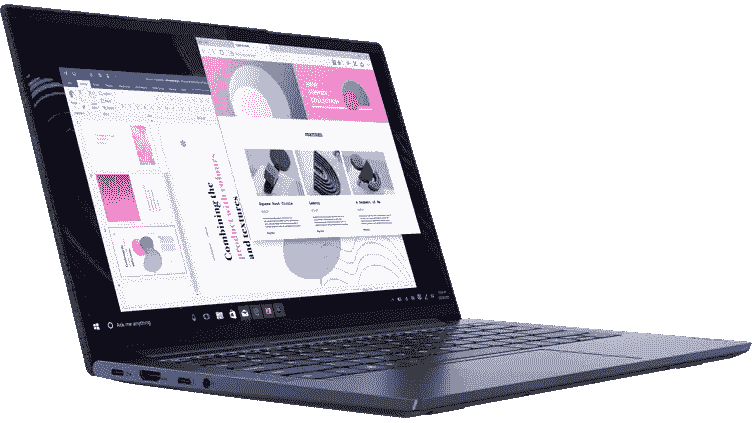
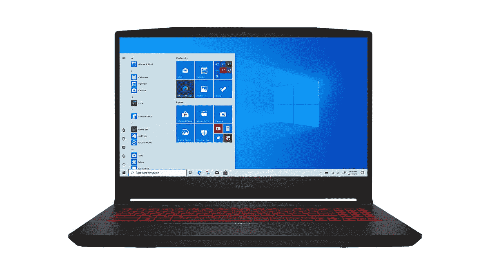
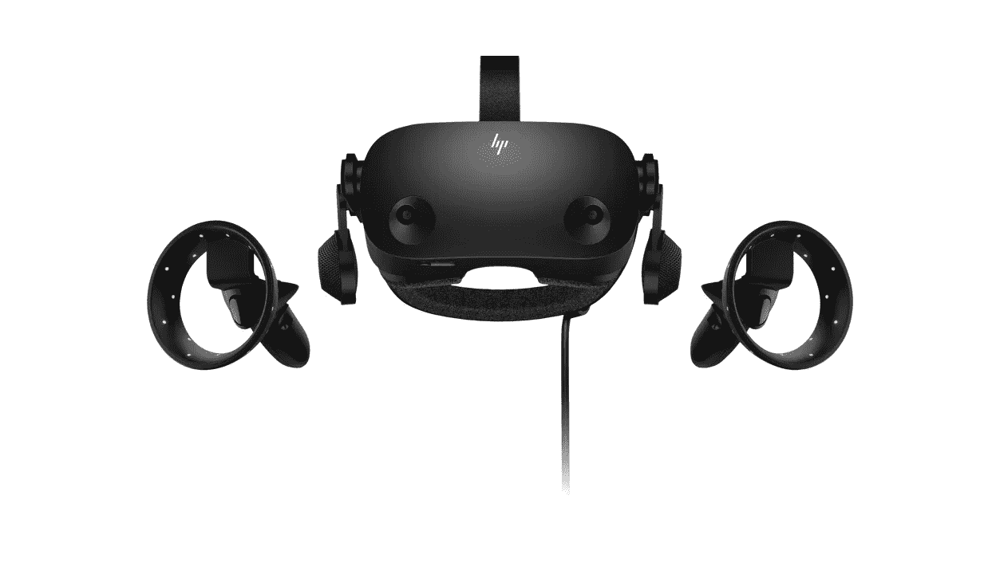
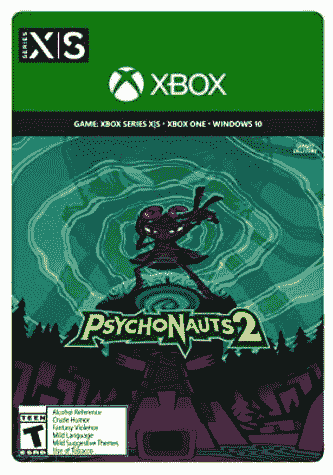
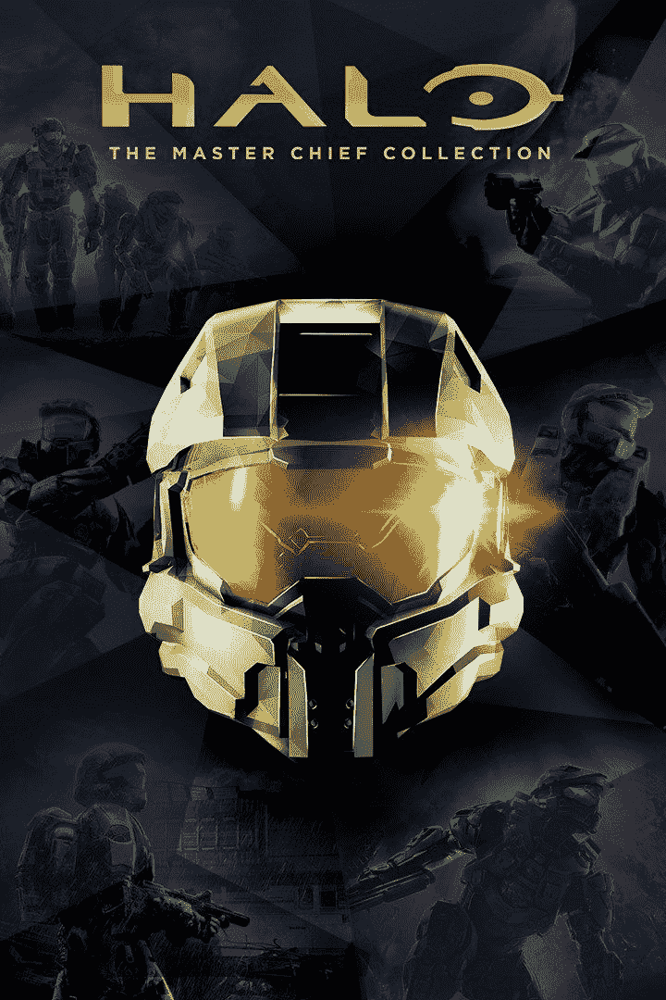
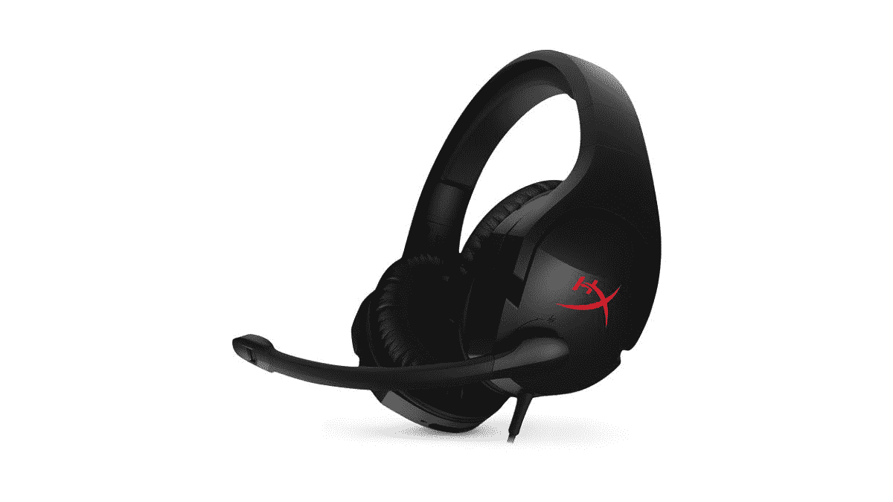
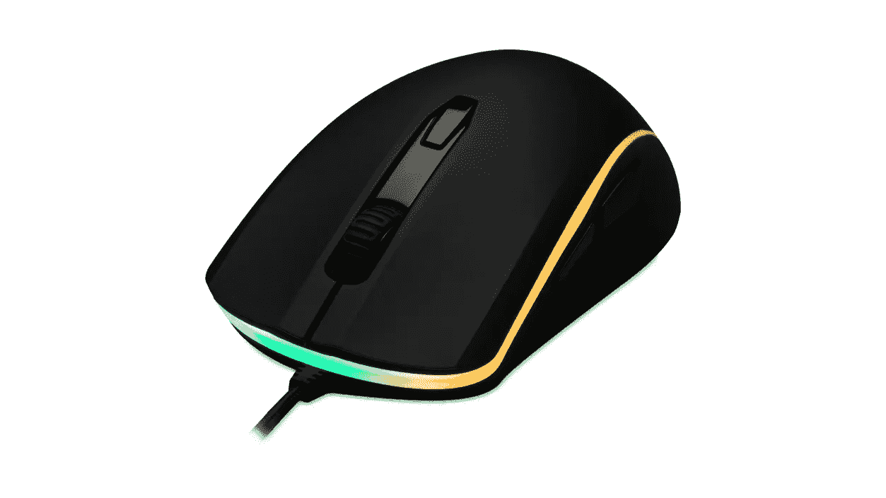
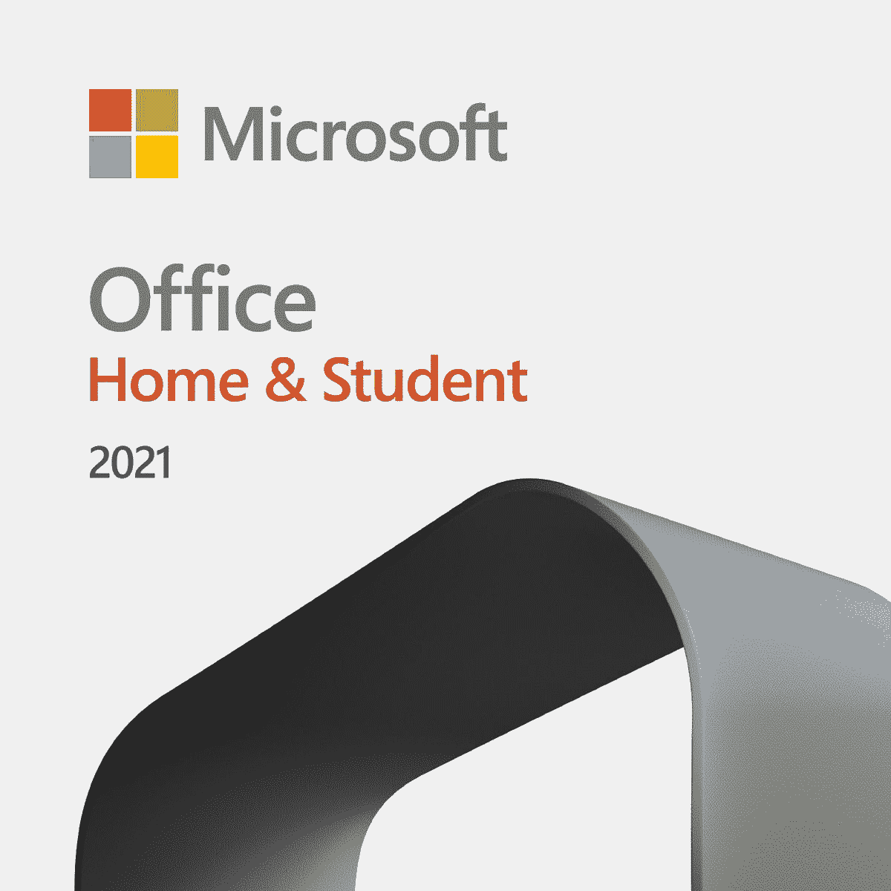

# 微软商店黑色星期五交易包括 Surface Laptop Go 优惠 200 美元

> 原文：<https://www.xda-developers.com/microsoft-store-black-friday-deals/>

黑色星期五很快就要到了，微软今天宣布了它将进行的交易来庆祝这一时刻。虽然黑色星期五要到 11 月 26 日才正式开始，但许多交易都很早就开始了，有些现在就可以买到。如果你正在寻找一些新的技术和游戏设备，在微软商店可以找到一些不错的交易。

微软商店是购买 Surface 设备的最佳地点之一，但这不是你能在那里买到的全部。其他公司的电脑和配件也有售，一些销售也适用于这些。微软还没有宣布所有交易的具体细节，所以随着更多信息的出现，我们将更新这个页面。这是我们目前所知的。

## Surface Laptop Go(最高优惠 200 美元)

本季度的第一笔大交易是 Surface Laptop Go，这是微软为学生提供的平价笔记本电脑。这款笔记本电脑配备了英特尔酷睿 i5.1035G1 处理器、高达 8GB 的内存和 256GB 的固态硬盘存储。现在，今年的黑色星期五高达 200 美元的折扣。

首先，8GB 内存和 128GB 固态硬盘存储的型号现在便宜了 150 美元，仅售 549.99 美元，而不是 699.99 美元。这与只有 4GB 内存和 64GB eMMC 存储的基本型号价格相同(不打折)。除了额外的内存和更快的存储，升级后的型号还为 Windows Hello 添加了指纹传感器，所以这是一个显而易见的交易。顶级型号配备了更大的 256GB 固态硬盘，从最初的 899.99 美元降至 699.99 美元，因此现在也是一笔不错的交易。该交易将于 12 月 24 日结束。

Surface Laptop Go 有三种不同的颜色，它们都是打折的，所以你也可以选择你最喜欢的外观。百思买目前也在进行类似的交易。

 <picture></picture> 

Surface Laptop Go (up to $200 off)

##### 微软 Surface Laptop Go

Surface Laptop Go 是一款非常实惠的笔记本电脑，价格高达 200 美元，是送给学生的绝佳礼物。

## 精选电脑优惠高达 600 美元

微软还在黑色星期五对微软商店中的许多第三方电脑进行高达 600 美元的折扣。我们将重点介绍一些最值得关注的交易，或者您也可以在这里查看这些交易的[完整列表。黑色星期五的交易将于 11 月 29 日结束。](https://www.microsoft.com/en-US/store/collections/EBFdeals)

折扣最大的是联想 IdeaPad Sim 9i，这也是销售中最好的笔记本电脑之一。这款机型配备了英特尔酷睿 i7-1195G7，这是英特尔目前最强大的 15W 处理器，也是第一款支持最高 5GHz 睿频的处理器。它还拥有 16GB 的内存和 512GB 的固态硬盘存储。最值得注意的是，它配备了 14 英寸 4K 超高清显示屏，清晰度令人难以置信，并且支持触摸。这款机型通常售价为 1759.99 美元，但它优惠了 710 美元，仅售 11049.99 美元，对于这款笔记本电脑来说，这绝对是一个非常棒的价格。

 <picture></picture> 

Lenovo IdeaPad Slim 9i ($750 off)

##### 联想 IdeaPad Slim 9i

联想 IdeaPad SLim 9i 配有高端规格和超清晰 4K 触摸屏。仅售 999.99 美元，非常划算。

如果你想要一些更主流的东西，联想 IdeaPad Slim 7i 也是打折的，它有更适中的，但仍然很棒的规格。它由英特尔酷睿 i5-1135G7 驱动，这仍然是一个相当强大的四核 CPU，配有 Iris Xe 显卡，它还拥有 8GB 内存和 512GB 固态硬盘存储。显示器是一个 14 英寸的全高清面板，它也支持触摸，所以它看起来仍然很棒，给你一些额外的直观性。通常是 949.99 美元，但你现在可以花 629.99 美元买到它。

 <picture></picture> 

Lenovo IdeaPad Slim 7i ($350 off)

##### 联想 IdeaPad Slim 7i

联想 IdeaPad Slim 7i 配备了可靠的规格组合和全高清触摸屏。售价 599.99 美元，是学生和日常使用的绝佳笔记本电脑。

对于游戏玩家来说，另一个很好的选择是 MSI 武士刀 GF66。这款游戏笔记本电脑配备了英特尔酷睿 i5-11400H 处理器，具有六个内核和 12 个线程，时钟速度高达 4.5GHz。它还包括英伟达 GeForce RTX 3050，因此你可以在这台机器上运行一些现代游戏，尽管你可能需要调低一些设置。显示器是全高清面板，刷新率为 144Hz，内存为 8GB，固态硬盘为 512GB。通常，这种型号的价格为 1099.99 美元，但现在你可以花 799.99 美元买到它，这更有吸引力。

 <picture></picture> 

MSI Katana GF66 ($300 off)

##### 微星武士刀 GF66

一款经济实惠的游戏笔记本电脑，具有稳定的规格，可运行大多数现代游戏，外加 144Hz 显示屏。有了这个折扣，就更有诱惑力了。

## PC 版 Xbox 游戏通行证(1 美元 3 个月)

这项交易[已经推出了几天](https://www.xda-developers.com/xbox-game-pass-games-november-2021/),但微软现在也提供三个月的 Xbox 游戏通行证，仅售 1 美元，这是一个尝试作为服务一部分的一些优秀游戏的好机会。有超过 100 个游戏可用，Xbox 游戏工作室的游戏在第一天就在 Game Pass 上发布。这包括 Forza Horizon 5 和 Halo Infinite，这是这个假期中最大的两个发布，所以没有比这更好的时间了。

最重要的是，根据我们的测试，你可以支付 1 美元升级到 [Xbox Game Pass Ultimate](https://www.microsoft.com/p/xbox-game-pass-ultimate/cfq7ttc0khs0) ，这也将订阅期限延长了一个月。这意味着你还可以使用云游戏，这样你就可以在你的手机或 PC 上玩 Xbox 游戏，而不是真正的游戏。

 <picture></picture> 

Xbox Game Pass for PC

##### Xbox 游戏通行证

Xbox Game Pass 可以让您访问 100 多种游戏，只需 1 美元就可以获得三个月的时间！

## Surface Go 2(最高优惠 150 美元)

微软商店的黑色星期五交易还包括 Surface Go 2，因为它的继任者已经推出。Surface Go 2 可能不是最快的设备，但它提供了优质 Surface 设备的一些元素，包括轻薄的设计、3:2 显示屏和价格合理的高分辨率摄像头。它由 Intel Pentium Gold 或 Core i3 处理器提供支持，并配备了高达 8GB 的 RAM 和 128GB 的 SSD。

通过这笔交易，Surface GO 2 的起价仅为 299.99 美元，比平时的价格低 100 美元，对于你在这里得到的东西来说是一笔非常划算的交易。150 美元的折扣将适用于更高配置的型号，这可能意味着顶级型号的价格仅为 479.99 美元，而不是 629.99 美元。微软还没有分享每种配置的详细价格，但无论如何这都是一笔大交易。该交易将于 12 月 5 日结束。

 <picture></picture> 

Surface Go 2

##### 微软 Surface Go 2

Surface Go 2 是一款非常轻薄的平板电脑，配有出色的显示屏和摄像头，非常适合与家人保持联系。黑色星期五的起价仅为 299.99 美元。

## 惠普混响 G2 耳机(优惠 150 美元)

VR 爱好者也可以在惠普 Reverb G2 耳机上获得优惠。这款耳机是与 Valve 合作设计的，它支持 Windows 混合现实和 SteamVR。它每只眼睛都有一个清晰的 2160 x 2160 显示屏，身临其境的立体声扬声器，以及 inside-ou 跟踪，这意味着您的所有动作都可以通过外部设备进行跟踪。耳机还包括两个控制器，每只手一个。

通常，这款耳机会让你花费 599.99 美元，但在这次销售中，你只需 449.99 美元就可以买到它，如果你已经想这样做一段时间，这是一个跳入虚拟现实世界的好时机。这个黑色星期五销售从 11 月 19 日在微软商店开始，到 12 月 4 日结束。

 <picture></picture> 

HP Reverb G2 ($150 off)

##### 惠普混响 G2

惠普 Reverb G2 是惠普和 Valve 为 Windows 混合现实和 SteamVR 游戏设计的 VR 耳机。这次销售给它打了 25%的折扣。

## 精选 Xbox 游戏工作室游戏高达 75%的折扣

如果你更喜欢拥有个人游戏而不是特定的订阅，微软也将举办 Xbox 游戏工作室出版的精选游戏的销售。精选游戏将高达 75%的折扣，包括像 [Forza Horizon 4](https://www.xbox.com/en-us/games/store/forza-horizon-4-standard-edition/9pnjxvcvwd4k) 、 [Gears 5](https://www.xbox.com/en-us/games/store/gears-5/c2kdnlt2h7dm) 、[稀有重玩](https://www.xbox.com/en-us/games/store/rare-replay/c22t53sq7flm)等游戏。尽管宣传 Xbox Game Studios 游戏高达 75%的折扣，但微软似乎没有专门针对其游戏的系列，而且不同发行商的大量游戏都有折扣。这包括几个突出的游戏。

其中一款是 2021 年最佳游戏之一的《心理医生 2 》,它在今年的游戏奖中获得了年度游戏提名。这个游戏已经准备了很多年，它没有辜负漫长的等待。这本书通常售价 59.99 美元，但你可以花 41.99 美元买到。

 <picture></picture> 

Psychonauts 2

##### 心理医生 2

这款期待已久的 3D 平台游戏是 2021 年最好的游戏之一，你可以以比平时低 30%的价格买到它。

如果你想尝试 Xbox 的一些老游戏，光晕:主酋长系列目前是 50%的折扣，对于一个默认情况下已经相当便宜的游戏来说，这是一个非常划算的交易。这包括了《光环》系列的每一款主线游戏，从《光环:战斗》一直进化到《光环 4》。随着 Halo Infinite 即将推出，这是一个了解士官长故事的好方法，现在只需 19.99 美元就可以买到。该游戏针对 Xbox Series X|S 游戏机进行了增强，因此它在最新的硬件上看起来和运行起来都很棒。

 <picture></picture> 

Halo: The Master Chief Collection

##### 光晕:首席大师系列

微软最受欢迎和好评的专营权被打包到这个恒星包，一定会让你娱乐很长一段时间。这是为即将到来的《光环无限》做准备的绝佳方式，而且半价！

如果你真的是经典的粉丝，稀有重播是老派书籍的宝库。它包括许多在被微软收购前后罕见开发的游戏，如班卓琴-卡祖伊，完美黑暗，以及翻拍邪教经典康克尔的坏毛皮日的康克尔直播和重装。这是其中一款打 75 折的游戏，所以你现在只需花 7.49 美元就能买到这 30 款经典游戏。

 <picture></picture> 

Rare Replay

##### 罕见重播

如果你想看看 2000 年代初之前《开发者稀有》的经典作品，这 30 本书现在只需 7.49 美元。

这些仅仅是我们个人的选择，但是我们强烈建议查看黑色星期五的完整清单，看看还有什么在出售。

## HyperX 游戏配件高达 40%的折扣

如果你正在寻找一些配件来增强你的游戏体验，微软也在为 PC 和 Xbox 打折一些 HyperX 配件。销售主要集中在耳机和鼠标上，你可以在这里找到完整的列表。折扣最大的是 HyperX Cloud Stinger 有线耳机，从 49.99 美元降至仅 29.99 美元。这款耳机采用 50 毫米驱动器和记忆泡沫耳垫，更加舒适，另外还具有扭曲耳罩以静音麦克风等功能。亚马逊也有这个折扣。

 <picture></picture> 

HyperX Cloud Stinger

##### HyperX 云毒刺

这款 HyperX 耳机配有 50 毫米大驱动器和记忆泡沫耳垫，增加了舒适度。

如果你更需要一个新的鼠标，HyperX Pulsefire Surge 可能正合你的胃口。这是一个相对简单的游戏鼠标，有两个侧按钮和 RGB 照明，增加了一些额外的天赋。它有一个 Pixart 3389 传感器，分辨率为 16，000 DPI，它使用欧姆龙开关，额定点击次数高达 5000 万次。

 <picture></picture> 

HyperX Pulsefire Surge

##### HyperX 脉冲火焰浪涌

HyperX Pulsefire Surge 是一款游戏鼠标，有六个可定制的按钮，RGB 照明和一个 16，000 DPI 的传感器。

## 高达 50 美元的海龟海滩和 ROCCAT 配件

微软商店还有知名游戏外设厂商 Turtle Beach 和 ROCCAT 的部分配件打折。其中包括高达 50 美元的折扣，这使他们成为非常好的交易。以下是目前所有打折的商品:

## Microsoft Office 家庭和学生 2021 优惠 50 美元

最后，如果你对完成工作更感兴趣，微软也对最新版本的微软 Office Home & Student 打折。2021 版在一个多月前刚刚推出，价格下降了 50 美元，从 149.99 美元降至 99.99 美元。

Office 2021 家庭和学生版使您可以在一台 PC 上访问 Word、Excel 和 PowerPoint，但您可以永远使用它。你可以使用下面的链接购买，但请记住，销售将持续到 12 月 4 日。

 <picture></picture> 

Microsoft Office Home & Student

##### Microsoft Office 家庭和学生版 2021(优惠 50 美元)

Microsoft Office 家庭和学生版包括 Word、Excel 和 PowerPoint，并有许可证，可以永远在一台 PC 上运行。