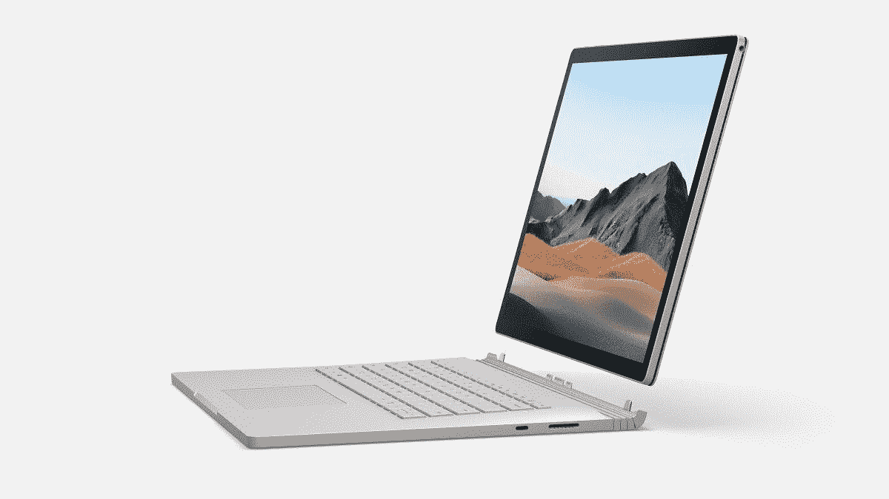
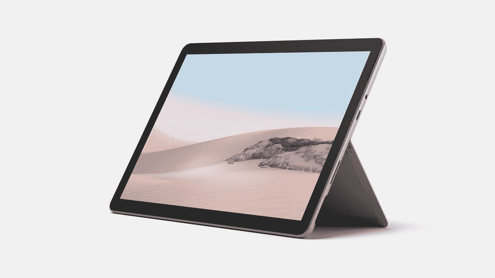

# 微软宣布推出 Surface Book 3 和 Surface Go 2 笔记本电脑

> 原文：<https://www.xda-developers.com/microsoft-surface-book-3-surface-go-2-laptops-announced/>

作为 Windows 操作系统的制造商，微软拥有市场上最好的笔记本电脑也就不足为奇了。这当然并不总是如此，因为微软在很长一段时间内将硬件留给原始设备制造商。然而，如今，如果你在寻找高端设计和 Windows 提供的最佳功能，Surface 设备是首选。他们现在推出了 Surface Book 3 和 Surface Go 2 笔记本电脑。

有 4 种不同类型的表面计算机在 4 种类型的风格。首先是 Surface Pro。这是一款带有可连接键盘和触控板的平板电脑。Surface Go 和 Surface Pro 基本一样，只是小了很多。这是一款小巧便携的平板电脑，具有相同的可连接键盘和 LTE 选项。Surface Laptop 只是微软的一款典型笔记本电脑。最后，Surface Book 是一台笔记本电脑，但显示屏是可拆卸的，你可以将其用作平板电脑。去年 10 月[微软发布了](https://www.xda-developers.com/microsoft-surface-duo-suface-neo-surface-pro-7-surface-laptop-3/)Surface Pro 7、Surface Pro X 和 Surface Laptop 3，现在我们看到了 Surface Go 2 和 Surface Book 3。

* * *

## 表面书 3

 <picture></picture> 

Surface Book 3

### Surface Book 3 规格

| 

技术规格

 | 

Surface Book 3 13 英寸

 | 

Surface Book 3 15 英寸

 |
| 显示 | 屏幕:13.5 英寸 PixelSense 显示屏分辨率:3000 x 2000 (267 PPI)宽高比:3:2 对比度:1600:1 触摸:10 点多点触摸 G5 | 屏幕:15 英寸 PixelSense 显示屏分辨率:3240 x 2160，(260 PPI)10 点多点触控 G5 纵横比:3:2 对比度:1600:1 |
| 可用型号 | 四核第十代英特尔酷睿 i5-1035G7 处理器四核第十代英特尔酷睿 i7-1065G7 处理器 | 四核第十代英特尔酷睿 i7-1065G7 |
| 制图法 | 英特尔 i5-1035G7 型号英特尔 Iris Plus 显卡英特尔 i7-1065G7 型号 NVIDIA GeForce GTX 1650，配有 Max-QDesign 和 4GB GDDR5 显存 | 英特尔 i7-1065G7 型号 NVIDIA GeForce GTX 1660 Ti，配有 Max-QDesign 和 6GB GDDR6 显存 |
| Windows 操作系统 | 随附 64 位 Windows 10 专业版和家庭版 | 搭载 64 位 Windows 10 专业版和家庭版 |
| 规模 | 英特尔酷睿 i5 12.3 英寸 x 9.14 英寸 x 0.51 英寸-0.90 英寸(312 毫米 x 232 毫米 x13 毫米-23 毫米)英特尔酷睿 i7 12.3 英寸 x 9.14 英寸 x 0.59 英寸-0.90 英寸(312 毫米 x 232 毫米 x15 毫米-23 毫米) | 英特尔酷睿 i7 13.5 英寸 x 9.87 英寸 x 0.568-0.90 英寸(343 毫米 x 251 毫米 x15 毫米-23 毫米) |
| 重量 | 英特尔酷睿 i5 总重量–1534 克(3.38 磅)平板电脑–719 克(1.59 磅)英特尔酷睿 i7 总重量–1642 克(3.62 磅)平板电脑–719 克(1.59 磅) | 英特尔酷睿 i7 总重量–1905 克(4.20 磅)平板电脑–817 克(1.80 磅) |
| 电池 | 连接到键盘底座:长达 15.5 小时的典型设备使用时间 | 连接到键盘底座:长达 17.5 小时 的典型设备使用 |
| 无线的 | Wi-Fi 6: 802.11ax 兼容蓝牙无线 5.0 技术 | Wi-Fi 6: 802.11ax 兼容蓝牙无线 5.0 技术内置 Xbox 无线 |
| 港口 | 2 个 USB-A(版本 3.1 第 2 代)1 个 USB-C(版本 3.1 第 2 代，带 USB 供电版本 3.0)3.5 毫米耳机插孔 2 个 Surface 连接端口(一个在键盘底座上，一个在平板电脑上)全尺寸 SDXC 读卡器兼容 Surface Dial 屏幕内外交互 | 2 个 USB-A(版本 3.1 第 2 代)1 个 USB-C(版本 3.1 第 2 代，带 USB 供电版本 3.0)3.5 毫米耳机插孔 2 个 Surface 连接端口(一个在键盘底座上，一个在平板电脑上)全尺寸 SDXC 读卡器兼容 Surface Dial 屏幕内外交互 |
| 安全性 | 面向企业安全的硬件 TPM 2.0 芯片通过 Windows Hello face 登录提供企业级保护 | 面向企业安全的硬件 TPM 2.0 芯片 采用 Windows Hello face 登录的企业级保护 |
| 传感器 | 环境光传感器接近传感器加速度计陀螺仪磁力计 | 环境光传感器 接近传感器 加速度计 陀螺仪 磁力计 |
| 摄像机 | Windows Hello face 认证摄像头(前置)500 万像素前置摄像头，支持 1080p 高清视频 800 万像素后置自动对焦摄像头，支持 1080p 高清视频 | Windows Hello face 认证摄像头(前置)500 万像素前置摄像头，支持 1080p 高清视频 800 万像素后置自动对焦摄像头，支持 1080p 高清视频 |
| 声音的 | 双远场录音室麦克风前置立体声扬声器，配有杜比全景声 | 双远场录音室麦克风前置立体声扬声器，配有杜比全景声 |
| 键盘和跟踪板 | 全尺寸背光键盘，带 1.55 毫米全键 travelGlass 触控板，带防指纹涂层和改进的多指手势 | 全尺寸背光键盘，带 1.55 毫米全键 travelGlass 触控板，带防指纹涂层和改进的多指手势 |
| 模式 | 笔记本电脑模式、平板电脑模式、查看模式或工作室模式 | 笔记本电脑模式、平板电脑模式、查看模式或工作室模式 |
| 在盒子里 | 英特尔酷睿 i5 65W 表面电源带 USB-A (5W)充电端口英特尔酷睿 i7 102W 表面电源带 USB-A (7W)充电端口快速入门指南安全和保修文档 | 127 瓦表面电源，带 USB-A (7W)充电端口快速入门指南 |

Surface Book 3 是微软最大、最强大的笔记本电脑。这款笔记本电脑是为我们当中的开发者和创作者设计的。它体积大，功能强，便于携带。与 Surface Pro 或 Surface Laptop 不同，这既是一台笔记本电脑，也是一台平板电脑。Surface Book 3 分为两部分，显示屏和键盘。显示器基本上容纳了每个部分，包括一个小电池，而键盘容纳了电池和 GPU。您可以将显示屏从键盘上取下，用作平板电脑，或者翻转显示屏，在几种不同的模式下使用。

Surface Book 3 有两种不同的尺寸。微软决定发布 13.5 英寸和 15 英寸的机型。13.5 英寸的总重量为 3.62 磅，尺寸为 312 毫米 x 232 毫米 x 15 毫米-23 毫米。这一厚度范围是因为该设备有一个坡度。15 英寸版本的尺寸为 343 毫米 x 251 毫米 x 15 毫米-23 毫米。15 英寸型号的重量为 4.20 磅，对于你正在购买的所有东西来说，这其实并不算重。两种型号都只有银色。

这两款笔记本电脑都配有高分辨率显示屏。13.5 英寸的型号配备了 3000x2000 PixelSense 触摸屏显示器。它的分辨率为 267ppi，宽高比为 3:2，对比度为 1600:1。15 英寸型号配有 3240x2160 PixelSense 触摸屏显示器。它的长宽比为 3:2，对比度为 1600:1，但 ppi 略低，为 260ppi。它还有 10 点多点触控功能。

Surface Book 3 上的规格确实不错。它为 13.5 英寸提供了两种不同的 CPU 选项，要么是英特尔酷睿 i5-1035G7，要么是酷睿 i7-1065G7。15 英寸将只配备英特尔酷睿 i7-1065G7。13.5 英寸的显卡选项取决于 CPU。i5 型号配备了英特尔 Iris Plus Grahpics，而 i7 型号配备了 Nvidia GTX 1650 MaxQ 和 4gb gdrr 5 VRAM。15 英寸的型号配有 GTX 1660 Ti，6GBs 的 GDDR6 VRAM。还有一个版本的 Surface Book 3 也将采用 Quadro 3000 系列显卡。

这些笔记本电脑的无线连接都非常好。它们都支持 802.11ax 兼容的 Wi-Fi 6。两款笔记本电脑也都支持蓝牙 5.0。15 英寸 Surface Book 3 独有的东西是 Xbox 无线内置。不需要蓝牙模型或连接 USB 电缆或加密狗，它支持开箱即用。

笔记本电脑的电池寿命也非常好。当连接到键盘时，13.5 英寸型号在典型使用条件下的电池寿命估计为 15.5 小时，15 英寸型号在典型使用条件下的电池寿命估计为 17.5 小时。两者都是轻松的全天设备。每个型号都配有不同的充电器。Surface 充电器使用 Surface Connect 端口连接到笔记本电脑。这些都允许电力和数据，所以所有充电器都带有一个 USB-A 端口。在 13.5 英寸的 i5 机型上，包装盒中将包含一个 65W 的充电器。在 13.5 英寸的 i7 机型上，盒子里会有一个 102W 的充电器。15 英寸的型号将在盒子里配备一个 127W 的充电器。

Surface Book 3 上的端口情况也相当棒。Surface Book 3 自带 2 个 Surface Connect 端口，一个在键盘上，一个在平板电脑上。这是连接平板电脑和键盘的端口。它也用于 Surface Dock 或随附的充电器。有 2 个 USB-A 版本 3.1 Gen 2 端口和 1 个 USB-C 版本 3.1 Gen 2，带 USB PD 3.0。微软还包括一个 3.5 毫米耳机插孔和全尺寸 SD 读卡器，这两个都是 2020 年的好东西。

这个设备的安全性也很好。微软包括一个 Windows Hello 红外摄像头，用于安全的面部识别。还有一个面向企业安全的硬件 TPM 2.0 芯片。至于摄像头，微软包括一个具有 1080p 高清视频的 5.0MP 前置摄像头和一个具有自动对焦和 1080p 高清视频的后置 8.0MP 摄像头。扬声器和麦克风也有很大改进。Surface Book 3 拥有双远场录音室麦克风，可以在更远的范围内提供更好的音频质量。还有前置立体声扬声器，配有杜比全景声。

键盘是 Surface Book 中比较有趣的部分之一。它不仅仅是一个键盘，它还是专用 GPU 的外部电池和存储。键盘本身是全尺寸背光键盘，全键行程 1.55mm。触控板是玻璃的，有新的防指纹涂层和改进的多手指手势。

Surface Book 3 起价 1599 美元，将于 5 月 21 日开始发售。它只有上图中的银色。

* * *

## Surface Go 2

 <picture></picture> 

Surface Go 2

### Surface Go 2 规格

| 

技术规格

 | 

Surface Go 2

 |
| 操作系统 | 消费者渠道:Windows 10 家庭用户模式商业渠道:Windows 10 专业版 |
| 外部 | 尺寸:9.65 英寸 x 6.9 英寸 x 0.33 英寸(245 毫米 x 175mm 毫米 x 8.3 毫米)机械特性:镁制机身、带 165 度全摩擦多位置铰链的支架、用于稳定键盘折叠的磁性附件颜色:银色物理按钮:音量、powerWi-Fi:起始重量为 1.2 磅(544 克)，不包括 Type CoverLTE Advanced3:起始重量为 1.22 磅(553 克)，不包括 Type Cover *包装盒中不包括 Type Cover |
| 显示 | 屏幕:10.5 英寸 PixelSense 显示屏分辨率:1920 x 1280 (220 PPI)宽高比:3:2 对比度 1500:1 触摸:10 点多点触控康宁大猩猩玻璃 3 |
| 处理器 | 英特尔奔腾金牌处理器 4425Y 第八代英特尔酷睿 m3 处理器 |
| 制图法 | 英特尔 UHD 显卡 615 |
| 记忆 | 4GB/8GB 内存 |
| 储存；储备 | 64GB eMMC128GB 固态硬盘 |
| 安全性 | 使用 Windows Hello face sign 的企业级保护-弱件 TPM 2.0 |
| 网络 | Wi-Fi:兼容 IEEE 802.11 a/b/g/n/ac/ax，蓝牙无线 5.0 技术高级高通骁龙 X16 LTE 调制解调器 |
| 电池 | WiFi:长达 10 小时的典型设备使用时间 geLTE Advanced:3 长达 10 小时的典型设备使用时间 |
| 相机、视频和音频 | Windows Hello face 登录摄像头(前置)500 万像素前置摄像头，支持 1080p 高清 Skype 高清视频 800 万像素后置自动对焦摄像头，支持 1080p 高清视频双 Studio Mics2W 立体声扬声器，支持 Dolby Audio Premium |
| 港口 | 1 个 USB-C1 x Surface connect Surface Type Cover port microsdxc 读卡器 3.5 毫米耳机插孔 |
| 传感器 | 环境光传感器加速度计陀螺仪磁强计 |
| 电源 | 24 W 电源 |

新款 Surface Go 2 是微软最小、最便携的 Surface。微软设计这款平板电脑的目的是为企业、学校、学生和家庭提供功能齐全的便携式电脑。这款笔记本电脑的尺寸非常小，为 245 毫米 x 175mm 毫米 x 8.3 毫米，微软决定在 Surface Go 2 中放置 10.5 英寸 1080p 显示屏，比上一代 Surface Go 大半英寸。微软通过缩小边框来做到这一点，以便新显示器能够适应与原始显示器相同的外形和尺寸。和上一代一样，Surface Go 也支持主动笔进行笔输入。

 <picture></picture> 

Surface Go 3

这种外形使得 Surface Go 2 成为一款非常便携的平板电脑。这是一款平板电脑，但它也有一个支架。有了这个，你可以放下支架，连接一个表面类型的盖子，基本上变成一台笔记本电脑。随着 Surface Go 2 的推出，微软也为 Surface Go 2 推出了几款新的签名型外壳。它配有一个很好的键盘和精密玻璃触控板。

Surface Go 2 的规格也不差。它提供了两种不同的 CPU 选项，英特尔奔腾黄金 4425Y 或第八代英特尔酷睿 m3 CPU。两者上的图形都将是英特尔 UHD 图形 615。它配有 4GB 或 8GB 内存，以及 64GB eMMC 或 128GB 固态硬盘存储选项。如果对你来说存储空间不够，还有一个支持高达 1TB micro sd 卡的 micro sd 卡插槽。没有 Wi-Fi 6 支持，但它带有蓝牙 5.0，并且有一个使用高通 X16 LTE 调制解调器的 LTE-A 选项。这些型号的电池也不差，虽然微软没有向我们提供确切的容量，但他们声称在“典型的设备使用”下，它将持续 10 个小时

由于这是一个平板电脑，它会有摄像头。有一个 500 万像素的前置摄像头，支持“1080p 高清 Skype 高清视频”正面也有 Windows Hello 面部扫描，使用红外摄像头。这意味着它既快又安全。后置摄像头为 800 万像素，具有自动对焦功能，支持 1080p 视频录制。微软还推出了一款新的相机应用，可以用来扫描文件或拍摄白板等。

这台笔记本电脑的音频效果也不错。它具有双重远场录音室品质，提高了语音清晰度，降低了背景噪音。Surface Go 2 还配有立体声扬声器，带有杜比音频高级功能。

这款笔记本电脑开箱即可在 S 模式下运行 Windows 10 Home。s 模式基本上意味着你只能从微软商店安装应用，只能使用微软 Edge。如果你和我一样，不想用这个，可以从微软商店升级到 Windows 10 Home 或者 Windows 10 Pro。退出 S 模式是免费的，只需要几分钟。

Surface Go 2 的起价为 399 美元，将于 5 月 12 日开始发售。Surface Go 2 将有银色可选，而 Type Covers 将有铂金、黑色、罂粟红和冰蓝色可选。

* * *

## 配件

随着 Surface Book 3 和 Surface Go 2 的推出，微软也在推出一些新的配件。他们发布了两个新的坞站，微软 USB-C 旅行中心和 Surface Dock 2。他们还发布了两款新的鼠标和键盘套装。

微软 USB-C 旅行集线器和 Surface Dock 2 是 Surface 系列的两个最新坞站。USB-C 旅行集线器使用 USB-C 电缆连接到您的计算机，并将具有以太网、VGA、HDMI、USB-C 和完整的 USB-A 端口。它非常适合在旅途中保持联系。当你在家或在办公室时，Surface Dock 2 可能会更有用。这是一个全功能集线器，具有一个以太网端口、3.5 毫米耳机插孔、两个全尺寸 USB-A 端口、2 个 USB-C 和 2 个 USB-C 显示端口。微软 USB-C 旅行集线器的价格为 99.99 美元，Surface Dock 2 的价格为 259.99 美元。

微软还推出了两款新的键盘套装。右边是微软人体工程学桌面套装。它配备了符合人体工程学的键盘和鼠标，旨在长期保持最舒适的状态。鼠标和键盘的价格是 89.99 美元。左边是微软蓝牙桌面套装。它配有轻薄小巧的键盘和鼠标