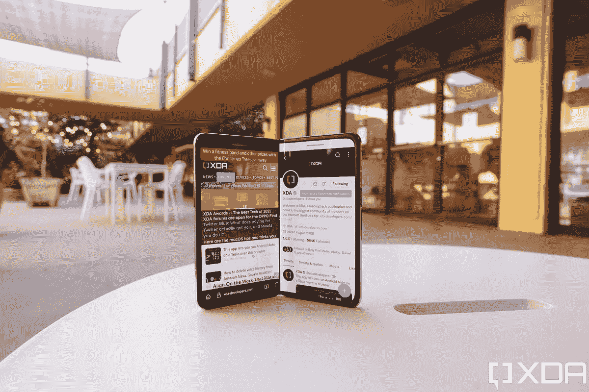

# Surface Duo 的双屏是这款设备的特别之处，而不是更糟

> 原文：<https://www.xda-developers.com/microsoft-surface-duo-2-dual-screens/>

在过去的两年半时间里，我对微软的 Surface Duo 系列有着一种又爱又恨的关系。虽然我绝对喜欢 Surface Duo 的硬件(厚边框除外)，并且我相信双屏手机的实用性，但 Surface Duo 的软件从垃圾箱火到勉强可以忍受。这并不夸张——我购买，然后出售，然后再购买最初的微软 Surface Duo *两次*，因为我在想要硬件和对软件感到失望之间交替。

也就是说，从[的第一款 Surface Duo](https://www.xda-developers.com/microsoft-surface-duo-review/) 到[的第二款](https://www.xda-developers.com/microsoft-surface-duo-2-review/)有了显著的进步，并且微软通过每月更新不断改进软件。我希望第三次会很有魅力，Surface Duo 3 会弥补前两个型号的缺点，成为我一直想要的多任务机。

但现在不会了，至少不会以我想要的方式。一位业内人士最近分享的一个传闻称，微软已经放弃了双屏概念，转而支持一款像三星 Galaxy Z Fold 系列这样的真正的可折叠手机。虽然我从第一天起就一直是可折叠手机的信徒(我实际上已经疯狂到用自己的钱买了最初的 Galaxy Fold 华为 Mate X)，但微软的这条新闻让我很失望。首先，我认为可折叠的场景越来越拥挤，产品开始变得相似(至少对于像我这样可以接触到中国手机的人来说)。如果微软也采用相同的内部折叠方法，我不相信它会打破三星、[小米、](https://www.xda-developers.com/xiaomi-mix-fold-2-review/)或 [Oppo](https://www.xda-developers.com/oppo-find-n2-hands-on/) 没有做过的任何新领域。

最重要的是，我很失望，因为我认为市场上仍然有双屏设备的空间。毕竟，它填补了平板手机和“真正的”可折叠手机之间的空白。

## 拥有两个独立的屏幕有助于划分和鼓励多任务处理

我认为，我们中的许多人的工作需要整天坐在电脑前，假设他们有某种双显示器设置是公平的。研究表明，增加第二台显示器[可将工作效率提高 42%](https://www.jonpeddie.com/news/jon-peddie-research-multiple-displays-can-increase-productivity-by-42/) 。我不知道他们是如何得出这个确切的百分比的(我总是对基于调查的报告持怀疑态度)，但不可否认的是，有第二块屏幕确实有助于人们完成更多工作。这是常识——只要能够同时打开两个全尺寸窗口，就能更容易地看到更多信息。

像 Surface Duo 这样的双屏手机基本上就是智能手机版本。无论是在一个屏幕上用谷歌地图导航，同时在另一个屏幕上确认我的目的地的位置，还是在一个屏幕上仔细检查新闻稿的事实，同时在另一个屏幕上做笔记，双屏手机都让我比单屏智能手机更容易完成这项工作。

是的，我知道一款可折叠手机具有更大的画布和直观的分屏 UI，可以在几乎正常的大小下同时打开两个应用程序，但依靠软件 UI 来划分这两个应用程序不如物理划分好。软件划分不够严格，这种划分经常会被意外模糊。例如，如果我在 Galaxy Z Fold 4 上以分屏模式运行两个应用程序，其中一个需要文本输入，键盘仍然会弹出并占据整个底部三分之一的显示屏，因此另一半会被转移。这不是一个交易破坏者——远远不是——但它可能会分散注意力，并且不断调整软件窗口可能会破坏应用程序的当前状态。

与单屏幕可折叠手机相比，Surface Duo 手机上的两个应用程序之间的界限更清晰、更严格，因为每个屏幕都完全像一个独立的显示器一样。同样的概念似乎也适用于我们的工作环境。想一想，为什么我们大多数人使用两个独立的显示器，而不是只使用一个巨型显示器？

## 拥有两个“普通”屏幕比一个折叠式塑料屏幕更耐用

还记得最初的 Galaxy Fold 和早期审查单元的显示器如何开始左右断裂吗？这既令人震惊又在意料之中，因为可弯曲屏幕的概念似乎违背了逻辑。值得称赞的是，三星最终解决了这个问题，自那以后，可折叠手机屏幕变得更加耐用。在过去的三年里，我每天都使用可折叠手机，还没有损坏过一个。

Vivo X Fold(中)与三星 Galaxy Z Fold 4(右)和 Oppo Find N(左)。

但是，尽管可折叠显示技术近年来在耐用性方面有了明显改善，但它仍然不如“普通”玻璃屏幕耐用。这就是为什么今天上市的大多数可折叠手机仍然有警告标签，建议用户对显示屏更加温柔。因此，尽管像 Galaxy Z Fold 4、 [Honor Magic Vs](https://www.xda-developers.com/honor-magic-vs-hands-on/) 和 [Oppo Find N2](https://www.xda-developers.com/oppo-find-n2-hands-on/) 这样的可折叠手机本身并不易碎，但它们仍然比 iPhone 或 Galaxy S22 Ultra 更容易受到显示器损坏。我是一个谨慎的用户，可以毫不担心地使用可折叠手机，但对于笨手笨脚的人来说，像 Surface Duo 这样的传统双屏设备比真正的可折叠手机风险更低。

## 双屏手机*应该比真正的可折叠手机*制造成本更低吗

如今，双屏手机在移动领域也有一席之地，因为它可能是消费者的一个很好的切入点，这些消费者希望他们的移动设备有更大的屏幕空间，但又不愿意花大价钱购买可折叠手机。我不是显示器或智能手机制造专家，但使用两块标准显示面板构建一部智能手机的成本低于一个可折叠 OLED 面板似乎是常识。然而，我们不知道微软对 Surface Duos 的定价，因为这两款手机都是 1500 美元，但我有一种感觉，这是因为微软收取的溢价高于设备本身的成本。

还记得 LG 做手机的时候吗？早在 2018 年和 2019 年，LG 就推出了几款双屏设备，虽然第二块屏幕是以可拆卸外壳的形式出现的，但基本概念与 Surface Duo 相同。LG 实际上免费赠送了第二台显示器，作为预订礼品或捆绑购买。当然，作为显示器制造商，LG 可以以比微软更好的价格采购面板，而且 Surface Duos 的制造质量确实比 LG 的 plasticky 双屏外壳更好。但关键是，如果公司愿意，双屏手机的价格可以更低。如果一个以价值著称的中国品牌，如小米或 Realme，要生产双屏设备，我敢肯定他们的价格会比可折叠设备低得多。

## 手机外形可以更加多样化

 <picture></picture> 

A foldable phone can run two apps in split-screen mode, but the second you need a keyboard, or if one of the apps display a pop-up window, the software border between the two apps goes out of wack. 

Find N 的 7.1 英寸屏幕。

今天，我从粉丝那里听到的关于智能手机的一个经常性的抱怨是，这种场景已经变得无聊，所有最好的手机看起来和感觉都相似。我同意，正如我提到的，我不只是对平板智能手机持这种观点。我也开始对可折叠手机有这种感觉了。我被宠坏了，因为我可以测试几乎每一部发布的可折叠手机。尽管如此，在上个月为 Honor Magic Vs 和 Oppo Find N2 撰写评论时，我发现自己没有办法描述它们的外形，因为它只是与 Galaxy Z Fold 手机完全相同的*外形*。事实上，从硬件角度来看，2022 年唯一真正给我留下深刻印象的可折叠产品是[小米 Mix Fold 2](https://www.xda-developers.com/xiaomi-mix-fold-2-review/) ，它有一种不可思议的薄，只有看到才会相信。

我并不是说双屏 Surface Duo 3 会立即重振手机市场，但至少它会与市场上的其他设备不同，并代表一种替代形式。相反，微软将试图在 2024 年发布另一款可折叠手机，这款手机几乎没有机会(在我看来)比三星、小米甚至谷歌届时推出的最新可折叠手机更精美。

## 前两个 Surface Duos 的问题是软件，而不是硬件

我也不相信微软转向新的外形会解决 Surface Duo 的问题，即低销量可能是由差评和不合理的高价格造成的。最初的 Surface Duo 搭载的软件如此糟糕，以至于我开玩笑说该产品应该被召回。有显示输入延迟，设备需要几秒钟来旋转方向，手机会冻结，需要每隔几天硬重启一次。Surface Duo 2 配备了更好的软件，微软不断推出每月的软件更新，最终将这两款 Surface Duo 都改进到我称之为“不错”的水平，但仍然不够好。Surface Duo 2 仍然是近年来最落后的旗舰手机之一。

因此，对于下一代 Surface Duo(如果考虑到外形因素的变化，它甚至会被称为 Surface Duo)，微软不仅需要处理所有新的硬件，但如果它想获得好评，它仍需要改进其软件。这是一个很大的要求。

##### 微软 Surface Duo 2

微软 Surface Duo 2 带来了比第一代产品大幅度改进的硬件和略有改进的软件。其结果是一个双屏手机，可以比大多数手机。