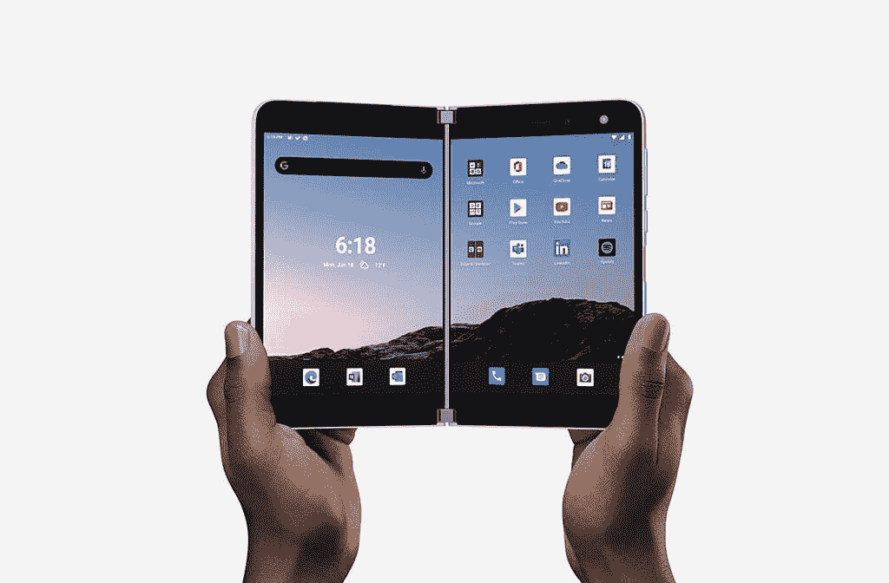
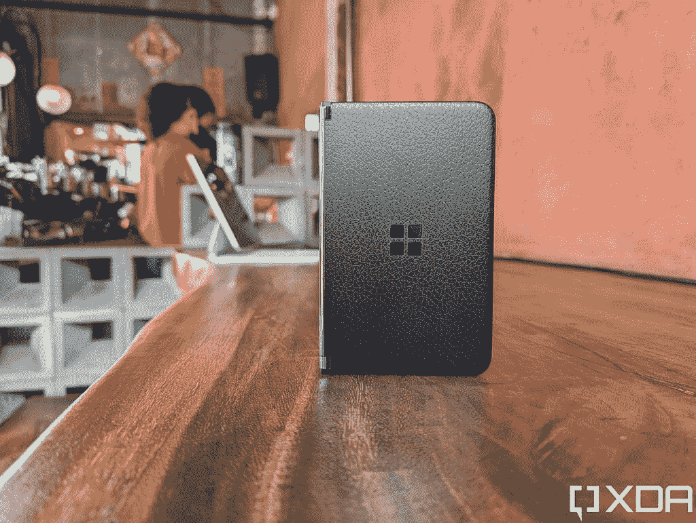
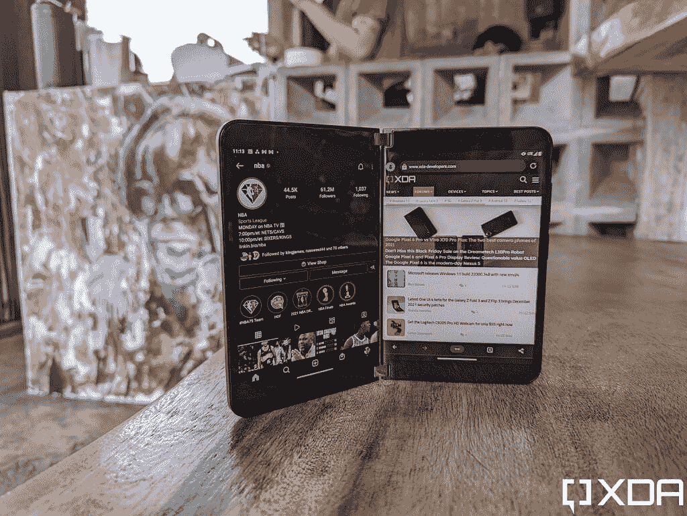
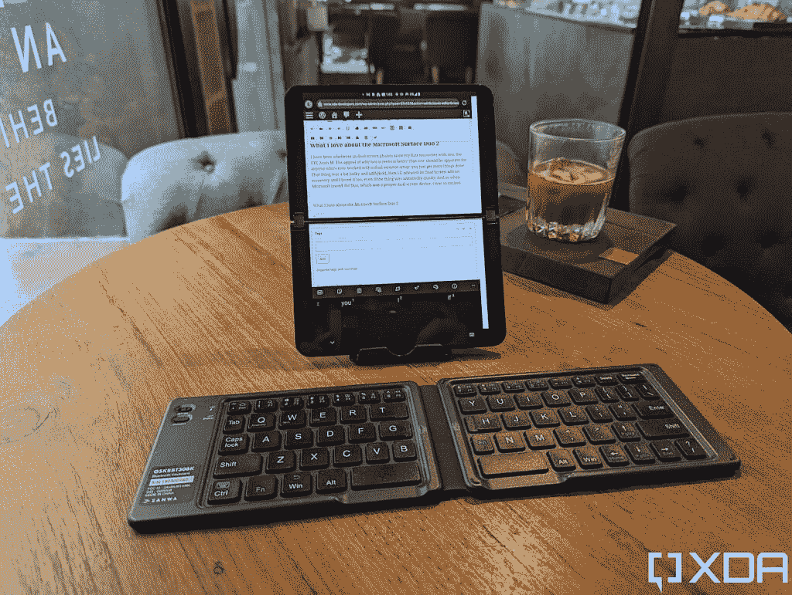
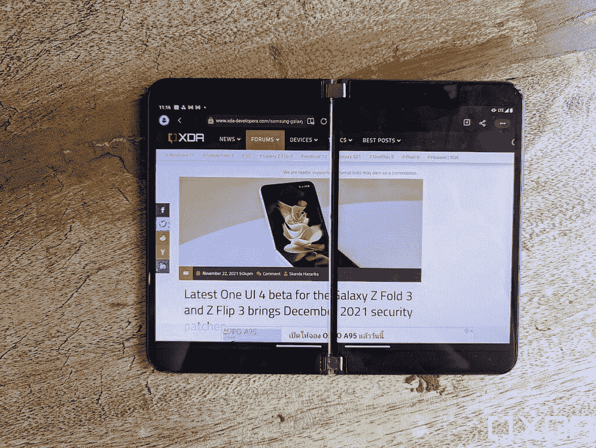
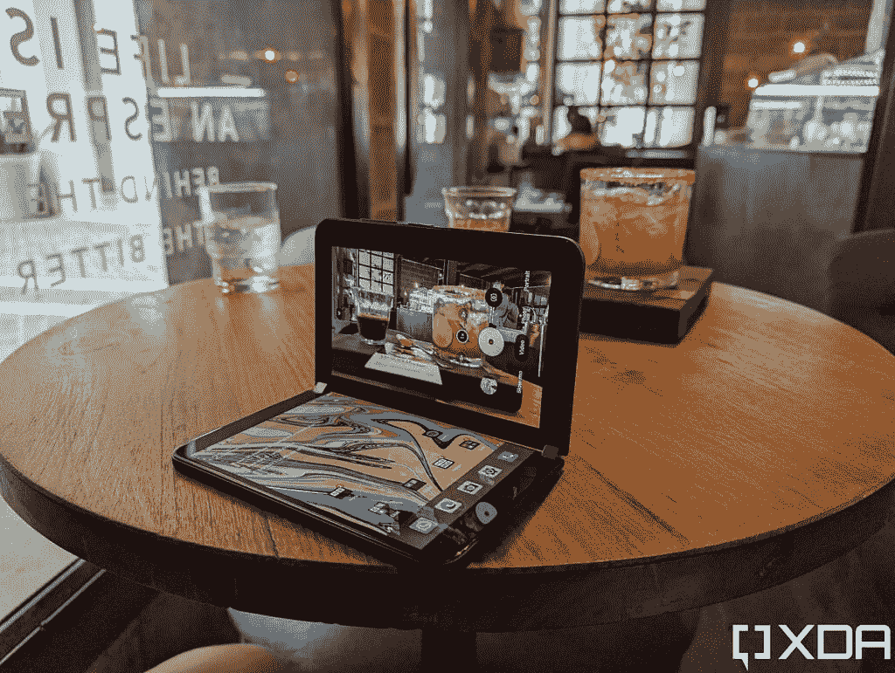

# 我喜欢微软 Surface Duo 2，也讨厌它

> 原文：<https://www.xda-developers.com/microsoft-surface-duo-2-love-hate-relationship/>

真实故事:我在三个不同的场合买卖了最初的微软二人组。不，这不是因为我把它们倒卖获利，就像运动鞋头和乔丹或精明的房地产投资者对房子做的那样。我每次卖掉二重唱都赔钱。但我还是这么做了，因为我对微软的双屏设备又爱又恨。

我的感情分明是分的，分成了两部分。

*   我喜欢两人组的硬件:我完全接受双屏便携式电脑的概念，这种电脑可以放在我的口袋里，因为它大大提高了我的工作效率，甚至像三星的 Fold 系列这样的真正可折叠电脑也无法做到这一点
*   我*讨厌*二人组的软件:在发布时，软件就已经坏到了值得召回的地步，即使在几个月的软件补丁之后，软件仍然漏洞百出，不可靠。这可能是我从一个知名品牌的大规模发布的消费设备上体验过的最糟糕的软件

正是这两种矛盾的情绪让我三次买卖这对组合。当我拥有这款设备时，我对频繁的延迟、应用崩溃和错过触摸输入感到非常沮丧。在我卖掉这款设备后，我开始想念那些华丽的硬件，尤其是完美的转轴和薄得令人难以置信的机身。

所以当微软宣布一款续作设备——Surface Duo 2 时，我非常兴奋！因为如果说我们从消费技术中学到了什么的话，那就是第二代尖端新产品总是会带来重大改进(例如，三星的 Galaxy Z Fold 2 就比第一代 Galaxy Fold 好得多)。因此，理论上，微软 Surface Duo 2 应该可以解决我讨厌的第一代 Duo 的所有问题，对吗？

不完全是。我(和几乎所有其他评审员)在最初的二人组中遇到的许多软件错误和问题要么得到了轻微的改进，要么仍然存在。这意味着我仍然对 Duo 2 爱恨交加。只是这一次，对我的钱包来说幸运的是，爱比恨更强烈，所以我可能不会做像继续出售和反驳它这样的傻事。

 <picture></picture> 

Microsoft Surface Duo 2

##### 微软 Surface Duo 2

微软 Surface Duo 2 是一款双屏手机，至少在理论上，是多任务者的梦想设备。

***About this editorial:***

我在使用了一台自购的微软 Surface Duo 2 近一个月后，写下了这篇观点文章。这纯粹是我的观点，本身不是评论。对于 XDA 的官方评论，我们的执行主编 Rich Woods 收到了一个单元，并编写了

[Microsoft Surface Duo 2 review](https://www.xda-developers.com/microsoft-surface-duo-2-review/)

.

* * *

## 我喜欢微软 Surface Duo 2 的地方是

对于任何使用过双显示器的人来说，为什么两个屏幕比一个屏幕更好的吸引力应该是显而易见的:你可以看到更多，你可以同时打开更多的窗口，你可以完成更多的事情。同样的逻辑也适用于手机。微软并不是第一个有这种想法的公司，以前也有过双屏智能手机，最引人注目的是中兴和 LG，但两家公司都无法制造出伟大的双屏硬件:这些设备折叠起来很厚，LG 的两个屏幕之间有一个巨大的边框/间隙。另一方面，微软通过第一代 Surface Duo 获得了双屏硬件。

 <picture></picture> 

The original Microsoft Surface Duo

这东西薄得不可思议，铰链旋转了近 360 度，可以保持在任何角度，两个屏幕之间的间隙足够近，你可以在两个屏幕上运行一个应用程序，它看起来只会有点烦人。第一代 Surface Duo 有一些硬件缺点，比如过时的处理器，缺乏合适的摄像头，以及屏幕周围的厚边框，但微软在 Surface Duo 2 中解决了所有这三个问题(在不同程度上)，同时仍然保留了我前面提到的所有优点。

我非常喜欢这种设计提供的多功能性:除了像拿一本书一样拿着设备，同时打开两个应用程序，我真的很喜欢以横向方式拿着设备，使用底部屏幕显示全尺寸键盘以加快打字速度，以及将设备放在 L 形桌子上(像笔记本电脑一样)，不用手看视频或拍摄视频。

可能因为我曾经幻想自己是一个随身携带鼹鼠皮笔记本的作家，我绝对喜欢 Surface Duo 1 和 Surface Duo 2 看起来像一个小笔记本——特别是在我给它贴上人造革皮之后。每次我打开或关闭它，它都会唤起一种喜悦的感觉。

 <picture></picture> 

The Duo 2 with a leather skin applied.

当 Duo 2 按预期工作时，它提高了我的工作效率

现在，一些读者可能会问:“但本，你也有[三星 Galaxy Z Fold 3](https://www.xda-developers.com/samsung-galaxy-z-fold-3/) ，那部手机不就是这一相同想法的高级版本吗？”是的，从技术上来说，我同意 Galaxy Z Fold 3 要先进得多——它只有一个可以折叠的屏幕！当然，如果我必须选择多年保留一台设备，我十有八九会选择 Galaxy Z Fold 3 而不是 Duo 2。但最近我选择携带 Surface Duo 2 而不是 Galaxy Z Fold 3 有两个原因，因为我经常出差。

*   我发现有两个独立的屏幕可以帮助我更好地处理多项任务，因为它迫使我将两个独立的任务划分开来。Surface Duo 2 更宽的长宽比也更适合以全尺寸显示两个应用程序。
*   尽管三星提高了 Galaxy Z Fold 3 的耐用性，但它最终仍比普通手机更脆弱，因为它有一个柔软的可弯曲屏幕和一个仍略微打开的铰链。如果我在特别多尘/脏/潮湿的环境中使用 Galaxy Z Fold 3(比如建筑工地、海滩或徒步穿越瀑布)，我仍然觉得有必要比普通手机更爱护它。我对 Surface Duo 2 没有这样的顾虑，因为它真的只是两个玻璃手机缝合在一起。如果灰尘或沙粒暂时落在上面，或者如果我不小心从几英尺高的地方将一枚硬币掉到 Surface Duo 2 的屏幕上，我都不会担心。

 <picture></picture> 

Running two apps side-by-side on the Duo 2.

当然，如果我必须吹毛求疵，我可以说出 Duo 2 可以改进的地方:我希望边框更薄，也许像现代平板手机一样。我希望相机质量更好——现在它只是一般——如果微软能在设备的“外面”放上第三块屏幕，那就太棒了，这样我就不用每次想做什么事情时都打开设备。但是最后一个要求也是不现实的，因为它会增加设备的厚度和成本。所以实事求是地说，我对 Duo 2 的硬件没有任何真正的抱怨。当 Duo 2 按预期工作时，它提高了我的工作效率。事实上，我在一家咖啡店写了一部分关于 Duo 2 的文章，WordPress 分布在两个屏幕上，配有无线键盘。

 <picture></picture> 

Running Wordpress across both screens for a larger typing canvas.

* * *

## 我讨厌微软 Surface Duo 2 的地方

你知道我之前说过最初的微软二人组有可能是我从大规模发布产品中体验过的最差的软件体验吗？嗯，微软 Duo 2 在这方面有所改进，在某些情况下，改进是主要的。但是因为最初的起点太低——请记住，“有史以来最差的软件”——以至于即使在基线上有很大的改进也不足以拯救产品。

我和许多评论者遇到的最大的问题是应用程序经常崩溃和死机。对于第一对搭档来说，这种情况每天至少发生两到三次——如果我打开了一个应用程序，整个手机偶尔会死机，需要 15-20 次向上滑动才能退出该应用程序。有时需要重启。

谢天谢地，这在 Surface Duo 2 上有了很大的改进。如果我大量使用手机作为我的主要电话，我可能仍然会一天左右遇到一次，但不是一天*多次*。不过，有时候我需要在 WhatsApp 或微信上输入一个简短的回复，这个过程需要 45 秒(而不是 5 秒)，因为应用程序死机了。

第一代 Surface Duo 的另一个主要问题是显示屏不会记录触摸或记录它们很晚，这真的会影响打字。这一点在 Surface Duo 2 上也有了很大的改进，但仍然足够了。正如许多其他评测者指出的那样，Surface Duo 2 屏幕的触摸响应速度仍然感觉缓慢，有时比我今年测试的任何其他智能手机都慢一拍。这个问题并没有糟糕到任何时候都可以立即察觉，如果我长时间使用 Surface Duo 2，我就会习惯了。但每当我在使用另一部智能手机一段时间后回到 Surface Duo 时，我总是会注意到触摸反应时间更慢。

我至少可以用 Surface Duo 2 打字，而不会沮丧到对着设备咕哝 F-bombs 的地步，这是我在第一款 Surface Duo 上尴尬做到的

令人欣慰的是，我至少可以用 Surface Duo 2 打字，而不会如此沮丧，以至于对着设备咕哝 F-bombs，这是我在第一款 Surface Duo 上令人尴尬的做法。

最后一个恼人的软件问题:如果你想用 Surface Duo 2 切换方向，请做一个夸张的手臂手势来旋转手机，就好像你在转动汽车方向盘来一个急转弯。因为 Duo 2 的加速度计，就像最初的 Duo 一样，非常不敏感，如果你只是随意地将手机转向一边，50%的时间都不会正确旋转。有时，应用程序会旋转，但显示不正确，需要您退出应用程序并再次启动。

 <picture></picture> 

When I tried to rotate the device to landscape orientation, it took multiple tries for Microsoft Edge to follow.

我在网上发泄了我的不满，一些微软粉丝指责我没有安装软件补丁。这不是真的:我已经安装了所有可用的软件补丁(到目前为止有两个),这些问题仍然存在。此外，最初的微软二人组在过去的一年里看到了八九个软件补丁，直到几周前我第三次出售它之前，这款设备仍然拥有“*有史以来大规模发布的消费设备*中最差的软件”。

此外，一些人为微软制造借口，坚称软件补丁可以解决问题，这一事实从根本上说是令人不快的。微软是一家价值万亿美元的公司，他们不能在发布时发布不是充满非常明显和频繁的错误的软件？人们应该为 Surface Duo 2 支付 1500 美元，然后希望半年后，在安装了 6 个软件补丁后，这款产品会像广告宣传的那样运行？不应该是这样的。虽然我们确实知道软件可能会有一些错误，直到设备到达大众面前才会变得明显，但 Surface Duo 将它带到了一个完全不同的水平，人们只能说它是可笑的半生不熟。

## 但是爱战胜了恨

但这是微软笑到最后的部分——尽管我抱怨这款设备，但我仍然每天都带着它，特别是因为我更多地在路上和公共场所工作。如前所述，我早些时候在 Surface Duo 2 上打出了这篇文章的一部分，但这是我在没有更大计算设备的紧要关头的最后手段。Duo 2 更理想的用途是作为配套的工作机。例如，当我使用 iPad Pro 时，我使用 Duo 2 来显示 Slack(或其他参考资料)，这样我就不必失去 iPad 屏幕的一大块来显示这些东西。

现在我可以用其他智能手机做同样的事情吗？是的。但是大多数手机都不能在我的 iPad 旁边自己直立起来。而且大多数手机都无法完整显示 Slack *加*另一个网站或日历。

Surface Duo 2 在我需要拍摄免提照片(如产品照片或 B-roll 视频片段)时也派上了用场，因为它的设计允许它充当自己的三脚架。当我需要给女朋友发一条长长的 WhatsApp 信息时，我会把手机侧过来，把整个底部屏幕当成键盘。

 <picture></picture> 

Capturing a hands-free timelapse video.

当微软 Surface Duo 和 Surface Duo 2 按预期工作时，它们对于像我这样的数字流浪者来说绝对是出色的、改变游戏规则的设备——我一次又一次地爱上了它们。不过，虽然第一代 Surface Duo 在 40%的时间里都能按预期工作，但 Surface Duo 2 将这一比例提高到了 70%？这意味着仍然有 30%的时间我绝对讨厌电话。但至少现在爱战胜恨的几率足够大了。

 <picture></picture> 

Microsoft Surface Duo 2

##### 微软 Surface Duo 2

微软 Surface Duo 2 是一款双屏手机，至少在理论上，是多任务者的梦想设备。