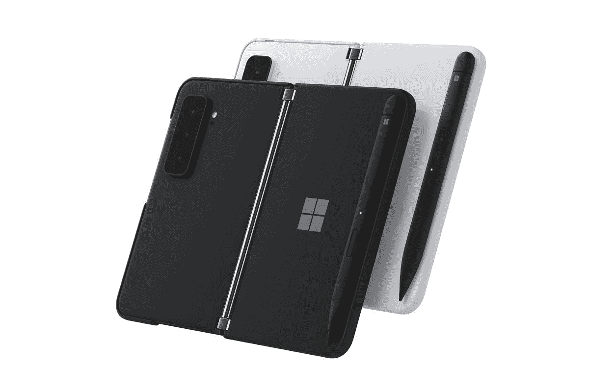
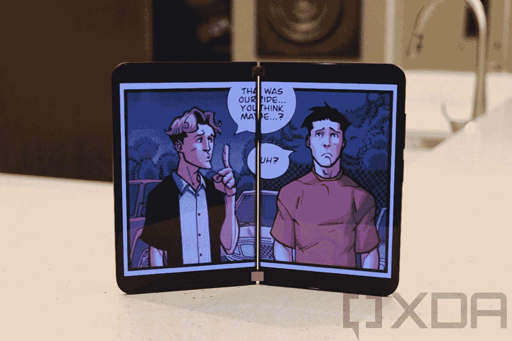
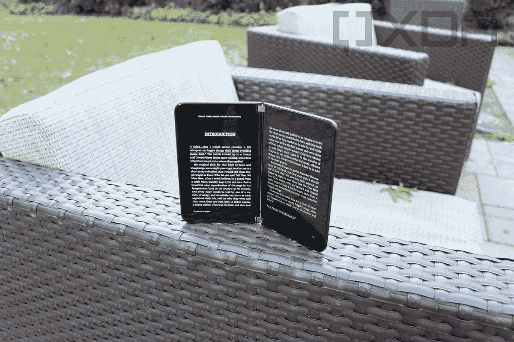

# 微软 Surface Duo 2 评测:生产力发电站

> 原文：<https://www.xda-developers.com/microsoft-surface-duo-2-review/>

微软 Surface Duo 2 是该公司双屏智能手机的第二代产品。第一次迭代不是我们所说的成功。充其量，我们可以说它得到了褒贬不一的评价。

最初的型号有一些你几乎不能认为是相机的东西。当它以 1399.99 美元推出时，它使用的是最新一代的规格，如骁龙 855 和 4G LTE。Surface Duo 2 解决了这些问题，甚至对软件进行了改进。

**浏览此评论:**

### 微软 Surface Duo 2 规格

| 

处理器

 | 骁龙 888 5G 移动平台 |
| 

身体

 | 打开时:145.2 毫米(高)x 184.5 毫米(宽)x 5.50mm 毫米(长)关闭时:145.2 毫米(高)x 92.1 毫米(宽)x 11.0 毫米(铰链处长)重量:284 克 |
| 

显示

 | 

*   双 PixelSense 融合显示屏打开:8.3 英寸 AMOLED，2688x1892
*   单个 PixelSense 屏幕:5.8 英寸 AMOLED 1344x1892 (13:9)
*   401 PPI
*   直接热轧制
*   宽彩色 100% SRGB，DCI-P3
*   具有 90Hz 自适应刷新率的双显示器
*   800 尼特最大亮度
*   展示材料:康宁大猩猩玻璃 Victus

 |
| 

电池

 | 

*   4449 毫安时(典型)双电池
*   4340mAh(最低)双电池

 |
| 

相机和视频记录

 | 动态三镜头后置摄像头:

*   **宽:** 12MP，f/1.7 光圈，27 mm，1.4 m，双像素 PDAF 和 OIS
*   **长焦:** 12MP，f/2.4 光圈，51 mm，1.0 m，PDAF，OIS，2 倍光学变焦
*   **超宽:** 16MP，f/2.2 光圈，13 毫米，1.0 米，110°^o对角线视野，带失真校正

前置摄像头:闪光灯:

*   双 led -双色闪光灯

照片:

*   自动模式，低光和 HDR 多帧照片捕捉和动态范围场景检测
*   专用夜间摄影模式
*   所有 3 个后置摄像头之间的平滑变焦与高达 10 倍的数字超级变焦相结合
*   可调节深度控制的人像模式。广角和远摄相机支持人像模式。用于肖像模式的机器学习
*   具有宽动态范围的全景模式
*   在照片拍摄过程中，长按即可拍摄短视频
*   在视频录制过程中拍摄照片

视频录制:

*   HDR 视频
*   每秒 30 帧和每秒 60 帧的 4K 视频录制
*   每秒 30 帧和每秒 60 帧的 1080p 视频录制
*   120 或 240fps 的慢动作视频
*   HEVC 和 H.264 视频录制格式

 |
| 

连通性

 | 

*   Wi-Fi 6 802.11ax (2.4/5GHz)
*   蓝牙:蓝牙 5.1
*   用于支付和供应的 NFC

*   5G-NR NSA(毫米波):发布 15 DL 64 QAM，最高 6 Gbps，8xDL CA (800MHz)，2x2 MIMO
*   5G-NR NSA(毫米波):第 15 版 UL 64 QAM，2 个上行链路 CA (200MHz)，2x2 MIMO
*   5G-NR NSA(毫米波)波段:n257、n260、n261
*   5G-NR NSA(Sub-6):Release 15 DL 256 QAM 高达 3.2 Gbps，2 个 DL CA (TDD+TDD)，4x4 MIMO
*   5G-NR NSA(子 6):第 15 版 UL 256 QAM
*   5G-NR NSA (Sub-6)频段:n1、n2、n3、n5、n7、n20、n25、n28、n38、n41、n66、n71、n77、n78、n79
*   支持 4x4 MIMO 和 LAA 的千兆位 LTE - A Pro Release 15
*   LTE DL Cat 20，256 QAM 高达 2Gbps，5xDL CA
*   LTE UL 13 类 64 QAM 连续 2X ULCA
*   LTE 频段:1、2、3、4、5、7、8、12、13、14、19、20、25、26、28、29、30、38、39、40、41、42、46、48、66、71
*   WCDMA: 1，2，5，8
*   GSM/GPRS: GSM-850、E-GSM-900、DCS-1800、PCS-1900
*   位置:GPS，伽利略，GLONASS，北斗，QZSS

 |
| 

存储和记忆

 | 

*   128GB、256GB、512GB
*   8GB DRAM LPDDR5 内存

 |
| 

软件

 | 微软内置应用程序:

*   Intune 公司门户
*   商务化人际关系网
*   微软认证器
*   微软必应搜索
*   微软 Edge
*   微软镜头- PDF 扫描仪
*   微软办公软件:Word、Excel、PowerPoint 等
*   微软 OneDrive
*   Microsoft OneNote
*   Microsoft Outlook
*   Microsoft Start
*   微软团队
*   微软要做什么
*   表面
*   技巧
*   Xbox 游戏通行证

微软 Surface Duo 2 UI 核心功能:

*   应用程序组
*   双屏窗口
*   动态码头
*   动态三镜头相机
*   微软 365 订阅源
*   自动跨越应用程序
*   表面双反光条
*   快速键自适应键盘
*   通用搜索
*   您的电话伴侣-链接到 Windows

其他预装应用程序:

*   计算器
*   铬
*   时钟
*   联系人
*   文件
*   谷歌邮箱
*   谷歌助手
*   谷歌日历
*   Google Drive
*   谷歌二重奏
*   谷歌地图
*   Google 相册
*   Google Play 电影和电视
*   谷歌 Play 商店
*   谷歌搜索
*   信息
*   电话
*   录音机
*   油管（国外视频网站）
*   YouTube 音乐

操作系统:Android 11 |
| 

视频回放

 | 视频播放格式:

*   MKV，MOV，MP4，H.265(HEVC)，AVI，WMV，TS，3GP，FLV，3G2，AVI，FLV，TS/M2TS，MKV，WEBM，3GP/MPEG-4，HEIC/HEIF，ASF/WMV，MOV

无线*

*   Chromecast 和 Miracast 支持

有线:

*   USB-C 上的显示端口。通过 HDMI 适配器连接时支持视频输出
*   通过 DisplayPort 电缆或 HDMI 适配器连接到外部显示器时，通过 USB-C 输出 4K 视频

*无线依赖于电视/显示器支持 |
| 

安全性和身份验证

 | 

*   生物识别锁类型:具有企业级安全性的指纹读取器
*   锁类型:刷卡、PIN、密码
*   设备上预装的安全应用程序:Microsoft Authenticator

 |
| 

国家和运营商可用性

 | 所有载具的解锁装置

*   澳大利亚
*   加拿大
*   法国
*   德国
*   联合王国
*   美国（United States 的缩写）
*   奥地利
*   比利时
*   丹麦
*   芬兰
*   爱尔兰
*   意大利
*   荷兰
*   西班牙
*   瑞典
*   瑞士
*   日本

 |
| 

传感器

 | 

*   双加速度计
*   双陀螺仪
*   双磁力仪
*   双环境光传感器
*   双接近传感器
*   霍尔传感器
*   指纹传感器

 |
| 

港口

 | USB 3.2 第二代 |
| 

声音的

 | 

*   立体声扬声器，基于双麦克风人工智能的噪音抑制和回声消除，针对所有姿势的生产性使用进行了优化
*   免提模式下语音通话的最佳全双工通信，接收器和 LRA
*   支持的音频格式:3GP、MP3、MP4、MKV、WAV、OGG、M4A、AAC、ts、AMR、FLAC、MID、MIDI、RTTL、RTX、OTA、IMY
*   高通aptX 经典、高清和 TWS
*   助听器兼容性:M4/T3
*   使用谷歌助手进行语音唤醒

 |
| 

外部

 | 

*   外部材料:康宁大猩猩玻璃
*   颜色:冰川、黑曜石

 |
| 

钢笔和墨水

 | 

*   支持市场上所有代的 Surface 超薄笔、Surface 笔和 Surface Hub 2 笔
*   支持同时使用笔和触摸

 |
| 

价格

 | $1,499.99 / $1,599.99 / $1,799.99 |

微软发给我的型号是 256GB 的黑曜石存储。

## 设计:Surface Duo 2 是我用过的最漂亮的硬件

我知道标题是这么说的，但 Surface Duo 2 是我见过的最漂亮的科技产品。说真的，这东西是艺术品，看着就能感受到。最初的型号只有一种叫做冰川的白色，但新增加的是黑曜石。如果你认为那座冰川很美，等着看这个吧。

完全公平地说，它如此漂亮的事实对产品是一种损害。Surface Duo 2 最大的缺陷就是外面没有屏幕，每次想用手机都要打开。这是一个痛点。我们稍后会谈论一下[三星 Galaxy Z Fold 3](https://www.xda-developers.com/samsung-galaxy-z-fold-3/) ，但这是一款类似的设备，它的外部确实有显示屏，并且工作正常。

但问题是。我宁愿放弃最基本的功能和易用性，以保留带有银色微软标志的黑色玻璃面板。太漂亮了。

Surface Duo 2 是我见过的最漂亮的科技产品。

背面有一个摄像头凸起。抱歉各位，但这只是物理现象。最初 Surface Duo 上的摄像头是一个土豆。你看，它只使用了前置摄像头，这也包括在一部本来就很薄的手机中。如果你想要更好的质量，你需要更多的 z 深度，简单明了。

这也不是你想妥协的事情。许多人对最初二人组相机的抱怨不以为然，但你必须记住，我们的目标是用一个设备做所有事情。即使生产力是这里的目标，我们也必须记住，用户正在用它取代他们的个人智能手机，所以它需要能够拍摄正确的照片。

因此，是的，当你将显示器向后折叠 360 度时，它不再能够平放在另一侧。不过没关系。

唯一的端口是底部的一个 USB 3.2 Gen 2 Type-C 端口，支持快充。没有耳机插孔，这并不奇怪，因为这东西只有 5.5 毫米厚。实际上这东西有多薄令人印象深刻，尽管它比它的前身厚一点。不过，我不是在抱怨。这里的工程是非凡的。

这两个屏幕也很漂亮。它有两个 5.8 英寸 AMOLED 1，344x1，892 显示屏，刷新率为 90 赫兹，最大亮度为 800 尼特。总像素密度为 401ppi。颜色是充满活力的，黑色是黑色，这是绝对令人愉快的。它们支持任何 MPP 笔的笔输入，您甚至可以获得一个外壳，让您连接和充电超薄笔 2。

遗憾的是，感觉像在纸上写字的超薄 Pen 2 触觉装置无法与这款设备配合使用。我被告知，该功能将于稍后推出。

在安卓软件更新方面，微软不值得信赖。

说到屏幕，虽然它很漂亮，但我确实有一些问题。有很多次，我不得不多次触摸或滑动屏幕来做我需要做的事情。我真的希望触摸屏更灵敏，这是我希望在未来的更新中看到的另一件事。这几乎肯定是可以在新固件中改进的。

但令人不安的是，这正是最初的 Surface Duo 失败的地方。微软以一种特定的方式运输产品，一旦产品上架，几乎没有做任何改进。这种策略的问题在于，它很难让人相信产品会随着时间的推移而改进。这是微软真正可以向一加学习的地方。

关于显示器，另一件需要注意的事情是，微软称之为扫视栏的背面曲线。它可能是有用的，但大多数时候，它并不真正实用。当有电话进来时，它会显示通知，当有电话进来时，它会亮起。但要查看时间，打开设备就像按下电源按钮点亮扫视栏一样简单。

## 相机:Surface Duo 2 是一个巨大的进步，但它仍然需要努力

就像我之前说的，最初 Surface Duo 中的摄像头是一个土豆，所以很高兴看到团队在这一个上投入了一些实际的努力。Surface Duo 2 有三个后置摄像头镜头:12MP f/1.7，12MP f/2.4 2 倍变焦，16MP f/2.2 超宽。

我很高兴地说，相机是体面的。然而，它肯定不会赢得任何奖项。在白天，很容易找到正确的方向，尽管它会奇怪地努力聚焦在取景器的中间。这是其他原始设备制造商不久前提出的，如果你的主题不在中间，它仍然应该是重点。

这是一个小问题，因为主要问题是夜间性能，我不是在谈论照片的质量。当你在晚上打开相机应用程序时，取景器中的帧速率会下降到难以使用的程度。更难把注意力集中在你想关注的主题上。这是我根据测试后要删除多少图片来判断的一个区域。对这部手机来说太多了。

很酷的一点是，你可以用两个屏幕做更多的事情。取景器在一个屏幕上，图像库在另一个屏幕上。轻按画廊中的图像，另一个屏幕会显示编辑选项。这在最初的 Duo 上是不可能的，因为没有后置摄像头，所以显示器必须折叠 360 度才能拍照。

这些是我采集的样本:

我真的很喜欢相机处理色彩等的方式。它的一切都比最初的 Surface Duo 好得多。

这是一个关键的变化。我不在乎这个设备在多大程度上是针对生产力的。它仍然是一部智能手机，它必须擅长智能手机所做的事情。拥有一台还过得去的相机是其中之一。

## 性能:骁龙 888 和 5G 将其提升到一个新的水平

老实说，如果某样东西配备了最新一代的处理器，我不会太生气。我个人认为，旗舰智能手机处理器提供的能力超出了大多数消费者的理解。因此，上一代芯片组没问题，但不适合 1400 美元的智能手机，去年的型号就是这种情况。

现在，Surface Duo 2 问世了。它配备了骁龙 888，这是高通的最新产品，具有 5G 连接能力。当然，我关闭了 5G，因为尽管我住在纽约市附近，但 T-Mobile 的 5G 对我来说仍然比 4G LTE 慢得多。

那么，你能用骁龙 888 的全部能量做什么呢？这是一个很大的生产力。是的，额外的处理能力确实有助于并行运行两个应用程序，这是你用这款设备经常要做的事情。如果你没有同时运行两个应用程序，我不知道你为什么会看 Surface Duo 2。

让您将第二块屏幕用作游戏控制器或照片编辑器是明智而实用的。

另一个大的用例是游戏。别忘了，生产这款注重生产力的设备的公司也生产 Xbox 游戏机。除了游戏机，还有 Xbox 云游戏服务。你可以使用第二块屏幕作为控制器来玩手机游戏，如*沥青 9* 等游戏，或者使用 Xbox 控制器来传输主机游戏。这里有很多游戏选择。

看到微软在第二个屏幕上做了很多，这很酷。从将它用作游戏控制器，到使用它编辑照片等等，都令人印象深刻。

它还配有 4340 毫安时的电池，这是我度过一天从未遇到过的问题。最差的时候，我晚上把它放在充电器上的时候是 35%。遗憾的是，快速充电没有 23%那么快，所以它不像一加 9 Pro 那样，我可以告诉你，如果电池没电了，你可以只充电几分钟。遗憾的是，这里也没有无线充电。

## Surface Duo 2 笔套和超薄笔套 2

当微软首次宣布 Surface Duo 2 时，它还展示了 Pen Cover，这是发布时没有的东西。它现在就在这里，坦率地说，这是我发现这个设备最有趣的地方之一。

首先，你可以通过已经内置在设备中的磁铁将一支笔连接到 Surface Duo 2 上。不会很强烈的停留，也不会很直。这是在最初的 Surface Duo 中发现的一种变通方法。有了新的笔盖，超薄笔 2 不仅可以正确地连接到设备上，而且可以无线充电。

关于箱子的设计，有几件事需要注意。首先它有黑曜石和冰川两种，你可以和你买的型号搭配(也可以不搭配)。它也是哑光的，所以你会失去 Duo 2 漂亮光滑的外观，而不是外壳本身不漂亮。只是用不同的方式很好看。

它也只覆盖前面。从上图可以看出，背部大部分是没有保护的。侧面还有一个保险杠，这些小块通过粘合剂连接在一起，这意味着一旦你把它放在那里，如果你想再次使用它，你应该把它放在那里。

另外需要注意的是，当显示器 360 度折叠时，细长的笔 2 增加了间隙。当然，如果你真的买了这个箱子，你可能会对随身带着这支笔的生产力影响比你带着一个稍大的缺口更感兴趣。

这款产品售价 64.99 美元，这还不包括 Slim Pen 2。这支笔需要额外支付 129.99 美元，所以税后总成本超过 200 美元。

我真的认为这完全值得。给这个设备添加一支笔会给它增加一个全新的维度。正如我在[谈论三星 Galaxy Z Fold 3](https://www.xda-developers.com/samsung-galaxy-z-fold-3-microsoft-surface-mini/) 时所说，我喜欢带笔支持的手持设备的想法。手写笔记非常有用，您可以使用一个屏幕进行通话，同时使用另一个屏幕在 OneNote 中做笔记。

截至目前，Surface Duo 2 不支持你从 Surface Pro 8 或 Surface Laptop Studio 获得的触觉反馈。它的意思是让你感觉像是在纸上写字，这非常棒。微软告诉我，这是以后的事。

 <picture></picture> 

Surface Duo 2 Pen Cover

##### 微软 Surface Duo 2 笔套

Surface Duo 2 笔套可以让你将一根细长的笔磁性连接到手机上，连接时可以无线充电。

 <picture></picture> 

Surface Slim Pen 2

##### 微软 Surface 超薄笔 2

Surface Slim Pen 2 设计用于 Surface Pro 8、Surface Laptop Studio 和 Surface Duo 2。

## 工作和娱乐:买一台三星 Galaxy Z Fold 3 更有意义吗？

我不在乎别人说什么。Surface Duo 2 并不是一款[可折叠手机](https://www.xda-developers.com/best-foldable-phones/)。这是一个带铰链的双屏设备。这是你不得不开始问的问题，是可折叠还是双屏设备更好？

这两款设备比你想象的更相似。微软和三星有着强大的合作伙伴关系，其中 [Galaxy Z Fold 3 与 Windows 和其他微软 365 服务](https://www.xda-developers.com/samsung-galaxy-z-fold-3-microsoft-surface-mini/)有着一些牢固的集成。两者的价格也差不多。

各有利弊。Galaxy Z Fold 3 上的可折叠显示屏可能会比两个传统显示屏更快损坏，因此这是一个有利于二人组的标志。另一方面，Galaxy Z Fold 3 展开成一个大显示屏。

 <picture></picture> 

Invincible

有了 Surface Duo 2，你可以强制任何应用跨越两个屏幕。可悲的是，这对于很多媒体消费来说并不是很好，正如你从上面的 Comixology 应用程序中看到的那样。如果你在看视频的话，你也必须看着这个裂口。

 <picture></picture> 

Fragile Things

不过亚马逊 Kindle 应用程序很棒。它实际上是为双屏幕制作的，甚至还有一个动画，看起来像你在翻书。奇怪的是，虚拟页面被固定在左屏幕的左侧，而不是两个屏幕的中间。不管怎样，Surface Duo 2 都是一款很棒的 Kindle 阅读器。当然，三星 Galaxy Z Fold 3 也是。

也看一下 Outlook 应用程序。一个屏幕显示你所有的邮件，另一个显示你正在阅读的邮件。使用一个窗格用于导航，另一个用于内容可能是最自然的，但问题是业界已经有了一个自然的解决方案。这是因为我们有一个完整的平板电脑市场，应用程序设计人员已经将一侧用作导航窗格，他们不会将屏幕分成 50%。

Surface Duo 2 和三星 Galaxy Z Fold 3 都是出色的微软手机。如果你对微软服务感兴趣，这两种服务都值得你关注。虽然我不得不说，在大多数情况下，我认为大的可折叠屏幕是正确的选择。

## 结论:该不该买微软 Surface Duo 2？

现在，问题来了。这款 1500 美元的双屏智能手机该不该买？如果你做了，很难指责你。其实光是看着这个东西，就对它一见钟情，是那么容易。太漂亮了，AMOLED 屏幕看起来很舒服。

看 Surface Duo 2 很容易一见钟情。

不过也有一些不好的地方，这都归结于微软在软件更新上不值得信任。我们要明确的是，Android 12 本周发货，Android 11 仍然不适用于最初的 Surface Duo。Surface Duo 2 有一些奇怪的触摸问题，正如我所说，相机可以在晚上使用一些真正的软件改进。这些东西会在固件更新中得到修复吗？没办法确定。我甚至不想承诺该公司将通过 Slim Pen 2 提供对触觉的支持，这是它实际上承诺的事情。

不过总的来说，我还是挺喜欢 Surface Duo 2 的。它有一些令人愉快和愉快的东西，它的生产力方面是真实的。如果你花很多时间在旅途中工作，你会发现在一个屏幕上有一个应用程序，在另一个屏幕上有另一个应用程序是非常有用的。

微软在这一点上做得非常好。摄像头改进了，最重要的是软件好了很多。我只是希望 Redmond 公司通过软件更新来维护它，继续做得很好。

 <picture></picture> 

Microsoft Surface Duo 2

##### 微软 Surface Duo 2

Surface Duo 2 修复了原始模型的错误，改进了相机、软件等。