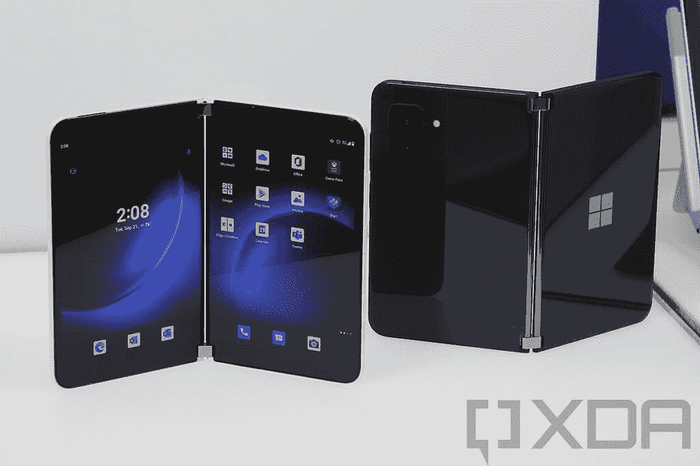
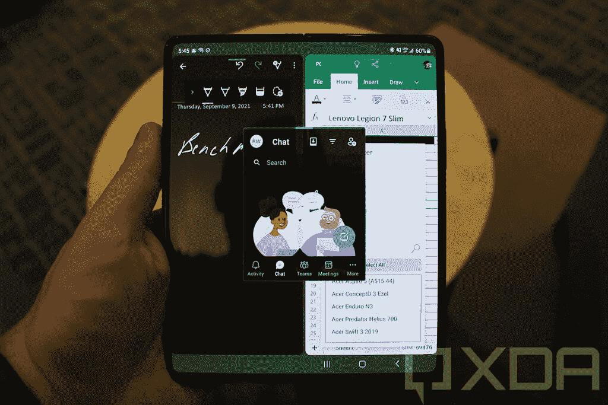
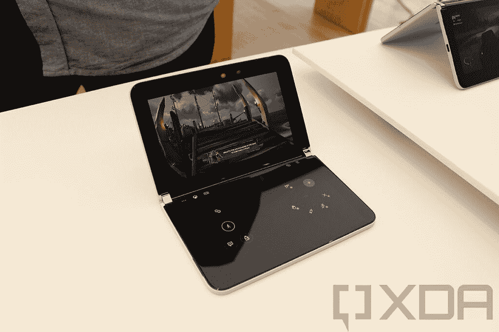
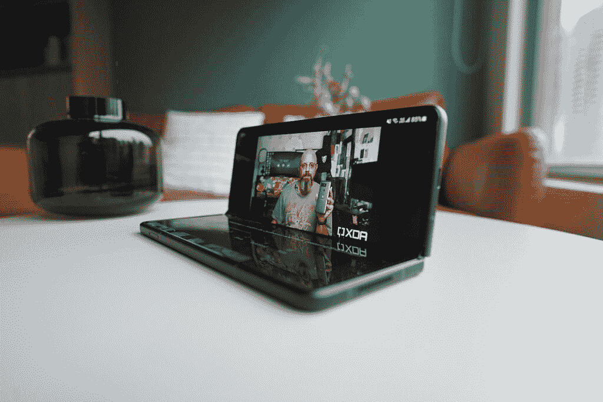

# Surface Duo 2 vs 三星 Galaxy Z Fold 3:该买哪个？

> 原文：<https://www.xda-developers.com/microsoft-surface-duo-2-vs-samsung-galaxy-z-fold-3/>

虽然三星和其他 Android 手机制造商正在走可折叠的路线，以更小的尺寸提供更多的屏幕空间，但微软已经选择了双屏幕的 Surface Duo 设备。该公司最近推出了新的 [Surface Duo 2](https://www.xda-developers.com/microsoft-surface-duo-2/) ，该产品在原来的基础上进行了多项改进。但它如何与三星的旗舰可折叠手机 [Galaxy Z Fold 3](https://www.xda-developers.com/samsung-galaxy-z-fold-3/) 相抗衡？请继续阅读，寻找答案。

**浏览本指南:**

## Surface Duo 2 vs 三星 Galaxy Z Fold 3:规格

| 

规格

 | 

表面二重奏 2

 | 

三星 Galaxy Z Fold 3

 |
| --- | --- | --- |
| 规模 | 

*   开放式:145.2 毫米(高)x 184.5 毫米(宽)x 5.50mm 毫米(长)
*   闭合时:145.2 毫米(高)x 92.1 毫米(宽)x 11.0 毫米(铰链处 T)

 | 

*   开放式:高 128.1 毫米 x 宽 158.2 毫米 x 长 6.4 毫米
*   闭合时:67.1 英寸(高)x 158.2 英寸(宽)x 16.0mm 毫米(铰链处的长度)

 |
| 显示 | 

*   两个 5.8 英寸 AMOLED 显示屏
    *   1344 x 1892 像素
    *   13:9 宽高比
    *   401PPI
    *   HDR、100% sRGB 和 P3 DCI
    *   90Hz 刷新率
    *   800 尼特峰值亮度
*   组合 8.3 英寸，2688 x 1892 像素
*   康宁大猩猩玻璃 Victus

 | 

*   7.6 英寸 QXGA+动态 AMOLED 2X 显示屏
    *   2208 x 1768 像素
    *   22.5:18 宽高比
    *   374PPI
    *   120 赫兹刷新率
    *   1200 尼特峰值亮度
*   辅助 6.2 英寸，2268 x 832 像素，大猩猩玻璃 Victus

 |
| 处理器 | 高通骁龙 888 | 高通骁龙 888 |
| 随机存取存储 | 8GB | 12GB |
| 储存；储备 |  |  |
| 电池和充电 | 

*   4，449 毫安时双电池
*   23W 快速充电

 | 

*   4400 毫安时双电池
*   25W 快速充电
*   10W 快速无线充电
*   4.5W 反向无线充电

 |
| 摄像机 | 

*   1200 万像素，广角，f/1.7 光圈，27 毫米，1.4 米，双像素 PDAF 和 OIS
*   12MP 长焦，f/2.4 光圈，51 mm，1.0 m，PDAF，OIS 和 2 倍光学变焦
*   16MP 超广角，f/2.2 光圈，13 毫米，1.0 米，110 ^o 对角线视野
*   12MP 自拍，f/2.0，24 mm，1.0 m

 | 

*   1200 万像素主摄像头，广角，f/1.8 光圈，1.8 米，双像素自动对焦和 OIS
*   12MP 长焦，f/2.4 光圈，OIS PDAF，1.0 m
*   12MP 超广角，f/2.2 光圈，1.12 m，123 ^o 对角线视野
*   10MP 自拍，f/2.2，1.22 m
*   400 万像素自拍显示下摄像头，f/1.8，2.0 米

 |
| 网络和连接 | 

*   5G-NR NSA(毫米波)波段:n257、n260、n261
*   5G-NR NSA (Sub-6)频段:n1、n2、n3、n5、n7、n20、n25、n28、n38、n41、n66、n71、n77、n78、n79
*   LTE 频段:1、2、3、4、5、7、8、12、13、14、19、20、25、26、28、29、30、38、39、40、41、42、46、48、66、71
*   WCDMA: 1，2，5，8
*   GSM/GPRS: GSM-850、E-GSM-900、DCS-1800、PCS-1900
*   Wi-Fi 6 (802.11ax)
*   蓝牙 5.1
*   国家足球联盟
*   GPS，伽利略，GLONASS，北斗，QZSS

 | 

*   5G(毫米波，低于 6GHz)
*   4G LTE
*   3G，2G
*   Wi-Fi 6E (802.11ax)
*   蓝牙 5.2
*   国家足球联盟
*   GPS，伽利略，GLONASS，北斗，QZSS

 |
| 操作系统（Operating System） | 安卓 11 | 安卓 11 |
| 生物认证 | 侧装式指纹传感器 | 侧装式指纹传感器 |
| 传感器 | 双加速度计、双陀螺仪、双磁力计、双环境光传感器、双接近传感器、霍尔传感器 | 加速度计、气压计、陀螺仪传感器、地磁传感器、霍尔传感器、接近传感器、光传感器 |
| 港口 | USB Type-C 3.2 Gen 2 | USB Type-C 3.2 |

## 设计和展示

 <picture></picture> 

Surface Duo 2

Surface Duo 和 Galaxy Z Fold 3 在设计和外形上是两种截然不同的设备。虽然微软手机有两个独立的屏幕，但它们结合在一起可以提供大屏幕体验，但三星 foldable 使用的是可折叠显示屏，可以展开成更大的屏幕。此外，三星还包括一个辅助屏幕，大小相当于普通智能手机的屏幕，可以帮助完成不需要大屏幕的奇怪任务。这样你就不用每次需要东西的时候都打开 Galaxy Z Fold 3 了。

不幸的是，由于 Surface Duo 2 上没有辅助显示屏，如果你想在手机上做任何事情，你必须打开设备。但是 Surface Duo 2 有一个显著的优势。由于微软使用康宁大猩猩玻璃 Victus 的传统屏幕，Surface Duo 2 的显示屏比 Galaxy Z Fold 3 上的柔性显示屏更坚固耐用。与 Surface 2 Duo 屏幕相比，柔性显示屏更容易被划伤或刺破。

Surface Duo 2 上的两个屏幕通过铰链连接在一起，支持 360 度的全方位移动(更像是 350 度，因为相机模块阻止它折叠起来)。所以基本上，你可以把屏幕从闭合状态下的彼此面对变成打开状态下的相反方向。当您只想操作一个屏幕时，这很有帮助。另一方面，Galaxy Z Fold 3 铰链只支持 180 度移动，但正如前面提到的，它有一个辅助显示屏，用于当你想将设备用作普通手机时。

就实际屏幕尺寸而言，Surface Duo 2 上有两个 5.8 英寸的 AMOLED 面板，刷新率为 90Hz，它们组合起来形成了一个 8.3 英寸的屏幕。另一方面，Galaxy Z Fold 3 拥有 7.6 英寸柔性 AMOLED 屏幕，刷新率为 120Hz。此外，Galaxy Z Fold 3 上的辅助显示屏尺寸为 6.2 英寸，包括一个 AMOLED 面板，刷新率为 120Hz，具有大猩猩玻璃 Victus 保护功能。

## 处理器、内存、存储和操作系统

 <picture></picture> 

Samsung Galaxy Z Fold 3

除了设计和展示，其他部门的事情变得更加简单和相似。Surface Duo 2 和 Galaxy Z Fold 3 都使用骁龙 888 SoC 和 Android 11。但在三星手机上，你会得到 12GB 的内存，而 Surface Duo 2 只有 8GB。虽然 12GB 内存很好，但 8GB 应该足以在 Surface Duo 2 上提供良好的性能。

此外，你可以在两款手机上获得高达 512GB 的存储空间，两家公司都包括了软件调整，以有效地利用额外的屏幕空间。

## Surface Duo 2 vs 三星 Galaxy Z Fold 3:相机

 <picture></picture> 

Surface Duo 2

虽然最初的 Surface Duo 只有一个摄像头用于自拍和常规照片，但 Surface Duo 2 配备了三个拍摄常规照片的摄像头和一个单独的自拍摄像头。Galaxy Z Fold 3 也有三个拍摄常规图像的拍摄器，但有两个相机可以用来自拍。

谈到原始规格，你会看到 OIS 的 12MP 广角相机，OIS 的 12MP 长焦相机，以及 Surface Duo 2 的 16MP 超广角相机。有一个 12MP 的自拍器。相比之下，OIS 有一个 12MP 广角相机，OIS 有一个 12MP 长焦相机，还有一个 12MP 超广角相机。对于自拍，你会得到一个 400 万像素的显示器下摄像头和一个 100 万像素的拍摄装置。

## 电池和连接

 <picture></picture> 

Samsung Galaxy Z Fold 3

这是这两款设备是否非常相似的另一个方面。Surface Duo 2 采用 4,449mAh 双电池，支持 23W 快速充电，而 Galaxy Z Fold 3 采用 4,400mAh 双电池，支持 25W 快速充电。Galaxy Z Fold 3 还支持无线充电和反向无线充电。

在连接选项中，Surface Duo 2 上有 5G 支持、Wi-Fi 6、蓝牙 5.1、NFC 和 USB Type-C 3.2。另一方面，Galaxy Z Fold 3 支持 5G、Wi-Fi 6E、蓝牙 5.2、NFC 和 USB Type-C 3.2。

### Surface Duo 2 vs 三星 Galaxy Z Fold 3:定价

Surface Duo 2 基本款 128GB 的起价为 1499 美元，而 Galaxy Z Fold 3 基本款 256GB 的起价为 1799 美元。因此，即使你考虑 256GB Surface Duo 2 的价格(1599 美元)，Galaxy Z Fold 3 也比 Surface Duo 2 贵 200 美元。

## 结论

正如你所看到的，Galaxy Z Fold 3 和 Surface Duo 2 的主要区别在于它们的设计。这两款设备的其他规格和功能大致相似。因此，在两者之间做出选择的决定取决于您更喜欢哪种设计实现。例如，如果你喜欢两个普通屏幕，而不是一个大的可折叠屏幕，Surface Duo 2 更适合你。但如果你更喜欢可折叠屏幕，并且对其相对脆弱的设计和较高的价格没有任何问题，Galaxy Z Fold 3 更有意义。Galaxy Z Fold 3 也是一款更加全面和实用的产品，所以如果你需要一款可折叠的产品，三星可以更好地满足你。

这两款手机你打算买哪一款？请在评论区告诉我们。如果你想考虑更多的选择，我们还选择了市场上的[最佳可折叠手机](https://www.xda-developers.com/best-foldable-phones/)和[最佳 Surface PC](https://www.xda-developers.com/best-microsoft-surface-pcs/)。

 <picture></picture> 

Microsoft Surface Duo 2

##### 微软 Surface Duo 2

Surface Duo 2 是微软最新的双屏安卓智能手机。它由高通骁龙 888 SoC 驱动，运行在 Android 11 上。

 <picture></picture> 

Samsung Galaxy Z Fold 3

##### 三星 Galaxy Z Fold 3

Galaxy Z Fold 3 是三星最新的旗舰可折叠智能手机。它由高通骁龙 888 SoC 驱动，运行在 Android 11 上，只有一个用户界面。

你也可以阅读我们的个人[微软 Surface Duo 2 评测](https://www.xda-developers.com/microsoft-surface-duo-2-review/)和[三星 Galaxy Z Fold 3 评测](https://www.xda-developers.com/samsung-galaxy-z-fold-3-review/)来更深入地了解这些可折叠设备。