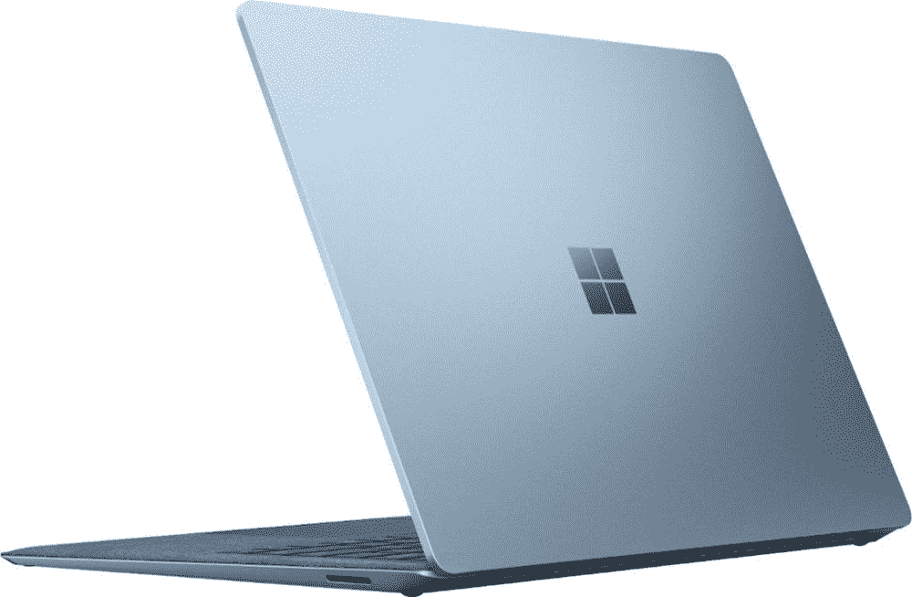

# 微软将其新的 Surface Laptop 4 系列带到印度

> 原文：<https://www.xda-developers.com/microsoft-surface-laptop-4-india-launch/>

微软将其最新的 Surface Laptop 4 系列带到了印度，该系列于 4 月份在全球发布。新款笔记本电脑继续提供与前代机型相似的设计和外形，配备 13.5 英寸和 15 英寸显示屏。在全球公告期间，该公司曾表示，它将让消费者在英特尔和 AMD 两种尺寸的 CPU 之间进行选择。然而，这一选项在印度将无法使用，至少在消费产品方面是如此。

## 微软 Surface Laptop 4:规格

| 

规范

 | 

Surface Laptop 4 13.5 英寸

 | 

Surface Laptop 4 15 英寸

 |
| --- | --- | --- |
| **尺寸&重量** | 

*   308 x 223 x 14.5 毫米
*   1.26 千克(铂金和冰蓝色 Alcantara 面料)
*   1.28 千克(哑光黑色和砂岩金属)

 | 

*   339.5 x 244 x 14.7 毫米
*   1.52 公斤

 |
| **显示** | 

*   13.5 英寸(2256 x 1504 像素)像素传感器
*   3:2 比率
*   10 点多点触控
*   201 ppi

 | 

*   15 英寸( 2496 x 1664 像素)像素传感器
*   3:2 比率
*   10 点多点触控
*   201 ppi

 |
| **处理器** | 

*   英特尔酷睿 i5-1145G7
*   英特尔酷睿 i7-1185G7
*   AMD 锐龙 5 4680U

 | 

*   英特尔酷睿 i7-1185G7
*   锐龙 7 4980U CPU

 |
| **GPU** | 

*   英特尔 Xe 显卡
*   AMD 镭龙显卡

 | 

*   英特尔 Xe 显卡
*   AMD 镭龙显卡

 |
| **闸板&存放** | 

*   8GB/16GB/32GB LPDDR4x 内存
*   256GB/512GB/1TB PCIe NVMe 固态硬盘

 | 

*   8GB/16GB/32GB LPDDR4x 内存
*   256GB/512GB/1TB PCIe NVMe 固态硬盘

 |
| **电池&充电器** | 

*   47.4 小时
*   在 AMD 锐龙上长达 19 小时
*   在英特尔上工作长达 17 小时

 | 

*   47.4 小时
*   AMD 锐龙处理器上长达 17.5 小时
*   上网时间长达 16.5 小时

 |
| **输入/输出** | 

*   表面连接
*   USB Type-A
*   USB-C
*   3.5 毫米耳机插孔

 | 

*   表面连接
*   USB Type-A
*   USB-C
*   3.5 毫米耳机插孔

 |
| **连通性** |  |  |
| **操作系统** |  |  |
| **其他特性** | 

*   Windows Hello
*   Surface pen 和 Surface Dial 兼容性
*   720p 高清网络摄像头

 | 

*   Windows Hello
*   Surface pen 和 Surface Dial 兼容性
*   720p 高清网络摄像头

 |

在外观上，设计没有变化，因此您可以选择键盘面板上的 Alcantara 面料，获得优质的金属结构。内部硬件已经更新，因此可以选择英特尔最新的第 11 代 Tiger Lake 处理器或基于锐龙 4000 系列的新 AMD Surface Edition 芯片组。

虽然微软有各种 SKU，但在印度提供的服务与美国不同。对于消费者来说，13.5 英寸的版本将配备 AMD 锐龙 5 4680U 六核 CPU、8GB 内存和 256GB 固态硬盘。还有英特尔酷睿 i5-1135G7、16GB 内存和 512GB 固态硬盘的选项。15 英寸版本将配备锐龙 7 4980U，8GB 内存和 256GB 固态硬盘。从本质上来说，人们无法获得采用英特尔芯片组的 15 英寸版本。微软正在为商业用户提供更广泛的 SKU，选项高达英特尔酷睿 i7-1185G7 或 AMD 锐龙 4980U。根据您选择的型号，图形将由英特尔的 Xe 或 AMD 的镭龙图形处理。

来到 I/O，你得到一个标准的 USB-A 端口，一个 USB Type-C 端口，一个耳机插孔和 Surface 连接器。虽然这是非常有限的，但你可以通过使用一个[外部坞站](https://www.xda-developers.com/best-docks-surface-laptop-4/)来进一步扩展它们。另一件要注意的事情是，微软提供了一个标准的 USB-C 端口，不支持 Thunderbolt，但是，你可以连接外部显示器。说到这里，我们列出了一些[Surface Laptop 4](https://www.xda-developers.com/best-monitors-surface-laptop-4/)的最佳外接显示器，你一定要看看。Surface 4 笔记本电脑的其他重要功能包括 Windows Hello face 登录、720p 高清网络摄像头、双远场录音室麦克风、带杜比 Atmos 的 omnisonic 扬声器、Wi-Fi 6 和蓝牙 5.0。

## 定价和可用性

新的 Surface Laptop 4 系列现已通过零售商店和在线合作伙伴亚马逊印度和 Reliance Digital 在印度上市。企业用户需要联系[微软商店](https://www.microsoft.com/en-in/surface/business/surface-laptop-4)和微软授权经销商订购。

以下是消费者系列的官方定价:

| 

投机

 | 

价格

 |
| --- | --- |
| [13.5 英寸，AMD 锐龙 5 4680U，8GB 内存，256GB 固态硬盘](https://www.amazon.in/Microsoft-Touchscreen-RadeonTM-Graphics-Platinum/dp/B0933L1RWD/?tag=xdaportalin-21) | ₹1,02,999 |
| [15 英寸，AMD 锐龙 7 4980U，8GB 内存，256GB 固态硬盘](https://www.amazon.in/Microsoft-Touchscreen-RadeonTM-Graphics-Platinum/dp/B0943S58GC/?tag=xdaportalin-21) | ₹1,34,999 |
| 13.5 英寸，英特尔酷睿 i5-1135G7，16GB 内存，512GB 固态硬盘 | ₹1,51,999 |

至于商业产品，微软将从₹1,05,999 开始向₹1,77,999.提供 Surface Laptop 4

亚马逊印度已经列出了 Surface Laptop 4，值得注意的是，AMD 型号正在以折扣价出售。

 <picture></picture> 

Surface Laptop 4 (Ryzen 7/512GB)

##### 微软 Surface Laptop 4

新的 Surface Laptop 4 配备了升级的内部硬件，包括最新的英特尔第 11 代处理器和 AMD 的新 Surface Edition 芯片组。