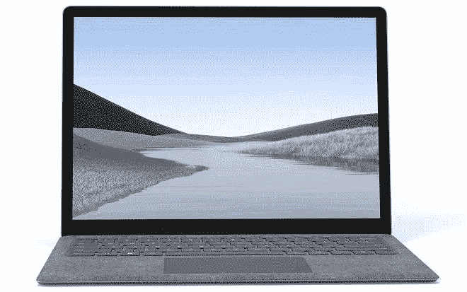

# 微软 Surface Laptop 4 将于 4 月 27 日上市

> 原文：<https://www.xda-developers.com/microsoft-surface-laptop-4-launch-date-leak/>

# 微软 Surface Laptop 4 将于 4 月 27 日发布，搭载新的英特尔和 AMD 芯片

新的报道表明，微软可能会在本月晚些时候推出 Surface Laptop 4，并可能在 4 月 27 日开始发货。

新的 Surface Laptop 4 即将推出，最新报道显示微软将于本月晚些时候推出。新版本预计将采用与当前一代 Surface Laptop 3 相同的设计和外形，13 英寸版本可能会选择 AMD 芯片组。

[*Winfuture*](https://winfuture.de/news,122236.html) 的一份报告表明，我们可能会在 4 月 27 日看到新款 Surface Laptop 4 上市。将再次有两种型号，包括 13.5 英寸和 15.6 英寸，其设计和材料选择与 Surface Laptop 3 相同。这意味着我们可以期待一个镁铝合金机箱，掌托上有一层纺织品涂层。我们唯一可以看到的外部变化是在底部增加了一个小隔间，让用户可以使用 PCIe NVMe 的 SSD，以防他们以后想要升级。然而，SSD 升级可能只能通过微软合作伙伴进行，因为它可能与 Surface Pro X 和 Surface Laptop 3 上看到的微型 M.2 2230 SSD 相同。

## 微软 Surface Laptop 4 泄露规格:

| 

规范

 | 

Surface Laptop 4 13

 | 

Surface Laptop 4 15

 |
| --- | --- | --- |
| **尺寸&重量** | 

*   308 x 223 x 14.5 毫米
*   英特尔 1.31 千克/ AMD 1.25 千克

 | 

*   339.5 x 244 x 14.5 毫米
*   英特尔 1.54 千克

 |
| **显示** | 

*   13.5 英寸(2256 x 1504 像素)
*   3: 2 比率
*   10 点多点触控
*   201 ppi

 | 

*   15 英寸( 2496 x 1664 像素
*   3: 2 比率
*   10 点多点触控
*   201 ppi

 |
| **处理器** | 

*   英特尔酷睿 i5-1145G7
*   英特尔酷睿 i7-1185G7
*   AMD 锐龙 5 4680U
*   锐龙 7 4980U CPU

 | 

*   英特尔酷睿 i5-1145G7
*   英特尔酷睿 i7-1185G7
*   AMD 锐龙 5 4680U
*   锐龙 7 4980U CPU

 |
| **图形处理器** | 

*   英特尔:虹膜加图形 950
*   AMD:镭龙图形

 | 

*   英特尔:虹膜加图形 950
*   AMD:镭龙图形

 |
| **闸板&存放** | 

*   8GB/16GB/32GB (32GB 仅适用于英特尔)
*   128GB/256GB/512GB/1TB PCIe NVMe 固态硬盘(仅 1TB 在英特尔上)

 | 

*   8GB/16GB/32GB (32GB 仅适用于英特尔)
*   128GB/256GB/512GB/1TB PCIe NVMe 固态硬盘(仅 1TB 在英特尔上)

 |
| **电池&充电器** |  |  |
| **输入/输出** | 

*   表面连接
*   USB Type-A
*   USB C

 | 

*   表面连接
*   USB A 型
*   USB C

 |
| **连通性** |  |  |
| **操作系统** |  |  |
| **其他特性** | 

*   Windows Hello
*   Surface pen 和 Surface Dial 兼容性

 | 

*   Windows Hello
*   Surface pen 和 Surface Dial 兼容性

 |

最大的更新将是新的内部硬件。Surface Laptop 4 将采用新的第 11 代英特尔处理器和 AMD 新的 Surface Edition 处理器选项。WinFuture 还表示，微软这次将提供配备 AMD 处理器的 13.5 英寸小机型。

 <picture></picture> 

Microsoft Surface Laptop 4 13-inch

某个在线零售商的定价信息也被泄露，至少在欧洲市场是这样。目前还不确定微软是否会在 4 月 27 日之前举行一场专门的发布会，或者会向媒体发布一份简单的新闻稿。以下是即将发布的 Surface Laptop 4 系列的**泄露价格**:

| 

模型

 | 

价格

 |
| --- | --- |
| Surface Laptop 4 13.5 i5 8 GB 512GB | €1499 |
| Surface Laptop 4 13.5 i5 16 GB 512GB | €1699 |
| Surface Laptop 4 13.5 i7 16 GB 512GB | €1899 |
| Surface Laptop 4 13.5 锐龙 5 SE 8 GB 256GB | €1149 |
| Surface Laptop 4 13.5 锐龙 5 SE 16 GB 256GB | €1399 |
| Surface 笔记本电脑 4 15 i7 16 GB 512GB | €1999 |
| Surface 笔记本电脑 4 15 i7 32 GB 1TB | €2699 |
| Surface Laptop 4 15 锐龙 7SE 8 GB 256GB | €1499 |
| Surface Laptop 4 15 锐龙 7SE 8 GB 512GB | €1699 |
| Surface Laptop 4 15 锐龙 7SE 16 GB 512GB | €1899 |

价格可能会因地区和特定国家的税收而有所不同。