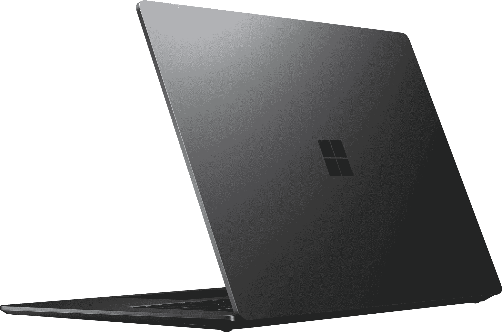

# 微软 Surface Laptop 5 vs 苹果 MacBook Air M2:买哪个？

> 原文：<https://www.xda-developers.com/microsoft-surface-laptop-5-vs-apple-macbook-air-m2/>

微软 Surface Laptop 5 已经上市，加入了目前上市的[最佳 Surface 电脑](https://www.xda-developers.com/best-microsoft-surface-pcs/)的名单。可以说，它甚至是你现在能买到的最棒的 [Windows 笔记本电脑](https://www.xda-developers.com/best-laptops/)之一。它很纤薄，时尚的机箱中融合了过时和最新的技术。

微软最近已经发布了一些看起来干净的产品，但它仍然可以说在某些部门做出了不合逻辑的决定。一个基本的例子是它如何在 2022 年的 Surface Laptop 5 上包括 USB Type-A 端口。尽管如此，它仍然有很多优点，我们将在下面强调。但它与当今市场上的另一款旗舰笔记本电脑相比如何呢? [MacBook Air M2](https://www.xda-developers.com/macbook-air-m2-apple-outdid-itself/) ？这是 Surface Laptop 5 vs MacBook Air M2——两台 13 英寸、2022 笔记本电脑之间的战斗。

## 微软 Surface Laptop 5 vs 苹果 MacBook Air M2 规格

|  | 微软 Surface Laptop 5 | 苹果 MacBook Air M2 |
| --- | --- | --- |
| **处理器** | 

*   第 12 代英特尔酷睿 i5-1245U
*   第 12 代英特尔酷睿 i7-1265U

 |  |
| **图形** |  | 

*   苹果 M2 (8 核 GPU)
*   苹果 M2 (10 核 GPU)

 |
| **正文** | 

*   12.1 x 8.8 x 0.57 英寸
*   2.8 磅

 | 

*   11.97 x 8.46 x 0.44 英寸
*   2.7 磅

 |
| **显示** | 

*   13.5 英寸 PixelSense 显示屏(2256 x 1504)，支持触摸，支持 Dolby Vision IQ

 | 

*   13.6 英寸液晶视网膜显示屏(2560 x 1664)，最高 500 尼特峰值亮度，True Tone 技术

 |
| **端口** | 

*   雷电 4 端口
*   USB 类端口
*   耳机插孔
*   表面连接端口

 | 

*   两个雷电 4 端口
*   MagSafe 3 端口
*   耳机插孔

 |
| **存储** |  |  |
| **记忆** |  |  |
| **电池** | 

*   典型使用时间长达 18 小时
*   60W 充电器

 | 

*   52.6 瓦时电池
*   长达 18 小时的视频播放
*   30W 充电器

 |
| **音频** | 

*   双通道远场录音室话筒
*   配有杜比 Atmos 的 Omnisonic 扬声器

 | 

*   播放 Dolby Atmos 内容时，四扬声器音响系统具有宽广的立体声和空间音频支持

 |
| **摄像机** | 

*   Windows Hello Face 身份验证
*   720 高清摄像机

 |  |
| **连通性** |  |  |
| **颜色** | 

*   铂
*   明智的
*   哑光黑色
*   砂岩

 | 

*   银
*   星光
*   太空灰
*   午夜

 |
| **价格** |  |  |

## 设计:Surface Laptop 5 色彩更丰富

当我们购买一台新设备时，它的物理外观是最先吸引我们注意力的东西之一。这个部门的确大部分是主观的，但不管怎样，我们还是可以做一些观察。从远处看，这两款笔记本电脑看起来都很现代，具有适合 2022 年的未来设计。同样，两家公司都为顾客提供了四种不同的表面可供选择。就我个人而言，我觉得 Surface Laptop 5 的颜色比 MacBook Air M2 的颜色更鲜艳，但它们非常相似。

不出所料，MacBook Air M2 比 Surface Laptop 5 略薄、略轻，但差别很小。在它们的盖子下面，我们分别看到一个带圆角的缺口屏幕和一个带锐角的厚边框显示屏。同样，这取决于你的品味，但我更喜欢 MacBook Air 的凹口设计和圆形屏幕边缘。

虽然他们有一些共同之处，但当谈到他们的港口时，相似之处就结束了。从 Surface Laptop 5 开始，你会得到 Thunderbolt 4、USB Type-A、耳机插孔和 Surface Connect 端口。如果你仍然有 USB 型配件，你可能会欣赏这项史前技术在 2022 年笔记本电脑上的存在。否则，它将会积满灰尘，因为许多设备已经转移到 USB Type-C。

与此同时，MacBook Air 提供了两个 Thunderbolt 4 端口、三个 MagSafe 3 端口和一个耳机插孔。您可以通过随附的 MagSafe 电缆为笔记本电脑充电，或者在另外两个端口中的一个上使用 USB Type-C。虽然创建者可能需要依赖加密狗来充分利用这些笔记本电脑，但两者都提供了相当多的端口类型。

## 显示屏:MacBook Air 更清晰，但不可触摸

现在让我们来看看购买笔记本电脑时你可能会看到的第二样东西:显示屏。人们大部分时间都盯着他们的屏幕——显示器是一个人工作或学习的焦点和反映。好消息是，这两款笔记本电脑都有很好的屏幕，尽管两者之间有一些关键的区别。

正如我们之前所说，Surface Laptop 5 的边框更厚，边角呈方形。与此同时，MacBook Air M2 的屏幕呈圆形，顶部中央有一个缺口。我已经使用 MacBook Air M2 几个月了，我可以向你保证这个刻痕一点也不碍事。你得到的更薄的表圈是完全值得的。然而，这款苹果笔记本电脑不支持触摸输入，所以如果你是一名数码插画师，你可能会发现它缺乏这种功能。

同时，Surface Laptop 5 拥有支持 Surface Pen 的触摸屏。这意味着你可以把它当作笔记本电脑、平板电脑或者两者兼而有之。如果你已经有一台平板电脑，或者只是不需要大屏幕上的触摸输入，MacBook Air M2 是一个具有更高像素分辨率的可靠选择。最终，两个显示器都是大约 13.5 英寸宽，应该可以像你期望的那样工作。

## 性能:苹果的 M2 芯片效率更高

就性能而言，两款笔记本电脑都很棒，但它们都不是最高端的。从附带的 SSD 存储开始，两者都是 256GB 起，Surface Laptop 5 的最大容量为 1TB。同时，MacBook Air M2 支持高达 2TB 的固态硬盘。类似地，这两款设备的内存起价为 8GB，Surface Laptop 5 的最大内存为 32GB，MacBook Air M2 的最大内存为 24GB。如果你需要大量的本地存储，那么 MacBook Air M2 提供了更高的最大容量。如果 RAM 是你想要的，你可以选择在 Surface Laptop 5 上获得更多内存。

如果你担心内存或性能，你应该知道 [macOS Ventura](http://xda-developers.com/macos-ventura) 不像 [Windows 11](http://xda-developers.com/windows-11) 那么苛刻。因此，尽管微软笔记本电脑支持更大的内存，但它不一定能像 MacBook 那样流畅地处理任务。这还没提到苹果 M2 芯片比英特尔的同类产品更强大、更节能。

两家公司都声称他们的设备在正常使用情况下可以持续 18 小时。所以一次充电就能让你度过一个工作日。说到工作，微软的前置摄像头——不管出于什么原因——只有 720p 的分辨率。如果你倾向于参加许多虚拟会议，那么你可能会更欣赏 MacBook Air M2 的 1080p 网络摄像头。不过，Surface Laptop 5 提供面部识别支持。另一方面，苹果笔记本电脑支持触控 ID 认证。

## 一句话:相似的产品，不同的优势

考虑到这是一个购买指南，我们从定价开始吧。仅仅根据你的预算，你可能会发现自己只能选择这两台电脑中的一台。微软 Surface Laptop 5 起价 999 美元，而苹果 MacBook Air M2 售价 1199 美元，需额外支付 200 美元。如果您的预算灵活，那么让我们来看看每种设备的优势。

MacBook Air M2 性能更好，设计更时尚，提供更清晰的网络摄像头，支持更大的存储空间，显示屏也更清晰。与此同时，Surface Laptop 5 有一个 USB Type-A 端口(一些客户可能会认为这是专业的)，包括一个触摸屏，支持 Surface Pen(单独销售)，支持更多 RAM，并有一些更鲜艳的颜色。

如果你已经有了一部 iPhone，购买 MacBook Air M2 对 T4 的生态系统来说更有意义。同样，如果你依赖 Android 设备，那么 Windows 笔记本电脑也能很好地运行。最终，在这一点上，你更好地知道哪种设备满足你的需求，你更喜欢哪种操作系统。然而，如果你热衷于生态系统竞争，这两种设备的利弊都会影响你的决定。

 <picture></picture> 

Microsoft Surface Laptop 5

##### 微软 Surface Laptop 5

Surface Laptop 5 采用时尚的设计，运行 Windows 11，并配有触摸屏。它确实有一些老化的端口，但它是目前市场上最好的 Windows 笔记本电脑之一。

 <picture></picture> 

Apple MacBook Air M2

##### 苹果 MacBook Air M2

2022 款 MacBook Air 提供了 M2 芯片、13.6 英寸显示屏和支持 MagSafe 的重新设计的机箱。