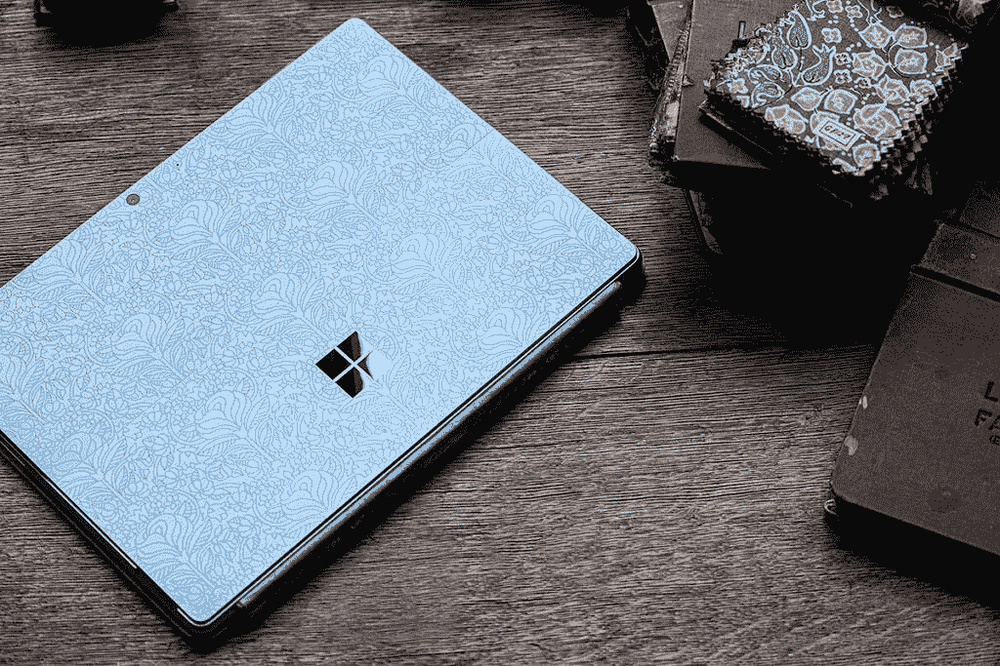

# 微软合并了 Surface Pro X 和 Surface Pro 9 品牌，增加了漂亮的新颜色

> 原文：<https://www.xda-developers.com/microsoft-surface-pro-9-pretty-colors/>

虽然微软每年 10 月都会举办一场硬件活动，但该活动唯一真正的主题是一款新的 Surface Pro。其他产品不到一年更新一次。因此，除了 Surface Laptop 5、T2 Surface Studio 2 和 T3 之外，该公司还推出了 Surface Pro 9。它实际上有两种型号， [Surface Pro 9](https://www.xda-developers.com/surface-pro-9/) 和 5G 的 Surface Pro 9，这两种型号彼此非常不同。

## Surface Pro 9

底盘最大的变化是 Surface Pro 9 现在有了蓝宝石和森林色，使阵容更加丰富多彩。这两种颜色加入了更传统的铂金和石墨配色。

对于 Surface 颜色的一些历史背景，唯一有不同颜色的是 Surface 笔记本电脑系列中的颜色。前两款 Surface Pro 型号为黑色，在 Surface Pro 3 推出铂金后，这是三代产品的唯一颜色。Surface Pro 6 带回了黑色，提供了两种颜色，而 Surface Pro 8 的改变是从使用镁作为材料到使用铝。当这种情况发生时，颜色是铂和石墨。

除了新的彩色平板电脑，Surface 键盘也有新的颜色，也有蓝宝石色和森林色。当然，Surface 键盘，以前被称为 Type Cover(或者触摸键盘，如果你想回到很久以前)，一直是让你的 Surface Pro 更加丰富多彩的方式。

 <picture></picture> 

'Liberty' special edition Surface Pro 9

另一个大的变化是它有英特尔的第 12 代处理器，是 15W 的 U 系列芯片。新一代 CPU 拥有性能内核(P-core)和效率内核(E-core)，采用混合架构，灵感来自我们在 Arm SoCs 中看到的内容。整体来说，性能和电源管理都应该更好，但这也意味着内核数量和线程数量要高得多。

Surface Pro 9 配备了酷睿 i5-1235U 或酷睿 i7-1255U，它们共有 10 个内核(两个 P 内核和八个 E 内核)，以及 12 个线程。相比之下，我们过去看到的第 11 代芯片有四个内核和八个线程。

产品的其余部分真的没有改变。屏幕还是 13 英寸，分辨率 2,880x1,920。它支持高达 120Hz 的动态刷新率，这在 Surface Pro 8 发布时不支持，但后来在固件更新中实现了。

这款平板电脑厚度为 0.37 英寸，重量为 1.94 磅，但如上所述，机箱的唯一变化是颜色选择。有两个 Thunderbolt 4 端口，以及一个 Surface Connect 端口。

有趣的是，微软在 Surface Pro 9 上移除了耳机插孔，尽管机身没有其他变化。

它配备了高达 32GB 的 LPDDR5 内存和高达 1TB 的固态硬盘，将于 10 月 25 日在部分市场推出。

| 

处理器

 | 

随机存取存储

 | 

储存；储备

 | 

颜色；色彩；色调

 | 

价格

 |
| --- | --- | --- | --- | --- |
| 酷睿 i5-1235U | 8GB | 128GB | 铂 | $999.99 |
| 酷睿 i5-1235U | 8GB | 256GB | 铂金、石墨、森林、蓝宝石 | $1,099.99 |
| 酷睿 i5-1235U | 8GB | 512GB | 铂金、石墨、森林、蓝宝石 | $1,399.99 |
| 酷睿 i5-1235U | 16GB | 256GB | 铂金、石墨、森林、蓝宝石 | $1,399.99 |
| 酷睿 i7-1255U | 16GB | 256GB | 铂金、石墨、森林、蓝宝石 | $1,599.99 |
| 酷睿 i7-1255U | 16GB | 512GB | 铂金、石墨、森林、蓝宝石 | $1,899.99 |
| 酷睿 i7-1255U | 16GB | 1TB | 铂 | $2,199.99 |
| 酷睿 i7-1255U | 32GB | 1TB | 铂 | $2,599.99 |

今年采用英特尔技术的机型的门槛降低了 100 美元，因为 Surface Pro 8 的起价为 1099 美元。

## 5G 的 Surface Pro 9

虽然 Surface Pro 9 的前身是 Surface Pro 8，但配备 5G 的 Surface Pro 9 的前身是 Surface Pro X，是的，传言是真的。微软正在合并其两个 Surface Pro 品牌，尽管这两个产品之间存在一些明显的差异。

5G 版 Surface Pro 9 配备了微软 SQ3 芯片组，这是一款高通骁龙 8cx Gen 3。与我们在 Surface Pro X 中看到的 SQ2 不同，这将提供显著的性能提升。当然，它还配有 5G 调制解调器。

这款机型没有 Thunderbolt 4 甚至 USB4，因为骁龙 8cx Gen 3 只支持 USB 3.2 Gen 2。此外，5G 型号只有白金，尽管 Surface Pro X 是第一款采用我们今天在 Surface Pro 上知道的石墨底盘的产品。

不过，Surface Pro X 有一些重大改进。屏幕现在是 120Hz，具有动态刷新率，它还支持 Surface Pen 2 中的触觉反馈，这种反馈让你感觉像在一张纸上写字。

需要明确的是，配备 5G 的 Surface Pro 9 与 Surface Pro 9 采用了相同的机箱，厚度为 0.37 英寸，因此比 Surface Pro X 厚三分之一左右。当然，Surface Pro X 在设计时就考虑到了 Arm 处理器。考虑到处理器的效率，你可以做更薄的无风扇设计。配备 5G 的 Surface Pro 9 仍然没有风扇，但如果两款产品拥有相同的品牌名称，它们就必须安装相同的外围设备，因此它们必须在设计时考虑最小公分母，这就是英特尔。

与 Surface Pro 9 一样，带 5G 的 Surface Pro 9 也将于 10 月 25 日到货，在以下 SKU 中。

| 

处理器

 | 

随机存取存储

 | 

储存；储备

 | 

颜色；色彩；色调

 | 

价格

 |
| --- | --- | --- | --- | --- |
| SQ3 | 8GB | 128GB | 铂 | $1,299.99 |
| SQ3 | 8GB | 256GB | 铂 | $1,399.99 |
| SQ3 | 16GB | 256GB | 铂 | $1,599.99 |
| SQ3 | 16GB | 512GB | 铂 | $1,899.99 |

不幸的是，虽然英特尔驱动的型号起价较低，但高通的实际上要贵得多。它的起价为 1299.99 美元，而 4G LTE Surface Pro X 刚推出时的起价为 999 美元。

 <picture></picture> 

Surface Pro 9 (Wi-Fi Model)

##### Surface Pro 9(无线网络)

Surface Pro 9 是一款采用英特尔或高通处理器的顶级 Windows 平板电脑，它首次拥有多种颜色。

 <picture></picture> 

Surface Pro 9 5G

##### Surface Pro 9 带 5G

5G 版 Surface Pro 9 由新的微软 SQ3 芯片组提供支持，并具有 120Hz 的显示屏。