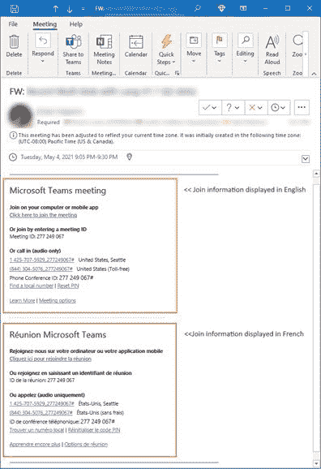
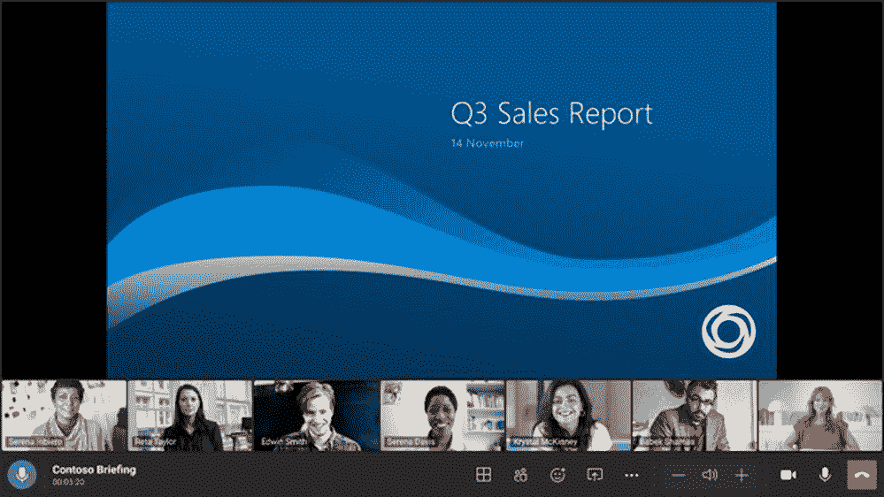

# 微软团队在 5 月份增加了视频质量改进等内容

> 原文：<https://www.xda-developers.com/microsoft-teams-may-2022-updates/>

我们已经到了五月底，和往常一样，微软正在分享上个月对团队所做的一些改进。像往常一样，有很多新闻，但许多新功能分散在不同的设备或特定类型的用户中。

其中一个更显着的改进与视频质量有关，因为团队增加了一个新的灯光校正功能，所以如果你站在明亮的背景前，团队可以确保你在会议或视频通话中仍然可见。此外，还有一个新的软模糊选项，可以稍微平滑您的视频，创建一种散景效果。

关于会议的主题，微软还增加了会议组织者对每个与会者强制模式的能力。这种视图使得会议中的人们一起出现在虚拟房间中，而不是有单独的视频源。到目前为止，您只能为自己启用它，但现在您可以让每个人都有一个相似的视图。

另一个新功能是能够同时以两种语言发送会议邀请，因此如果您与来自不同国家的人一起工作，您可以使他们更容易响应请求并参加会议。与会者现在还可以选择他们在会议中希望显示的状态，例如他们是空闲、忙碌还是外出。此外，关于语言的话题，微软已经在手机上启用了许多新语言的建议回复，包括西班牙语、荷兰语、葡萄牙语、希伯来语等。

 <picture></picture> 

Microsoft TEams multi-languge meeting invite controls

其他更新包括 Approvals 应用程序的新变化，使管理员能够在请求获得批准时要求评论。如果您想保留该信息的个人记录，现在还可以将您的个人批准数据导出到 Excel 文件中。还有其他新的管理功能，如在团队管理中心自定义主页的能力，对应用使用报告和活动日志的改进，以及在管理应用页面查看外部应用 ID 的能力。

Teams Rooms 设备也获得了一些升级，包括一个新的画廊视图，当会议阶段用于演示或共享内容时，该视图可以水平显示会议参与者。现在还可以使用 Android 设备在团队房间中使用直接来宾加入来缩放会议，尽管此功能仅在 Poly Studio X30 和 X50 团队房间设备上可用。

 <picture></picture> 

Horizontal participant gallery in Teams Rooms

说到设备，本月有一些新的团队认证设备，包括罗技 Zone True Wireless 耳塞、哈德里·L1 相机、雅马哈的 ADECIA 桌面解决方案和舒尔数字信号处理器。对于一线员工来说，[微软团队对讲机功能](https://www.xda-developers.com/walkie-talkie-available-microsoft-teams-users/)现在也支持交叉呼叫设备。

今天发布的许多新闻都是针对特定用户的现有功能，例如 VDI(虚拟桌面基础架构)环境。使用 VDI for Azure 虚拟桌面、Windows 365 或 VMware 的用户现在可以受益于多窗口支持，前两个平台现在还支持会议期间的背景模糊。面向 VMware 用户的 VDI 现在还支持动态紧急呼叫，面向 Citrix 的 VDI 现在支持在演示过程中给予和控制的能力，因此参与者可以控制演示者当时共享的内容(在演示者许可的情况下)。

与此同时，政府用户也有一些新功能，包括在网上使用团队时支持 Together 模式，presenter 模式，可以对视频进行镜像，这样你就可以正确地看到自己，以及[高保真音频模式](https://www.xda-developers.com/microsoft-teams-music-mode-external-messaging/)，也称为音乐模式。政府用户现在也可以匿名参加跨不同云的会议，并选择默认应用程序来打开团队共享的文件。最后，政府用户现在还可以在针对 Azure 虚拟桌面和 Citrix 的 VDI 上的团队会议中使用实时字幕。

* * *

来源:[微软](https://techcommunity.microsoft.com/t5/microsoft-teams-blog/what-s-new-in-microsoft-teams-may-2022/ba-p/3440546)