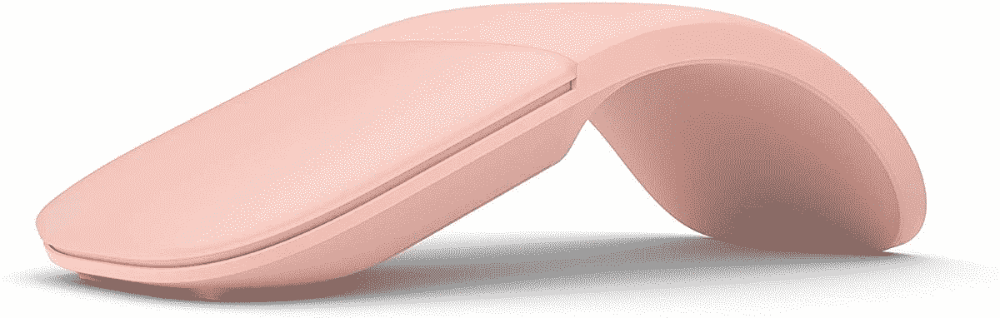

# 微软的折叠弧形鼠标现已上市，售价 47 美元

> 原文：<https://www.xda-developers.com/microsofts-folding-arc-mouse-is-now-on-sale-for-47/>

微软的 Arc 鼠标无疑是目前比较独特的个人电脑配件之一。这是一个带有大滚动垫的鼠标，但它在不使用时可以折叠成扁平的位置，以便于存放。微软通常以 70 美元到 52 美元左右的价格出售这款鼠标，但现在你可以在亚马逊上以 47-48 美元的价格买到多种颜色的鼠标。

微软 Arc 鼠标(有时也称为 Surface Arc 鼠标)使用蓝牙，因此您可以将其与任何电脑或平板电脑配对。中间部分弯曲，允许它在手掌形状和完全平坦之间切换。这在旅行时很方便——鼠标可以滑入任何包或口袋。顶部是用于滚动的触摸板。

 <picture></picture> 

Microsoft Arc Mouse

##### 微软 Arc 鼠标

微软 Arc 鼠标的售价为 47 美元，黑色的售价为 48 美元。其余颜色按通常价格。

这种鼠标的主要缺点是它不能存储多个蓝牙连接，所以如果你想切换设备，你通常需要再次经历配对过程。