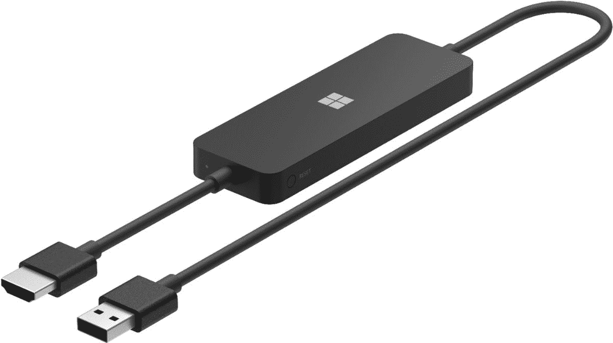
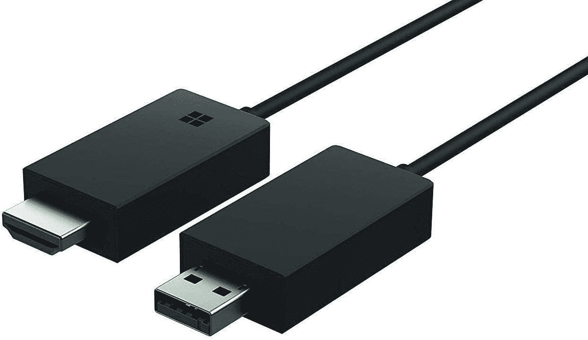
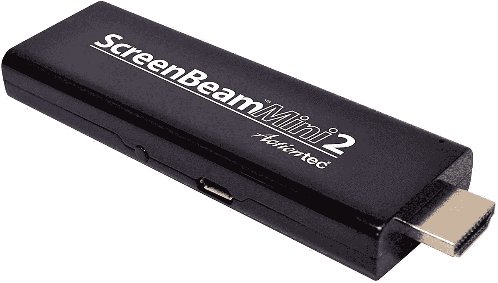

# 什么是 Miracast:关于屏幕镜像标准你需要知道的一切

> 原文：<https://www.xda-developers.com/miracast/>

几年来，出现了几个无线显示标准。虽然有些公司，如英特尔 WiDi，没有得到消费者的太多喜爱，但其他公司如 Miracast，由于其相对更广泛的适应性，已经设法留了下来。但是你有没有想过 Miracast 到底是什么，它能做什么？这篇文章将解释所有你需要了解的技术。

## Miracast 是一种屏幕镜像标准

Miracast 是由 Wi-Fi 联盟推出的屏幕镜像标准，该行业组织促进 Wi-Fi 技术并认证 Wi-Fi 产品的互操作性。它使智能手机、平板电脑和笔记本电脑等设备能够将屏幕镜像到显示器、[电视](https://www.xda-developers.com/best-tv/)和投影仪等接收设备上。然而，由于 Miracast 只能将一台设备的屏幕复制/镜像到另一台设备上，因此它本质上相当于一根无线 HDMI 电缆。因此，它不如 Chromecast 或苹果 AirPlay 那样通用。

Miracast 建立在 Wi-Fi Direct 的基础上，这是一种 Wi-Fi 标准，允许两台设备直接连接，无需任何无线接入点。因此，屏幕镜像标准不需要无线网络来工作。两台经 Miracast 认证的设备可以直接相互通信并创建视频会话。

使用 Miracast，您可以将手机屏幕镜像到电视或汽车的信息娱乐系统，在投影仪上共享笔记本电脑屏幕，并快速完成更多任务。

尽管 Miracast 标准最初允许共享高达 1080p 的视频和 5.1 环绕声，但它在 2017 年进行了更新，增加了对 4K 视频镜像的支持。也就是说，并非所有 Miracast 认证的设备都能够镜像 4K 分辨率的内容。所以实际上，在大多数情况下，你仍然可以获得 1080p 的分辨率。

## 谁支持米拉卡斯特？

由于 Miracast 是一个行业标准，它可用于各种设备。微软在 Windows 8.1 中引入了 Miracast 支持，新版本也可以使用，包括 Windows 11。与智能手机和平板电脑上 Miracast 只能镜像屏幕不同，在 Windows PC 上，您可以使用 Miracast 将电视、显示器、投影仪或其他计算机用作扩展显示器。

谷歌曾经在 Android 中提供 Miracast 支持，但该公司用 Android 6.0 棉花糖删除了它。因此，虽然目前的安卓系统不包含 Miracast，但一些制造商继续在他们的设备上提供它。如果您不确定您的设备是否支持 Miracast，请查看设备文档或联系制造商。

此外，Roku 目前所有的流媒体硬件和[精选亚马逊 Fire TV 设备](https://www.xda-developers.com/amazon-fire-tv-stick-4k-miracast-screen-mirroring-support-update/)也提供内置 Miracast 支持的屏幕镜像。

值得注意的是，一些设备不使用 Miracast 品牌，可能会将其 Miracast 实施称为其他名称，如 Smart View、AllShare Cast 或简单的屏幕镜像。

即使您的电视、显示器或投影仪不支持 Miracast，您也可以从市场上购买 Miracast 加密狗，将该功能添加到您的设备中。Miracast 加密狗通常插入 USB 或 HDMI 端口。一些流行的 Miracast 加密狗包括微软 4K 无线显示适配器，微软 V2 无线显示适配器和 ScreenBeam Mini 2。

 <picture></picture> 

Microsoft 4K Wireless Display Adapter

##### 微软 4K 无线显示适配器

微软 4K 无线显示适配器实际上是一个 Miracast 加密狗。

 <picture></picture> 

Microsoft Wireless Display Adapter v2

##### Microsoft 无线显示适配器 v2

Microsoft 无线显示适配器 v2 是 Miracast 加密狗的另一个绝佳选择。

 <picture></picture> 

ScreenBeam Mini 2 Wireless Display Adapter

##### ScreenBeam Mini 2 无线显示适配器

ScreenBeam Mini 2 是 Miracast 加密狗的绝佳选择。

您还可以使用 Wi-Fi 联盟网站上的[产品查找器来查找 Miracast 认证的设备。](https://www.wi-fi.org/product-finder-results?capabilities=100)

## Miracast 与 Chromecast 或 AirPlay 有何不同？

如上所述，Miracast 只能在电视、显示器或投影仪上镜像您的智能手机、笔记本电脑或平板电脑的屏幕。另一方面，Chromecast 和 AirPlay 的功能要丰富得多，甚至可以与扬声器配合使用来传输音频。

通过 Chromecast，你可以在电视上播放基于互联网或本地存储的内容，然后在手机上做任何你想做的事情，而不会影响正在播放的内容。它还支持屏幕镜像。不幸的是，Chromecast 只能通过特定的移动和网络应用程序或 Chrome 使用。

苹果 AirPlay 也支持屏幕镜像。但是另外，它还可以从发送者设备而不是整个屏幕流式传输特定的内容格式。所以，它比 Miracast 更灵活。也就是说，你只能在苹果设备上使用 AirPlay 播放内容。

## 如何使用 Miracast 镜像您的屏幕

要使用 Miracast standard 进行屏幕镜像，两台设备都需要经过 Miracast 认证。如果你使用 Android 手机或平板电脑将屏幕镜像到电视或其他设备，你通常会在快速设置中找到屏幕镜像功能。如果快速设置中没有屏幕共享或镜像功能，您也可以在设置>连接的设备或设置>显示中查找。

在 Windows 10 或 Windows 11 计算机上，您可以通过打开操作中心，然后单击“连接”来使用镜像屏幕。这将显示周围兼容的 Miracast 显示器列表；选择接收器设备。您也可以选择允许来自电脑键盘和鼠标的输入。此外，您可以使用“更改投影模式”选项来扩展您的显示，而不是复制它。

## 问题和议题

虽然 Miracast 在理论上似乎是一个优秀的屏幕镜像解决方案，但在现实中，它可能是一个痛苦的工作。Miracast 认证的设备应该可以与所有其他 Miracast 认证的设备无缝协作，但通常情况下，您最终会遇到连接问题。

也很难确定特定设备是否支持该技术。制造商通常不会提及 Miracast，并以不同的名称来称呼他们的屏幕镜像功能，即使它是基于 Miracast 的。所以普通消费者甚至没有意识到他们的手机或电视支持 Miracast，可以用于屏幕镜像。

* * *

你在安卓手机或电脑上使用 Miracast 吗？您遇到过这方面的问题吗？请在评论区告诉我们。我们在 Chromecast 和 AirPlay 上也有类似的解说。

与此同时，我们精心挑选了市场上[最好的安卓电视盒子和流媒体棒](https://www.xda-developers.com/best-android-tv-box/)，可以帮助你让你的哑电视变得智能。