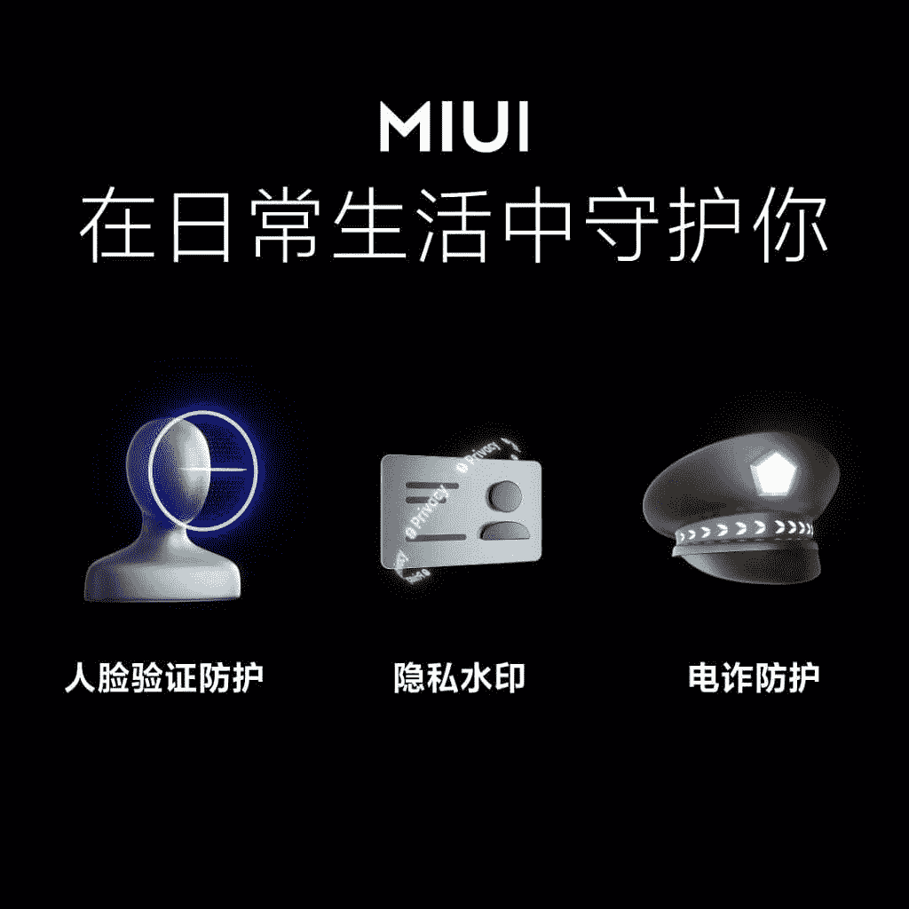
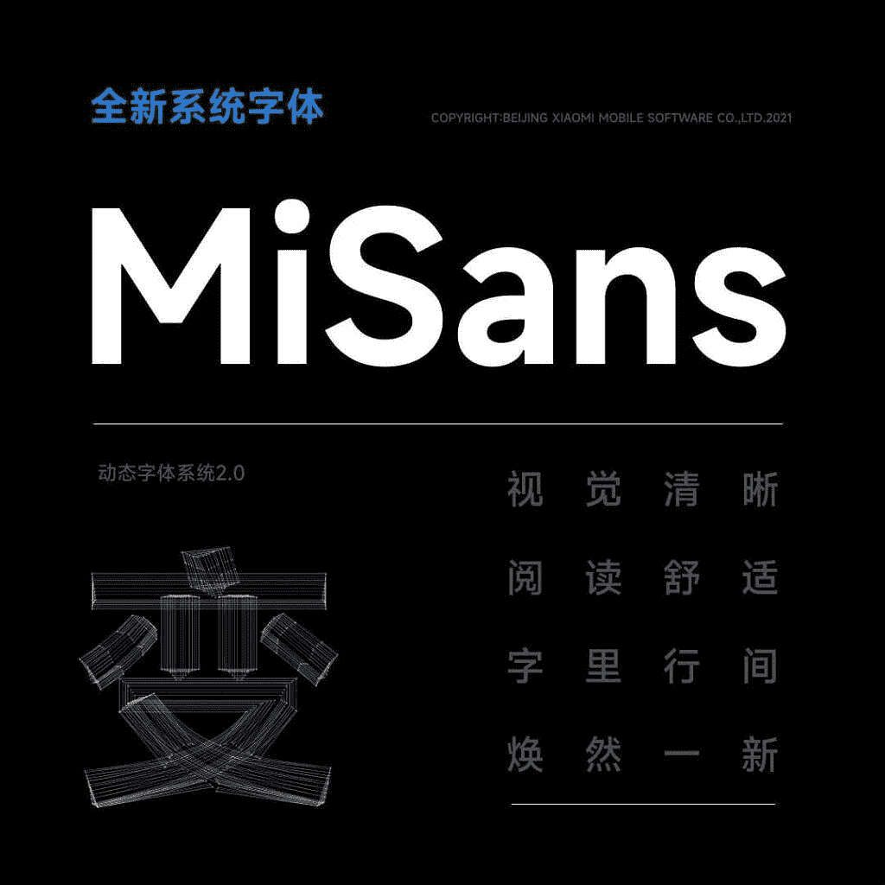
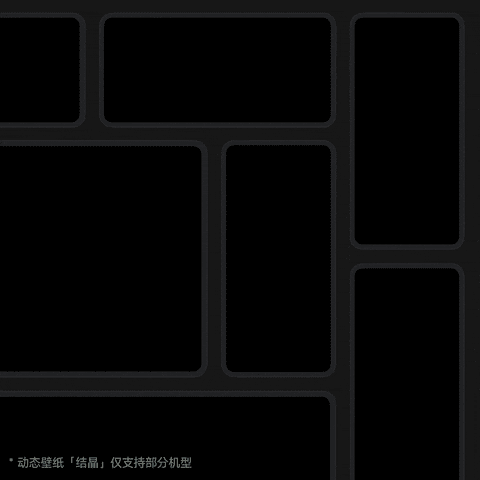
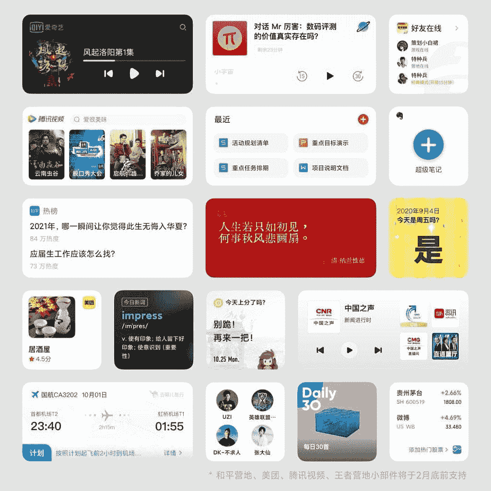

# MIUI 13:小米最新安卓皮肤的功能、发布时间表、下载链接等

> 原文：<https://www.xda-developers.com/miui-13/>

在 2021 年 12 月 28 日在中国举行的发布会上，小米发布了其最新版本的安卓皮肤——MIUI 13。正如你所料，MIUI 13 带来了一系列新功能和性能改进，包括新的隐私功能，新的系统字体，一系列酷壁纸，甚至还有一个针对平板电脑优化的版本。这里有一个 MIUI 13 中所有新东西的快速概述，随后是它的壁纸，推出时间表，下载链接等等。

**浏览这篇文章:**

1.  [新功能和性能改进](#newfeatures)
2.  [MIUI 13 Pad](#miui13pad)
3.  [MIUI 13 发布时间表](#rolloutschedule)
4.  [下载 MIUI 13 壁纸](https://www.xda-developers.com/download-miui-13-wallpapers/)
5.  已接收 MIUI 13 的设备列表
    1.  [小米 11T(玛瑙)](#agate)
    2.  [red Mi K40/POCO F3/Mi 11X(alioth)](#alioth)
    3.  [小米米 10T /红米 K30S(阿波罗)](#apollo)
    4.  [红米 K40 游戏版/ POCO F3 GT(战神)](#ares)
    5.  [红米 10X (atom)](#atom)
    6.  [Redmi Note 8(2021)(biloba)](#biloba)
    7.  [红米 10X Pro(炸弹)](#bomb)
    8.  [红米 Note 10 5G / POCO M3 Pro 5G(山茶花)](#camellia)
    9.  [红米 Note 9 5G【中国】/红米 Note 9T(大炮)](#cannon)
    10.  [小米 Mi 10 Ultra (cas)](#cas)
    11.  [糜混叠(鲸鱼座)](#cetus)
    12.  [红米 K30 超(塞尚)](#cezanne)
    13.  [红米 Note 10 Pro 5G【中国】/ POCO X3 GT(肖邦)](#chopin)
    14.  [小米 Mi 10 Pro (cmi)](#cmi)
    15.  [米 11 Lite 4G (courbet)](#courbet)
    16.  [小米 Mi 9 Pro 5G(症结)](#crux)
    17.  [小米 12(丘比特)](#cupid)
    18.  [米 Pad 5 Pro (elish)](#elish)
    19.  [米 Pad 5 Pro 5G (enuma)](#enuma)
    20.  [红米 Note 11【中国】/红米 Note 11T【印度】(evergo)/POCO M4 Pro 5G(evergreen)](#evergo)
    21.  [红米 Note 11S / POCO M4 Pro 4G(芙蓉)](#fleur)
    22.  [红米 10C【环球】/红米 10【印度】/红米 10 动力【印度】(雾)](#fog)
    23.  [小米米 10T Lite【全球】/红米 Note 9 Pro 5G【中国】/米 10i【印度】(高更)](#gauguin)
    24.  [红米 K40 Pro /红米 K40 Pro+ /米 11X Pro /米 11i(海顿)](#haydn)
    25.  [红米 K50G / POCO F4 GT (ingres)](#ingres)
    26.  [红米 Note 11E【中国】/红米 10 5G【全球】/红米 10 Prime+ 5G【印度】/ POCO M4 5G(轻型)](#light)
    27.  [小米 11 Lite 5G NE (lisa)](#lisa)
    28.  [red mi K30 Pro/POCO F2 Pro(LMI)](#lmi)
    29.  [红米 K50 Pro(马蒂斯)](#matisse)
    30.  [红米 Note 10(莫吉托)](#mojito)
    31.  [小米 CIVI(蒙娜丽莎)](#mona)
    32.  [小米米 10 Lite 5G(莫奈)](#monet)
    33.  [红米 K40S(蒙克)](#munch)
    34.  [米垫 5(纳布)](#nabu)
    35.  [小米 Mix 4(奥丁)](#odin)
    36.  [红米 Note 11S 5G(猫眼石)](#opal)
    37.  [红米 K30 4G / POCO X2(凤凰)](#phoenix)
    38.  [红米 K30 5G(毕加索)](#picasso)
    39.  [红米 K30i 5G (picasso48m)](#picasso48m)
    40.  [红米 Note 11 Pro【中国】/小米 11i【印度】(毕沙罗)/小米 11i 超充(毕沙罗 pro)](#pissarro)
    41.  [小米 12X(波西卡)](#psyche)
    42.  [米 11 Lite 5G(雷诺阿)](#renoir)
    43.  [红米 K50(鲁本斯)](#rubens)
    44.  [红米 10 (selene)](#selene)
    45.  [红米 Note 11 (spes) /红米 Note 11 NFC (spesn)](#spes)
    46.  [小米米 11 超(星)/米 11 Pro(火星)](#star)
    47.  [红米 Note 10 Pro【印度】(sweet) /红米 Note 10 Pro【全球】(sweet_pro) /红米 Note 10 Pro Max【印度】(sweet_pro)](#sweet)
    48.  [米 10S(百里香)](#thyme)
    49.  [小米米 Note 10 Lite (toco)](#toco)
    50.  [小米 Mi Note 10 / Mi CC9 Pro (tucana)](#tucana)
    51.  [小米米 10 (umi)](#umi)
    52.  [小米 Mi 10 青春版/ Mi 10 Lite Zoom(凡高)](#vangogh)
    53.  [波科·X3 专业版(vayu)](#vayu)
    54.  [红米 Note 11 Pro 4G (vida/viva)](#vidaviva)
    55.  [米 11(金星)](#venus)
    56.  [小米 11T Pro (vili)](#vili)
    57.  [红米 Note 11E Pro【中国】/红米 Note 11 Pro 5G【全球】/ POCO X4 Pro 5G【全球】(veux)](#veux)
    58.  [小米 12 Pro(宙斯)](#zeus)
    59.  [小米 Civi 1S(紫金)](#zijin)
6.  [闪烁指示](https://www.xda-developers.com/how-to-install-stock-official-miui-android-update-xiaomi-mi-redmi-smartphones/)

* * *

## MIUI 13:新功能和性能提升

MIUI 13 相比之前的版本带来了几项性能提升——[MIUI 12.5](https://www.xda-developers.com/xiaomi-announces-miui-12-5-mi-redmi-smartphones/)。小米声称，其定制 Android 皮肤的最新版本提供了更好的应用流畅性，与之前的版本相比，第三方应用中的丢帧减少了 15%。小米的原生应用在新版本上也运行得更好，丢帧减少了 23%。

小米声称，MIUI 13 在鲁大师的流畅度测试中排名第一，在所有价位的设备上击败了其他 OEM 厂商的 Android 皮肤。小米还改进了 MIUI 13 的多任务处理能力，该软件现在允许你在任何给定时间在旗舰设备上后台打开多达 14 个应用程序。

小米还致力于通过人脸验证保护、隐私水印和欺诈保护等新功能，使 MIUI 13 对最终用户更加安全。目前，我们还没有所有这些功能的完整细节。然而，我们知道隐私水印功能可以让你在分享的图片上添加水印以防止滥用。

 <picture></picture> 

New privacy and security features

另一方面，欺诈保护功能由几个不同的措施组成，以保护用户免受在线和电信欺诈，如“电子欺诈警告”、“官方徽标”、“欺诈应用程序安装拦截”和“转移保护”。"

 <picture></picture> 

MiSans font

如前所述，MIUI 13 还包含了一个名为 MiSans 的新系统字体。这是一种扁平的最小字体，具有丰富的 Opentype 功能，如自动将连字符的高度调整为大写和小写字母。该字体可免费下载，供个人和商业使用。

 <picture></picture> 

MIUI 13 live wallpapers

此外，MIUI 13 附带了一系列新的实时壁纸，展示晶体的形成。小米表示，这些壁纸是通过 8K 延时摄影使用偏光显微镜拍摄的。一旦 MIUI 13 的第一版开始在设备上推出，我们将确保与您分享这些新壁纸。

 <picture></picture> 

MIUI 13 widgets

此外，MIUI 13 还包括对一堆新插件的支持，像“超级倒计时日”和“量水杯”。该公司在发布会上只给了我们这些新部件的一瞥，但我们希望在未来几天了解更多细节。

**[最好买的小米手机](https://www.xda-developers.com/best-xiaomi-phones/)**

## MIUI 13 Pad

除了智能手机的 MIUI 13，小米还在今天的发布会上宣布了 MIUI 13 Pad。MIUI 13 Pad 是小米安卓皮肤针对大屏设备的优化版。它带来了一些额外的功能，帮助用户充分利用额外的屏幕空间。小米还与开发商合作，为这种新的平板电脑界面优化应用程序，该公司声称，超过 3000 个应用程序已经适应大屏幕。

除了上面提到的所有新功能，MIUI 13 Pad 还包括一些额外的功能，以改善大屏幕设备上的多任务处理体验。这些功能包括在全屏和窗口模式之间快速切换的新快捷方式、窗口缩放、支持多任务拖放的全局任务栏等。MIUI 13 Pad 还提供了对一堆键盘快捷键的支持，以提高生产力。

* * *

## MIUI 13:推出时间表

[小米计划在 2022 年 1 月底开始向第一批设备推出 MIUI 13](https://www.xda-developers.com/miui-13-rollout-schedule/) 。新款小米 12、小米 12 Pro 和小米 12X 将是首批接收更新的设备，此外还有小米 11 Ultra、小米 11 Pro 和小米 11。

### 全球机型 MIUI 13 推出时间表

*   **第一批(Q1 2022)**
    *   军情十一处
    *   米 11 超
    *   米 11i
    *   米 11X 专业版
    *   米 11X
    *   小米 11T Pro
    *   小米 11T
    *   米 11 Lite
    *   米 11 Lite 5G
    *   小米 11 Lite 5G NE
    *   小米 11 Lite NE
    *   小米 Pad 5
    *   红米 10
    *   红米 10 Prime
    *   红米 Note 8 (2021)
    *   红米 Note 10 Pro
    *   红米 Note 10 Pro Max
    *   红米 Note 10
    *   红米 Note 10 JE

### 中国机型 MIUI 13 推出时间表

**公开测试版—第一批(2022 年 1 月中旬)**

*   *   小米 Civi
    *   小米 MIX 4
    *   红米 K40 游戏增强版
    *   红米 Note 10 Pro
    *   小米 11 Ultra
    *   小米 11 Pro
    *   小米 11
    *   小米 11 青春版
    *   小米 Pad 5
    *   小米 Pad 5 Pro
    *   小米 Pad 5 Pro 5G
    *   小米 10S
    *   红米 K40 Pro
    *   红米 K40
    *   红米 K30S 至尊版
    *   红米 K30 至尊版
    *   小米 10 极速版
    *   小米 10
    *   小米 10 Pro
    *   Redmi K30 Pro
    *   红米 Note 11 5G
    *   红米 Note 9 4G
    *   红米 Note 9，红米 10X Pro
    *   红米 10X 和小米 CC9 Pro
*   **第二批(TBD)**
    *   红米 Note 11 Pro
    *   红米 Note 11 Pro+
    *   红米 K30 5G
    *   Redmi K30i 5G
    *   红米 K30
    *   小米 10 青春版
    *   红米 Note 9 Pro
    *   红米 Note 10
*   **稳定推出—第一批(2022 年 1 月底)**
    *   小米 11 Ultra
    *   小米 11 Pro
    *   小米 11
    *   小米 Pad 5 Pro
    *   小米 Pad 5 Pro 5G
    *   小米 Pad 5

* * *

## 下载 MIUI 13 壁纸

如果你正在为你的设备寻找新的壁纸，你可以[下载 MIUI 13 壁纸](https://www.xda-developers.com/download-miui-13-wallpapers/)。

* * *

## 已收到 MIUI 13 或 MIUI 13 Pad 的设备列表

以下是目前有稳定 MIUI 13 版本可用的设备。请注意，设备按其代号的字母顺序排列。本文底部提供了通用闪烁说明。但是，我们建议用户参考设备论坛，了解针对其设备的具体闪存说明，以防有任何变化或需要遵循的特殊说明。

名称中带有 DEV 的构建是公共测试版。在刷新此类版本之前，强烈建议用户自行判断。不建议日常使用。

### 1.小米 11T(玛瑙)

### 2.Redmi K40 / POCO F3 / Mi 11X (alioth)

### 3.小米米 10T /红米 K30S(阿波罗)

### 4.红米 K40 游戏版/ POCO F3 GT(战神)

### 5.红米 10X(凌动)

### 6.Redmi Note 8 (2021 年)(biloba)

### 7.红米 10X Pro(炸弹)

| 

没有。

 | 

内部版本号、地区和状态

 | 

恢复只读存储器

 | 

快速启动 ROM

 |
| --- | --- | --- | --- |
|  | 偏差 |  |  |
| 0.1. | 开发 | [下载链接](https://bigota.d.miui.com/V13.0.0.1.27.DEV/miui_BOMB_V13.0.0.1.27.DEV_5e783601e1_12.0.zip) | - |
| 0.2. | 开发版 | [下载链接](https://bigota.d.miui.com/V13.0.1.1.34.DEV/miui_BOMB_V13.0.1.1.34.DEV_e006e1e5a8_12.0.zip) | - |

### 8.红米 Note 10 5G / POCO M3 Pro 5G(山茶花)

### 9.红米 Note 9 5G【中国】/红米 Note 9T(大炮)

### 10.小米 Mi 10 Ultra (cas)

### 11.Mi 混合折叠(cetus)

| 

没有。

 | 

内部版本号、地区和状态

 | 

恢复只读存储器

 | 

快速启动 ROM

 |
| --- | --- | --- | --- |
|  | **中国(鲸鱼座)** |  |  |
| 1.1. | 13.0.2.0.RJTCNXM | [下载链接](https://bigota.d.miui.com/V13.0.2.0.RJTCNXM/miui_CETUS_V13.0.2.0.RJTCNXM_0dcc796a2c_11.0.zip) | 下载链接 |
| 1.2. | V13.0.3.0.RJTCNXM | [下载链接](https://bigota.d.miui.com/V13.0.3.0.RJTCNXM/miui_CETUS_V13.0.3.0.RJTCNXM_aeb9723e83_11.0.zip) | 下载链接 |

### 12.Redmi K30 Ultra(塞尚)

| 

没有。

 | 

内部版本号、地区和状态

 | 

恢复只读存储器

 | 

快速启动 ROM

 |
| --- | --- | --- | --- |
|  | **开发** |  |  |
| 0.1. | 开发 | [下载链接](https://bigota.d.miui.com/V13.0.0.1.27.DEV/miui_CEZANNE_V13.0.0.1.27.DEV_836ce3d15c_12.0.zip) | - |
| 0.2. | 开发版 | [下载链接](https://bigota.d.miui.com/V13.0.1.1.33.DEV/miui_CEZANNE_V13.0.1.1.33.DEV_1e4edba5f6_12.0.zip) | - |

### 13.红米 Note 10 Pro 5G【中国】/ POCO X3 GT(肖邦)

### 14.小米 Mi 10 Pro (cmi)

### 15.小米 Mi 9 Pro 5G(症结)

### 16.小米 Mi 11 Lite 4G (courbet)

### 17.小米 12(丘比特)

### 18.Mi Pad 5 Pro (elish)

### 19.redmi note 11[中国]/redmi note 11t[印度](evergo)/poco M4 pro 5g(evergreen)

| 

-你好。不，不。

 | 

生成编号、区域和状态

 | 

恢复 ROM

 | 

Fastboot ROM(快速启动 ROM)

 |
| --- | --- | --- | --- |
|  | dev |  |  |
| 0.1. | V13.0.0.1.18.DEV 版 | [下载链接](https://bigota.d.miui.com/V13.0.0.1.18.DEV/miui_EVERGO_V13.0.0.1.18.DEV_a6e3ede657_12.0.zip) | 下载链接 |
|  | **中国(evergo)** |  |  |
| 1.1. | V13.0.2.0.SGBCNXM 版 | [下载链接](https://bigota.d.miui.com/V13.0.2.0.SGBCNXM/miui_EVERGO_V13.0.2.0.SGBCNXM_ffc4488770_12.0.zip) | 下载链接 |

### 20.my pad 5 pro 5g(列举)

### 21.Redmi Note 11S / POCO M4 Pro 4G(花)

### 22.redmi 10c[全球] / Redmi 10[印度]/redmi 10 电源[印度] (fog)

### 23.小米 10t lite[全球] /redmi note 9 pro 5g[中国]/小米 10i[印度](高更)

### 24.redmi k40 pro/redmi k40 pro+/m11x pro/mi11 I(Hayden)

### 25.Redmi K50G / POCO F4 GT(输入)

### 26.redmi note 11 e[中国] /redmi 10g[全球]/redmi 10 prime+5g[印度]/少许 M4 5G (light)

### 27.小米 11 Lite 5G NE (lisa)

### 28.Redmi K30 Pro / POCO F2 Pro (lmi)

### 29.雷德米 K50 Pro(马蒂斯省)

### 30.Redmi 附注 10(莫吉托)

### 31.小米(梦娜)

### 32.小米 10 Lite 5G(莫奈)

| 

-你好。不，不。

 | 

生成编号、区域和状态

 | 

恢复 ROM

 | 

Fastboot ROM(快速启动 ROM)

 |
| --- | --- | --- | --- |
|  | **欧洲(全球货币)** |  |  |
| 1.1. | v 13 . 0 . 2 . 0 . sjieuxm 版 | [下载链接](https://bigota.d.miui.com/V13.0.2.0.SJIEUXM/miui_MONETEEAGlobal_V13.0.2.0.SJIEUXM_b5bf156b9b_12.0.zip) | [下载链接](https://bigota.d.miui.com/V13.0.2.0.SJIEUXM/monet_eea_global_images_V13.0.2.0.SJIEUXM_20220413.0000.00_12.0_eea_958be85ad7.tgz) |
| 1.2. | v 13 . 0 . 3 . 0 . sjieuxm 版 | [下载链接](https://bigota.d.miui.com/V13.0.3.0.SJIEUXM/miui_MONETEEAGlobal_V13.0.3.0.SJIEUXM_4e384a605c_12.0.zip) | 下载链接 |
|  | **台湾(莫奈环球)** |  |  |
| 2.1 | v 13 . 0 . 1 . 0 . sjitwxm 版 | [下载链接](https://bigota.d.miui.com/V13.0.1.0.SJITWXM/miui_MONETTWGlobal_V13.0.1.0.SJITWXM_d8d23da7f4_12.0.zip) | 下载链接 |

### 33.Redmi 40S(芒什省)

### 34.Mi Pad 5 (nabu)

### 35.小米 Mix 4 (odin)

### 36.Redmi 附注 11S 5G (opal)

### 37.Redmi K30 4G / POCO X2(凤凰城)

### 38.雷德米 K30 5G(毕加索)

### 39.Redmi K30i 5G(毕加索 48m)

### 40.Redmi 注 11 pro[中国] /小米 11i[印度](pis arro)/小米 11i 超负荷[印度](pis arro)

| 

-你好。不，不。

 | 

生成编号、区域和状态

 | 

恢复 ROM

 | 

Fastboot ROM(快速启动 ROM)

 |
| --- | --- | --- | --- |
|  | **DEV** |  |  |
| 0.1. | V13.0.0.1.18.DEV 版 | [下载链接](https://bigota.d.miui.com/V13.0.0.1.18.DEV/miui_PISSARRO_V13.0.0.1.18.DEV_28c20c642e_12.0.zip) | 下载链接 |
|  | **中国(pis arro)** |  |  |
| 1.1. | v 13 . 0 . 2 . 0 . sktcnxm 版 | [下载链接](https://bigota.d.miui.com/V13.0.2.0.SKTCNXM/miui_PISSARRO_V13.0.2.0.SKTCNXM_26423b9da8_12.0.zip) | 下载链接 |
|  | **欧洲(pisarrieagglobal)** |  |  |
| 2.1. | v 13 . 0 . 2 . 0 . skteuxm 版 | [下载链接](https://bigota.d.miui.com/V13.0.2.0.SKTEUXM/miui_PISSARROEEAGlobal_V13.0.2.0.SKTEUXM_e33b5fdfc1_12.0.zip) | 下载链接 |
|  | **全球(pisarrollo global)** |  |  |
| 3.1. | v 13 . 0 . 1 . 0 . sktmixm 版 | [下载链接](https://bigota.d.miui.com/V13.0.1.0.SKTMIXM/miui_PISSARROGlobal_V13.0.1.0.SKTMIXM_c4ed23626c_12.0.zip) | 下载链接 |
|  | **俄罗斯** |  |  |
| 4.1. | V13.0.1.0.SKTRUXM | [下载链接](https://bigota.d.miui.com/V13.0.1.0.SKTRUXM/miui_PISSARRORUGlobal_V13.0.1.0.SKTRUXM_66f440dc6d_12.0.zip) | 下载链接 |
|  | **台湾** |  |  |
| 5.1. | V13.0.1.0.SKTTWXM | [下载链接](https://bigota.d.miui.com/V13.0.1.0.SKTTWXM/miui_PISSARROTWGlobal_V13.0.1.0.SKTTWXM_b776c5dd7c_12.0.zip) | 下载链接 |
|  | **土耳其** |  |  |
| 6.1. | V13.0.1.0.SKTTRXM | [下载链接](https://bigota.d.miui.com/V13.0.1.0.SKTTRXM/miui_PISSARROTRGlobal_V13.0.1.0.SKTTRXM_22bdb3c484_12.0.zip) | 下载链接 |

### 41.小米 12X(波西卡)

### 42.小米 11 Lite 5G(雷诺阿)

### 43.红米 K50(鲁本斯)

### 44.红米 10 号

### 45.红米 Note 11 (spes) /红米 Note 11 NFC (spesn)

### 46.小米米 11 Ultra(星星)/米 11 Pro(火星)

### 47.红米 Note 10 Pro[印度] (sweet) /红米 Note 10 Pro[全球] (sweet_pro) /红米 Note 10 Pro Max[印度] (sweet_pro)

### 48.米 10(百里香)

### 49.小米米 Note 10 Lite (toco)

### 50.小米 Mi Note 10 / Mi CC9 Pro (tucana)

### 51.小米 Mi 10 (umi)

### 52.小米 Mi 10 青春版/ Mi 10 Lite Zoom(凡高)

### 53.波科 X3 专业版(瓦尤语)

### 54.红米 Note 11 Pro 4G (vida/viva)

### 55.军情十一处(金星)

### 56.红米 Note 11E Pro[中国] /红米 Note 11 Pro 5G[全球]/POCO X4 Pro 5G[全球] (veux)

### 57.小米 11T Pro (vili)

### 58.小米 12 Pro(宙斯)

### 59.小米 Civi 1S(紫金)

* * *

## MIUI 13 的闪烁说明

请注意，这些是通用的闪烁指令，通常适用于小米、红米和 POCO 设备。但是，您的设备可能会有独特的变化，因此我们强烈建议您访问设备论坛，获取设备特定的说明。

**[如何在装有 MIUI 的小米、米、红米、POCO 智能手机上安装安卓官方更新](https://www.xda-developers.com/how-to-install-stock-official-miui-android-update-xiaomi-mi-redmi-smartphones/)**

* * *

*感谢 XDA 公认开发者 [yshalsager](//forum.xda-developers.com/member.php?u=6084385%E2%80%9D) 和 XDA 成员 [kacskrz](https://forum.xda-developers.com/member.php?u=8240900) 提供这些下载链接！*