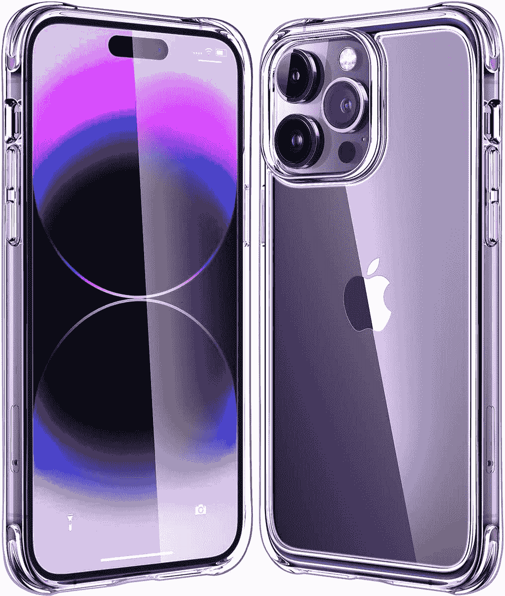

# Mkeke 透明保护套为您的 iPhone 14 Pro 提供时尚保护

> 原文：<https://www.xda-developers.com/mkeke-iphone-14-pro-clear-case/>

iPhone 14 Pro 是 2022 年 T2 市场上最好的智能手机之一。该系列包装了最新的苹果 A16 仿生芯片和永远显示，它有一个新的独特的颜色，深紫色。如果你喜欢用独一无二的外壳展示你的智能手机，Mkeke clear 外壳可以提供很多东西，同时提供军用级保护，防止划痕、磨损和裂缝。

如果你在市场上为你的 iPhone 14 Pro、 [iPhone 14 Pro Max](https://www.xda-developers.com/apple-iphone-14-pro-max-review/) 和其他设备购买新外壳，[mke 为你提供了大量选择](https://www.amazon.com/stores/Mkeke/page/E67DE57E-58BF-40EA-BF2E-38E97D55738B?ref_=ast_bln)。

## 姆凯克是谁？

Mkeke 自 2015 年以来一直在制作案例，它在亚马逊等零售商网站上获得了数千条正面评论。该公司一直专注于为旗舰设备制作 iPhone 保护套，它在亚马逊上有许多畅销保护套来证明自己的观点。

Mkeke 为 iPhone 设备制造简单、优雅、清晰的外壳。它们因其高精度、对细节的关注和独特的颜色渐变选项而闻名，这些选项补充了 iPhones 特有的外观。

如果你在市场上为你的 [iPhone 14 或更老的苹果旗舰设备](https://www.amazon.com/stores/Mkeke/page/E67DE57E-58BF-40EA-BF2E-38E97D55738B?ref_=ast_bln)买一个新的外壳，Mkeke 有大量精密设计的透明外壳可供选择。

## 优雅的保护与时尚的设计相结合

Mkeke 是一个水晶般透明的外壳，我们测试的设备完全适合 iPhone 14 Pro。该保护套也适用于 iPhone 14 Pro Max 以及 iPhone 14 和 iPhone 14 Plus 设备。外壳由聚碳酸酯和柔性材料制成，提供坚固的军用级保护。四个角落还设有内置气囊，有助于在摔倒时吸收冲击力。

Mkeke 保护套非常适合那些想要简单设计并提供高级保护的人。外壳背面有一个 3.9 毫米的凸起边缘，可以防止相机镜头上的划痕和凹痕。前面还有一个凸起的挡板，可以保护显示器免受磨损和跌落损坏。

我们都有过不容易从口袋里掏出来的情况，但这不会发生在 Mkeke 的情况下。它们具有纤细的防滑握持设计，确保它们舒适，可以从你的口袋中滑出，而不会自己掉出。人体工程学设计增强了手持和使用智能手机玩游戏、浏览网页和自拍时的握持感。

## Mkeke 表壳颜色

Mkeke 保护套共有八种颜色可供选择。最容易推荐的是 clear 选项，这是展示设备背面的一个很好的方式，而且它不会随着时间的推移而变黄。也有丰富多彩的选择。每个都有独特的渐变，贯穿手机背面。以下是你今天可以为你的 iPhone 14 Pro 挑选的所有颜色选项:

*   清晰案例
*   渐变黑色透明
*   渐变黑绿色
*   渐变蓝色透明
*   渐变透明黑色
*   渐变紫蓝色
*   渐变紫绿色
*   渐变紫色粉色

## 卓越的感觉和体验

许多外壳感觉不到溢价或没有精确的切口，这在插入智能手机充电时可能不方便。音量和电源按钮上不一致的切口和没有反馈会显著降低使用智能手机的体验。拥有一个让人感觉质量很高的外壳也很重要。毕竟，大多数用户每天解锁设备的次数超过 100 次。

这正是 Mkeke 案例的另一个亮点。Mkeke 表壳设计精密。每一个扬声器孔、麦克风孔、lightning 端口和电源按钮都有一个大小完美的切口，确保它完全适合，没有任何问题。音量摇杆和电源按钮提供额外的反馈，确保用户准确知道按钮何时被按下，从而改善智能手机的整体体验。

如果你手里已经有了 iPhone 14 Pro，那你就走运了。你现在可以在亚马逊上购买这个箱子。如果你有一部老款 iPhone，什么也不会丢失，因为公司[为老款设备](https://www.amazon.com/stores/Mkeke/page/E67DE57E-58BF-40EA-BF2E-38E97D55738B?ref_=ast_bln)出售类似的保护套。Mkeke 还销售钢化玻璃屏幕保护器和其他配件。

 <picture></picture> 

Mkeke

##### Mkeke Clear iPhone 14 Pro 保护套

Mkeke 的透明外壳称赞了 iPhone 14 Pro 独特的外观。外壳由聚碳酸酯和柔性材料制成，可以保护设备免受刮擦，同时改善对 iPhone 14 Pro Max 等较大设备的握持。外壳有许多渐变选项，升高的边框可以保护显示屏和相机免受刮擦和磨损。

我们感谢姆凯克赞助这个职位。我们的赞助商帮助我们支付与经营 XDA 相关的许多费用。虽然您可能会在标准 XDA 内容旁边看到赞助内容，但它们将始终被标记为赞助内容，并不一定反映编辑团队的观点。XDA 绝不会通过接受金钱来赞扬一家公司，或以任何方式改变我们的观点或看法，从而损害其新闻诚信。