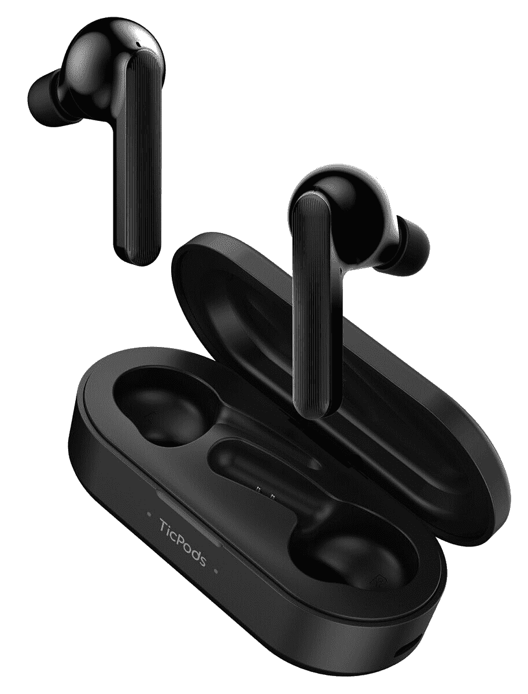

# Mobvoi 耳塞手势可以购买，也可以销售！

> 原文：<https://www.xda-developers.com/mobvoi-earbuds-gesture-amazon/>

去年， [Mobvoi 众筹了耳塞手势](https://www.xda-developers.com/mobvoi-earbuds-gesture-are-new-tws-earbuds-with-head-gestures/)，这是一对特殊的无线耳塞，利用头部运动来接听和拒绝来电。在筹集了超过 13 万美元后，Mobvoi 耳塞手势现在可以购买了！更好的是，如果你在亚马逊买到它们，你可以打折买到。

该手势在 [Indiegogo 页面](https://www.indiegogo.com/projects/mobvoi-earbuds-gesture-intuitive-ai-assistance#/)上的原始建议零售价为 130 美元，早鸟特价为 79 美元。在亚马逊上，这些 TWS 耳塞的基本价格是 90 美元，比最初的广告价格低 40 美元。但是，最重要的是，亚马逊在手势的商店页面上提供 20 美元的优惠券，使耳塞降至仅 70 美元。这已经比早鸟价格低了！

Mobvoi Earbuds 手势的主要吸引力是头部手势控制，用于一系列通常只有触摸控制的耳塞功能。例如，如果你接到一个电话，你可以点头两次来接电话，而不需要敲击耳塞或拿起手机。不过，如果你担心头部手势不起作用，你仍然可以使用触摸控制。

关于这些耳塞还有很多要了解的，但我认为这个规格表比我这个反音响发烧友更好地概括了它:

| 

规格

 | 

Mobvoi 耳塞手势

 |
| --- | --- |
| **尺寸&重量** | 

*   充电盒
    *   81 毫米 x 36.8mm 毫米 x 31mm 毫米
    *   130 克

 |
| **扬声器&麦克风** | 

*   6mm 驱动器
*   双麦克风阵列

 |
| **电池&充电** | 

*   耳塞:每个 90 毫安
*   充电箱:600mAh
    *   用于充电的 USB 型端口

 |
| **连通性** | 

*   蓝牙 5.0 低延迟
*   独立连接支持
*   Mobvoi 应用支持

 |
| **手势控制** | 

*   来电时的 TicMotion 头部手势
*   播放控制、来电和语音助手的触摸手势

 |
| **颜色** | 哑光黑色 |
| **防水/防尘** | IPX5 |
| **箱子内容** | 

*   耳塞
*   充电盒
*   额外的硅胶吸头
*   USB 型到 A 型充电线
*   快速入门指南
*   用户手册

 |

相信了吗？在销售结束前，前往亚马逊以折扣价购买耳塞吧！

 <picture></picture> 

Mobvoi Earbuds Gesture

##### Mobvoi 耳塞手势

使用 Mobvoi 耳塞手势获得真正的免提体验！用点头或摇头来拒绝电话。确保将优惠券夹在商店页面上，以获得最大折扣！