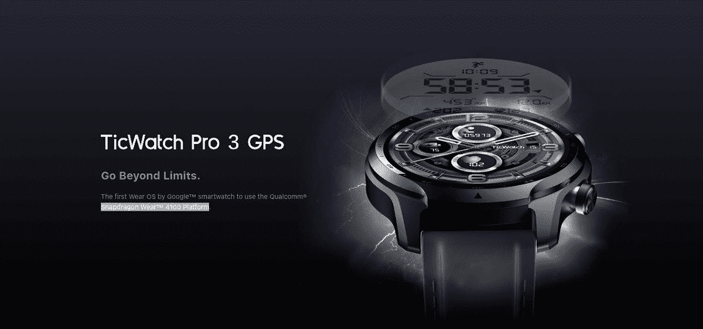
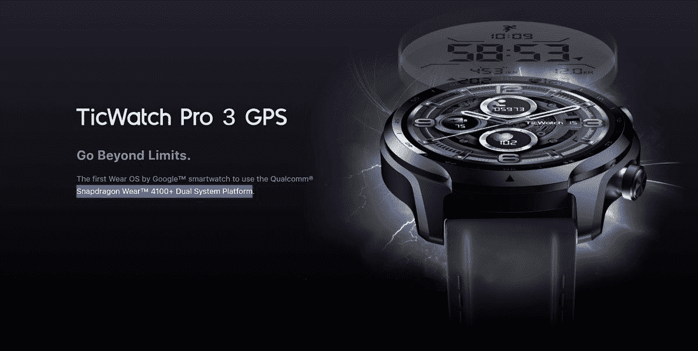

# Mobvoi 在 TicWatch Pro 3 和 E3 硬件方面误导了客户

> 原文：<https://www.xda-developers.com/mobvoi-lying-ticwatch-hardware/>

Mobvoi 是目前少数几家使用谷歌 Wear OS 平台生产智能手表的公司之一。去年发布的 [TicWatch Pro 3](https://www.xda-developers.com/mobvoi-ticwatch-pro-3-review/) 和 [TicWatch E3](https://www.xda-developers.com/mobvoi-ticwatch-e3/) ，都搭载了高通的骁龙 4100 芯片组。然而，在过去的几个月里，Mobvoi 在产品页面上声称，这两款手表都具有改进的 Wear 4100+芯片。

TicWatch Pro 3 和 TicWatch E3 在发布时都被宣传为使用了[骁龙 Wear 4100 芯片](https://www.xda-developers.com/qualcomm-snapdragon-4100-announcement-wear-os-smartwatches/)。然而，高通也销售 Wear 4100+芯片组，该芯片组有一个额外的协处理器，可以提高电池寿命。尽管 4100 和 4100+都是在 2020 年宣布的，但仍然没有采用改进的 4100+芯片的 Wear OS 手表——本月晚些时候开始发货的 [Fossil Gen 6](https://www.xda-developers.com/fossil-gen-6-launch/) 将是第一款。三星最近开始销售 [Galaxy Watch 4](https://www.xda-developers.com/samsung-galaxy-watch-4/) ，但这款手表使用 Exynos 芯片，而不是高通硬件。

Mobvoi 的 TicWatch Pro 3 和 TicWatch E3 的产品页面现在声明，这两款手表都使用升级的 Wear 4100+芯片，而不是 Wear 4100。目前还不清楚这一变化是何时发生的，但 7 月 17 日的 TicWatch Pro 3 亚马逊页面的一个[存档版本](https://web.archive.org/web/20210717080908/https://www.amazon.com/TicWatch-Qualcomm-Snapdragon-Monitoring-Waterproof/dp/B08BRFWGMC?tag=xdadev04-20)列出了 4100，而[当前页面提到](https://www.amazon.com/TicWatch-Qualcomm-Snapdragon-Monitoring-Waterproof/dp/B08BRFWGMC?tag=xda-2gciq94-20&ascsubtag=UUxdaUeUpU5510&asc_refurl=https%3A%2F%2Fwww.xda-developers.com%2Fmobvoi-lying-ticwatch-hardware%2F&asc_campaign=Short-Term)是“高通骁龙 Wear 4100+双系统平台”同样， [Mobvoi 的网站在 3 月份](https://web.archive.org/web/20210330200606/https://www.mobvoi.com/us/pages/ticwatchpro3gps)有原始规格，而[当前页面](https://www.mobvoi.com/us/pages/ticwatchpro3gps)称 TicWatch Pro 3 有 Wear 4100+芯片。同样的变化也出现在 TicWatch E3 的[产品页面上。](https://www.amazon.com/Ticwatch-Qualcomm-Snapdragon-Waterproof-Compatible/dp/B0928CY9TN?tag=xda-2gciq94-20&ascsubtag=UUxdaUeUpU5510&asc_refurl=https%3A%2F%2Fwww.xda-developers.com%2Fmobvoi-lying-ticwatch-hardware%2F&asc_campaign=Short-Term)

 <picture></picture> 

TicWatch Pro product page from March 30, 2021 ([source](https://web.archive.org/web/20210330200606/https://www.mobvoi.com/us/pages/ticwatchpro3gps)).

 <picture></picture> 

TicWatch Pro product page from September 24, 2021 ([source](https://www.mobvoi.com/us/pages/ticwatchpro3gps)).

[*NotebookCheck* 在 9 月 21 日](https://www.notebookcheck.net/Evidence-points-to-Mobvoi-lying-about-upgrading-the-TicWatch-E3-and-TicWatch-Pro-3-to-the-Snapdragon-Wear-4100.563571.0.html)注意到了这一变化，后来购买了一款新的 TicWatch E3 来测试据称是新的硬件。然而，该网站[后来报道](https://www.notebookcheck.net/Evidence-points-to-Mobvoi-lying-about-upgrading-the-TicWatch-E3-and-TicWatch-Pro-3-to-the-Snapdragon-Wear-4100.563571.0.html)称，该手表仍然使用了一款 Wear 4100 芯片，产品包装上仍有多个位置写着“骁龙 Wear 4100”。可能该出版物收到了旧批次的手表(假设确实有*更新的*批次)，但 Mobvoi 没有回复 *NotebookCheck* 的询问，截至发稿时，该公司也没有向 *XDA* 提供任何信息。

据报道，Reddit [上的一个人向 Mobvoi 的客户支持](https://old.reddit.com/r/TicWatch/comments/pt6bdj/apparently_new_twp3s_are_going_to_ship_with_the/hdz6238/)发送了一封电子邮件，并收到了以下回复:

> #### "亲爱的 Joma309，
> 
> #### 感谢您联系 Mobvoi 支持团队！
> 
> #### 请注意，“4100+”实际上是“4100+双系统平台”，这是我们出门问问定制的 4100，与之前的 4100 没有任何区别。
> 
> #### 一如既往地感谢大家对 Mobvoi 的支持。如果您有任何进一步的问题或顾虑，请不要犹豫再次联系我们。
> 
> #### 最诚挚的问候，
> 
> #### Mobvoi 支持团队”

对客户支持的回应应该持保留态度。然而，如果这是真的，那至少是欺骗性广告。Mobvoi 没有说明它对骁龙 Wear 4100 芯片做了什么改变(如果存在的话)。这两款手表似乎都没有 4100+的主要功能，即皮质 M0 协处理器。

与此同时，Mobvoi 似乎正在[开发](https://www.xda-developers.com/mobvoi-ticwatch-pro-snapdragon-wear-4100-plus-leaked/)一款“TicWatch Pro 3 Ultra GPS”，预计*实际上*将拥有骁龙 Wear 4100+芯片。