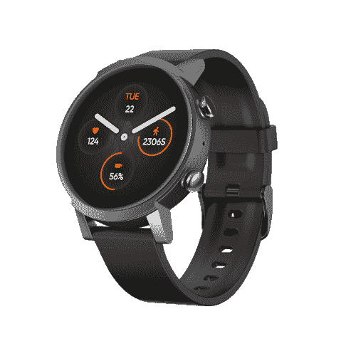

# Mobvoi TicWatch E3 降至 140 美元(降价 60 美元)，并将搭载 Wear OS 3

> 原文：<https://www.xda-developers.com/mobvoi-ticwatch-e3-drops-to-140-60-off-and-it-will-get-wear-os-3/>

Mobvoi 是目前少数几家生产 Wear OS 智能手表的公司之一，其他几家还有 Fossil Group、三星和其他公司。该公司今年早些时候发布了 TIC watch E3作为一款配备骁龙 Wear 4100 芯片的经济型手表，现在你可以以 140 美元的价格买到它。这比通常的价格低了 60 美元，最棒的是，手表*应该会在明年的某个时候更新 Wear OS 3。*

TicWatch E3 配备了 1.3 英寸 360x360 圆形显示屏、心率传感器、血氧传感器、Google Pay NFC、蓝牙 5.0、Wi-Fi 802.11b/g/n、1GB 内存、8GB 存储和骁龙 Wear 4100 芯片组。这是最便宜的 Wear OS 手表之一，采用高通最新的芯片组，[现在比 Galaxy Watch 4 便宜 80 美元](https://www.amazon.com/Samsung-Electronics-Galaxy-Watch-Smartwatch/dp/B096BJLZZM/?tag=xda-463n6gt-20&ascsubtag=UUxdaUeUpU6142&asc_refurl=https%3A%2F%2Fwww.xda-developers.com%2Fmobvoi-ticwatch-e3-drops-to-140-60-off-and-it-will-get-wear-os-3%2F&asc_campaign=Short-Term)。一点也不差，而且你还可以获得 IP68 防水/防尘性能和(大约)一次充电两天的电池寿命。

 <picture></picture> 

TicWatch E3 GPS

##### TicWatch E3 GPS

这款廉价的 Wear OS 智能手表在 B&H 照相馆的售价为 139.99 美元，比通常的价格节省了 60 美元。

[谷歌在 7 月](https://www.xda-developers.com/will-my-smartwatch-get-wear-os-3/)表示，TicWatch E3 将在“2022 年中至下半年”接受 [Wear OS 3 更新](https://www.xda-developers.com/samsung-and-google-just-are-rebuilding-wear-os-to-challenge-the-apple-watch/)，与 Fossil Gen 6、TicWatch Pro 3 GPS 和 TicWatch Pro 3 LTE 一起。Wear OS 3 是谷歌与三星合作开发的，三星的 Galaxy Watch 4 系列已经有了一个厚皮版本。YouTube 音乐应用最初是 Wear OS 3 的专属应用，但谷歌已经逐渐推出了 Wear OS 2 的精选手表，包括 TicWatch E3。

如果你现在想要一款最新更新的 Wear OS 手表，你唯一的选择就是[三星 Galaxy Watch 4](https://www.xda-developers.com/samsung-galaxy-watch-4/) 系列。三星最新的手表比 TicxWatch E3 拥有更多的硬件和软件功能，但它们也贵得多。