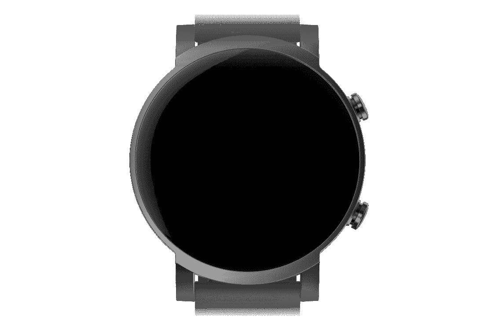

# Mobvoi 应用程序拆卸揭示了带有 Wear 操作系统的 TicWatch E3

> 原文：<https://www.xda-developers.com/mobvoi-ticwatch-e3-wear-os-ticwatch-gth-global-launch/>

Mobvoi 是少数几家生产搭载谷歌 Wear OS 的智能手表的公司之一。该公司[刚刚发布了另一款 TicWatch Pro](https://www.xda-developers.com/mobvoi-ticwatch-pro-s-minor-upgrade-ticwatch-pro-2020/) (硬件陈旧得令人尴尬)，现在看起来又有两款手表可能会在不久的将来在全球发布。

**APK 的拆卸通常可以预测应用程序未来更新中可能出现的功能，但有可能我们在这里提到的任何功能都不会在未来的版本中出现。这是因为这些特性目前还没有在实时构建中实现，并且可能会被开发人员在未来的构建中随时引入。**

Mobvoi 刚刚为[发布了其可穿戴配套应用](https://play.google.com/store/apps/details?id=com.mobvoi.companion.aw)(也称为 Mobvoi)的新更新，其中包含了该公司未来产品计划的一些暗示。应用程序中的新字符串提到了 TicWatch GTH，这是今年早些时候在中国发布的，但尚未在其他地方销售。应用程序中的引用，以及 Mobvoi 最近的推文，似乎证实了《GTH》将很快在中国以外上映。Mobvoi 的网站将 4 月 13 日列为公布日期。

```
 <string name="device_type_ticgth"><strong>TicWatch GTH</strong></string>
<string name="watch_lite_gth_title"><strong>TicWatch GTH</strong></string>
<string name="text_smart_breathe">The device automatically detects the respiration rate at regular intervals within 24 hours</string>
<string name="watch_lite_breathe_reminder">Automatic detection of respiration rate</string>
<string name="watch_lite_heart_rate_msg_reminder_des">The device automatically detects heart rate at regular intervals within 24 hours</string>
<string name="watch_lite_heart_rate_reminder">Automatic heart rate detection</string>
<string name="watch_lite_oxygen_des">血氧检查开关</string>
<string name="watch_lite_oxygen_msg_reminder_des">The device automatically detects blood oxygen at regular intervals within 24 hours</string>
<string name="watch_lite_oxygen_reminder">Automatic blood oxygen detection</string>
<string name="watch_lite_temperature_des">The device automatically detects skin ​temperature at regular intervals within 24 hours</string>
<string name="watch_lite_temperature_reminder">Automatic body temperature detection</string>
<string name="this_week_sleep">Weekly Sleep Records</string>

```

现有版本的 TicWatch GTH 在设计上与 Apple Watch 和 OPPO Watch 非常相似，配有 1.55 英寸 360 x 320 的方形显示屏和 260 毫安时电池。上述字符串似乎证实了全球版本将与中国手表具有相同的温度和血氧监测功能，尽管如果三星的 Galaxy 手表阵容是[everything to go by](https://www.xda-developers.com/samsung-galaxy-watch-3-watch-active-2-ecg-monitoring-app-us/)，该软件最初可能不会在所有地方启用。

该应用程序还包含上述 TicWatch GTH 的资源图像，显示了与中国模型相同的方形设计。这款手表也不运行 Wear OS——它有一个更有限的操作系统，类似于[一加手表](https://www.xda-developers.com/oneplus-watch-launch/)，一次充电可以持续大约七天。

最后，该应用程序包含一张 TicWatch E3 的图片，Mobvoi 尚未公布。没有任何线索表明它会有什么功能，但它可能会运行 Wear OS，并以较低的价格出售，就像 [TicWatch E2](https://www.amazon.com/TicWatch-Waterproof-Smartwatch-Monitor-Compatible/dp/B0834NB5JG?tag=xda-4c0kadd-20&ascsubtag=UUxdaUeUpU1834&asc_refurl=https%3A%2F%2Fwww.xda-developers.com%2Fmobvoi-ticwatch-e3-wear-os-ticwatch-gth-global-launch%2F&asc_campaign=Short-Term) 一样。即将推出的型号似乎比 TicWatch E2 的框架更薄，有两个侧面按钮，而不是只有一个。

 <picture></picture> 

TicWatch E3

TicWatch E3 可能是今年发布的少数几款 Wear OS 手表之一。关于谷歌 Pixel 手表的猜测[越来越多](https://www.tomsguide.com/news/google-pixel-watch-leak-just-teased-a-more-rounded-apple-watch-rival-and-theres-more-to-come)，一次销售展示透露[至少三款摩托罗拉品牌的手表](https://www.xda-developers.com/new-moto-branded-smartwatches-are-coming-but-theyre-not-what-you-may-think/)将在未来几个月发布。Mobvoi 今年已经发布了 [TicWatch Pro S](https://www.xda-developers.com/mobvoi-ticwatch-pro-s-minor-upgrade-ticwatch-pro-2020/) ，Fossil 在 CES 上宣布了[其第五代智能手表](https://www.xda-developers.com/fossil-gen-5-wear-os-smartwatch-lte/)的 LTE 版本。

*特色图片:TicWatch GTH。感谢 PNF 软件为我们提供了使用 [JEB Decompiler](https://www.pnfsoftware.com/?aid=xdadev) 的许可，这是一款针对 Android 应用的专业级逆向工程工具。*