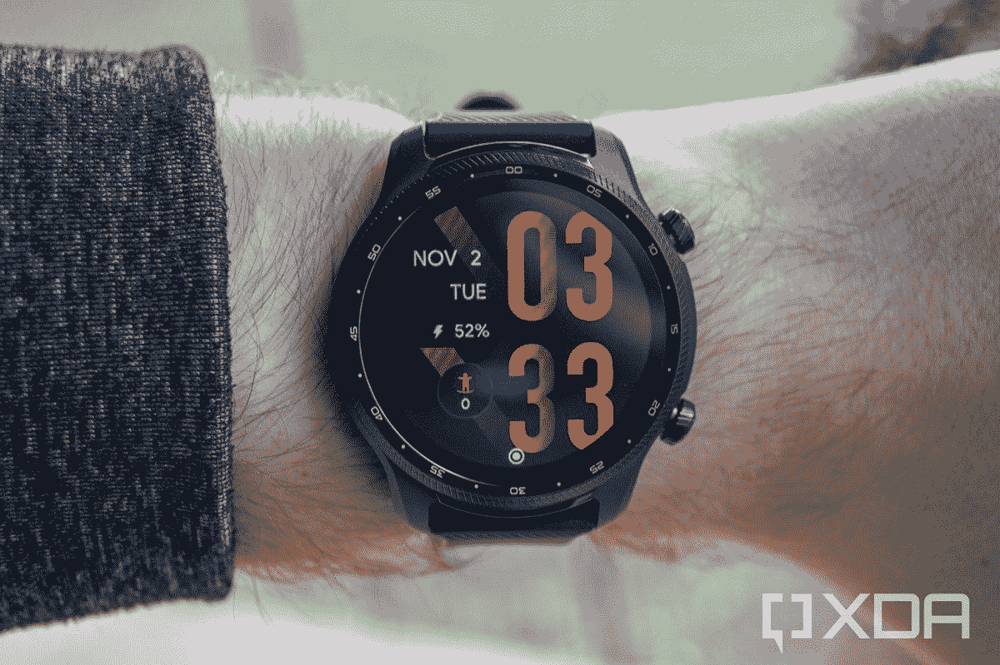

# 亚马逊 Prime Day 交易让 TicWatch Pro 3 Ultra 降价 90 美元

> 原文：<https://www.xda-developers.com/mobvoi-ticwatch-pro-3-ultra-90-off/>

# 亚马逊 Prime Day 交易让 TicWatch Pro 3 Ultra 降价 90 美元

亚马逊 Prime Day 活动的前半段出现了一个很好的交易，TicWatch Pro 3 Ultra 打折 90 美元。

如果你一直在寻找智能手表，你的搜索可能已经结束了。通常定价为 299.99 美元的 Mobvoi TicWatch Pro 3 Ultra 在亚马逊 Prime Day 期间大幅打折。在有限的时间内，这只手表可以少花 90 美元，这使得这笔交易成为迄今为止最令人印象深刻的交易之一。

那么你用 TicWatch Pro 3 Ultra 得到了什么呢？首先也是最重要的，它有一个高通骁龙 Wear 4100+处理器，1GB 内存和 8GB 内部存储。这款手表还有一个辅助 Mobvoi SoC，在电池节电模式下接管工作。至于它的显示屏，它使用了 1.4 英寸的 AMOLED 显示屏，还搭配了 FSTN(薄膜补偿超扭曲向列)液晶显示器。正如你对现代智能手表的期望，它能够跟踪位置、健康数据等。它还拥有 100 多项身体活动，可以直接从手表上追踪。

由于它确实运行 Wear OS 2，因此它还能够让您在旅途中保持联系。TicWatch Pro 3 Ultra 应该会在不久的将来更新为佩戴 OS 3，但何时会发生谁也说不准。这款手表还支持使用 Google Pay 通过 NFC 进行移动支付。最后，这款腕表凭借其 810G 认证的耐用性，提供了高端的防风雨保护。如果以上还不足以说服你购买这款手表，你会很高兴知道它还有令人印象深刻的电池寿命。

在“智能模式”下，一次充电可持续 72 小时。在“基本模式”下，它可以持续 45 天，这至少令人印象深刻。虽然这些数字有时可能会被制造商夸大，但在我们自己的评估中，我们实际上一次充电可以使用大约 3 到 4 天。如果感兴趣，请务必查看下面的链接。更多优惠，请查看[亚马逊 Prime Day](https://www.xda-developers.com/amazon-prime-day/) 优惠页面。

 <picture></picture> 

Mobvoi TicWatch Pro 3 Ultra

##### Mobvoi TicWatch Pro 3 Ultra

Mobvoi TicWatch Pro 3 Ultra 一次充电可持续 3 至 4 天，现在便宜了 90 美元