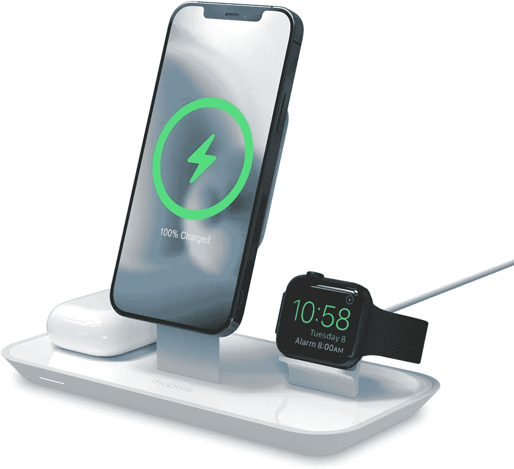

# 这个摩尔菲三合一充电站将为你的苹果设备充电，价格为 70 美元

> 原文：<https://www.xda-developers.com/mophie-station-deal-2022/>

# 这个摩尔菲三合一充电站将为你的苹果设备充电，价格为 70 美元

来自摩尔菲的 3 合 1 MagSafe 无线充电站目前仅在亚马逊上限时打折。抓一两个！

让我们承认吧——电缆糟透了。当你周围有三种不同类型的电缆时，一张看起来非常现代的桌子可能看起来非常过时。考虑到一些苹果设备使用不同的充电端口，你可能会有很多充电器。例如，[大苹果手表](http://xda-developers.com/best-apple-watch)就有自己专有的 puck。同时，iPhones 使用 Lightning，而一些 iPads 使用 USB Type-C。当然，你也可以为你的[新 MacBook](http://xda-developers.com/best-macs) 使用 MagSafe。那么如何处理这种灰尘磁铁呢？摩尔菲有一个解决方案！摩尔菲 3 合 1 MagSafe 无线充电站集 Apple Watch puck、Qi pad 和 MagSafe 充电器支架于一体。因此，你可以通过简约干净的方式简化你的办公桌。

 <picture></picture> 

Mophie 3-in-1 MagSafe Wireless Charging Station

##### 摩尔菲三合一 MagSafe 无线充电站

摩尔菲 3 合 1 MagSafe 无线充电站帮助您减少对电缆的依赖，并清理您的办公桌。

通常，摩尔菲 3 合 1 MagSafe 无线充电站的价格接近 90 美元。然而，今天是你的幸运日——因为你遇到了一个伟大的限时交易。你只需花 70.66 美元就能买到一个摩尔菲三合一 MagSafe 无线充电站。值得注意的是，虽然这个站不**不**包括一个 MagSafe 充电器。所以你需要单独购买。车站只是给你提供一个可以把它挂起来的架子。多亏了摩尔菲站，你可以在横向和纵向使用你的 iPhone。

当您打开摩尔菲 3 合 1 MagSafe 无线充电站的包装时，您会得到一个支架和一个 1.5 米长的墙壁适配器。因此，唯一缺失的一块拼图就是 iPhone MagSafe 充电器。该站包括 Apple Watch puck 和 Qi pad，用于兼容 AirPods Pro 型号。当然，你也可以用它来为其他兼容的支持 Qi 的配件充电。在这笔交易到期前抢一个单位！

*您会购买 Mohpie 3 合 1 MagSafe 无线充电站吗？为什么或为什么不？请在下面的评论区告诉我们。*