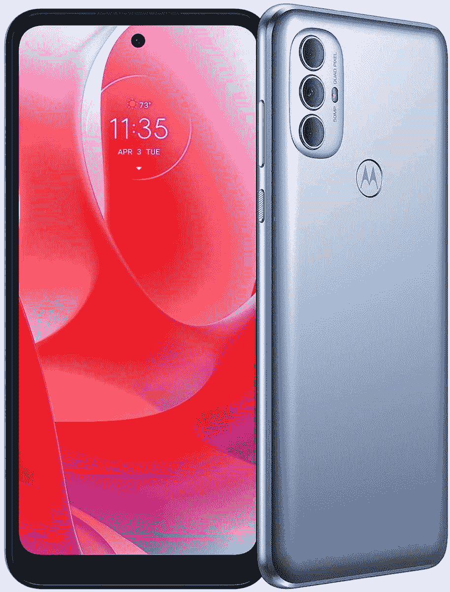

# Moto G Power 现可在百思买和亚马逊预购

> 原文：<https://www.xda-developers.com/moto-g-power-united-states/>

摩托罗拉有很多很多不同价位的智能手机，其中大多数都使用了历史悠久的 Moto G 名称。最近增加的产品之一是 [2022 Moto G Power](https://www.xda-developers.com/motorolas-new-moto-g-power-packs-a-50mp-camera-and-5000mah-battery/) ，这是一款强调长电池寿命的中档智能手机。这款手机已经通过运营商在美国上市，但现在它将于本月晚些时候进入零售渠道，你现在可以预订。

作为补充，Moto G Power 拥有 6.5 英寸 90Hz 720p 屏幕，联发科 Helio G35，4GB 内存，两个后置摄像头，5,000mAh 电池，以及“防溅”设计。摩托罗拉似乎只在美国销售 128GB 存储选项，而其他一些地区也销售 64GB 存储选项。值得注意的是，没有 NFC 支持，这在 2022 年是愚蠢的。

| 

规格

 | 

Moto G Power (2022)

 |
| --- | --- |
| **尺寸和重量** | 

*   167.24 x 76.54 x 9.36
*   203 克

 |
| **显示** | 

*   6.5 英寸 IPS 液晶屏
*   1600 x 720(高清)
*   90Hz 刷新率

 |
| **SoC** | 

*   联发科 Helio G35
    *   8 个 ARM Cortex-A53 内核(最高 2.3GHz)

*   IMG PowerVR GE8320 GPU

 |
| **RAM 和存储器** | 

*   4GB 内存
*   128GB 闪存存储
*   MicroSD 卡支持

 |
| **电池&充电** | 

*   5000 毫安时电池
*   10W 快速充电器(包装盒内)

 |
| **后置摄像头** | 

*   主像素:5000 万像素四像素 f/1.8，1.3 微米
*   辅助:2MP 深度传感器

 |
| **前置摄像头** |  |
| **端口** | 

*   USB 类端口
*   3.5 毫米耳机插孔

 |
| **连通性** | 

*   4G LTE
*   蓝牙 5.0
*   C 型端口
*   WiFi 802.11 . b/g/n/AC(2.4 GHz+5 GHz)

 |
| **安全** | 侧装式指纹读取器 |
| **软件** |  |

我们还没有机会回顾最新的 Moto G Power，但印象并不太好。 [*Android Police 的*评测](https://www.androidpolice.com/moto-g-power-2022-review/)在其评测中称“性能一般”，而 [*Android Central* 则批评](https://www.androidcentral.com/motorola-g-power-2022-review)“在使用这款手机时，你将不得不不断忍受延迟。”电池寿命显然名副其实，但没有 NFC 功能，手机搭载的是 Android 11 而不是 Android 12。有一个 USB Type-C 端口，摩托罗拉花了一段时间才在整个产品系列中使用，但充电仅限于 10W。

这款手机可以通过下面的链接在亚马逊和百思买预订，发布日期定在 3 月 18 日。

 <picture></picture> 

Moto G Power (2022)

##### 摩托罗拉摩托 G 动力(2022)

最新的 Moto G Power 将在美国上市，售价为 199.99 美元。

**更新:**本文的前一版本称，Moto G Power 现在才进入美国。它已经更新，以反映自去年 12 月以来已通过运营商提供。