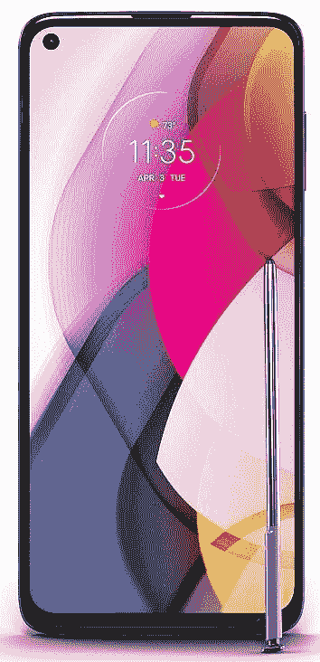

# Moto G stylus 2021 获得了巨大的折扣，降至 149.99 美元

> 原文：<https://www.xda-developers.com/moto-g-stylus-2021-gets-a-huge-discount/>

在 2022 年，没有多少智能手机配有触控笔。虽然有一些很好的选择，但有些可能相当昂贵。幸运的是，还有更实惠的选择，如 [Moto G Stylus 2021](https://www.xda-developers.com/moto-g-play-moto-g-power-moto-g-stylus-announced/) 。这款手机获得了巨大的折扣，降价 150 美元，现在可以以 149.99 美元的价格购买。

Moto G Stylus 2021 由高通骁龙 678 处理器、4GB 内存和 128GB 内部存储提供支持。幸运的是，如果 128GB 对你来说不够，你可以使用 microSD 卡增加手机的存储空间，G Stylus 可以接受高达 512GB 的卡。它有一个 6.8 英寸的大 FHD+屏幕，和一个 4000 毫安时的电池，摩托罗拉说一次充电可以持续两天。如果你需要快速充电，这款手机支持 10W 充电。

Moto G Stylus 2021 的后部有四个摄像头，并使用了 48MP 主传感器，以及 2MP 微距摄像头，8MP 超宽摄像头和 2MP 深度传感器。对于自拍，手机将依赖于 16MP 的拍摄。但这款手机最重要的部分，也是一些人认为最吸引人的部分，是触控笔。如果你愿意，你可以记笔记，创作一些艺术作品，或者只是用它来导航手机。

因此，如果你一直在寻找一款触控笔不会让你倾家荡产的智能手机，摩托罗拉 Moto G 触控笔可能是最佳选择之一。但是，如果这款手机不能真正与你交流，那么你可以在[我们的指南](http://www.xda-developers.com/best-cheap-android-phones/)中查看其他一些很好的选择，以及最实惠的 Android 智能手机选项。

 <picture></picture> 

Moto G Stylus (2021)

##### 摩托罗拉 Moto G 手写笔(2021)

Moto G 手写笔在手机机身中有一个车库手写笔，当你需要它时，它就在那里，当你不需要时，它就在旁边。