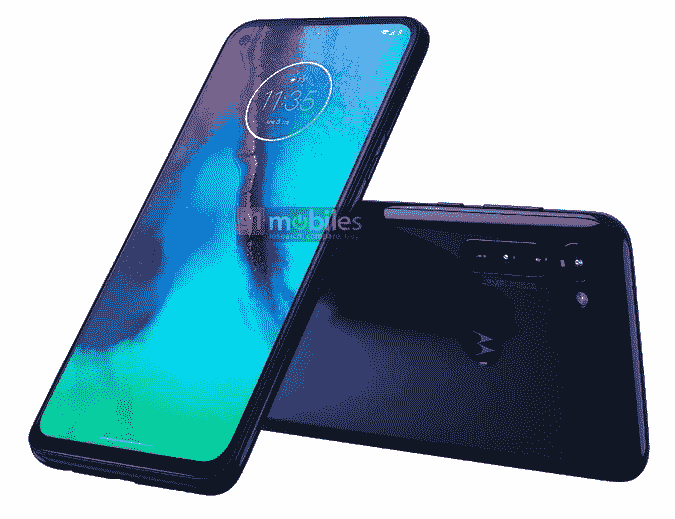

# Moto G8 Power render 揭示了熟悉的设计，带手写笔的 Moto 手机的新渲染

> 原文：<https://www.xda-developers.com/moto-g8-power-renders-motorola-stylus-phone/>

短短几天时间，Moto G8 系列已经有两款(可能是三款？)新设备传言泄露。事情始于一张带有手写笔的[未命名摩托罗拉设备的泄露渲染图。我们的主编米沙·拉赫曼随后为](https://www.xda-developers.com/motorola-next-phone-stylus/)[带来了一些关于](https://www.xda-developers.com/motorola-moto-g8-power-leaked-specifications/)Moto G8 和 Moto G8 Power 的独家信息。现在，我们看到了 Moto G8 Power 的泄露渲染图和触控笔手机的另一种外观。

今天早上早些时候，我们已经看到了标准版 Moto G8 的[泄露渲染图。该渲染图看起来非常类似于未命名的带手写笔的摩托罗拉手机，让我们相信该设备也将成为 Moto G8 系列的一部分。由于泄露的渲染图，我们现在可以看到 Moto G8 的动力，同样，它看起来非常相似。它有相同的后置摄像头排列，但有四个摄像头，而不是三个。](https://www.xda-developers.com/motorola-moto-g8-leak-render-hole-punch-display-triple-camera/)

说到相机，正如我们报道的，据说是 16MP f/1.7，2MP f/2.2 微距镜头，8MP f/2.2 118 广角，8MP f/2.4。Moto G8 Power 的正面左上角也有一个相同的 2500 万像素摄像头孔。正如我们之前报道的那样，显示屏为 6.36 英寸，分辨率为 2300 x 1080。渲染还显示了黑色和深蓝色的手机颜色选项。

 <picture></picture> 

Motorola stylus phone

下一个渲染是带有手写笔的未命名的摩托罗拉手机。如果你不知道它，你可能会混淆这个设备是 Moto G8 还是 Moto G8 Power。它有相同的单穿孔显示屏，相同的背面摄像头排列，以及相似的边框和边缘。关于这款设备的规格，我们知道的不多，但据传它有三个后置摄像头(48MP +广角+微距)。大概就是这样。

我们不确定摩托罗拉何时会发布 Moto G8、Moto G8 Power 或这款带触控笔的未知设备。到目前为止，我们看到的所有渲染中有一个有趣的细节是时钟部件上的 4 月 3 日。这可能是对发布日期或活动日期的暗示，但也可能毫无意义。我们只能等着瞧了。

| 

规格

 | 

摩托 G8

 | 

Moto G8 动力

 |
| --- | --- | --- |
| 显示 | 6.39 英寸 1560×720，单孔打孔机 | 6.36″ 2300×1080，单孔打孔机 |
| 尺寸* | 160 x 74mm 毫米(对角线:170 毫米) | 167.99 x 75.8mm 毫米(对角线:165 毫米) |
| 社会学 | 高通骁龙 665 | 高通骁龙 665 |
| 随机存取存储 | 2/3/4GB | 4GB |
| 储存；储备 | 32/64GB | 64GB |
| 后置摄像头 | 16MP f/1.7 + 2MP f/2.2 微距镜头+8MP f/2.2 118°广角 | 16MP f/1.7 + 2MP f/2.2 微距镜头+ 8MP f/2.2 118 广角+ 8MP f/2.4 |
| 前置摄像头 | 800 万像素 f/2.0 | 25MP f/2.0 |
| 电池 | 4000mAh，10W 充电 | 5000 毫安时，18W 充电 |
| 连通性* | 无 NFCDual SIM 卡(部分地区)XT2045-1: GSM850/1900、WCDMA 频段 II/IV/V、LTE 频段 2/4/5/7/66、WLAN 2.4GHz 802.11b/g/n、蓝牙 BR/EDR/LE | 双卡(部分地区)XT2041-1: GSM850/1900、WCDMA 频段 II/IV/V、LTE 频段 2/4/5/7/12/17/66、WLAN 2.4 GHz 802.11b/g/n、蓝牙 BR/EDR/LEXT2041-3: GSM850/1900、WCDMA 频段 II/IV/V、LTE 频段 2/4/5/7/26/38/41、WLAN |
| 软件 | 安卓 10 | 安卓 10 |
| 安全性 | 指纹扫描仪(物理) | 指纹扫描仪(物理) |
| 模型 | XT2045-1 | XT2041-1、XT2041-3 |
| 地区 | 北美、拉丁美洲(墨西哥)、欧洲、中东、非洲 | 北美、拉丁美洲(阿根廷、哥斯达黎加、墨西哥)、国际 |

*确切的尺寸和网络频率规格摘自两款设备的 FCC 文件。Moto G8: [ [1](https://fccid.io/IHDT56YK2) 。Moto G8 动力:[ [1](https://fccid.io/IHDT56YL2) ] [ [2](https://fccid.io/IHDT56YL3) 。

* * *

**来源:[91 辆](https://www.91mobiles.com/hub/moto-g8-power-stylus-phone-render-design-punch-hole-display-exclusive/)**