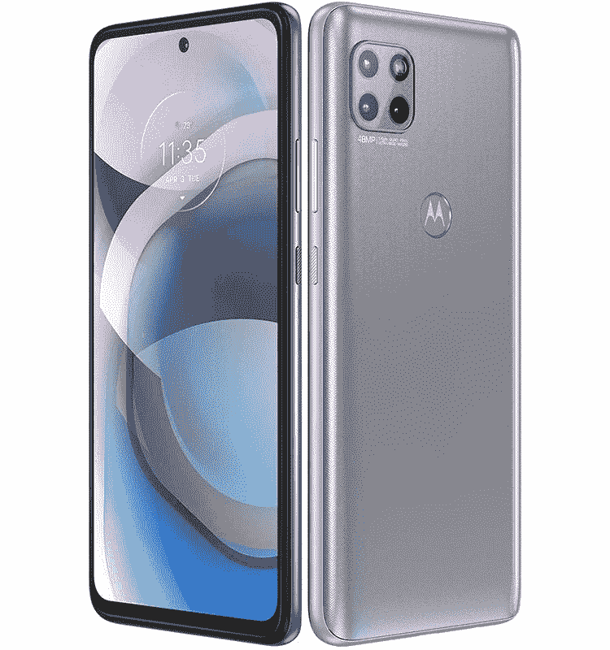

# Moto G 5G 作为 Moto One 5G Ace 进入美国市场

> 原文：<https://www.xda-developers.com/moto-one-5g-motorola-most-affordable-5g-capable-device/>

回到去年 7 月，摩托罗拉[因推出欧洲市场最实惠的 5G 功能设备之一 Moto G 5G Plus 而成为头条新闻。Moto G 5G Plus 的零售价仅为€349 英镑，提供了高通支持 5G 的骁龙 765 芯片组，高达 6GB 的内存和高达 128GB 的存储空间。在首次披露几周后，摩托罗拉在美国推出了 Moto G 5G Plus，名为](https://www.xda-developers.com/moto-g-5g-plus-48mp-quad-cameras-90hz-display/) [Moto One 5G](https://www.xda-developers.com/motorola-one-5g-coming-usa-att-verizon/) ，让美国居民有机会体验 5G 服务，而无需花费大量金钱。现在，摩托罗拉以 Moto One 5G Ace 的形式为美国带来了更加实惠的 5G 设备。

## Moto One 5G Ace:规格

| 

规格

 | 

Moto One 5G Ace

 |
| --- | --- |
| **打造** | 塑料的 |
| **尺寸&重量** | 

*   166.1 x 76.1 x 9.9mm 毫米
*   212 克

 |
| **显示** | 6.7 英寸 FHD+ |
| **SoC** | 高通骁龙 750 克 |
| **闸板&存放** |  |
| **电池&充电** | 

*   5000 毫安时
*   15w 快速充电

 |
| **安全** | 后置指纹传感器 |
| **后置摄像头** | 

*   4800 万像素主摄像头
*   800 万像素超宽摄像头
*   2MP 微距相机

 |
| **前置摄像头** | 16MP |
| **端口** | 

*   USB 类型-C
*   3.5 毫米耳机插孔

 |
| **音频** | 向下发射扬声器 |
| **连通性** | 

*   Wifi 802.11ac
*   蓝牙 5.1
*   国家足球联盟
*   A-GPS

 |
| **软件** | 安卓 10 |

与 Moto One 5G 非常相似，Moto One 5G Ace 是去年年底在欧洲推出的 Moto G 5G 的更名版本。它由高通的[骁龙 750G](https://www.xda-developers.com/qualcomm-snapdragon-750g-processor-specifications-features/) 芯片驱动，其设计类似于 Moto One 5G。这款设备配备了 6.7 英寸的 FHD+ IPS LCD 屏幕，中心有一个 1600 万像素自拍相机的打孔切口。

 <picture></picture> 

Motorola One 5G Ace

在背面，该设备的右上角有一个方形摄像头模块，由三个摄像头组成。这些相机包括一个 48MP 主传感器，一个 8MP 超宽传感器和一个 2MP 宏观传感器。该设备上的骁龙 750G SoC 配有 4GB 内存和 64GB 存储，由支持 15W 快速充电的 5,000mAh 电池供电。

在连接方面，Moto One 5G Ace 在 5G 支持的基础上提供了 802.11 a/b/g/n/ac 双频 Wi-Fi、蓝牙 5.1 和 NFC。它还具有一个用于充电和数据传输的 USB Type-C 端口，以及一个 3.5 毫米耳机插孔。此外，该设备具有 IP52 防尘和防水等级。在软件方面，Moto One 5G Ace 运行摩托罗拉基于 Android 10 的近库存 Android 皮肤。

## 定价和可用性

如前所述，Moto One 5G Ace 是美国市场上最实惠的 5G 设备之一，零售价仅为 399.99 美元。该设备将于 1 月 14 日开始在百思买和亚马逊购买。关于运营商可用性的细节预计将很快公布。