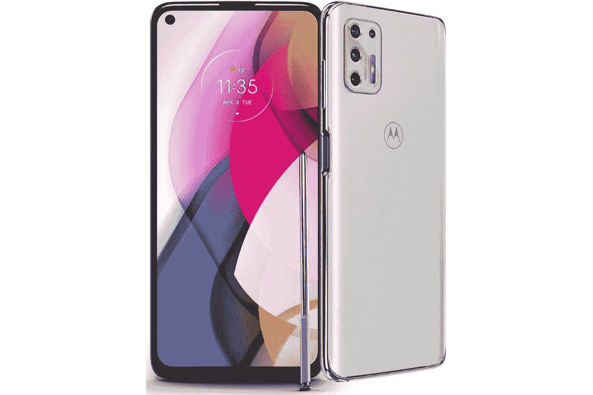
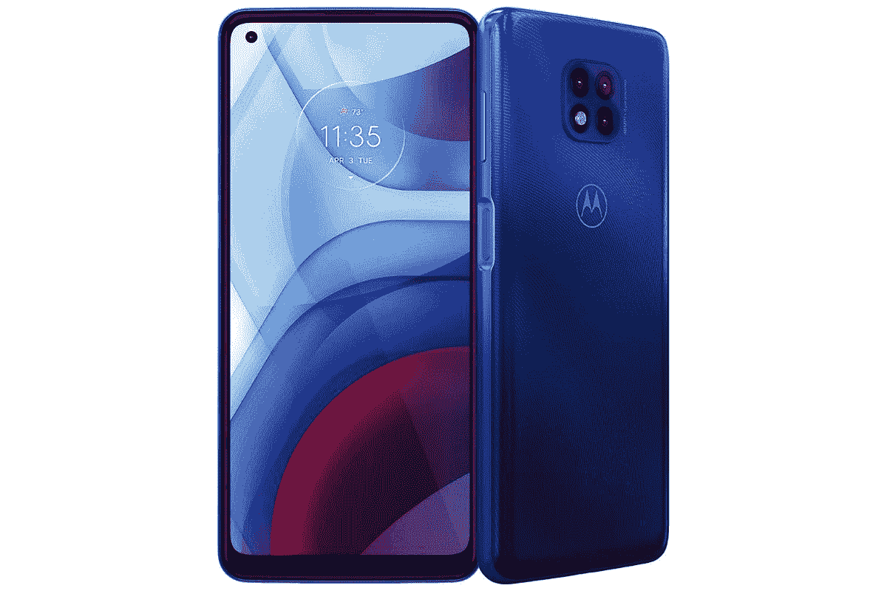

# 作为亚马逊 Android 日的一部分，在摩托罗拉 Edge Plus 和其他产品上节省 360 美元

> 原文：<https://www.xda-developers.com/motorola-amazon-android-day-2022/>

摩托罗拉通过在其手机上提供大量交易来开始其亚马逊安卓日庆祝活动。如果你有兴趣购买新手机，现在可能是一个绝佳的机会。该公司目前的设备阵容提供高达 58%的折扣，看起来每个人都有适合自己的东西。

## 摩托罗拉边缘增强版

 <picture></picture> 

Motorola Edge Plus 2022

##### 摩托罗拉 Edge Plus (2022)

摩托罗拉 Edge Plus 以优惠的价格提供了一些令人惊叹的高端功能

摩托罗拉 Edge Plus 是一款采用高通骁龙 8 代 1 处理器的手机。它有 8GB 内存，配有 6.7 英寸的大型 Max Vision 有机发光二极管显示器，刷新率为 144Hz。此外，它在后部有一个三摄像头设置，有一个 50MP 主摄像头，50MP 超宽摄像头和 2MP 深度摄像头。前置摄像头与 6000 万像素的摄像头传感器同样令人印象深刻。这款手机有一个 4800 毫安时的大电池，由于它的 30W 涡轮动力技术，可以快速充电。还可以 15W 无线充电，甚至 5W 无线充电其他设备。摩托罗拉 Edge Plus 获得了巨大的折扣，零售价降低了 360 美元，降至 639 美元。您可以查看我们的[完整评论](https://www.xda-developers.com/motorola-edge-plus-2022-review/)以获得更深入的了解。

## 摩托罗拉边缘

 <picture></picture> 

Motorola Edge (2021)

##### 摩托罗拉边缘(2021)

摩托罗拉 Edge 以优惠的价格提供卓越的功能

摩托罗拉边缘是一个伟大的全能由高通骁龙 778G 处理器和 8GB 内存驱动。这款智能手机提供了一个 6.8 英寸的大屏幕，刷新率为 144 赫兹。它提供了一个三摄像头设置，具有 108MP 主摄像头。它的 5000 毫安时大电池可以供电两天。它[最初以 699 美元的价格推出](https://www.xda-developers.com/motorola-edge-2021/)，并得到了巨大的折扣，比零售价低了 350 美元，现在为 349.99 美元。

## 摩托罗拉 G 唱针

 <picture></picture> 

Motorola G Stylus

##### 摩托罗拉 G 唱针

摩托罗拉 G 手写笔是少数几款能以实惠的价格提供手写笔输入的手机之一

摩托罗拉 G 手写笔是提供手写笔输入的独特手机之一。该功能通常为高端智能手机保留，但摩托罗拉将其引入了配备高通骁龙 678 处理器的中端智能手机。它有一个 6.8 英寸的 Max Vision FHD+显示屏，并提供一个四摄像头阵列，其主摄像头为 1600 万像素。它的 4000 毫安时电池可以为该设备供电长达两天。目前，摩托罗拉的零售价降低了 120 美元，G Stylus 的售价为 179.99 美元。

## 摩托罗拉电力公司

 <picture></picture> 

Motorola G Power

##### 摩托罗拉电力公司

摩托罗拉 G 电源包的电池寿命长达三天

摩托罗拉 G Power 是一款不仅仅可以容纳自己的设备，但它的独特之处在于，一次充电可以提供长达三天的电池寿命。这款智能手机由高通骁龙 662 驱动，拥有 6.6 英寸的 Max Vision 显示屏。该设备有一个 48MP 主摄像头的三摄像头设置。最棒的是，这款手机在打了 100 美元的折扣后，售价仅为 149.99 美元。

这些只是摩托罗拉亚马逊安卓日销售期间提供的部分折扣。如果您对其他选择感兴趣，请务必点击下面的链接获取更多优惠。你会想尽快行动，因为促销价格将在有限的时间内。

* * *

**来源** : [亚马逊](https://www.amazon.com/stores/Motorola/page/5293F48E-1F7B-4C0E-9617-ADF6A7EDD190?tag=xda-38stfbf-20&ascsubtag=UUxdaUeUpU43215&asc_refurl=https%3A%2F%2Fwww.xda-developers.com%2Fmotorola-amazon-android-day-2022%2F&asc_campaign=Affiliate)