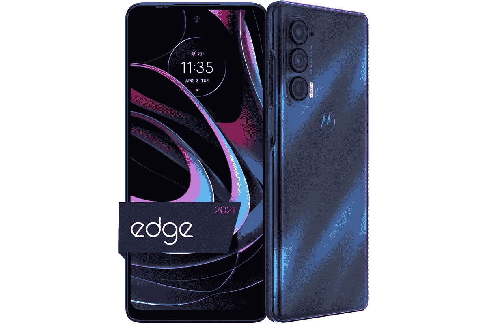

# 摩托罗拉 Edge 2021 得到了很大的折扣，现在售价仅为 249.99 美元

> 原文：<https://www.xda-developers.com/motorola-edge-2021-priced-at-just-24999/>

摩托罗拉 Edge 包含一些令人印象深刻的规格，但其发布时的初始价格对一些人来说有点难以承受。令人欣慰的是，这款手机的价格从那时起已经下降，现在它正以接近最低的价格出售。

摩托罗拉 Edge 拥有一个 6.8 英寸的 FHD+ 144Hz 大显示屏，由高通骁龙 778G 处理器提供支持。这款智能手机拥有 8GB 内存和 256GB 内部存储空间。在背面，它装有一个三摄像头设置，主摄像头配有一个 108MP 传感器。除了 108MP 传感器，它还有一个 8MP 超广角摄像头和一个 2MP 深度摄像头。至于前置摄像头，你将使用 32MP 传感器拍摄自拍。

这款手机有一个 5000 毫安时的大电池，摩托罗拉声称一次充电可以持续两天。如果你需要快速充满电池，你会很高兴知道摩托罗拉 Edge 能够进行 30W 涡轮动力快速充电。谈到安全性，它有一个侧装指纹传感器，可以使用面部识别解锁。

在很大程度上，摩托罗拉 Edge 是一款令人印象深刻的手机。当它最初于 2021 年首次亮相时，售价为 699.99 美元。但在有限的时间内，这款手机通过亚马逊销售，并打折 450 美元，降至 249.99 美元。根据研究，看起来亚马逊最近的定价远低于其建议零售价，为 349.99 美元，但即使如此，新的折扣价仍然便宜 100 美元。你也可以在百思买(Best Buy)买到它，但价格会稍微贵一点，约为 299.99 美元。

虽然价格很高，但不会永远如此，所以如果你点击链接，发现有差异，就有可能要么已经售罄，要么促销活动不再可用。如果你感到有点不知所措和不确定，你可以随时查看[我们的设备预览](https://www.xda-developers.com/motorola-edge-2021-preview/)，在那里我们会仔细检查手机的细节。想要更多选择，你也可以查看[我们的指南](https://www.xda-developers.com/best-phones/)，重点介绍目前市场上最好的智能手机。

* * *

 <picture></picture> 

Motorola Edge (2021)

##### 摩托罗拉边缘(2021)

摩托罗拉 Edge (2021)提供 6.8 英寸显示屏，刷新率为 144Hz，骁龙 778G 芯片组和 5,000mAh 电池。