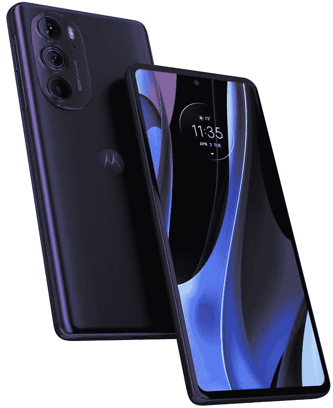
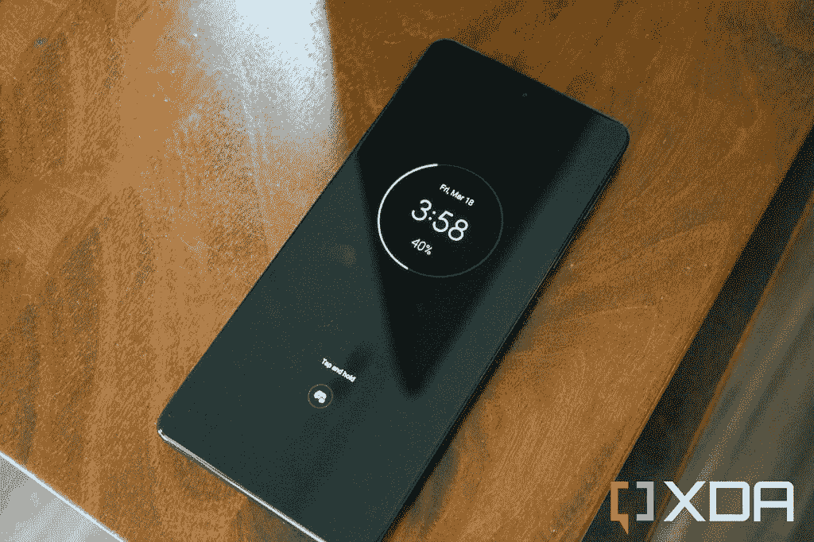

# 摩托罗拉 Edge Plus 2022 回顾:被遗忘的旗舰手机

> 原文：<https://www.xda-developers.com/motorola-edge-plus-2022-review/>

摩托罗拉的大部分收入来自廉价手机，但在缺席多年后，该公司一直试图再次进军旗舰领域。2020 年的第一款摩托罗拉 Edge Plus 标志着高端市场的回归，现在摩托罗拉已经为 2022 年准备了升级版。

摩托罗拉 Edge Plus 2022 T1，或摩托罗拉在美国坚持称之为“摩托罗拉 Edge+ (2022)”，或该公司在世界其他地方喜欢称之为“摩托罗拉 Edge 30 Pro”，配备了与 T2 Galaxy S22 Ultra T3 和 T4 一加 10 Pro T5 等手机相同的骁龙 8 Gen 1 芯片组。软件包的其余部分也很不错，高达 12GB 的内存和基本干净的 Android 12 体验。然而，旗舰市场的竞争很激烈，摩托罗拉计划在介绍期结束后，这款手机的售价为 1000 美元。

 <picture></picture> 

Motorola Edge Plus (2022)

##### 摩托罗拉 Edge Plus (2022)

摩托罗拉 2022 年的旗舰手机不错，但无法击败竞争对手。

## 摩托罗拉 Edge Plus 2022:定价和可用性

*   摩托罗拉 Edge Plus 发布时的售价为 899.99 美元，以后会涨到 999.99 美元
*   威瑞森正在出售一种支持毫米波的特殊型号

摩托罗拉 Edge Plus 在百思买(Best Buy)、亚马逊(Amazon)和摩托罗拉自己的网上商店出售，没有锁定运营商。这意味着你可以购买它，并在任何你想要的运营商上使用它——它可能没有一些较小网络的所有集成和设置，但它应该可以与美国三大运营商中的任何一家完美配合。

这款手机的官方价格为 999.99 美元，但摩托罗拉限时售价为 899.99 美元。鉴于上一款 Moto Edge 手机的[价格历史，你可能会预计它会在几个月后回到 899.99 美元的价格，然后继续下跌。](https://keepa.com/#!product/1-B098TXKW8K)

威瑞森也在销售略有修改的版本，摩托罗拉 Edge Plus 5G UW，售价为 849.99 美元或 32.61 美元/月，为期 36 个月。从亚马逊、百思买或其他商店购买的普通 Edge Plus 也可以在威瑞森的网络上工作，只是没有毫米波 5G。令人欣慰的是，毫米波 5G 支持几乎无关紧要，解锁的模型仍然支持威瑞森更容易获得和有用的 C 波段 5G。

在世界其他地区，如印度，摩托罗拉以“摩托罗拉 Edge 30 Pro”品牌销售这款设备，在₹49,999 销售 8GB+ 128GB 存储版本。

## 摩托罗拉 Edge Plus 2022:规格

| 

规格

 | 

摩托罗拉 Edge Plus (2022) /摩托罗拉 Edge 30 Pro

 |
| --- | --- |
| **尺寸&重量** | 

*   163 x 75.9 x 8.79 毫米
*   196 克

 |
| **显示** | 

*   6.7 英寸极化 2400 x 1080
*   144 赫兹刷新率

 |
| **SoC** | 高通骁龙 8 代 1 |
| **内存&存储** | 

*   8 或 12 GB LPDDR5 RAM
*   128、256 或 512GB UFS 3.1 内部存储
*   没有 microSD 卡插槽

 |
| **电池&充电** | 

*   4800 毫安时电池
*   30W 有线充电
*   15W 无线充电
*   5W 无线功率共享(反向充电)

 |
| **安全** | 侧装式指纹传感器 |
| **后置摄像头** | 

*   50MP (f/1.8，1.0μm)初级
*   50MP (f/2.2，0.64μm)超宽
*   200 万像素(f/2.4，1.75 微米)深

 |
| **前置摄像头** | 60MP (f/2.2，0.6 微米) |
| **端口** | 

*   带 DisplayPort 1.4 的 USB 3.1 Type-C
*   没有耳机插孔

 |
| **音频** | 

*   双立体声扬声器
*   3 个麦克风

 |
| **连通性** | 

*   Wi-Fi 802.11 a/b/g/n/ac/ax(双频 2.4/5GHz)
*   蓝牙 5.2
*   GPS、AGPS、LTEPP、SUPL、Glonass、伽利略
*   国家足球联盟

 |
| **软件** | Android 12 和我的 UX |
| **其他功能** | 

*   “准备好”桌面环境
*   IP52 防溅/防尘性能
*   支持智能手写笔(根据地区/商店，单独销售或捆绑销售)

 |

*关于此次评估:摩托罗拉将 Edge Plus 2022 借给 XDA 开发人员用于此次评估。摩托罗拉对这篇文章的内容没有任何意见。*

## 摩托罗拉 Edge Plus 2022 设计和展示:这是一个大家伙

*   Moto Edge Plus 的屏幕为 6.7 英寸，大小与 Galaxy S22 Ultra 几乎相同
*   没有耳机插孔或 microSD 卡插槽

Edge Plus 的定义性设计元素是物理尺寸——它与 Galaxy S22 Ultra 的尺寸几乎相同，为 163 x 75.9 x 8.79 毫米。我个人并不喜欢大型手机，但我知道我在这方面属于少数(完全缺乏紧凑的 Android 旗舰就证明了这一点)。请放心，如果你想要智能手机上的大屏幕，Edge Plus 可以满足你的需求。

正面显示屏是一块 6.7 英寸的 pOLED 面板，分辨率为 2400 x 1080。对于那种尺寸的显示器来说，这个分辨率有点低，像素密度约为 392 PPI(Galaxy S22 Ultra 约为 500 PPI)，所以如果你把手机靠近你的脸，文本不会非常清晰。显示器在其他方面都很棒，色彩鲜艳，有你从有机发光二极管面板上看到的常见的深黑色。动画和游戏也很流畅，这要归功于 144Hz 的刷新率。

我很高兴看到摩托罗拉配备了平板显示屏，而不是曲面屏，就像许多其他旗舰手机和以前的摩托罗拉 Edge 型号(因此有“Edge”的名字)一样。在宣传图片中，平板显示器可能看起来不那么酷，也不那么前卫，但是它们不容易受到掌上电脑的排斥，而且它们使安装屏幕保护器变得容易。

手机的左侧或顶部没有任何东西，但右侧有常见的电源和音量按钮。电源按钮兼作侧装指纹传感器，扫描我的拇指没有问题，但传感器在手机侧面相当高。我通常不得不把我的手沿着电话向上移动一点，这样我的拇指才能在正确的位置。

手机底部有主扬声器、USB Type-C 端口和 SIM 卡插槽。没有 3.5 毫米耳机插孔或 microSD 卡插槽，这似乎比三星、谷歌或苹果的手机更奇怪。摩托罗拉需要一切优势从其他制造商那里夺回旗舰产品的市场份额，在耳机插孔和 SD 卡插槽的硬件上多花几分钱可能是一个简单的方法。相反，摩托罗拉正在追逐不利于 Edge Plus 的当前硬件趋势。

摩托罗拉在 Moto Edge 的背面使用了玻璃，但纹理和表面感觉类似于光滑的塑料。除了中心摩托罗拉标志，手机背面唯一有趣的地方是摄像头阵列。总共有三个摄像头(下一节会详细介绍)和一个闪光灯。

* * *

## 摩托罗拉 Edge Plus 2022 相机:一般不错，偶尔有 bug

摩托罗拉 Edge Plus 有三个后置摄像头。第一个是 50MP 主摄像头，它结合像素生成 12MP 图像，类似于大多数其他旗舰手机上的摄像头。还有一个 50MP 超宽摄像头，最后是一个 2MP...深度传感器。好吧，基本上是两个摄像头。

在我的测试中，照片质量变化很大。主体在几英尺之外的照片通常看起来很好，包括夜景和人像模式。然而，一些更近的照片在主体周围有一些边缘/模糊，就像下面样本中我的狗 Daisy 在床上的照片(看她的脖子左侧)。

**[点击此处查看全分辨率照片](https://imgur.com/a/WyhuQXA)**

我很惊讶这部手机上的微距照片看起来有多棒，特别是没有专用的微距镜头——手机只是裁剪了 50MP 超宽镜头。尽管如此，摩托罗拉可能应该包括一个长焦镜头，或者比 2MP 深度传感器更有用的东西。

除了偶尔的软件故障，摩托罗拉 Edge 的普通和超宽照片的相机质量与这个价格范围内的其他手机大致相当。色彩比三星的过饱和图像更真实一点，只要主体(和你的手)相对静止，夜间模式就很不错。

6000 万像素的前置摄像头绝对是一个比你在大多数其他手机上看到的分辨率高得多的传感器，但这似乎并没有转化为更好的照片。Edge Plus 上的自拍看起来与任何其他旗舰设备上的自拍都差不多。

* * *

## 摩托罗拉 Edge Plus 2022 软件:Android 12 和“我的 UX”

*   软件体验接近“库存”Android 12，有一些有益的补充
*   摩托罗拉开发了自己的移动桌面/显示器工具“Ready For”

多年来，摩托罗拉的软件战略一直是发布相对干净的 Android 版本，摩托罗拉 Edge Plus 依然如此。这款手机运行 Android 12，在很大程度上，它非常接近你在谷歌 Pixel 手机上找到的东西。它有相同的快速设置和通知面板，大部分是相同的锁屏，等等。还有同样的“材料你”自定义系统颜色支持，虽然这里的软件不会自动从你的壁纸中提取颜色——你需要进入设置中的“个性化”部分来改变设计。

有一些来自摩托罗拉的定制功能，该公司官方称之为“我的 UX”除了上述主题支持，还有一堆自定义手势(如经典的“砍”来打开手电筒，旋转来打开相机应用程序)，屏幕关闭时可选的媒体控制，以及其他微小但有用的附加功能。其中大多数都可以从主屏幕上的“Moto”应用程序访问，但也可以从设置应用程序的相关部分访问。

 <picture></picture> 

Peek Display on the Motorola Edge Plus

### 摩托罗拉就绪-通过您的手机获得类似桌面的体验

摩托罗拉也有自己的桌面/外部显示软件体验，名为“Ready For”，有点类似于三星 DeX 和其他类似桌面的体验。该功能允许您将手机连接到 Windows PC、电视或显示器，然后您可以在更大的屏幕上使用您的应用程序。我用一个 [Anker USB 集线器](https://www.amazon.com/gp/product/B07ZVKTP53?tag=xda-6o1uorp-20&ascsubtag=UUxdaUeUpU40593&asc_refurl=https%3A%2F%2Fwww.xda-developers.com%2Fmotorola-edge-plus-2022-review%2F&asc_campaign=Short-Term)进行了测试，插入了键盘、鼠标和 HDMI 显示器，体验非常接近三星几年来在其旗舰手机和平板电脑上提供的体验。

我确实注意到 Ready For 的一些奇怪问题，比如虚拟键盘偶尔会弹出，即使我插了 USB 键盘，但它的工作效果和三星 DeX 一样好。除了桌面，还有三种模式——电视、视频聊天和游戏——它们本质上是在全屏模式下打开某些应用程序的启动器，没有桌面的东西。除了三星平板电脑上的 DeX 模式，我从未发现手机桌面有什么用处，但这表明摩托罗拉至少在追赶其他制造商。

总的来说，摩托罗拉似乎找到了一个平衡点，给安卓系统增加了一些功能，但又不会让它们显得格格不入或臃肿。如果你不关心手势或桌面环境，你可以忽略它们。然而，我确实不得不关闭摩托罗拉的定制常亮显示屏(称为“Peek Display”)，因为每当我撞到手机所在的桌子时，它都会一直亮着。

* * *

## 摩托罗拉 Edge Plus 2022 性能和电池寿命:优秀

*   4800 毫安时电池和骁龙 8 Gen 1 给你一个合适的旗舰体验

这款手机与今年发布的大多数其他旗舰手机，包括 Galaxy S22 系列，一加 10 Pro 和 Realme GT 2 系列，拥有相同的高通骁龙 8 Gen 1 芯片组。这意味着对于 Twitter 的末日滚动、在线游戏以及介于两者之间的一切来说，这已经足够快了。摩托罗拉正在销售 8GB 或 12GB 内存的 Edge Plus，这两种内存对大多数人来说都足够了。我在应用程序之间快速切换没有任何问题，除了最耗电的手机游戏之外，其他一切都可以快速打开。

如果你对基准测试感兴趣，摩托罗拉 Edge Plus 在 Geekbench 5 中获得了单核 1199 分，多核 3695 分([完整结果在此](https://browser.geekbench.com/v5/cpu/13753547))。我还进行了 CPU 节流测试，以评估在长期压力测试中性能如何下降，大约 10 分钟后性能下降相当明显，因此这可能不是 T2 最适合长期游戏会话的手机。

电池续航时间非常好，不过对于这款手机的 4800 毫安时电池来说，这可能算不上什么惊喜。除非你整天都在玩游戏，否则 Moto Edge Plus 应该可以轻松支持你一整天，根据使用情况可能会持续两天。我玩的手机游戏不多，目前也不怎么旅行，所以我从来没有注意到手机在任何一天都降到了 40%以下。

* * *

## 你应该买摩托罗拉 Edge Plus 吗？

摩托罗拉 Edge Plus 是一款*精品*手机。不算太棒，也不可怕，但介于两者之间。性能和软件体验大约是你对 1000 美元智能手机的期望，即使相机可能在某些领域落后于竞争对手，你仍然可以用 Moto Edge Plus 拍摄一些精彩的照片。

话虽如此，我不确定我是否有任何令人信服的理由来购买 Galaxy S22、iPhone 13 或任何其他当前旗舰智能手机。Moto Edge Plus 没有任何突破性的软件或硬件功能，摩托罗拉只承诺了两次主要的 Android 操作系统更新和三年的安全补丁，这落后于竞争对手。三星现在承诺[四次重大更新和五年安全补丁](https://www.xda-developers.com/samsung-promises-four-android-os-upgrades-flagships/)，谷歌 Pixel 6 将有[三年操作系统更新和五年安全修复](https://www.xda-developers.com/google-pixel-6-3-years-software-updates/)，而[苹果仍在更新六年前的 iPhone 6S](https://support.apple.com/guide/iphone/supported-models-iphe3fa5df43/ios) 。

还有定价的问题。即使是 900 美元的临时初始成本，你也可以少花 100 美元获得入门级的 Galaxy S22，或者少花 300 美元获得谷歌 Pixel 6。这些手机的显示屏较小，但几乎所有其他东西都可以媲美或超过摩托罗拉 Edge。摩托罗拉需要一些理由来证明更高的价格，这只是...什么都没有。

如果你能以很低的折扣获得摩托罗拉 Edge Plus，并且不介意较短的软件支持时间，我认为你不会有太多抱怨。我希望摩托罗拉继续做旗舰业务，因为美国三星/苹果的双头垄断对除了这两家公司以外的任何人都没有好处，但下一个版本肯定需要一些改变。

**购买摩托罗拉 Edge Plus 2022，如果:**

*   你想要一部大显示屏的旗舰 Android 手机。
*   你想要接近库存 Android 的东西，但不想要谷歌 Pixel 手机。
*   你已经习惯了摩托罗拉的手势和其他软件功能。

**不要买摩托罗拉 Edge Plus 2022 如果:**

*   扩展软件支持是重中之重——还是买 Galaxy S22、Pixel 6 或者 iPhone 吧。
*   你想要一个耳机插孔或 microSD 卡插槽。
*   你想要一台一流的相机。

 <picture></picture> 

Motorola Edge Plus (2022)

##### 摩托罗拉 Edge Plus (2022)

摩托罗拉 2022 年的旗舰手机不错，但无法击败竞争对手。