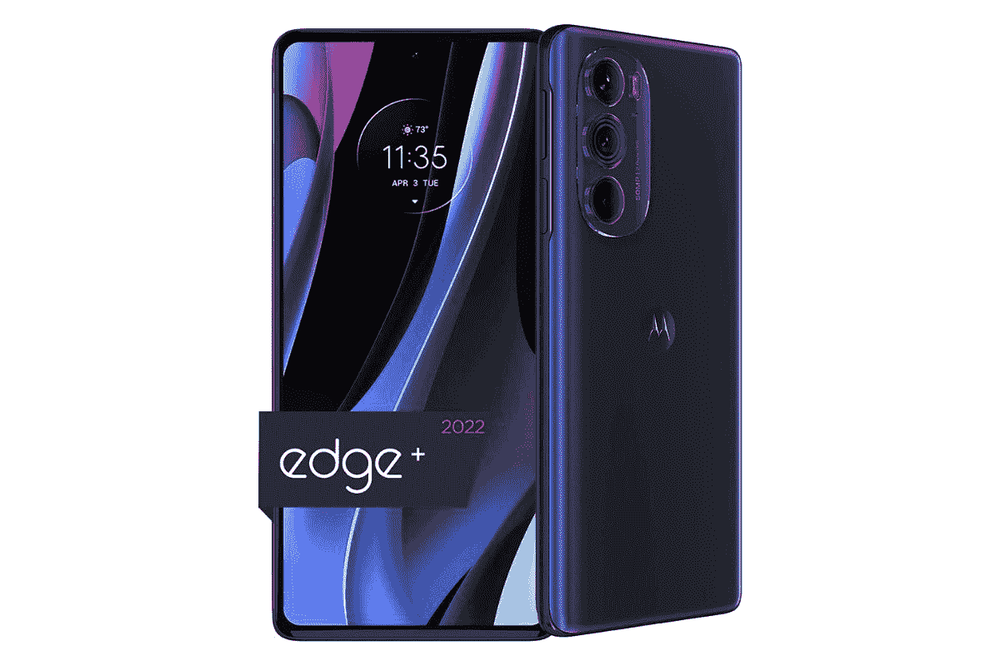

# 摩托罗拉最近的一次销售使一些最好的智能手机降价 800 美元

> 原文：<https://www.xda-developers.com/motorola-february-best-deals/>

尽管人们谈论得不多，但摩托罗拉提供了强大的智能手机产品组合，价格几乎符合所有预算。无论你是在寻找一款[最佳可折叠手机](https://www.xda-developers.com/best-foldable-phones/)，还是仅仅寻找一款[价格适中的安卓智能手机](https://www.xda-developers.com/best-cheap-android-phones/)，摩托罗拉都能满足你。尽管如此，摩托罗拉在提供交易时并不害羞，该公司目前提供一些惊人的折扣，交易价格高达 800 美元。如果你想升级你现在的手机或者只是想买些新的，这将是最好的时机。

## 摩托罗拉·拉兹尔

 <picture></picture> 

Motorola Razr

##### 摩托罗拉·拉兹尔

摩托罗拉 Razr 提供了两个世界的最佳选择，其紧凑的翻盖设计具有展开时可扩展的显示屏。

摩托罗拉 Razr 是一款令人印象深刻的智能手机，有时会被忽视，但它提供了令人印象深刻的设计和广阔的显示屏。也许最棒的是，它是当今市场上最实惠的可折叠智能手机之一，售价仅为 600 美元。如果你要从百思买购买它，这个交易会变得更加甜蜜，现在它的价格是 561 美元。那些寻求以旧换新的人会很高兴知道摩托罗拉正在接受报价，这可以让你用合格的设备额外获得 100 美元的折扣。

## 摩托罗拉边缘+

 <picture></picture> 

Motorola Edge Plus 2022

##### 摩托罗拉 Edge Plus (2022)

摩托罗拉 Edge Plus 以优惠的价格提供了一些令人惊叹的高端功能

Moto Edge+是一款绝对的智能手机，采用高通骁龙 8 Gen 1 处理器，8GB 内存和 512GB 内部存储。除了其强大的规格，您还可以获得一个漂亮的 6.7 英寸大有机发光二极管显示器，刷新率为 144Hz。最重要的是，你可以在背面获得一个三摄像头阵列，其中包含一个 50MP 主传感器，50MP 超宽传感器和 2MP 深度传感器。最棒的是，它现在的售价仅为 500 美元，并且你可以获得两种美丽的颜色，宇宙蓝和星尘白。

## 摩托罗拉边缘

 <picture></picture> 

Motorola Edge 2022

##### 摩托罗拉边缘 2022

摩托罗拉 Edge 是一款功能极其强大的智能手机，不缺乏风格或功能。你也可以以令人印象深刻的价格买到它。

摩托罗拉 Edge 是一款坚固的智能手机，具有漂亮的 6.6 英寸有机发光二极管显示屏，刷新率为 144Hz，联发科天玑 1050 处理器，8GB 内存和 256GB 内部存储。你有一个 5000 毫安时的大型内置电池，摩托罗拉称一次充电可以持续两天，还有一个由 50MP 传感器领导的后部三摄像头设置。这是一大堆的手机，却没有多少钱。摩托罗拉 Edge 2022 现在只需 350 美元，如果你在亚马逊上购买，价格低至 313 美元。

## 摩托罗拉 Moto G 手写笔 5G

 <picture></picture> 

Moto G Stylus 2022

##### 摩托罗拉 Moto G 手写笔(2022)

Moto G Stylus 2022 是一款非常划算的智能手机，它不仅拥有强大的功能，还配备了触控笔，这是其价位上的一项独特功能。

Moto G Stylus 5G 最出名的可能是它包含了一个触控笔，这在这个价位的智能手机上很少见。虽然这可能是这款机型的主要吸引力，但它仍然有很多其他东西，如 6.8 英寸 120 赫兹的大显示屏，令人难以置信的 5000 毫安时电池，一次充电可持续两天，以及你可能会炫耀的时尚设计。最重要的是，它的价格，在有限的时间内只需 250 美元。

## 摩托罗拉摩托 G 动力

##### 摩托罗拉摩托 G 动力(2022)

Moto G Power (2022)配备了 6.5 英寸 90Hz 720p 屏幕，联发科 Helio G35，5,000 mAh 大容量电池等等。

如果你正在寻找一部预算有限的智能手机，Moto G Power 将是你的不二之选。Moto G Power 采用 6.5 英寸 90Hz 显示屏，联发科 Helio G37 处理器，4GB 内存和 64GB 内部存储。如果你需要更多的空间，这款手机确实有一个 microSD 卡插槽和令人印象深刻的电池寿命，可持续三天。也许这款手机最好的一点是它的售价仅为 130 美元。

虽然这些交易很热门，但不会持续太久。如果你想买一部新的安卓智能手机，这将是目前摩托罗拉最好的选择。所以趁这些销售还在的时候好好利用吧，因为一旦他们走了，他们就永远走了。