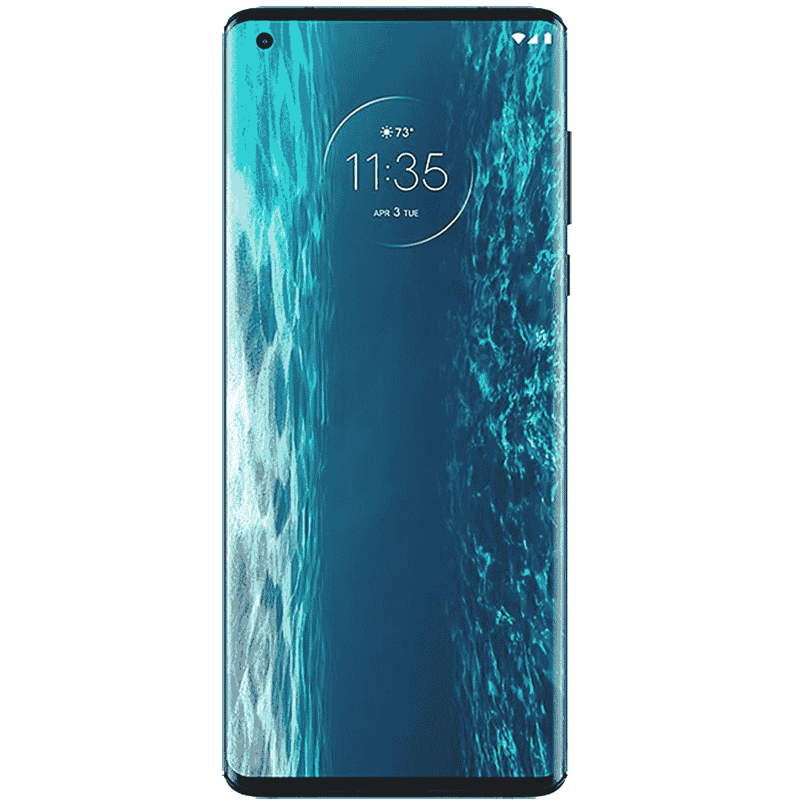
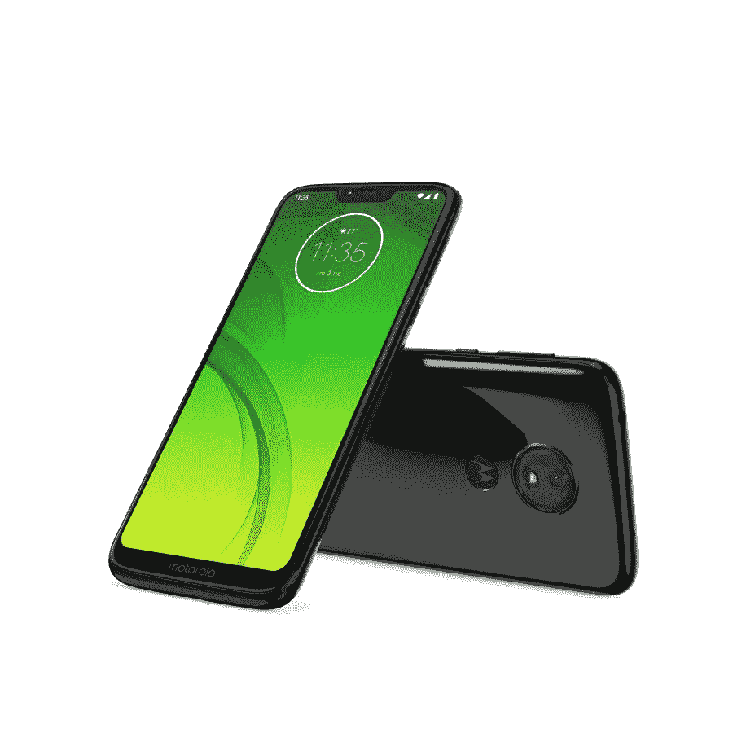
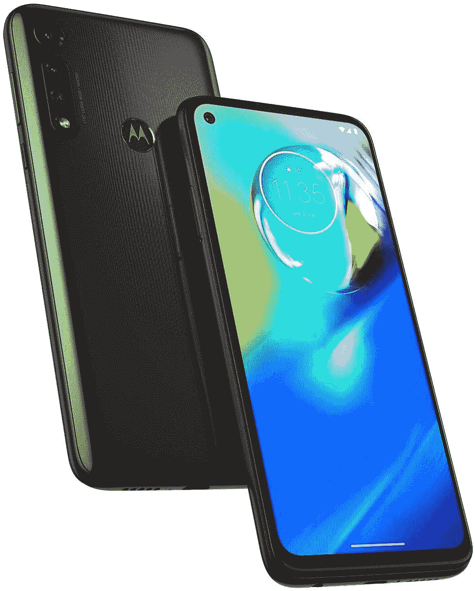

# 摩托罗拉的泄漏销售有很大的折扣在边缘，G 权力，等等

> 原文：<https://www.xda-developers.com/motorola-leak-sale-amazon/>

在假日购物季，一部高质量的廉价手机能做些什么？他们大幅降价，变得更加实惠！摩托罗拉等不及黑色星期五了，所以他们提前开始了销售活动！随着摩托罗拉泄漏销售削减价格的摩托罗拉优势，七国集团的权力，以及更多，有一个预算智能手机在这里的每一个人！

摩托罗拉的泄露拍卖在亚马逊和 T2 摩托罗拉的网站上直播。亚马逊确实有 Prime shipping、免费退货和付款计划的优势，如果你有亚马逊 Prime Rewards Visa，这家在线零售商是更好的选择。

也许这次泄露拍卖中最令人印象深刻的交易是摩托罗拉边缘，它的价格降到了 400 美元。这款解锁手机通常售价 700 美元，兼容美国所有运营商。它甚至兼容 T-Mobile 的 5G 网络！Edge 的电池可持续使用两天，可以涡轮增压，有 90 赫兹的显示屏和 64MP 三摄像头。简而言之，这是一款非常棒的高端预算手机！

 <picture></picture> 

Motorola Edge

##### 摩托罗拉边缘(2020)

摩托罗拉预算图片的高端选项，摩托罗拉边缘目前在亚马逊上仅售 400 美元。

在摩托罗拉的特价期间寻找更经济实惠的东西？莫过于 Moto G7 动力！价格低到令人震惊的 132 美元，如果你不需要任何花哨的功能，或者担心磨损会很快毁掉更昂贵的东西，这款手机基本上是值得购买的。这款手机配有可持续使用两天以上的电池和指纹识别器，为您提供所有基本功能。几乎每个人都知道有人可以使用智能手机，而不会淹没他们。

 <picture></picture> 

Motorola G7 Power

##### 摩托罗拉 G7 力量

你的生活中有太多花里胡哨的人，你需要一部简单的手机吗？Moto G7 Power 现在只要 132 美元！

最后，还有 Moto G Power，是的，事实上它比 Moto G7 Power 更新更强大。这是我们选出的 300 美元以下的最好的安卓手机之一！把它想象成 G7 力量和边缘之间的中间点。凭借 4GB 的 od RAM，它应该能够轻松运行大多数非游戏应用程序，16MP 相机将拍摄一些精彩的照片。它还有杜比音响，而且防水！作为摩托罗拉泄漏销售的一部分，这款手机仅售 180 美元，比 250 美元的建议零售价低了 70 美元。

 <picture></picture> 

Moto G Power

##### 摩托罗拉摩托 G 动力

Moto G Power 是最好的廉价手机之一，现在，你只需 180 美元就可以买到它！

寻找更多的交易？查看[摩托罗拉漏售店铺页面](https://shop-links.co/link/?exclusive=1&publisher_slug=xda&article_name=Motorola%27s+Leak+Sale+has+deep+discounts+on+the+Motorola+Edge%2C+G+Power%2C+and+more%21&article_url=https%3A%2F%2Fwww.xda-developers.com%2Fmotorola-leak-sale-amazon%2F&u1=UUxdaUeUpU30617&url=https%3A%2F%2Fwww.motorola.com%2Fus%2Fspecials)！