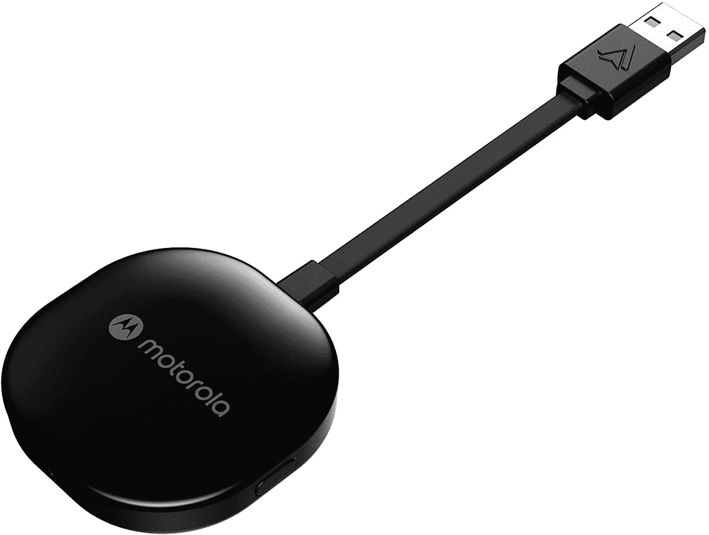

# 您现在可以预购摩托罗拉 MA1 无线安卓汽车适配器

> 原文：<https://www.xda-developers.com/motorola-ma1-pre-order/>

本月早些时候，[摩托罗拉 MA1 被宣布](https://www.xda-developers.com/motorola-ma1/)为第一款作为商业产品销售的无线安卓汽车适配器(像 [AAWireless](https://www.xda-developers.com/aawireless-dongle-enable-wireless-android-auto-wired-head-units/) 这样的小规模尝试已经存在)。该适配器声称可以为任何只有有线 Android Auto 的汽车带来无线 Android Auto 功能，现在可以预订。

尽管适配器以摩托罗拉 MA1 的名义出售，但它实际上不是由摩托罗拉制造的。该加密狗由 SGW Global 出售，该公司已经获得了在[各种家用电话](http://sgwglobal.com/portfolio/motorola-products)和[音频设备](https://www.motorolasound.com/)上使用摩托罗拉名称的许可。一旦您将 MA1 插入汽车或主机上的 USB 端口，它将通过蓝牙和 5GHz Wi-Fi 连接到您的手机。就像“真正的”无线 Android Auto 一样，无需将手机从口袋中拿出来——只要手机在附近，启动汽车就会自动建立无线连接。

 <picture></picture> 

Motorola MA1

##### 摩托罗拉 MA1

这似乎是第一个大规模生产的适配器，用于为任何装有 Android Auto 的汽车或主机添加无线连接。

SGW Global 表示，该适配器将于 2022 年 1 月 28 日在 motorolasound.com 和全球精选零售商处上市，但现在它也出现在亚马逊(通过*9 到 5 谷歌*T13)。它是由第三方卖家“摩托罗拉之声”销售的，看起来是 SGW Global，但发货将来自亚马逊自己的仓库。价格列为 89.95 美元，产品页面上写着该适配器将于 2022 年 1 月 28 日发布。

摩托罗拉 MA1 适配器的设计看起来有点像谷歌 Chromecast，所有硬件都包含在一个短 USB Type-A 线末端的小圆盘形单元中。如果能看到更紧凑的设计就好了，但一些汽车上的 USB 端口可能无法通过这种方式访问，而且盒子里显然会有一个“凝胶垫”，用于将其固定在平坦的表面上。与上周的公告相比，产品列表似乎没有提供任何新信息。

不幸的是，亚马逊似乎是目前唯一接受 MA1 预购的主要零售商，至少在美国是这样。