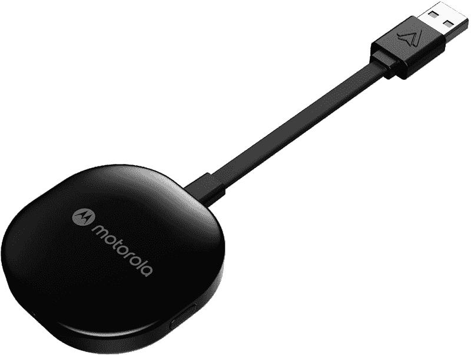

# 摩托罗拉 MA1 评论:无线安卓汽车为我们其余的人

> 原文：<https://www.xda-developers.com/motorola-ma1-review/>

Android Auto 最初需要通过 USB 连接手机，但一些新型主机和汽车支持无线连接。尽管如此，仍然有许多汽车和娱乐系统没有无线汽车，这导致了各种创造适配器的尝试。 [AAWireless](https://www.xda-developers.com/aawireless-dongle-enable-wireless-android-auto-wired-head-units/) 是最早的例子之一，但我们从未有过由大公司生产并通过正常零售渠道销售的无线适配器——直到现在。摩托罗拉 MA1 是来拯救世界的，但即使这个名字可能暗示着其他意思，它实际上并不是由摩托罗拉生产的——不是生产手机的[联想拥有的摩托罗拉移动](https://en.wikipedia.org/wiki/Motorola_Mobility)，也不是生产通讯设备的[摩托罗拉解决方案](https://en.wikipedia.org/wiki/Motorola_Solutions)。该加密狗由 SGW Global 出售，该公司已经获得了在各种家用电话和音频设备上使用摩托罗拉商标的许可。

不管是谁生产的，摩托罗拉 MA1 真的像宣传的那样好用吗？简而言之，是的——但是继续阅读更长版本的“是的”

 <picture></picture> 

Motorola MA1

##### 摩托罗拉 MA1

摩托罗拉 MA1 的功能与广告宣传的一样，但也许要等待销售。

## 摩托罗拉 MA1 定价和供货情况

*   摩托罗拉 MA1 的售价为 89.95 美元，但目前供应有限。

摩托罗拉 MA1 适配器在[亚马逊](https://www.amazon.com/gp/product/B09PQ95GY4?tag=xda-3hl1p1f-20&ascsubtag=UUxdaUeUpU393&asc_refurl=https%3A%2F%2Fwww.xda-developers.com%2Fmotorola-ma1-review%2F&asc_campaign=Short-Term)、[塔吉特](https://www.target.com/p/motorola-ma1-wireless-android-auto-car-adapter/-/A-85692043)、[Motorolasound.com](https://www.motorolasound.com/audio-products/android-auto/ma1)出售，并在全球范围内选择其他零售商。然而，目前需求超过了供给，至少在撰写这篇评论时是这样。预购上线后不久，亚马逊就停止接受订单，摩托罗拉声音网站上的产品页面仍然只允许你注册电子邮件通知。

## 摩托罗拉 MA1 规格

| 

尺寸和重量

 | 

*   冰球:55 x 55 x 10 毫米
*   USB 电缆长度:80 毫米
*   31 克

 |
| 

连通性

 | 

*   WiFi 802.11 a/n/ac 5GHz
*   蓝牙 5.0

 |
| 

港口

 | USB 类型 A (2.5W) |
| 

价格

 | $89.95 |

***关于这篇评论:**我购买了摩托罗拉 MA1 供个人使用。SGW Global 和摩托罗拉品牌的其他许可持有人都没有参与此次审查的内容。*

* * *

## 设计:一个光滑的塑料小囊

摩托罗拉 MA1 类似于最初的谷歌 Chromecast，所有的电子设备都装在一个小松鼠(方形圆圈)中，一根短电缆的另一端是 USB Type-A 连接器。该圆盘的宽度和高度约为 55 毫米，与大多数无线耳塞的外壳大小相同。前面还有一个小灯，充当指示灯，右侧有一个按钮，用于重置无线连接。

对于这种简单的设计，我没什么可说的，但我确实有一个主要的抱怨:USB 电缆。大多数汽车上的 USB 端口通常都塞在中控台下面，所以 MA1 的电缆较短是有道理的，但这并不是在所有情况下都理想。

我车上的 USB 连接器在中控台的最底部(与我的换挡杆齐平)，周围有一个短托盘。适配器和电缆比托盘长，所以我要么必须扭转电缆，将 MA1 放在较高的托盘中，要么让电缆弯曲，让 MA1 朝上。适配器应该只有一个标准的 USB Type-C 端口(或 microUSB，我不在乎)，让我使用任何电缆。如果电缆末端的 USB 连接器损坏，固定电缆也会成为一个问题。然而，MA1 确实可以与我在家里能找到的所有 USB 延长线配合使用，所以这可能是将适配器移动到你车上更好位置的一种选择。

另一个潜在的问题是外观:摩托罗拉 MA1 的顶部是光滑的黑色塑料。这几乎确保了 MA1 在大多数汽车上看起来永远布满灰尘——我希望单元底部的常规黑色塑料覆盖整个适配器。

好的一面是，随附的用户指南中有一个凝胶垫，您可以使用它将 MA1 连接到 USB 端口范围内的任何地方。几乎任何双面胶带都可能奏效 MA1 仅重 31 克。

* * *

## 软件:按预期工作

该适配器只为已经支持有线 Android Auto 的汽车和主机增加了无线连接能力。这并没有给一辆还没有 Android Auto 的汽车添加 Android Auto。本质上，这个适配器告诉你的手机这是一辆无线 Android Auto 汽车，但对你的汽车来说，它似乎是用电缆连接的手机。

第二个问题是，你需要一部支持无线 Android Auto 的手机。谢天谢地，只要你的手机是在过去 2-3 年内制造的，你就*可能*没事。无线 Android Auto [可以在任何搭载 Android 11 或更高版本](https://support.google.com/androidauto/answer/6348019)的手机上运行，也可以在任何搭载 Android 10 的谷歌或三星手机上运行。根据谷歌 11 月发布的数据[，在所有活跃使用的安卓设备中，约有 24.2%的设备运行的是安卓 11，26.5%的设备运行的是安卓 10(其中任何谷歌/三星手机都将支持 Auto)。](https://9to5google.com/2021/11/22/android-2021-distribution-numbers/)

一旦你插入适配器，你应该看到一个名为“AndroidAuto”的设备，在你可用的蓝牙设备的末尾有一些数字和字母。一旦你成功地与 MA1 配对(我试了两次)，你手机上的 Android Auto 服务就会启动，你的车就会显示通常的 Auto 界面。不需要额外的应用程序或设置。设置完成后，一旦 USB 端口通电，您的手机将自动连接。

我只能用一辆车(我的 2020 现代 Kona)测试摩托罗拉 MA1，但我手头确实有几部手机——包括一部 [Galaxy S21](https://www.xda-developers.com/samsung-galaxy-s21/) 、Unihertz Titan Pocket、 [Galaxy S21 FE](https://www.xda-developers.com/samsung-galaxy-s21-fe-review/) 和[一加 9 Pro](https://www.xda-developers.com/oneplus-9-pro-review/) 。对于所有这些手机，Auto 就像通常的有线连接一样工作，在播放音乐和播客时，在延迟，图像质量或音频质量方面没有明显的差异。我注意到视频压缩了几次，但只有几秒钟。

我注意到的唯一软件问题是开关设备。你必须按住重置按钮才能将适配器与另一部手机配对，但即使在连接了另一部手机之后，我通常仍必须拔掉适配器并将其插回，以便自动完成设置过程。我是唯一一个使用我的汽车的人，所以这对我来说不是一个重大问题，但它可能会使这比共享车辆中的有线汽车更令人讨厌。

* * *

## 谁应该购买摩托罗拉 MA1？

摩托罗拉 MA1 实现了它的既定目标:它将无线 Android Auto 添加到任何装有有线 Android Auto 的汽车中。89.95 美元的初始价格对于一个可能最多花费几美元制造的东西来说绝对是昂贵的，但 MA1 或多或少地垄断了这一功能。所有其他选项都是处于不同发展阶段的小规模项目——[aa wireless 仍在处理积压的订单](https://www.indiegogo.com/projects/aawireless#/updates/all)、 [Carsifi 刚刚开始向 Kickstarter 支持者发货](https://www.kickstarter.com/projects/carsifi/carsifi-wireless-android-auto-adapter/posts/3398740)等等。当然，摩托罗拉 MA1 的库存时间也不会超过几天。

**谁应该购买摩托罗拉 MA1？**

*   那些想在每次上车时省去有线连接麻烦的人，只要他们
    *   有一辆装有有线 Android Auto 的汽车，但没有无线 Auto
    *   拥有一部支持无线 Android Auto 的手机

**谁不应该购买摩托罗拉 MA1？**

*   经常共用汽车并需要不断重新配对适配器的人
*   任何认为 90 美元对于无线功能来说太贵的人
*   那些还没有在车上安装有线 Android Auto 的用户，因为这是启用无线功能的先决条件

我希望对摩托罗拉 MA1 的疯狂需求将鼓励其他制造商发布他们自己的版本，特别是如果他们能提供可移动电缆或更低的价格。奇怪的是，谷歌自己从未为此目的创造过适配器，特别是因为它过去曾与 JBL 和安科等公司合作过，用谷歌助手为汽车创造音频适配器。谷歌甚至可以将这一概念更进一步，构建一个完全安装了 Android Automotive 的加密狗。不过，就目前而言，我对这个价格过高的适配器很满意。