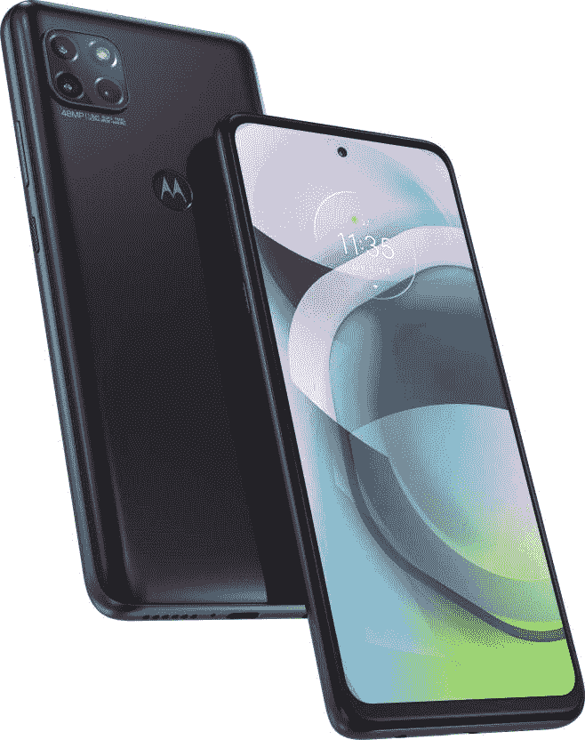

# 摩托罗拉 Moto G 5G 配备 6GB 内存，骁龙 750G 在印度推出

> 原文：<https://www.xda-developers.com/motorola-moto-g-5g-snapdragon-750g-launch-india/>

# 摩托罗拉推出 6GB 内存的 Moto G 5G，骁龙推出 750G

摩托罗拉在印度推出了配备 6GB 内存、128GB 存储空间、5000mAh 电池和骁龙 750G 的 Moto G 5G 手机。

摩托罗拉一直致力于夺回印度智能手机市场的中端市场。自去年以来，他们在该国推出了许多价格具有竞争力的设备，包括 [Moto G8 Plus](https://www.xda-developers.com/moto-g8-plus-first-impressions/) 、[摩托罗拉 One Fusion+](https://www.xda-developers.com/motorola-one-fusion-plus-review/) 和 [Moto G9](https://www.xda-developers.com/motorola-moto-g9-snapdragon-662-5000mah-battery-launched-india/) 。现在的重点是建立 5G 就绪的产品组合，在早些时候推出[摩托罗拉 Edge+](https://www.xda-developers.com/motorola-edge-plus-90hz-waterfall-display-snapdragon-865-108mp-camera-launch-india/) 和 [Razr 5G](https://www.xda-developers.com/motorola-razr-5g-snapdragon-765g-launched-india-124999/) 之后，该公司正在印度推出 5G mid-ranger，即使没有 5G 网络可用。摩托罗拉在印度发布了 [Moto G 5G](https://www.xda-developers.com/motorola-moto-g-5g-snapdragon-750g/) ，这是首款搭载[骁龙 750G](https://www.xda-developers.com/qualcomm-snapdragon-750g-processor-specifications-features/) 的智能手机，将在印度推出。

Moto G 5G 配备了 6.7 英寸打孔液晶显示屏，具有全高清+分辨率。该显示器的刷新率为 60Hz，并通过 HDR10 认证。在打孔的切口里有一个 1600 万像素的自拍相机。在背面，Moto G 5G 采用了方形摄像头凸起的三摄像头设置。这些相机包括一个带有[三星 ISOCELL GM1 传感器](https://www.xda-developers.com/samsung-32mp-48mp-isocell-camera-sensors/)的 48MP 主相机，一个具有 118°宽视野的 8MP 超宽相机，就像 [One Macro](https://www.xda-developers.com/motorola-one-macro-camera-review/) 一样——一个具有自动对焦功能的 2MP 微距相机。

与配备 4GB 内存的 Moto G 5G 全球版本不同，印度版本配备 6GB 内存。存储空间也增加了一倍，从 64GB 增加到 128GB，特别是针对印度市场。这款手机采用 5000 毫安时电池，支持 20W 快速充电。

软件方面，Moto G 5G 配备了一个现成的 Android 10 用户界面。这款手机已经承诺将很快升级到 Android 11，但该公司没有做出任何承诺。尽管 Moto G 5G 不属于谷歌的 Android One 计划，但像一些旧的摩托罗拉设备一样，它有一个专用于谷歌助手的按钮。

**[Moto G 5G 论坛](https://forum.xda-developers.com/moto-g-5g)**

## 印度的价格和供货情况

Moto G 5G 将于 12 月 7 日通过 Flipkart 在印度₹20,999[(约 285 美元)上市。HDFC 卡用户通过 Flipkart 购物将能够享受₹1,000 的即时折扣。](https://www.flipkart.com/motorola-g-5g-volcanic-grey-128-gb/p/itm911e9b0874de1)

 <picture></picture> 

Motorola Moto G 5G (6GB/128GB)

##### 摩托罗拉摩托 G 5G

摩托罗拉在印度推出了支持 5G 的 mid-ranger，配备骁龙 750G、6GB RAM 和 128GB 存储。从 12 月 7 日开始在 Flipkart 上获取。

## Moto G 5G 规格

| 

规格

 | 

摩托罗拉摩托 G 5G

 |
| --- | --- |
| **构建** | 塑料的 |
| **尺寸&重量** |  |
| **显示** | 6.7 英寸全高清+打孔液晶屏 |
| **SoC** | 高通骁龙 750 克 |
| **闸板&存放** | 6GB/128GB |
| **电池&充电** |  |
| **安全** | 后置指纹传感器 |
| **后置摄像头** |  |
| **前置摄像头** | 16MP |
| **端口** |  |
| **音频** | 向下发射单声道扬声器 |
| **连通性** | Wifi 802.11ac /蓝牙 5.1 / NFC / A-GPS |
| **软件** | 安卓 10 |