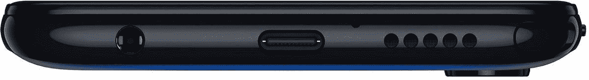

# 来源:这里是 Moto G 手写笔规格和手写笔功能

> 原文：<https://www.xda-developers.com/motorola-moto-g-stylus-specifications-stylus-features/>

自 2013 年第一款 Moto G 发布以来，摩托罗拉刚刚庆祝了卖出 1 亿部 Moto G 智能手机。自首次亮相以来，Moto G 系列已经大幅扩展，随着第 7 代的推出，该公司在该系列中发布了 4 款不同的智能手机:普通、Play、Power 和 Plus。【2019 年末，摩托罗拉推出了其首批两款第八代 Moto G 设备，Moto G8 Play 和 Moto G8 Plus。很明显，摩托罗拉正准备推出[普通版 Moto G8 和 Moto G8 Power](https://www.xda-developers.com/motorola-moto-g8-power-leaked-specifications/) ，但我们最近也获悉，摩托罗拉将为 G 系列推出一款全新的手机:Moto G Stylus。我们已经获得了很可能是该设备的规格以及其签名功能手写笔的可能用途。

上周，著名泄密者埃文·布拉斯[公布了一张即将发布的摩托罗拉手机的图片](https://www.xda-developers.com/motorola-next-phone-stylus/)，当时他还无法确认。这篇文章顶部的图片描绘了一部带有手写笔和单穿孔显示屏的手机。本周，同一部手机在三个不同的场合被泄露。第一次泄漏，由 *91Mobiles，*是该设备的另一个渲染，这一次[显示背面](https://www.xda-developers.com/moto-g8-power-renders-motorola-stylus-phone/)。墨西哥博客 *Xataka* 的第二次泄露展示了该设备及其手写笔的现场照片。最后， *91Mobiles* 发布了该设备的另一张图片，这次是在真实世界的图片中展示了该设备的正面和背面。从这三个单独的泄漏，我们了解了基本的设计和一些硬件规格，但感谢我们的来源，我们可以填补其余的空白。

我们首先想确认的是名字。这款手机确实将被称为 Moto G Stylus，这是 Evan Blass 在其 Twitter 账户上首次透露的。我们可以独立地确认这个名字，虽然感谢加拿大的无线电设备清单，这个名字并没有真正的疑问。

正如我猜测的那样，这款设备在规格上与即将推出的摩托罗拉 Moto G8 Power 非常相似。Moto G 触控笔和 Moto G8 Power 的关键区别在于后置摄像头传感器，当然还有前者上触控笔的存在。Moto G 手写笔的基本规格包括 6.36 英寸 2300x1080 单孔显示屏，高通骁龙 665，4GB 内存，至少 64GB 的内部存储，4000mAh 电池，10W 充电，Android 10，后置物理指纹扫描仪。在某些地区，手机将支持 NFC 和/或双 nano-SIM 卡。

在手机背面，你会发现一个三后置摄像头阵列，包括一个主 48MP f/1.7 [三星传感器](https://www.xda-developers.com/samsung-32mp-48mp-isocell-camera-sensors/)(像素合并到 12MP)，一个辅助 16MP f/2.2 117 广角“动作凸轮”传感器，和一个第三 2MP f/2.2 微距摄像头。“动作摄像头”最初是在摩托罗拉 One Action 上推出的，它允许你在垂直拿着手机的时候拍摄横向广角视频。这是可能的，因为摄像机传感器相对于其他传感器垂直安装。在正面，你会发现一个 2500 万像素的 f/2.0 摄像头在穿孔下方。

下面显示的是一个消息来源发给我们的渲染图，描绘了 Moto G 手写笔的底部。从渲染图中，我们可以看到有一个 3.5 毫米耳机插孔，一个 USB Type-C 端口，一个底部发射扬声器，以及一个用于插入手写笔的插槽。

 <picture></picture> 

The bottom of the Motorola Moto G Stylus

根据我们的消息来源，该设备上有一个新的应用程序，可用于执行以下操作:

*   当手写笔从机身上取下时，打开一个应用程序或启动您选择的快捷方式
*   使用“Moto Note”记笔记用户可以在使用触笔绘图时将手指用作橡皮擦。用户可以在他们记录的任何笔记上插入带有日期的水印。

摩托罗拉还将允许用户使用该应用程序跟踪手写笔的位置。该应用程序将记录您最后一次从设备上取下手写笔的时间和位置。当手写笔在一段时间内没有重新插入设备时，该应用程序可以发送通知，提醒用户重新插入笔。

| 

规格

 | 

摩托罗拉摩托 G 手写笔

 |
| --- | --- |
| 显示 | 6.36 英寸 2300x1080 单孔打孔机 |
| 尺寸* | 155 毫米 x75 毫米(对角线:168 毫米) |
| 社会学 | 高通骁龙 665 |
| 随机存取存储 | 4GB |
| 储存；储备 | 64GB/128GB |
| 后置摄像头 | 48MP f/1.7 三星 S5KGM1 + 2MP f/2.2 微距摄像头+ 16MP f/2.2 117 广角“动作凸轮”传感器 |
| 前置摄像头 | 25MP f/2.0 |
| 电池和充电* | 4000mAh，10W 有线充电 |
| 连通性 | NFC(部分地区)、双卡(部分地区) |
| 软件 | 安卓 10 |
| 安全性 | 后置电容式指纹扫描仪 |
| 模型 | XT2043-4、XT2043-5、XT2043-6 |
| 地区 | 北美、拉丁美洲、中国、国际 |

*确切的尺寸和充电速度来自该设备的 [FCC 文件](https://fccid.io/IHDT56YN1)。

虽然我们不知道价格或推出日期，但随着 MWC 2020 的临近，我们可能会了解更多细节。这款设备可能会比 Moto G8 Power 略贵，因为它有更好的(更有市场价值的)摄像头配置和手写笔支持。