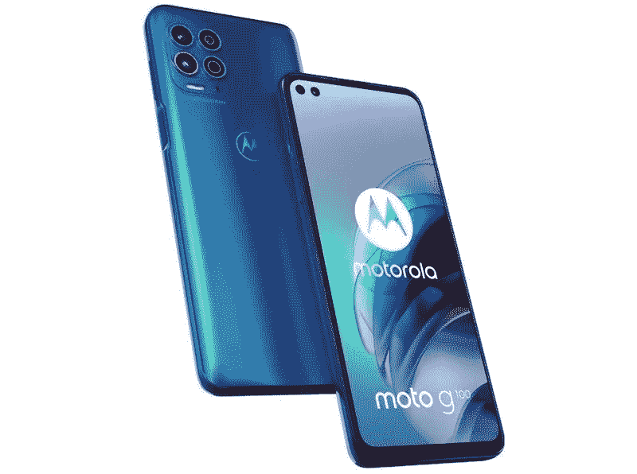

# 摩托罗拉摩托 G100:规格，定价，可用性，销售，新闻，等等！

> 原文：<https://www.xda-developers.com/motorola-moto-g100/>

摩托罗拉 Moto G100 是该公司在 Moto G 系列中的新款顶级智能手机。这款手机于今年 3 月在欧洲和拉丁美洲首次亮相，并已打入美国市场。G100 是 Moto G 系列中第一款采用高通骁龙 800 系列 SoC 的手机。这款手机还包含许多其他令人兴奋的功能。这是你需要知道的一切。

## 摩托罗拉摩托 G100:规格

| 

规范

 | 

摩托罗拉·莫托·G100

 |
| --- | --- |
| **尺寸和重量** | 

*   168.38 x 73.97 x 9.69mm 毫米
*   215 克

 |
| **显示** | 

*   6.7 英寸曲面液晶显示器
*   全高清+ (2520 x 1080)分辨率
*   90Hz 刷新率
*   21:9 宽高比
*   康宁大猩猩玻璃 3
*   HDR10

 |
| **SoC** | 

*   高通骁龙 870
    *   1 个 Kryo 585 (Cortex-A77) @ 3.2GHz
    *   3 个 Kryo 585(Cortex-A77)2.42 GHz
    *   4 个 Kryo 585(Cortex-A55)1.8 GHz

*   Adreno 650 GPU
*   7 纳米工艺

 |
| **RAM 和存储器** | 

*   8GB 内存
*   128GB/ 256GB 存储空间
*   MicroSD 卡支持

 |
| **后置摄像头** | 

*   **初级:** 64MP，初级，f/1.7，0.7μm
*   **次要:** 16MP，超广角，117 FoV，f/2.2，1.0μm
*   **第三级:** 2MP 微距，f/2.4，1.75μm
*   ToF 传感器
*   **视频**:最高 6K@30

 |
| **前置摄像头** | 

*   **初级:** 16MP，f/2.2，1.0μm，定焦，
*   **次要:** 8MP，超广角，f/2.4，2.0μm，118 FoV
*   **视频:**高达 1080@60

 |
| **电池** | 

*   5000 毫安时电池
*   最高 20W 有线充电(包装盒内)

 |
| **连通性** | 

*   乐队(北美):
    *   2G 频段:GSM 850/900/1800/1900
    *   3G 频段:UMTS B1/2/4/5/8
    *   4G LTE 频段:1/2/3/4/5/7/8/12/13/17/20/26/28/32/34/38/39/40/41/42/43/66
    *   5G 频段:n1/3/5/7/8/28/38/41/66/77/78

*   国家足球联盟
*   WiFi 802.11 . b/g/n/AC/ax(2.4 GHz+5 GHz)
*   蓝牙 6/蓝牙 5.1
*   USB Type-C(显示端口)，USB 3.1

 |
| **其他特性** | 

*   侧装式指纹扫描仪

 |
| **软件** |  |

## 设计和展示

摩托罗拉推出了一款平板屏幕，边缘略有弯曲，左上角有两个打孔切口。G100 的边框也很小，这款手机采用康宁大猩猩玻璃 3，带有防指纹涂层进行保护。在背面，有一个反射塑料面板，根据颜色选项显示各种色调。

谈到颜色，你有三种选择——彩虹色的海洋、彩虹色的天空和石板灰——但只有“彩虹色的海洋”选项在美国出售。

在显示屏方面，G100 采用了 6.7 英寸全高清+ (1，080 x 2，520 像素)LCD 屏幕，具有 HDR10，90Hz 刷新率和 21:9 的纵横比。

## SoC、RAM 和存储

新的摩托罗拉手机由高通骁龙 870 SoC 驱动，这是骁龙 865 的超频版本。您将获得一个主频为 3.2GHz 的 Kryo 585 (Cortex-A77)内核，三个主频为 2.42GHz 的 Kryo 585 (Cortex-A77)内核，四个主频为 1.8GHz 的 Kryo 585 (Cortex-A55)内核。还存在一个 Adreno 650 GPU。即使有更新的芯片组，这仍然是在性能和散热方面最可靠的移动 SOC 之一。

摩托罗拉摩托 G100 还配有 8GB 内存、高达 256GB 的板载存储空间和一个 microSD 卡插槽。这款手机支持最大 1TB 的 SD 卡。虽然美国只有 128GB 型号，但 256GB 型号在部分拉美市场销售。

## 摩托罗拉·莫托·G100:相机

该公司在 G100 的背面安装了三个摄像头，在正面安装了两个摄像头。后置摄像头设置包括 64MP 主摄像头、16MP 广角摄像头、2MP 深度传感器和飞行时间(ToF)传感器。自拍时，有一个 1600 万像素的主摄像头和一个 800 万像素的广角摄像头。

虽然前置摄像头只能以 30fps 的速度拍摄 1080p 视频，但主后置摄像头可以以 30 fps 的速度拍摄高达 6K 的视频。

## 电池、连接和指纹传感器

你将在支持 20W 快速充电的 Moto G100 上获得 5,000mAh 电池。手机还捆绑了兼容的 20W 快速充电器。

谈到连接选项，这款手机支持 5G，但它只能在美国的 T-Mobile 上工作。即使在 T-Mobile 上，也只支持 6GHz 以下的 NSA 频段。摩托罗拉预计将在未来几天增加美国电话电报公司 4G LTE 兼容性。

此外，Moto G100 还配备了 Wi-Fi 6 (802.11ax)、蓝牙 6、NFC 和 USB Type-C 端口。Type-C 端口还可以用作显示端口，因此你可以将手机连接到外部显示器或电视，并通过[摩托罗拉的“就绪”软件](https://www.xda-developers.com/motorola-ready-for-desktop-mode-edge-plus/)获得类似桌面的体验。

根据市场的不同，这款手机要么提供单 SIM 卡插槽，要么提供混合双卡支持。它还具有嵌入电源按钮的侧装指纹传感器。

### 操作系统和软件更新

摩托罗拉·莫托·G100 的手机运行的是安卓 11 系统，自带“我的 UX”定制功能。没有关于手机软件更新的消息，但它很可能会收到至少一个主要的 Android 更新，以及至少两年的安全更新。

除了“我的 UX”定制之外，G100 还配备了 ThinkShield for mobile，为手机增加了企业级安全性和各种企业相关功能。这款手机还支持[联想的 ThinkReality A3 智能眼镜](https://www.xda-developers.com/lenovo-thinkreality-a3-ar-smart-glasses-enterprise-launch-ces-2021/)。

### 摩托罗拉摩托 G100:价格和可用性

摩托罗拉只提供 Moto G100 的一种存储版本，8GB 内存和 128GB 内置存储。它在美国的售价为 599.99 美元，但在有限的时间内，这款手机将以 499.99 美元的促销价提供。如前所述，除了美国以外，这款手机还在欧洲和拉丁美洲的部分国家销售。

 <picture></picture> 

Motorola Moto G100

##### 摩托罗拉·莫托·G100

Moto G100 是摩托罗拉第一款旗舰级规格的 Moto G 手机，它终于在美国上市了。

以下是这款手机在其他一些市场的价格:

*   欧洲:€
*   英国: [449.99](https://www.amazon.co.uk/Motorola-Smartphones-G100-Iridescent-Ocean/dp/B08X4GX9K1/?tag=xdadevelopers-21)
*   巴西:BRL 3，999
*   阿根廷:ARD
*   哥伦比亚:缔约方会议 2399900

* * *

这就是我们现在所知道的关于摩托罗拉摩托 G100 的一切。我们将更新这个网页，当任何新的信息弹出手机。