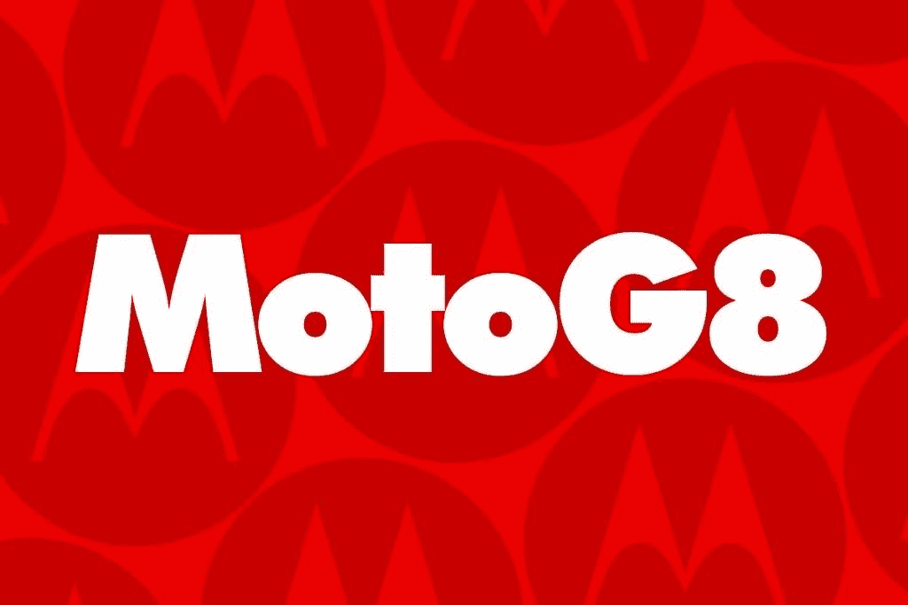

# 摩托罗拉 Moto G8 和 Moto G8 Power -我们对它们的规格了解多少

> 原文：<https://www.xda-developers.com/motorola-moto-g8-power-leaked-specifications/>

由于中国价值品牌的迅速崛起，我们都知道并喜爱的摩托罗拉品牌近年来在市场上面临艰难时刻。然而，联想旗下的这家公司成功重振了其移动业务，这在很大程度上得益于 G 和 E 系列产品的强劲表现。Moto 的 G 系列在预算到中端市场非常成功，常规和 Play 型号迎合了预算市场，Plus 和 Power 型号迎合了中端市场。去年 10 月，摩托罗拉[发布了](https://www.xda-developers.com/motorola-moto-g8-plus-g8-play-e6-play/)Moto G8 Plus 和 Moto G8 Play——然而 3 个月后，我们仍然错过了常规的 Moto G8 和它的大电池兄弟 Moto G8 Power。然而，这种情况可能很快就会改变，因为我们已经收集了这两款设备的大量信息，包括它们的完整规格。这是我们目前所知的一切。

一个可靠的消息来源与我们分享了规格和其他细节，我们过去从该消息来源获得了几款摩托罗拉设备的准确信息。在我们深入讨论每款器件之前，我们想先讨论一下这两款器件的相似之处。首先，这两款设备的设计几乎相同:Moto G8 和 Moto G8 Power 都有带圆角的单孔显示屏，相同的按钮位置，物理指纹扫描仪(据信嵌入在背面的摩托罗拉标志中)，以及背面左上角垂直排列的摄像头阵列。两款设备都由[高通骁龙 665](https://www.xda-developers.com/qualcomm-snapdragon-665-snapdragon-730g/) 移动平台驱动，开箱运行 [Android 10](https://www.xda-developers.com/tag/android10/) ，拥有相同的主后置摄像头，拥有微距摄像头，拥有广角摄像头。我不知道这两款设备上的广角摄像头是不是像[摩托罗拉 One Action](https://www.xda-developers.com/motorola-one-action-review/) 或 [Moto G8 Plus](https://www.xda-developers.com/moto-g8-plus-first-impressions/) 上的“动作摄像头”，但很可能摩托罗拉使用的是与[摩托罗拉 One Macro](https://www.xda-developers.com/motorola-one-macro-camera-review/) 相同的微距镜头。

## 

## Moto G8 规格

Moto G8 将是这两款设备的低端型号。它将有一个 6.39 英寸的高清+分辨率(1560x720)屏幕，可能有一个单穿孔。预计显示技术将是 LCD，事实上，不会有光学欠显示指纹扫描仪。然而，有一个指纹扫描仪，正如我们之前提到的，它可能嵌入在手机背面醒目的摩托罗拉标志中。由于该设备将在多个市场销售(北美、拉丁美洲、欧洲、中东和非洲)，因此将有多个 SKU。我们预计这款设备将出售 2/3/4GB 内存和/或 32/64GB 内部存储，但我们不知道存储是否可以通过 micro SD 卡插槽扩展。预计没有一个 SKU 支持 NFC，尽管一些型号将支持双 nano-SIM 卡。该设备将由 4000mAh 电池供电，并支持 10W 充电。

标准的 Moto G8 将具有三个后置摄像头阵列，包括一个主 16MP f/1.7 传感器，一个用于微距拍摄的辅助 2MP f/2.2 传感器，以及一个第三 8MP f/2.2 118 广角传感器。在正面，我们预计会有一个 8MP f/2.0 传感器。骁龙 665 的光谱 165 ISP 将处理图像处理。我不知道摩托罗拉是否正在为这两款设备开发新的相机模式。

虽然我不知道 Moto G8 的价格，但我怀疑它会比 G8 Power 便宜，尽管我也不知道那个型号的价格。

## Moto G8 电源规格

“Power”系列下的每部智能手机都有大电池，Moto G8 Power 在这方面也不例外。它将拥有 5000 毫安时电池，并支持 18W 有线充电。与标准的 Moto G8 相比，G8 Power 的显示屏分辨率更高，为 2300x1080，但显示屏尺寸略小，为 6.36 英寸。不过，G8 Power 的底部边框应该会稍微薄一点。G8 Power 还标配 4GB 内存和 64GB 内部存储，但也可能有其他我不知道的 SKU。像标准的 G8 一样，G8 Power 应该在摩托罗拉标志的背面嵌入一个物理指纹扫描仪。同样，它应该有一个液晶显示器，而不是 OLED 面板。我不知道 G8 Power 是否会在任何市场支持 NFC，但我知道一些市场将会有双 SIM 卡托盘。

Moto G8 Power 上的摄像头设置与标准 G8 几乎相同，但在后部有一个额外的 8MP f/2.4 传感器，这意味着 Power 有一个四后置摄像头阵列。不过在正面，G8 Power 似乎有更好的 25MP f/2.0 传感器。

| 

规格

 | 

摩托罗拉摩托 G8

 | 

摩托罗拉摩托 G8 动力

 |
| --- | --- | --- |
| 显示 | 6.39 英寸 1560x720，单孔打孔机 | 6.36 英寸 2300x1080，单孔打孔机 |
| 尺寸* | 160 x 74mm 毫米(对角线:170 毫米) | 167.99 x 75.8mm 毫米(对角线:165 毫米) |
| 社会学 | 高通骁龙 665 | 高通骁龙 665 |
| 随机存取存储 | 2/3/4GB | 4GB |
| 储存；储备 | 32/64GB | 64GB |
| 后置摄像头 | 16MP f/1.7 + 2MP f/2.2 微距镜头+8MP f/2.2 118°广角 | 16MP f/1.7 + 2MP f/2.2 微距镜头+ 8MP f/2.2 118 广角+ 8MP f/2.4 |
| 前置摄像头 | 800 万像素 f/2.0 | 25MP f/2.0 |
| 电池 | 4000mAh，10W 充电 | 5000 毫安时，18W 充电 |
| 连通性* | 无 NFCDual SIM 卡(部分地区)XT2045-1: GSM850/1900、WCDMA 频段 II/IV/V、LTE 频段 2/4/5/7/66、WLAN 2.4GHz 802.11b/g/n、蓝牙 BR/EDR/LE | 双卡(部分地区)XT2041-1: GSM850/1900、WCDMA 频段 II/IV/V、LTE 频段 2/4/5/7/12/17/66、WLAN 2.4 GHz 802.11b/g/n、蓝牙 BR/EDR/LEXT2041-3: GSM850/1900、WCDMA 频段 II/IV/V、LTE 频段 2/4/5/7/26/38/41、WLAN |
| 软件 | 安卓 10 | 安卓 10 |
| 安全性 | 指纹扫描仪(物理) | 指纹扫描仪(物理) |
| 模型 | XT2045-1 | XT2041-1、XT2041-3 |
| 地区 | 北美、拉丁美洲(墨西哥)、欧洲、中东、非洲 | 北美、拉丁美洲(阿根廷、哥斯达黎加、墨西哥)、国际 |

*确切的尺寸和网络频率规格摘自两款设备的 FCC 文件。Moto G8: [ [1](https://fccid.io/IHDT56YK2) 。Moto G8 动力:[ [1](https://fccid.io/IHDT56YL2) ] [ [2](https://fccid.io/IHDT56YL3) 。

* * *

摩托罗拉证实，他们正在开发一款搭载高通骁龙 765 的智能手机和一款搭载高通骁龙 865 的智能手机。我们没有任何关于这两款设备的确认细节，尽管最近[泄露的手写笔承载设备](https://www.xda-developers.com/motorola-next-phone-stylus/)可能是其中之一。说到那个带触控笔的未知设备——我们相当有信心它不是 Moto G8 或 Moto G8 Power。摩托罗拉将在 2020 年 MWC 举办一场新闻发布会，我预计该公司将在会上发布这两款 G8 智能手机。该公司也有可能像往常一样，在巴西安排一场单独的活动。当我们了解到关于这两款设备的更多信息时，我们将随时为您更新。