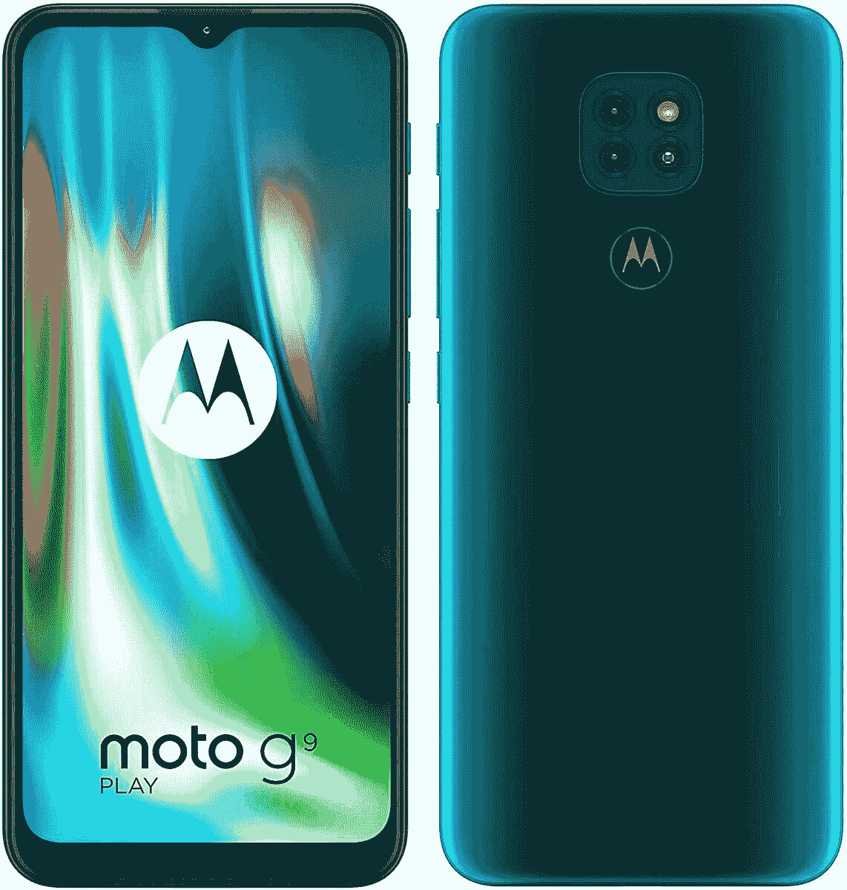

# 摩托罗拉在欧洲推出 Moto G9 Play 经济型智能手机

> 原文：<https://www.xda-developers.com/motorola-moto-g9-play-launch-europe-budget-smartphone/>

**更新 1(****09/16/2020****@****06:00am****ET):**摩托罗拉已经在欧洲和英国推出了 Moto G9 Play。滚动到底部了解更多信息。下面保留了 2020 年 8 月 24 日发表的文章。

摩托罗拉今天早些时候刚刚在印度发布了[Moto G9](https://www.xda-developers.com/motorola-moto-g9-snapdragon-662-5000mah-battery-launched-india/)，现在该公司也发布了[Moto G9 Play](https://blog.motorola.de/2020/08/24/moto-g9-play-mehr-als-du-brauchst-riesen-akku-zum-kleinen-preis/)，它将在德国首次亮相。

新款 Moto G9 Play 的许多规格与普通 G9 相似。你可以获得 5000 毫安时的大电池、20W 有线充电支持、由 48MP 主摄像头、2MP 深度传感器和 2MP 宏观传感器组成的三摄像头设置、高通骁龙 662 芯片组和高清分辨率的 6.5 英寸 LCD。G9 Play 还具有 64GB 的内部存储空间，可通过 microSD 卡扩展，以及 4GB 的 RAM。

正如你所看到的，3 个后置摄像头和 LED 闪光灯排列在一个矩形的摄像头凸起上，位于后部顶部的中心。指纹扫描仪位于摄像头下方，按钮上印有摩托罗拉的标志。

## 摩托罗拉摩托 G9 Play:规格

| 

规格

 | 

摩托罗拉摩托 G9 Play

 |
| --- | --- |
| **显示** | 

*   6.5 英寸高清液晶 TFT 显示屏
*   20:9 宽高比

 |
| **SoC** | 高通骁龙 662 足球俱乐部

*   4 倍性能 Kryo 260 CPU 内核(高达 2.0GHz)
*   4 倍效率的 Kryo 260 CPU 内核

肾上腺素 610 |
| **闸板&存放** | 

*   4GB LPDDR4 + 64GB
*   可通过 microSD 扩展

 |
| **电池&充电** | 

*   5000 毫安时电池
*   20W 快速充电

 |
| **指纹传感器** | 后置指纹传感器 |
| **后置摄像头** | 

*   初级:4800 万像素，f/1.7
*   中学:2MP，深度，f/2.4
*   第三代:2MP，微距，f/2.4

 |
| **前置摄像头** | 800 万像素 f/2.2 |
| **其他特征** | 

*   无线网络 802.11ac
*   蓝牙 v5.0
*   国家足球联盟
*   3.5 毫米耳机插孔

 |
| **安卓版本** | 安卓 10 |

G9 Play 的一个小变化是它有一个专用的谷歌助手按钮，允许用户快速召唤助手，而无需说出关键短语。作为一款经济型手机，G9 Play 还配备了 3.5 毫米音频插孔。

Moto G9 Play 还搭载了 Android 10，除了摩托罗拉的第一方应用套件之外，没有进行太多重大修改，因此软件体验仍然接近库存。许多常见的 Moto 体验都可以使用，还有一些工具允许用户选择他们喜欢的字体、颜色和动画。

Moto G9 Play 现在在德国有蓝色和绿色两种颜色，零售价为 169.99€。摩托罗拉尚未确认在其他地区的可用性，但我们可以预计该设备将在不久的将来在拉丁美洲，中东和欧洲其他地区推出。

## 更新:摩托罗拉 Moto G9 Play 在英国上市，售价 159.99 英镑

摩托罗拉在英国推出了宝蓝色和森林绿色的 G9 Play。你可以通过亚马逊或者摩托罗拉的官方网站购买这款手机。这款手机也有望打入中东和亚洲其他地区。它已经在选定的拉丁美洲国家和欧洲销售，€的起始建议零售价为 169。

 <picture></picture> 

Motorola Moto G9 Play

##### 摩托罗拉摩托 G9 Play

摩托罗拉 Moto G9 Play 是一款可靠的经济型智能手机，采用值得信赖的骁龙 662 SoC。您还可以获得一块结实的 5000 毫安时电池，轻松支持您使用一天。4800 万像素的后置摄像头将确保您每天都能获得良好的点击量。