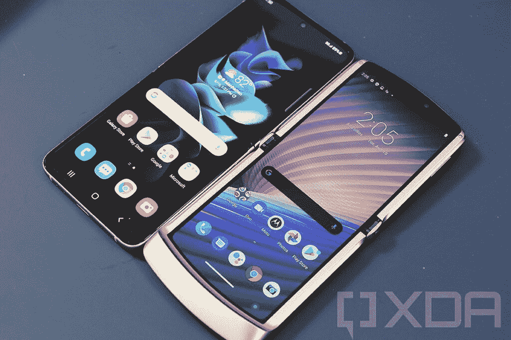
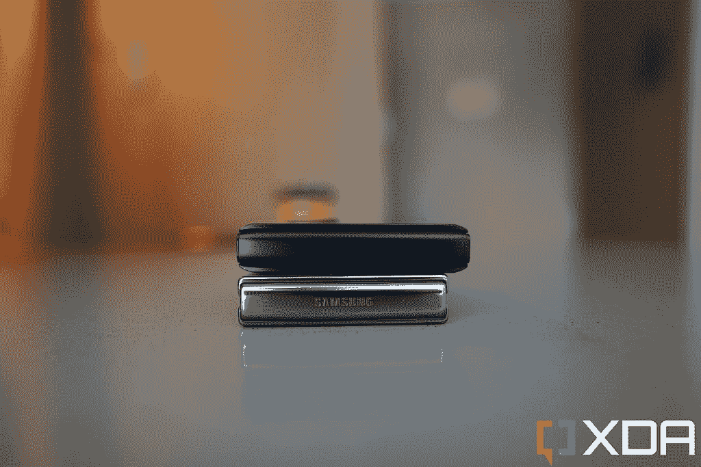
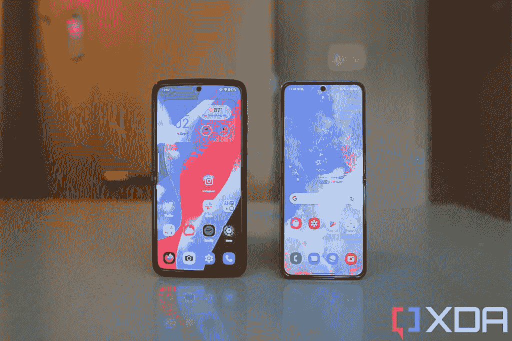
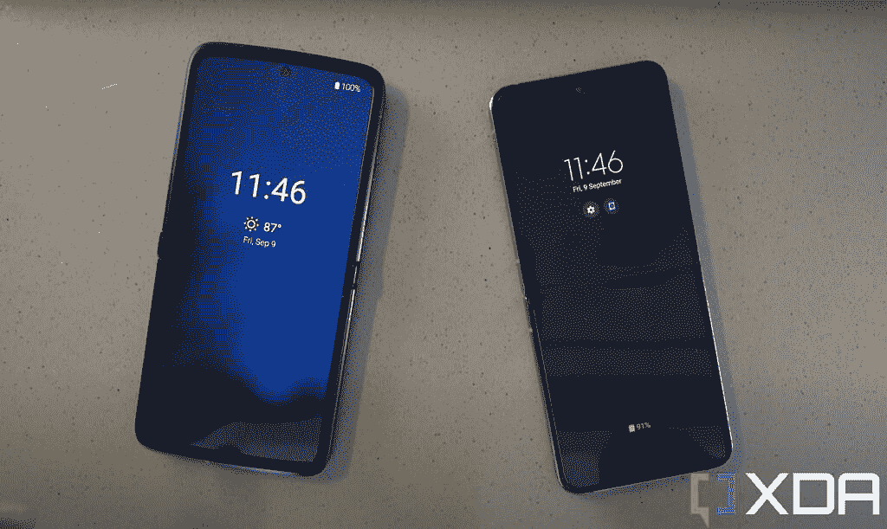

# 摩托罗拉·拉兹尔(2022)评论:时尚的硬件，但破碎的相机软件

> 原文：<https://www.xda-developers.com/motorola-razr-2022-review/>

可折叠智能手机场景现在正处于这样一个奇怪的位置。三星实际上垄断了全球可折叠领域，除了一个重要但有些孤立的国家:中国。在中国，除了三星的可折叠手机，还有六种可折叠手机，它们的硬件都更时尚、更美观。

最新上市的此类设备是第三代摩托罗拉 Razr。与 [Galaxy Z Flip 4](https://www.xda-developers.com/samsung-galaxy-z-flip-4-review/) 相比，Razr 可以完全折叠，具有无褶皱显示屏，并且具有更大的外盖屏幕，可以显示和做更多事情。在我看来，它只是看起来更好。

但有两个因素让新款 Razr 无法成为真正的竞争对手:首先，目前它只在中国销售，所以 Galaxy Z Flip 4 在其他地方仍然没有竞争对手。第二，摩托罗拉的软件，尤其是在相机方面，并不好。

2022 Razr 很有可能最终在美国上市，因为以前的 Razr 已经在国际上销售。但除非摩托罗拉届时能改进其软件，否则它不会成为三星可折叠手机的严重挑战者，这很遗憾。

 <picture></picture> 

Motorola Razr 2022

##### 摩托罗拉 RAZR 2022

这款手机目前只在中国销售，但如果它真的到达美国，它将立即给三星 Galaxy Z Flip 4 带来一些急需的竞争。

## Moto Razr 2022:规格

| 

规格

 | 

Moto Razr 2022

 |
| --- | --- |
| **尺寸&重量** | 

*   166.99 x 79.79 x 7.62mm 毫米
*   200 克

 |
| **显示** | 

*   封面:
    *   2.7 英寸 AMOLED
    *   800 x 573p 分辨率

*   主要:
    *   6.67 英寸 FHD+ POLED
    *   144 赫兹刷新率

 |
| **SoC** | 高通骁龙 8 加第 1 代 |
| **内存&存储** | 

*   8GB/12GB LPDDR5 RAM
*   128GB/256GB/512GB UFS 3.1 存储

 |
| **电池&充电** | 

*   3500 毫安时
*   33W 有线快速充电支持

 |
| **安全** | 侧装式指纹扫描仪 |
| **后置摄像头** | 

*   小学:50MP f/1.8，OIS
*   超宽:1300 万像素/2.2 英寸

 |
| **前置摄像头** | 32MP f/2.45 |
| **港口** | USB 类型-C |
| **连通性** | 

*   5G
*   4G LTE
*   蓝牙
*   无线保真

 |
| **软件** | 上面有我的 UX 的 Android 12 |

***关于这篇评论:**我购买了摩托罗拉 Razr (2022)供个人使用。这篇评论是在使用零售单元两个多星期后写的。*

* * *

## 摩托罗拉 Razr 2022:硬件和设计

 <picture></picture> 

Motorola Razr 2022

最初的两个 Razr 可折叠手机是对最初的“哑手机”时代 Razr 的明确纪念，其设计在展开时，保持了与其祖先相似的形状。然而，这意味着一个厚下巴挡板从设备的正面伸出，整体呈楔形，感觉比现代手机更宽。

 <picture></picture> 

The older, second-gen Razr (right) next to a Galaxy Z Flip 4.

这款新 Razr 摒弃了这种外形，采用了一种展开时看起来就像现代平板手机的设计。我们现在有了统一的挡板，而不是笨重的下巴。屏幕尺寸大幅增加，从之前的 6.2 英寸增加到现在的 6.7 英寸。但由于这是一款可折叠的翻盖手机，新款 Razr 仍然感觉非常便携和紧凑，尺寸仅为 91.6 毫米 x 72.6mm 毫米 x 16mm 毫米。

然而，这款设备明显比 Z Flip 4 宽，因为 Razr 的 21:9 纵横比不像 Flip 4 的 22:9 那样细长。

 <picture></picture> 

The Motorola Razr (top) and Galaxy Z Flip 4 (bottom).

更宽的宽度并没有困扰我，因为 Razr 在折叠状态下仍然可以放入我的衬衫口袋或小夹克口袋。200g，体重不麻烦。事实上，我更喜欢摩托罗拉的宽高比，因为我发现 Z Flip 4 的主屏幕对于像我这样的两个拇指打字者来说有点窄。

 <picture></picture> 

Motorola (left); Samsung (right).

### 显示

Razr 的 6.7 英寸可折叠塑料有机发光二极管显示屏的刷新率高达 144Hz，非常悦目。色彩鲜艳，动画超流畅，不像三星的 Flip 4，屏幕中间没有粗糙的折痕。摩托罗拉实际上是第一家通过设计一种铰链来解决折痕问题的公司，这种铰链有一个小空腔，折叠屏幕可以塞进去。小空腔为展示空间提供了更柔和的折叠，而不是粗糙的平折。

 <picture></picture> 

Razr (left), Flip 4 (right).

外部的辅助面板是传统的玻璃有机发光二极管，对角线尺寸为 2.7 英寸，分辨率为 573 x 800。它明显比 Flip 4 的翻盖屏幕高，可以显示更多信息。

与默认情况下只显示小工具的 Flip 4 不同，摩托罗拉让 Razr 的外部屏幕自由显示任何它想显示的内容——这意味着你可以在上面打开任何应用程序。然而，大多数应用程序在如此狭窄的风景屏幕上看起来很荒谬。但有些应用程序确实有效，比如 YouTube 和谷歌地图中的基本导航。

我想没有多少情况下人们会想要使用 YouTube 的外部屏幕——你也可以在更大的屏幕上打开并观看——但我认为能够在外部屏幕上访问谷歌地图甚至 Slack 是非常有用的。有时我只需要一点点信息，我不想打开设备。这实际上是我对三星 Flip 系列最大的不满——归根结底，它只是一部普通的手机，在你真正使用它之前需要一个额外的步骤。

### 铰链:可以保持原位，但不够坚固

Razr 2022 的铰链可以保持中间折叠，这开辟了免提使用的情况，但这里的铰链远不如 Flip 4 坚固。如果我像上面的照片一样将 Razr 放在桌子上，然后用一些力点击底部屏幕，上半部分就会晃动，就像一台经济型笔记本电脑。翻盖 4 没有这种运动，它的铰链非常稳定。

与 Flip 4 一样，Razr 的相机应用和 YouTube 应用将通过将主要内容推至上半部分来适应 Flex 模式，而下半部分则显示稍微不太重要的信息。

### 硅、内存、电池和其他芯片

骁龙 8 加 12GB 内存的第一代是这里的组合，两者都为这种类型的设备提供了足够的动力。使用高通最新的硅是一个好消息，因为这里的电池并不大，只有 3500 毫安时(尽管它仍然比上一代 Razr 的 2800 毫安时高了一大步)。触觉是糊状和柔软的，但有一个坚实的立体声扬声器。

### 相机:快门慢，处理不好

摩托罗拉 Razr 2022 的相机硬件比上一代有了很大的改进。主摄像头是一个 50MP，f/1.9 传感器，配有一个相对较大的 1/1.55 英寸图像传感器，比之前的小传感器 48MP 主摄像头有了很大的进步。此外，还增加了一个 1300 万像素的超宽摄像头，这在以前的 Razrs 中是一个明显的遗漏。包裹相机包装的是一个 32MP 的前置相机。当然，你也可以将屏幕用作取景器，这样你就可以用主相机系统自拍了。

这些相机硬件在纸面上看起来令人印象深刻，但不幸的是，摩托罗拉需要改善其相机软件。现在的处理可能会时好时坏，有时图像甚至会突然熄灭。还有一个非常糟糕的幻影快门错误，它会看到相机自己拍摄照片。如果我现在看 Razr 的照片库，每三张我自己拍的照片中，就有一两张不是我拍的，而且通常是指向地面，或者是一片模糊的混乱，因为当相机拍摄时我正在移动我的手臂。

当星星排成一行的时候——如果我完全静止不动，光线很好，相机的快门按钮没有松开，我就能拍出一些令人印象深刻的照片。但这是一个非常偶然的经历，错过的次数比成功的次数多，这让人有些沮丧。

* * *

## 摩托罗拉 Razr 2022:软件、性能和电池寿命

Razr 运行 Android 12，上面是摩托罗拉的 MyUI Android 皮肤，从美观和功能上来说，我很喜欢这个 UI。它看起来接近 Pixel 的 Android 版本，但它有更多的定制选项。也许太多了。事实上，我能想到的所有快捷手势，从双击唤醒/锁屏，多指滑动截图，双击按钮启动应用程序，都在这里。此外，还有这些古怪的摩托罗拉特有的手势，比如用手机做两次砍或扭的动作来触发一个动作。

目前，摩托罗拉 Razr 2022 被推荐给居住在中国以外的任何人，作为一个发烧友专用设备

动画非常流畅，几乎没有口吃，除了相机体验之外，智能手机的整体使用情况良好。前面提到的幻影摄影爱好者是持久的，另一个购买了一个的评论家证实他的单位也有同样的问题。

这款手机的电池寿命还可以。我是一个重度用户，经常在社交媒体上发短信，流媒体 Spotify，我拍摄了很多视频，我通常会通过应用程序 PowerDirector 当场剪辑这些视频，然后上传到 Instagram，Razr 对我来说无法持续一整天。我想说，对于像我这样的重度用户，这款手机一次充电可以使用 10-11 个小时。但是轻度使用者可以享受一整天。包装中包括一个 30W 的充电器，所以总的来说，我对电池的性能很满意。

* * *

## 你应该买摩托罗拉 Razr 2022 吗？

**您应该购买摩托罗拉 Razr 2022，如果:**

*   你喜欢翻盖式可折叠手机，但不管出于什么原因，你都不想使用三星手机
*   你真的喜欢摩托罗拉手机，不介意进口或糟糕的拍照体验

**你不应该购买摩托罗拉 Razr 2022，如果:**

*   你关心相机性能
*   你不想麻烦进口

摩托罗拉 Razr 2022 目前被推荐给居住在中国以外的任何人，作为一款仅供发烧友使用的设备，因为它需要进口，这从大约 900 美元的价格开始上涨，并失去了保修。由于摩托罗拉之前已经在国际上发布了之前的可折叠手机，第三代 Razr 有机会在全球发布，但摩托罗拉必须先搞清楚相机的情况，才能成为高度抛光的三星 Galaxy Z Flip 4 的合适可行的替代品。

 <picture></picture> 

Motorola Razr 2022

##### 摩托罗拉 RAZR 2022

这款手机目前只在中国销售，但如果它真的到达美国，它将立即给三星 Galaxy Z Flip 4 带来一些急需的竞争。