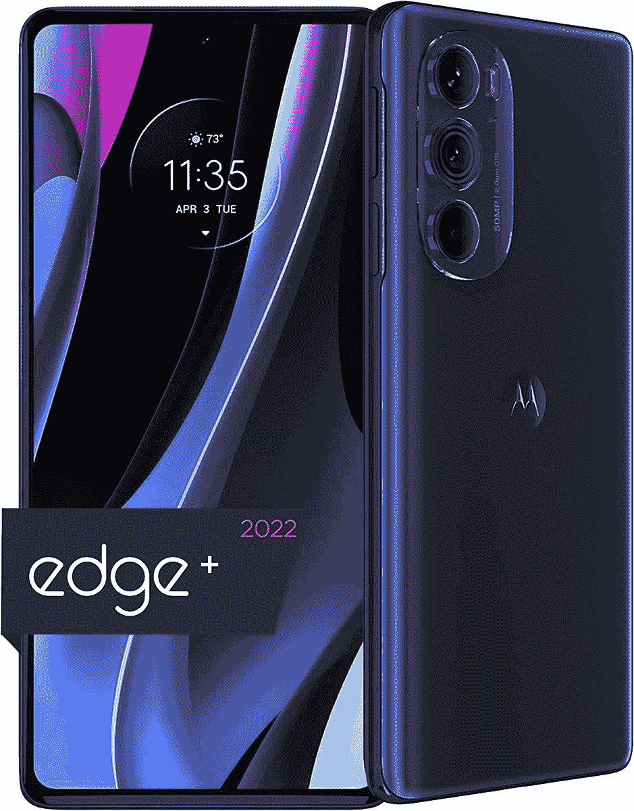
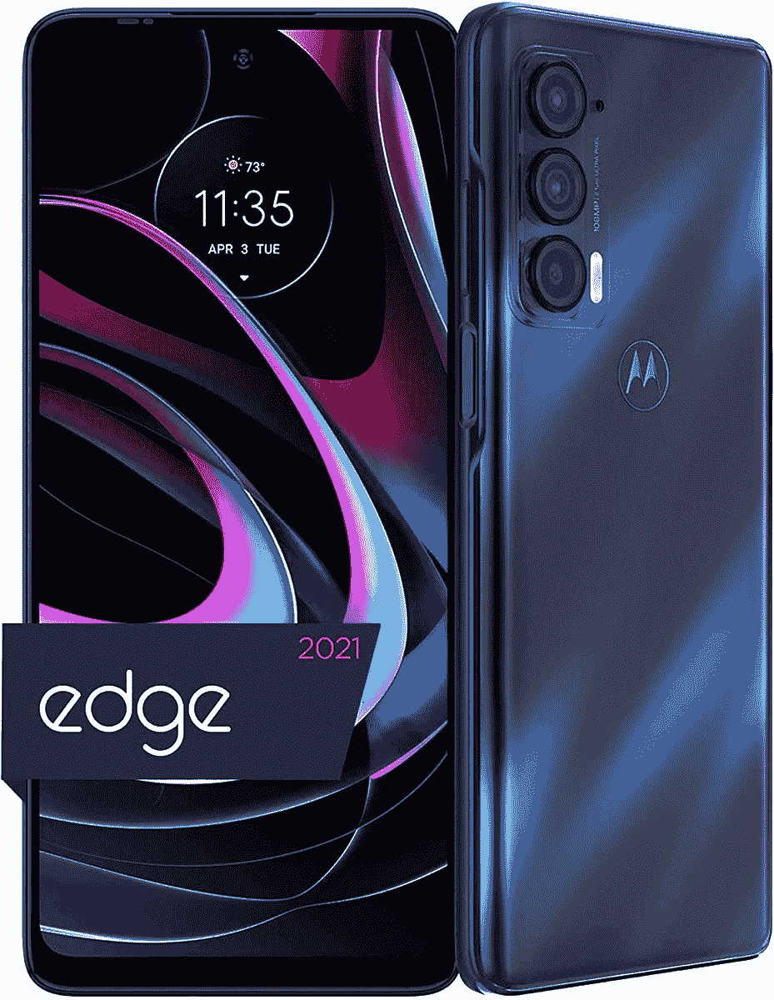
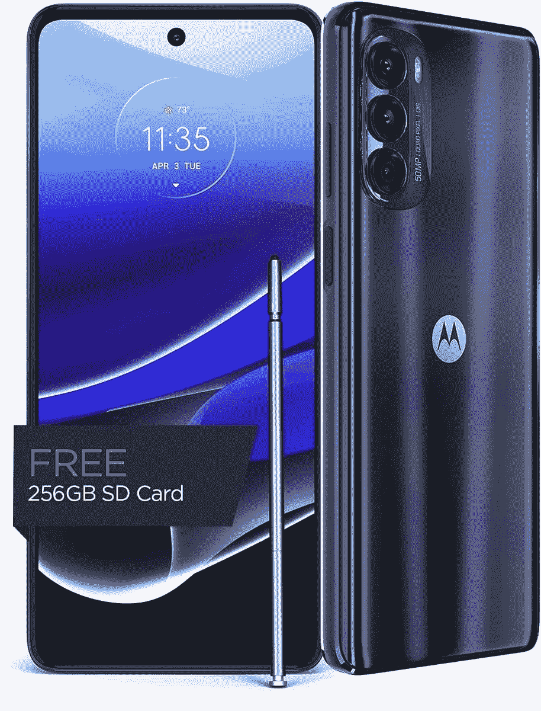
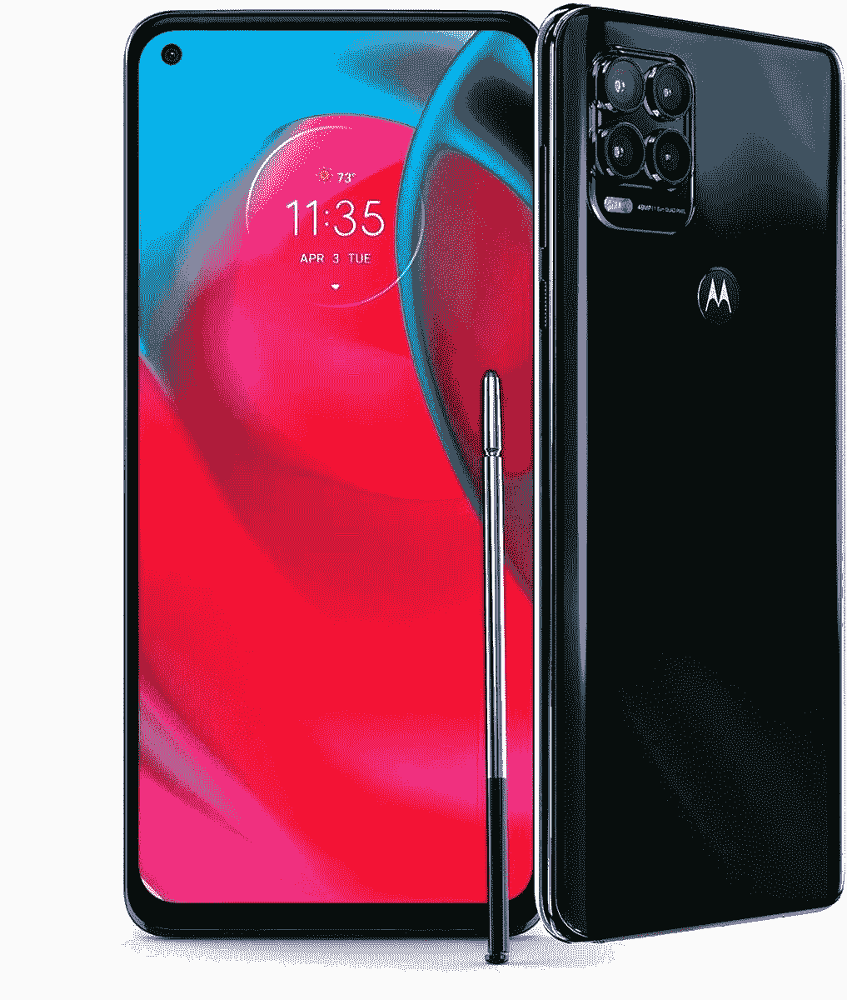
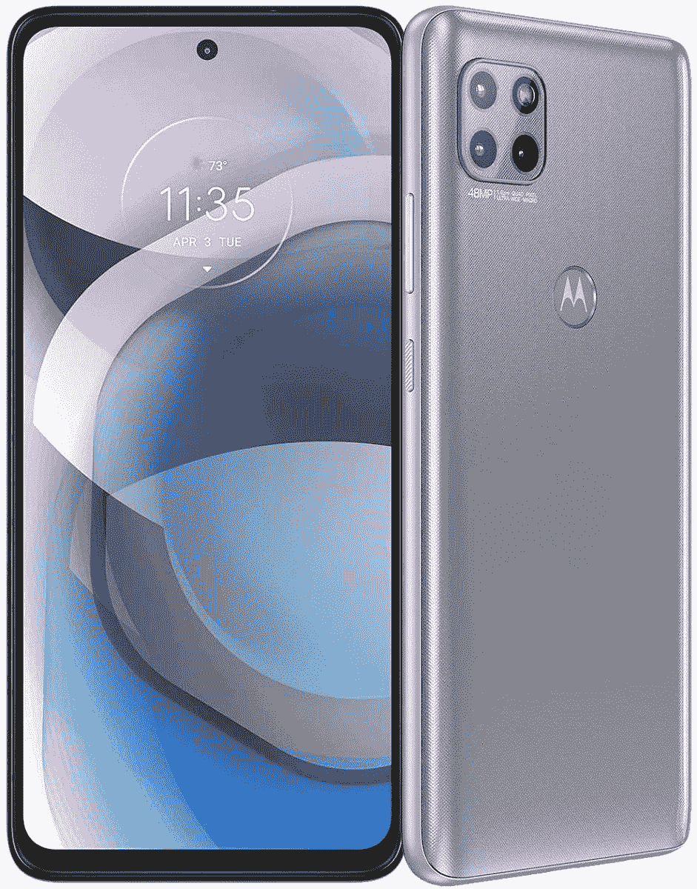
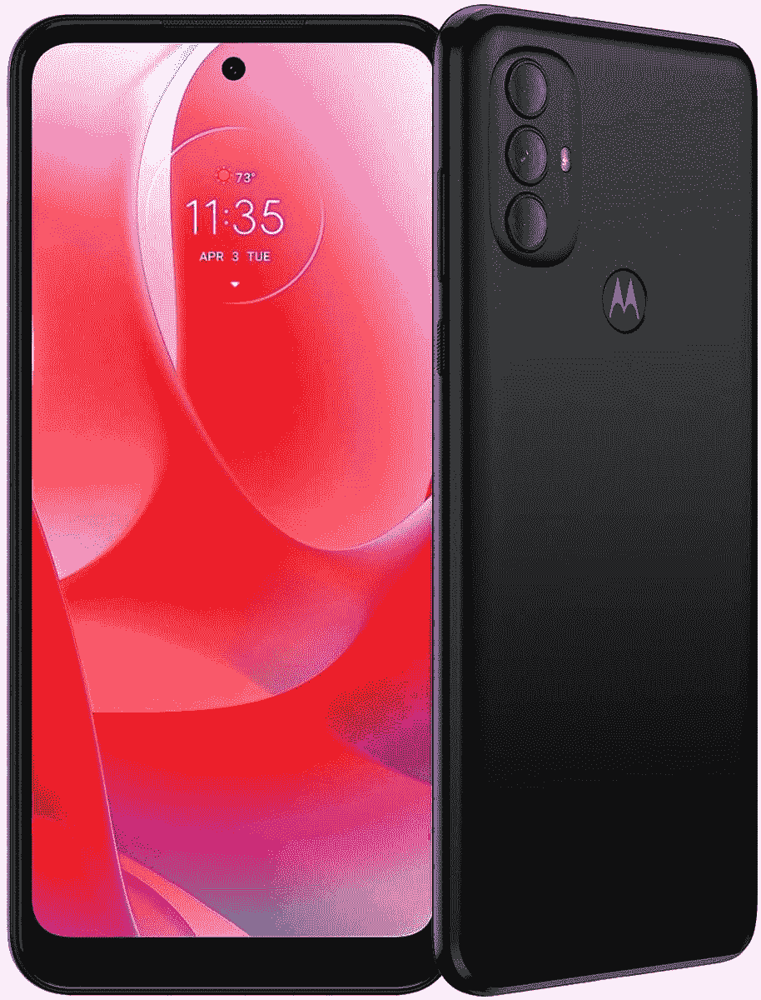
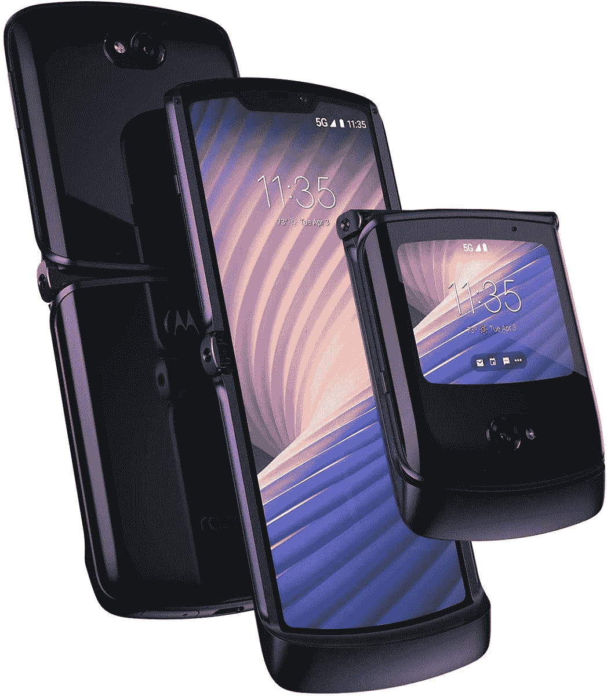

# 摩托罗拉在黄金日提供高达 300 美元的手机优惠

> 原文：<https://www.xda-developers.com/motorola-smartphones-prime-day-deals/>

[亚马逊优惠日](https://www.xda-developers.com/amazon-prime-day/)正在全面展开，你可以找到很多优惠。如果你正在寻找一款新的智能手机，一些值得注意的选择包括[谷歌 Pixel 6](https://www.amazon.com/Google-Pixel-Unlocked-Smartphone-Ultrawide/dp/B09HJZPFDD/?tag=xda-7tv5bfu-20&ascsubtag=UUxdaUeUpU42462&asc_refurl=https%3A%2F%2Fwww.xda-developers.com%2Fmotorola-smartphones-prime-day-deals%2F&asc_campaign=Affiliate) 和一些一加设备。但是如果你想要更多的选择，摩托罗拉有更多的选择。对美国人来说，由于其庞大的投资组合，摩托罗拉在入门级和中档市场占据了相当大的份额。在这个黄金日，您可以从它的阵容中获得高达 300 美元的优惠。

## 旗舰:摩托罗拉边缘 2022 和摩托罗拉边缘 2021 最高优惠 300 美元

[摩托罗拉 Edge Plus 2022](https://www.xda-developers.com/motorola-edge-plus-2022-review/) 和摩托罗拉 Edge 2021 是该公司旗舰产品系列的一部分，在这里你会看到最多的折扣。对于 Edge Plus 2022，我们认为它是一款不错的手机，因为它 1000 美元的价格标签上有骁龙 8 代 1 芯片。对于 Prime Day，我们将该设备降至 720 美元，将其标记为 280 美元的折扣，并提高了这款手机的内在价值。对于摩托罗拉 Edge 2021，尽管它“仅仅”有一个骁龙 778G SoC，但它仍然是一个不错的设备，特别是当你考虑到它现在只需 400 美元，低于发布时的 700 美元建议零售价，标志着它是 300 美元的折扣(尽管你可以在以前的销售中以接近 500 美元的价格购买这款手机)。

 <picture></picture> 

Motorola Edge Plus

##### 摩托罗拉 Edge Plus (2022)

摩托罗拉 Edge Plus 2022 是该公司的顶级旗舰产品，你只需 720 美元就可以拥有它，这标志着它是采用骁龙 8 代 1 芯片的更好的手机之一。

 <picture></picture> 

Motorola Edge 2021

##### 摩托罗拉边缘(2021)

摩托罗拉 Edge 2021 代表着超值产品，骁龙 778G 在这个黄金日仅售 400 美元

## 手写笔设备:最高降价 170 美元

摩托罗拉认为自己是少数几家生产内置手写笔手机的原始设备制造商之一。虽然这些手机都不是 Galaxy S22 Ultra 的竞争对手，但附带的手写笔确实对用户体验有影响。在售手机包括 Moto G Stylus 2022、Moto G Stylus 5G 2022 和 Moto G Stylus 5G 2021。

 <picture></picture> 

Moto G Stylus 2022

##### 摩托罗拉 Moto G 手写笔(2022)

Moto G Stylus 2022 是一款不错的预算智能手机，采用联发科 Helio G88 SoC。通常售价 300 美元，在这次黄金日大减价中，你可以花 200 美元买到它。

 <picture></picture> 

Moto G Stylus 5G 2022

##### 摩托罗拉 Moto G 手写笔 5G (2022)

摩托罗拉 Moto G Stylus 5G 2022 配有骁龙 695 SoC。通常零售价为 500 美元，现在 330 美元就可以买到，这表明它是 170 美元的折扣。

 <picture></picture> 

Moto G Stylus 5G (2022)

##### 摩托罗拉 Moto G 手写笔 5G (2021)

Moto G Stylus 5G 2021 是另一款经济型智能手机，采用骁龙 480 SoC。之前售价 400 美元，现在售价 240 美元，打了 160 美元的折扣。

## 其他设备:高达 160 美元的折扣

摩托罗拉的产品线中还有许多其他手机。如果你对手写笔不是特别感兴趣，还有其他 5G 手机，如摩托罗拉 One 5G Ace 和 Moto G 5G。如果你也不关心 5G，有 Moto G Power 2022，它有望成为一个电池发电站，并继续下去。

 <picture></picture> 

Motorola One 5G Ace

##### 摩托罗拉一个 5G 王牌

凭借骁龙 750G，摩托罗拉 One 5G Ace 成为中端市场的不错选择。原来 400 美元，你现在可以在这个黄金日大减价中以 240 美元买到它。

 <picture></picture> 

Moto G 5G 2022

##### 摩托罗拉摩托 G 5G (2022)

Moto G 5G 2022 由 Dimensity 700 提供动力，在中端提供平衡的体验。这款设备上市时售价 400 美元，但现在售价 280 美元。

 <picture></picture> 

Moto G Power 2022

##### 摩托罗拉摩托 G 动力(2022)

Moto G Power 由联发科 Helio G37 提供动力，适合那些愿意放弃 5G 以获得更长电池寿命的人。这款设备最初售价 200 美元，现在在黄金日促销中售价 150 美元。

## 可折叠:Moto Razr 5G 2020

Moto Razr 5G 2020 降至 800 美元。无论您是否应该购买这款可折叠产品，我们都将决定权留给您，以及您对 Razr 外形的怀旧程度。

 <picture></picture> 

Moto Razr 5G 2020

##### 摩托罗拉摩托 Razr 5G

Moto Razr 5G 是一款来自 2020 年的手机，它也唤起了人们对这之前的怀旧之情。起价 1400 美元，现在你可以花 800 美元买到它。

你打算买一台摩托罗拉设备吗？请在下面的评论中告诉我们是哪一个！