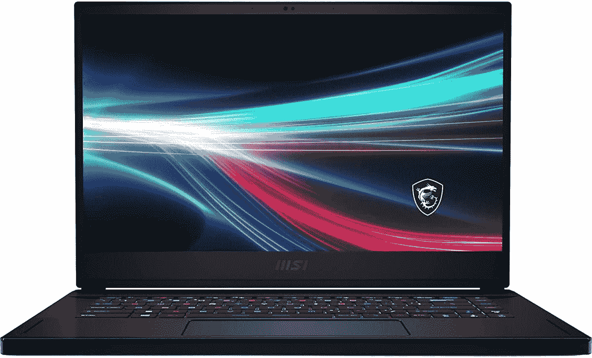

# MSI Creator 15 回顾:游戏笔记本电脑变成了 creator PC

> 原文：<https://www.xda-developers.com/msi-creator-15-review/>

MSI Creator 15 真正引人注目的是它漂亮的有机发光二极管显示屏。事实上，当你使用它时，你会爱上它，尤其是如果你以前从未在笔记本电脑上使用过[有机发光二极管显示屏。这太不可思议了，如果你正在编辑照片或视频，这种颜色会有所不同。](https://www.xda-developers.com/best-oled-laptops/)

感觉有点奇怪的最大事情是，它感觉像一台重新设计的游戏笔记本电脑。它拥有游戏设备中常见的厚而方的设计，并且有一个响亮的风扇。当我把它放在其他专注于创作者的设备旁边，如[戴尔的 XPS 15](https://www.xda-developers.com/dell-xps-15-9510-review/) 或惠普的 Spectre x360 16，MSI Creator 15 绝对是与众不同的。

除了有机发光二极管显示器，我绝对喜欢这台机器的另一点是电池寿命。它有一个 99.9 瓦时的电池，这是字面上最大的。说到其他的 [creator 笔记本电脑](https://www.xda-developers.com/best-creator-laptops/)，我很有信心这款能获得最好的电池续航时间，所以当我谈到那个四四方方的设计时，它可能是值得的。

 <picture></picture> 

MSI Creator 15

##### MSI 创建者 15

微星的创作者笔记本电脑包括照片和视频编辑所需的功能，它有一个美丽的屏幕。

**浏览此评论:**

## MSI Creator 15 定价和可用性

*   微星 Creator 15 起价 1849 美元，但经常打折。
*   有一款更高端的型号，配有 GeForce RTX 3080 和 1TB 存储空间。

微星 Creator 15 已经在 2021 年上市了，所以你想要一台并不太难。微星发给我的型号包括酷睿 i7-11800H、16GB DDR4-3200 内存、512GB 固态硬盘和 NVIDIA GeForce RTX 3060 显卡。建议零售价为 1，849 美元，但似乎经常打折。

那个模型实际上是基础模型，令人印象深刻。最高可配 RTX 3080 显卡和 1TB 固态硬盘。这款高端机型售价 2349 美元，需要什么样的显卡和存储由你决定。就我个人而言，我认为 RTX 3060 对于一台创作型笔记本电脑来说非常坚固。

这台笔记本电脑不太好配置，只有三个选项。幸运的是，有机发光二极管显示器是标准配置。

## MSI 创建者 15:规格

| 

中央处理器

 | 英特尔酷睿 i7-11800H |
| 

制图法

 | NVIDIA GeForce RTX 3060 笔记本电脑 GPU 6GB GDDR6Up 高达 1517MHz 的提升时钟，95W 的最大图形功率和动态提升。 |
| 

显示

 | 15.6 英寸 UHD (3840x2160)，60 赫兹，有机发光二极管 |
| 

身体

 | 358.3 x 248 x 18.3-19.8 毫米，2.1 千克 |
| 

记忆

 | 16GB DDR4-32002 插槽最大 64GB |
| 

储存；储备

 | 512GB M.2 NVMe 固态硬盘 |
| 

电池

 | 4 芯 99.9 英寸电池(瓦时) |
| 

港口

 | 1 个 rj 451 x(8K @ 60Hz/4K @ 120hz)HDMI 3 x Type-A USB 3.2 gen 21 x Type-C(USB 3.2 gen 2/DP)1 个 Type-C (USB / DP / Thunderbolt 4)，带 PD 充电 |
| 

声音的

 | 2x 2W 扬声器 |
| 

连通性

 | 黑仔 Gb 局域网(最高 2.5G)黑仔 ax Wi-Fi 6E +蓝牙 v5.2 |
| 

网络摄像头

 | 红外高清类型(30fps@720p) |
| 

颜色

 | 核心黑 |
| 

操作系统（Operating System）

 | Windows 11 主页 |
| 

价格

 | $1,849 |

## 设计:它的外观和感觉都很像游戏电脑

*   从本质上来说，黑色机箱采用了四四方方的设计，感觉就像是游戏笔记本电脑被改造成了创作型笔记本电脑。

MSI Creator 15 看起来很像该公司的一款游戏笔记本电脑，并更换了一系列功能，使其对创作者更具吸引力。例如，前面没有 RGB 灯条，有一个 4K 有机发光二极管屏幕而不是高刷新率的 FHD 屏幕，它有一个用于 Windows Hello 的红外摄像头，设计更加微妙。它有一种叫核心黑的颜色，你可能知道它的街名:黑色。

显然，它的盖子上印有 MDI 标志，这也很微妙，因为它只是一种更暗的黑色，而不是更艳丽的铬色。

但正如你从侧面看到的，它有那种方方正正的外观。不一定是坏事。这只是我期望在游戏设备中更经常看到的设计。它确实有很多端口，都在左右两边。这与微星的游戏笔记本电脑不同，微星的游戏笔记本电脑后部有端口。

这就是港口的酷之处。所有三个 USB Type-A 端口都是 USB 3.2 Gen 2，这意味着它们可以获得 10Gbps 的数据传输速度。你会发现右边有两个，还有一个 USB 3.2 Gen 2 Type-C 端口，一个耳机插孔和一个以太网端口。那个 USB Type-C 端口也支持 DisplayPort，所以你可以用它来连接另一台显示器。

在左侧，有一个 HDMI 端口，可以用来输出到 8K 60Hz 或 4K 120Hz 显示器，一个 USB 3.2 Gen 2 Type-A 端口和一个 Thunderbolt 4 端口。显然，这一边的 USB Type-C 端口比另一边的 USB 端口更加通用，支持 40Gbps 的数据传输速度，双 4K 显示器，甚至感谢 Thunderbolt 的外部 GPU。和往常一样，我不喜欢用户必须知道两个看起来一样的端口之间的区别，但至少它们是有标签的。

## 显示:微星带来了与造物主 15 甜蜜，甜蜜的有机发光二极管

*   4K·有机发光二极管的银幕意味着这种体验是令人愉快的。
*   可惜网络摄像头是 720p。

微星 Creator 15 配备了 15.6 英寸 3，840x2，160 有机发光二极管显示屏，非常棒。说真的，它让笔记本电脑成为一种绝对的乐趣。当你使用有机发光二极管显示器时，你的电脑就从一个实用工具变成了更个人化的东西。

4K 有机发光二极管显示器使微星创造者 15 愉快地使用。

如果你不熟悉有机发光二极管显示器，如果你使用高端设备，你的手机可能有一个。由于部分屏幕实际上是关闭的，所以黑色是真正的黑色，以至于在黑暗的房间里你看不到屏幕的尽头和边框的起点。在其上而不是背光上渲染的颜色更加鲜艳。

凭借更宽的色域、更高的对比度等，有机发光二极管显示器非常适合照片和视频编辑等创造性工作。微星也有一个名为真彩色的应用程序，可以让你调整 Adobe RGB、sRGB 等。

在我的测试中，我得到了 100%的 sRGB、90%的 NTSC、96%的 Adobe RGB 和 89%的 P3。那些真的很好，而且你不会从*几乎*任何非有机发光二极管笔记本电脑上得到那些分数。

亮度最大值为 411.9，对比度最大值为 28，020:1，尽管这个对比度实际上是我的 SpyderX Pro 能够读取的最大对比度。

需要说明的是，这些展示测试没有一个是令人惊讶的。这就是你得到的优质有机发光二极管显示器。对比度基本上是无限的，这对用户体验有很大的影响。

说到消费，双 2W 扬声器位于键盘上方的条形音箱中。它们不会发出难以置信的声音，但对于听音乐或流媒体来说仍然很好。虽然质量很好。显然，如果你也在家工作的话，你也可以很好地处理电话。

不过有一个问题，那就是它有一个 720p 的网络摄像头。网络摄像头的质量实际上似乎相当不错，但随着英特尔的新 Evo 规格，你将在市场上看到许多带有 FHD 网络摄像头的新笔记本电脑。如果你有很多视频通话，这是需要注意的。

说到通话，这里还有一个叫 MSI Center Pro 的应用。它有许多生产力功能，如电池优化，但它也有噪音消除，这无疑有助于在家工作的场景。

## 键盘和触摸板:键盘是 RGB，触摸板有点小

*   RGB 键盘也感觉更像是面向游戏的东西。

键盘最有意思的是背光是 RGB。这是通常为游戏笔记本电脑保留的功能，所以颜色更加微妙，比如柔和的颜色。我唯一一次看到这样的东西是在 Razer 的 Razer Book 13 上。我不介意；这只是一个有趣的选择，当一家游戏笔记本电脑公司针对另一个市场做出一些东西时，似乎就会发生这种情况。

至于使用键盘本身，我觉得按键需要的力量有点太大了。这种键盘感觉很适合玩游戏，但对于打字来说，还需要一点时间来适应。我花了很多时间在 MSI Creator 15 上，我写文章时犯的错误肯定比平时多。就像我说的，你只需要习惯一点。

我就是要说，精密触摸板应该高一点。又好看又宽，太棒了。现在，它只需要更高。甲板上有一些房地产本来可以使用，但整个事情本来可以做得不同；事实上，如果我看到未来几代人的做法有所不同，我不会感到惊讶。许多原始设备制造商正在转向 16:10 屏幕，这使得它们更高，为更高的触摸板增加了更多空间。

问题是，触摸板甚至不是特别小。只是随着它走得这么宽，Y 维感觉很小。如果你看看像戴尔 XPS 15 或 [MacBook Pro](https://www.xda-developers.com/macbook-pro-2021/) 这样与这款笔记本电脑直接竞争的产品，你就可以看到公司正在用更大的触摸板做什么。没什么大不了的。这只是我想从这样的笔记本电脑上看到的东西。

## 性能:凭借酷睿 i7-11800H 处理器和 RTX 3060 显卡，它可以轻松完成工作

*   酷睿 i7-11800H、RTX 3060 和 16GB 内存非常适合照片和视频编辑，但如果你想要额外的提升，也可以选择 RTX 3080。
*   99.9 瓦时的电池实际上是最大的，因此对于这样一款强大的笔记本电脑来说，电池续航时间非常长。

我之前提到过 MSI 发给我的型号是基本型号，包装了一个 Core i7-11800H，RTX 3060 显卡，16GB RAM，和一个 512GB SSD，但说实话，我不认为大多数人需要更多。这个东西可以飞，大多数时候，我用它连接双 4K 显示器。

如果你确实需要更大的存储空间，高端型号会更好，但它也配有 RTX 3080，所以你会获得更强的图形处理能力。如果您正在寻找一款可以兼作游戏机的 creator 笔记本电脑，这正是您想要的。

基本型号应该提供你需要的所有性能，但是如果你想要的话，你可以买一台 RTX 3080。

但就我使用它的目的而言，性能非常好。这包括在 Adobe Lightroom Classic 中批量导出，在 Photoshop 中编辑图像，当然还有我写文章的一般工作流程，打开十几个 Chromium 标签页(特别是 Vivaldi)，同时使用 Slack、Skype 和 OneNote 等其他应用程序。我也玩了一点游戏，玩了一些 *Forza Horizon 5* 。它没有去超或极端的设置，这很好，但游戏玩得很好，它在有机发光二极管显示器上看起来很漂亮。

对于基准测试，我使用了 PCMark 10、3DMark、Geekbench、Cinebench 和 VRMark。

|  | 

微星 Creator 核 i7-11800H，RTX 3060

 | 

宏碁 Swift XRyzen 7 5800U，RTX 3050 Ti

 | 

戴尔 XPS 15 9510 酷睿 i7-11800H，RTX 3050 Ti

 |
| --- | --- | --- | --- |
| 

PCMark 10

 | 5,965 | 6,019 | 5,988 |
| 

3DMark:时间间谍

 | 6,880 | 4,046 | 4,801 |
| 

极客工作台 5

 | 1,417 / 6,217 | 1,447 / 8,104 | 1,538 / 7,514 |
| 

Cinebench R23

 | 1,370 / 8,382 | 1,434 / 10,568 | 1,491 / 9,399 |
| 

橙色房间

 | 9,772 |  |  |
| 

VRMark:青色房间

 | 2,752 |  |  |
| 

蓝色房间

 | 2,101 |  |  |

微星 Creator 15 也有一个 99.9 瓦时的大旧电池，这是它最大的电池。任何比这更大的东西都不符合某些监管限制，比如飞机上允许携带的物品。在我的测试中，它使用了四到五个小时，这对像这样的机器来说是非常好的。这大约是我在超极本或变形本中得到的平均水平，但这个东西有 45W 的 CPU 和 RTX 显卡。在真实世界使用下五小时的电池寿命是致命的。

MSI Creator 15 拥有笔记本电脑中最大的电池。

这次我没有使用任何特定的设置。它不像一台生产机器，我可以设置电源滑块一直保持平衡。有很多照片编辑在进行，有时，它还为 INNOCN 发送的 [15.6 英寸 FHD 有机发光二极管显示器供电。我没有试图保存电量，或者通过循环播放本地视频或类似的方式进行测试。这是真实世界的直接使用，结果非常好。](https://www.amazon.com/dp/B09L12DGW5?tag=xda-7vcskbk-20&ascsubtag=UUxdaUeUpU6&asc_refurl=https%3A%2F%2Fwww.xda-developers.com%2Fmsi-creator-15-review%2F&asc_campaign=Short-Term)

## 谁应该购买微星创造者 15？

MSI Creator 15 有很多非常好的地方，也有一些不太好的地方，所以很明显，它并不适合所有人。

**谁应该购买微星创造者 15:**

*   想要一台笔记本电脑进行照片和视频编辑，但也想玩一些游戏的人
*   想要享受有机发光二极管展示的顾客
*   无法一直与权力保持联系的创造者

**谁不该买微星创造者 15:**

*   进行大量视频通话并受益于 FHD 网络摄像头的用户
*   寻求主要用于提高工作效率的笔记本电脑的人

除了绝对令人惊叹的有机发光二极管展示之外，这里最让我印象深刻的是那种四四方方的设计。微星的笔记本电脑传统上是为游戏设计的，感觉就像该公司采用了游戏笔记本电脑的设计，将一系列以玩家为中心的功能换成了以创作者为中心的功能。这不一定是一件坏事；事实上，这可能是完全相反的，但它应该给你一个想法，如果这是你的笔记本电脑。