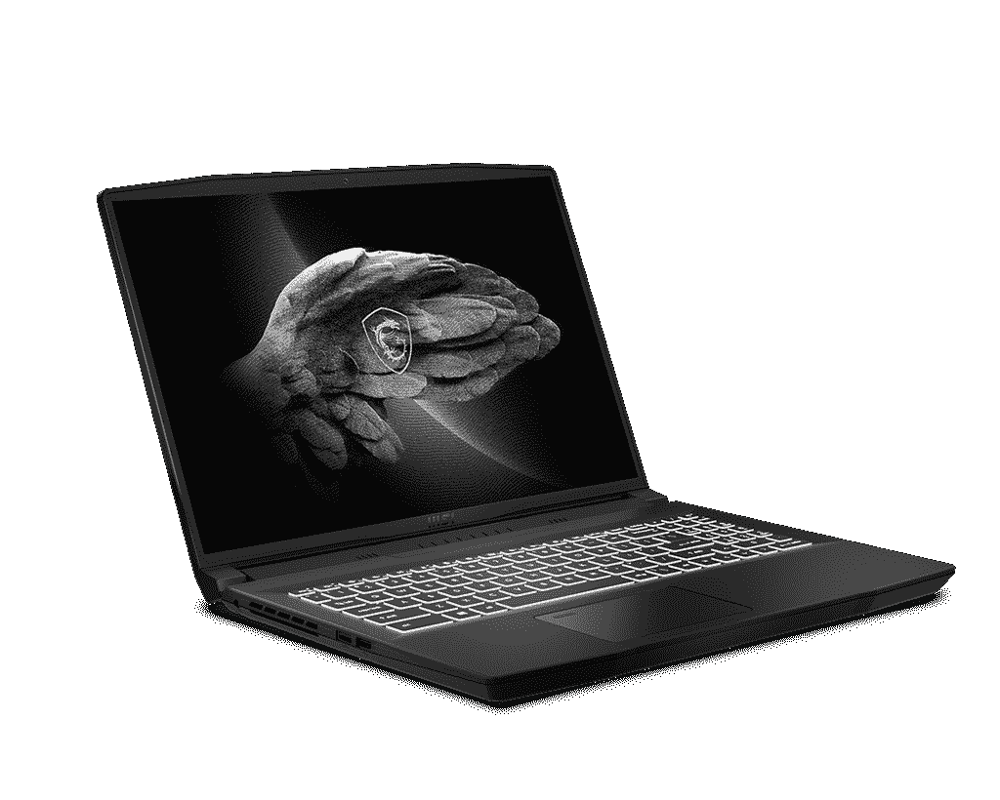
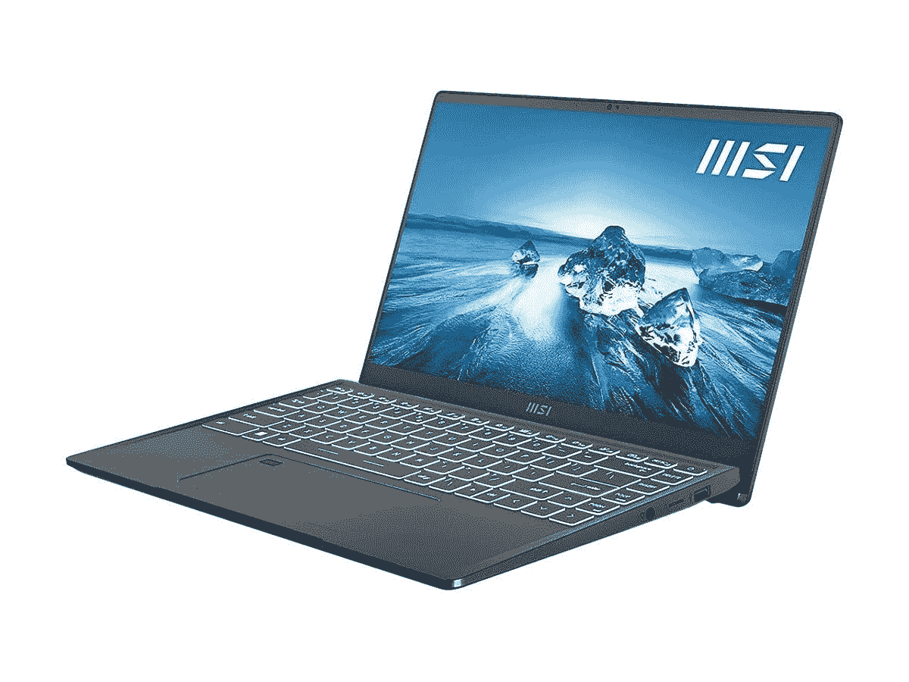

# 微星交易用 GeForce RTX 3060 比 Creator M16 低 240 美元

> 原文：<https://www.xda-developers.com/msi-deals-240-off-creator-m16-geforce-rtx-3060/>

微星目前正在经营一些笔记本电脑和台式电脑的交易，如果你一直在寻找一台新的个人电脑，现在可能是一个购买的好时机。这些交易涵盖了一些领域，但几个亮点包括 MSI Creator M16 和 MSI Presting 14 Evo，这两款笔记本电脑非常适合提高工作效率。

首先，MSI Creator M16 是一款面向创意专业人士的[笔记本电脑](https://www.xda-developers.com/best-creator-laptops/)，这种配置配备了 14 核 20 线程的英特尔酷睿 i7-12700H 处理器，搭配 Nvidia GeFOrce RTX 3060 笔记本电脑 GPU，可使用高达 105W 的功率，为创意工作和游戏提供非常强大的性能，如果你喜欢的话。这一切都驱动着一个 16 英寸的大显示屏，具有 16:10 的纵横比和 Quad HD+ (2560 x 1600)分辨率，以及 165Hz 的刷新率。这是一个奇妙的规格组合，虽然 1，499 美元的建议零售价还不错，但你现在只需 1，259 美元就可以买到它——优惠了 240 美元。这次促销甚至还包括一个无线鼠标。

 <picture></picture> 

MSI Creator M16 ($240 off)

##### 微星创造者 M16(优惠 240 美元)

MSI Creator M16 是一款面向创意专业人士的功能强大的笔记本电脑，具有出色的显示屏。打了 240 美元的折扣，这是一笔非常划算的交易。

另一个很好的选择是 MSI Prestige 14 Evo，这是一款更高端的商务笔记本电脑。这种配置相当基本，但它确实配备了 12 核 16 线程的英特尔酷睿 i5-1240P 处理器，外加 8GB 内存和 512GB 固态硬盘，足以满足大多数人的需求。它还有一个 14 英寸的全高清显示屏。建议零售价为 929 美元，这有点贵，但如果打 230 美元的折扣，你只需 699 美元就可以买到，对于你在这里买到的东西来说，这是一个非常好的价格。

 <picture></picture> 

MSI Prestige 14 Evo ($230 off)

##### 微星 Prestige 14 Evo(优惠 230 美元)

MSI Prestige 14 Evo 是一款出色的商务笔记本电脑，可以很好地处理工作任务。仅需 699 美元，非常划算，再加上包含一年的微软 365 个人版。

如果这些交易不是你想要的，现在还有一些打折的 MSI 产品，可能会更合你的意。如果你觉得有趣，我们会把它们列在下面

**笔记本电脑:**

*   [微星十字准线 15(英特尔酷睿 i7-12700H，GeForce RTX 3060，16GB 内存，512GB 固态硬盘)——新蛋](https://redirect.viglink.com/?key=f246be432ee335db8d1b13f098db73cc&cuid=UUxdaUeUpU43983&u=https%3A%2F%2Fwww.newegg.com%2Fp%2FN82E16834156220)1499 美元(优惠 100 美元)
*   [MSI Pulse GL66(英特尔酷睿 i9-12900H，GeForce RTX 3060，32GB 内存，1TB 固态硬盘)——新蛋 1699 美元](https://redirect.viglink.com/?key=f246be432ee335db8d1b13f098db73cc&cuid=UUxdaUeUpU43983&u=https%3A%2F%2Fwww.newegg.com%2Fblack-msi-gl-series-pulse-gl66-12uek-688-gaming%2Fp%2FN82E16834156280)(优惠 100 美元)
*   [微星创造者 M16(英特尔酷睿 i7-11800H，GeForce RTX 3050，16GB 内存，512GB 固态硬盘)——亚马逊](https://www.amazon.com/MSI-Creator-M16-Professional-Laptop/dp/B098X4777X?tag=xda-33432fo-20&ascsubtag=UUxdaUeUpU43983&asc_refurl=https%3A%2F%2Fwww.xda-developers.com%2Fmsi-deals-240-off-creator-m16-geforce-rtx-3060%2F&asc_campaign=Affiliate)1099 美元(优惠 400 美元)

**台式机:**

*   MSI Aegis RS(英特尔酷睿 i7-12700KF，GeForce RTX 3060 Ti，16GB 内存，1TB 固态硬盘)-亚马逊 1699 美元(优惠 90 美元)
*   [微星宙斯盾 RS(英特尔酷睿 i7-12700K，GeForce RTX 3080 Ti，16GB 内存，1TB 固态硬盘)——新蛋 3049 美元](https://redirect.viglink.com/?key=f246be432ee335db8d1b13f098db73cc&cuid=UUxdaUeUpU43983&u=https%3A%2F%2Fwww.newegg.com%2Fmsi-aegis-rs-12tf-254us%2Fp%2FN82E16883152937)(优惠 250 美元)
*   [微星宙斯盾 ZS (AMD 锐龙 5 5600G，AMD 镭龙 RX 6600，16GB 内存，500GB 固态硬盘)——新蛋 1079 美元](https://redirect.viglink.com/?key=f246be432ee335db8d1b13f098db73cc&cuid=UUxdaUeUpU43983&u=https%3A%2F%2Fwww.newegg.com%2Fmsi-aegis-zs-5dq-280us%2Fp%2FN82E16883151042)(优惠 120 美元)

**监视器:**

如果你正在寻找其他品牌的好东西，[宏碁也在它的一些笔记本电脑上进行交易](https://www.xda-developers.com/acer-aspire-7-with-rtx-3050-sale/)，你可能想看看。