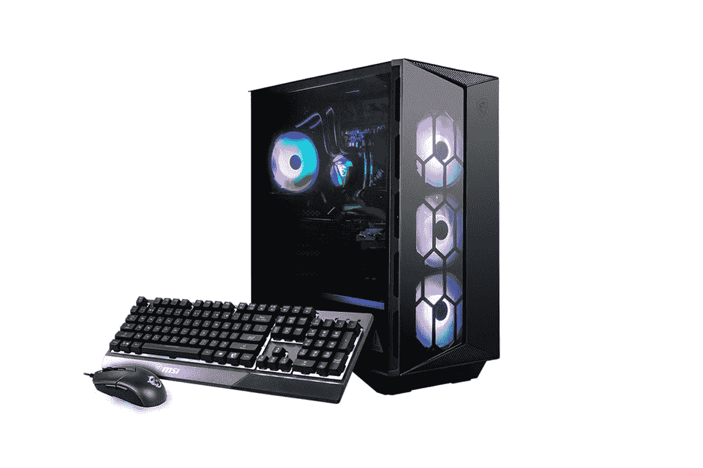

# MSI Prime Day 优惠活动为您的最新游戏电脑节省 200 多美元

> 原文：<https://www.xda-developers.com/msi-prime-day-deals-save-200-latest-gaming-pcs/>

亚马逊优惠日(Amazon Prime Day)仍在如火如荼地进行着，微星正在其一些游戏和面向创作者的个人电脑上进行一些交易。像大多数公司一样，这些交易中有许多是关于最新一代产品的——很明显，这些产品仍然很棒——但如果你想了解最新的东西，也有一些关于该公司最新笔记本电脑的交易。

例如，微星 Pulse GL66 游戏笔记本电脑的价格比平时低了 154.85 美元，仅售 1，325.99 美元。以这个价格，你可以买到 14 核 20 线程的英特尔酷睿 i7-12700H 处理器，以及 Nvidia GeForce RTX 3070 显卡。这种组合已经可以带来出色的游戏体验，并且足以驱动这台笔记本电脑的全高清 144Hz 显示屏。它还配备了 16GB 的内存和 512GB 的固态硬盘，因此它是一款坚固的笔记本电脑。

如果你想更专注于内容创作，那么 MSI Creator M16 可能更适合你。这款笔记本电脑采用英特尔酷睿 i7-12650H 处理器，还配备了 Nvidia GeForce RTX 3060 显卡，搭配 32GB 内存和 1TB 固态硬盘。16 英寸显示屏具有更高的 16:10 宽高比，具有 Quad HD+分辨率，并覆盖 100%的 DCI-P3，是内容创作的理想选择。这是一个强大的规格组合，通常价格为 1，599.99 美元，但你可以减去 239 美元，使其仅为 1，359.99 美元，这是这些规格的一个非常好的价格。

*   <picture></picture>

    MSI Creator M16(240 美元起)

    ##### MSI Creator M16

    采用第 12 代英特尔处理器，Nvidia RTX 3969 显卡，以及 16:10 宽高比的 16 英寸显示屏，MSI Creator M16 是一款出色的创意笔记本电脑通常是 1599.99 美元，但现在是 1359.99 美元。

*   <picture></picture>

    MSI Aegis RS(350 美元起)

    ##### MSI Aegis RS

    MSI Aegis RS 是一款台式机，为您提供最新的英特尔处理器和 Nvidia 显卡以及其他强大的规格它也很容易升级。对于 Prime 会员，它的折扣仅为 1649.99 美元。

对于桌面电脑游戏玩家来说，还有微星宙斯盾 rs。这款机型配备了英特尔酷睿 i7-12700KF 处理器，这是一款拥有 12 个内核和 20 个线程的巨型 CPU，能够提升至 5GHz。它还有一个 Nvidia GeForce RTX 3060 Ti GPU，不过你可以随时升级。机箱周围有大量风扇来保持冷却，PC 还包括 16GB 的 RAM 和 1TB 的 SSD 存储。这个套装包括一个键盘和鼠标，外加一份《死亡之光 2》，这样你就可以马上开始玩游戏了。通常，这种型号的价格为 1，999.99 美元，但现在降到了 1，649.99 美元，这是你在这里得到的可靠价格。此外，您可以随时升级电脑以保持最新状态，而无需购买全新的电脑。

如果你对这些交易不感兴趣，还有几个选择。查看 MSI Prime Day 的其他优惠:

*   [微星武士刀 GF66(英特尔酷睿 i7-12650H，GeForce RTX 3050 Ti，16GB 内存，512GB 固态硬盘)-999.99 美元](https://www.amazon.com/MSI-Katana-GF66-i7-12650H-RTX3050TI/dp/B08FD8Z37N?tag=xda-28fknf4-20&ascsubtag=UUxdaUeUpU42513&asc_refurl=https%3A%2F%2Fwww.xda-developers.com%2Fmsi-prime-day-deals-save-200-latest-gaming-pcs%2F&asc_campaign=Short-Term)(通常为 1149.99 美元)
*   [微星武士刀 GF66(英特尔酷睿 i7-11800H，GeForce RTX 3060，16GB 内存，512GB 固态硬盘)-1149.99 美元](https://www.amazon.com/MSI-i7-11800H-RTX3060-512GBNVMe-11UE-617/dp/B09J98M8GW?tag=xda-28fknf4-20&ascsubtag=UUxdaUeUpU42513&asc_refurl=https%3A%2F%2Fwww.xda-developers.com%2Fmsi-prime-day-deals-save-200-latest-gaming-pcs%2F&asc_campaign=Short-Term)(通常为 1399 美元)
*   [微星 Stealth 15M(英特尔酷睿 i7-11375H，GeForce RTX 3060，16GB 内存，512GB 固态硬盘)-1059.99 美元](https://www.amazon.com/MSI-Stealth-15M-Gaming-Laptop/dp/B091GGZT1S?tag=xda-28fknf4-20&ascsubtag=UUxdaUeUpU42513&asc_refurl=https%3A%2F%2Fwww.xda-developers.com%2Fmsi-prime-day-deals-save-200-latest-gaming-pcs%2F&asc_campaign=Short-Term)(通常为 1399 美元)
*   [微星 Pulse GL66(英特尔酷睿 i7-11800H，GeForce RTX 3070，16GB 内存，512GB 固态硬盘)——1199.99 美元](https://www.amazon.com/MSI-GL66-Gaming-Laptop-i7-11800H/dp/B09127DDVT?tag=xda-28fknf4-20&ascsubtag=UUxdaUeUpU42513&asc_refurl=https%3A%2F%2Fwww.xda-developers.com%2Fmsi-prime-day-deals-save-200-latest-gaming-pcs%2F&asc_campaign=Short-Term)(通常为 1499.99 美元)
*   [微星 GF63 纤薄(英特尔酷睿 i7-11800H，GeForce RTX 3050 Ti，16GB 内存，512GB 固态硬盘)-999.99 美元](https://www.amazon.com/MSI-Gaming-i7-11800H-RTX3050TI-11UD-260/dp/B09J98M7ZB?tag=xda-28fknf4-20&ascsubtag=UUxdaUeUpU42513&asc_refurl=https%3A%2F%2Fwww.xda-developers.com%2Fmsi-prime-day-deals-save-200-latest-gaming-pcs%2F&asc_campaign=Short-Term)(通常为 1199 美元)
*   [微星 GF63 Thin(英特尔酷睿 i5-11400H，GeForce RTX 3050 Ti，16GB 内存，512GB 固态硬盘)-799.99 美元](https://www.amazon.com/MSI-HzGaming-i5-11400H-RTX3050TI-11UC-263/dp/B09J97ZCQP?tag=xda-28fknf4-20&ascsubtag=UUxdaUeUpU42513&asc_refurl=https%3A%2F%2Fwww.xda-developers.com%2Fmsi-prime-day-deals-save-200-latest-gaming-pcs%2F&asc_campaign=Short-Term)(通常为 999 美元)
*   [微星 Bravo 15 (AMD 锐龙 7 5800H，镭龙 RX 5500M，16GB 内存，512GB 固态硬盘)-940 美元](https://www.amazon.com/MSI-Bravo-144Hz-Gaming-Laptop/dp/B09YC2782X?tag=xda-28fknf4-20&ascsubtag=UUxdaUeUpU42513&asc_refurl=https%3A%2F%2Fwww.xda-developers.com%2Fmsi-prime-day-deals-save-200-latest-gaming-pcs%2F&asc_campaign=Short-Term)(通常为 1099.99 美元)
*   微星布拉沃 15 (AMD 锐龙 5 5600H，镭龙 RX 5500M，16GB 内存，512GB 固态硬盘)-775 美元(通常为 899.99 美元)
*   [微星创造者 Z16(英特尔酷睿 i7-11800H，GeForce RTX 3060，32GB 内存，2TB 固态硬盘)——2404.99 美元](https://www.amazon.com/MSI-Creator-Z16-Professional-Laptop/dp/B096D4KY27?tag=xda-28fknf4-20&ascsubtag=UUxdaUeUpU42513&asc_refurl=https%3A%2F%2Fwww.xda-developers.com%2Fmsi-prime-day-deals-save-200-latest-gaming-pcs%2F&asc_campaign=Short-Term)(通常为 2999.99 美元)
*   [MSI Creator 15(英特尔酷睿 i7-11800H，GeForce RTX 3060，16GB 内存，1TB 固态硬盘)-2159.99 美元](https://www.amazon.com/MSI-Creator-15-Professional-Laptop/dp/B09BP4532T?tag=xda-28fknf4-20&ascsubtag=UUxdaUeUpU42513&asc_refurl=https%3A%2F%2Fwww.xda-developers.com%2Fmsi-prime-day-deals-save-200-latest-gaming-pcs%2F&asc_campaign=Short-Term)(通常为 2599.99 美元)
*   [微星峰会 E13 Flip Evo(英特尔酷睿 i7-1195G7，16GB 内存，512GB 固态硬盘)-1159.99 美元](https://www.amazon.com/MSI-Summit-Business-Professional-Laptop/dp/B098WK7CND?tag=xda-28fknf4-20&ascsubtag=UUxdaUeUpU42513&asc_refurl=https%3A%2F%2Fwww.xda-developers.com%2Fmsi-prime-day-deals-save-200-latest-gaming-pcs%2F&asc_campaign=Short-Term)(通常为 1599 美元)
*   [微星峰会 E13 Flip Evo(英特尔酷睿 i7-1185G7，32GB 内存，1TB 固态硬盘)——1639.99 美元](https://www.amazon.com/MSI-Summit-Business-Professional-Laptop/dp/B098WK7CND?tag=xda-28fknf4-20&ascsubtag=UUxdaUeUpU42513&asc_refurl=https%3A%2F%2Fwww.xda-developers.com%2Fmsi-prime-day-deals-save-200-latest-gaming-pcs%2F&asc_campaign=Short-Term)(通常为 1799 美元)

这些都是 MSI 为 Prime Day 提供的很好的交易，虽然如果你负担得起，我们通常会建议成为最新的型号，但这些选项也会为你提供很好的服务，而且其中许多价格要低得多。