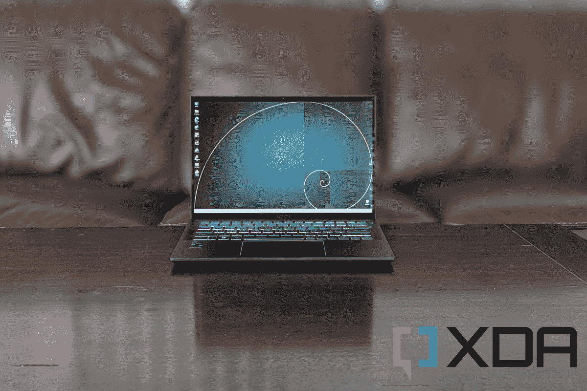

# 微星峰会 E14 翻页回顾:挑战最好的二合一设备

> 原文：<https://www.xda-developers.com/msi-summit-e14-flip-review/>

微星以其[出色的游戏笔记本电脑](https://www.xda-developers.com/best-gaming-laptops/)而闻名，所以当我收到微星峰会 E14 Flip Evo 的评论时，我很惊讶。2 合 1 市场通常由惠普、联想甚至戴尔主导，所以我想知道 E14 Flip Evo 是否足以参与竞争。

在使用 2 合 1 设备两周之后，你可能会对我将要说的话感到惊讶。事实上，这是我用过的[最好的二合一 Windows 设备](https://www.xda-developers.com/best-windows-tablets/)之一。它也值得成为最好的[微星笔记本电脑](https://www.xda-developers.com/best-msi-laptops/)之一。凭借出色的设计、16:10 的宽高比显示屏、英特尔 P 系列 CPU 的强大功能以及我在敞篷车中使用过的最好的键盘之一，这款 Windows 2 合 1 电脑值得购买，即使价格高达 1，700 美元。只有一个恼人的触控板和一个非常奇怪的 MSI 笔阻止它成为完美的设备。

 <picture></picture> 

MSI Summit E14 Flip Evo

##### 微星峰会 E14 翻转 Evo

MSI Summit E14 Flip Evo 是一款出色的 Windows 2 合 1 设备，拥有强大的功能和非常棒的设计。

**浏览此评论:**

## MSI 峰会 E14 Flip Evo:定价和供货情况

*   微星峰会 E14 Flip Evo 有很多不同的配置。你可以在新蛋和其他第三方零售商那里买到，起价 1400 美元
*   发给我审查的型号已经完全升级，售价为 1700 美元

微星峰会 E14 Flip Evo 今天在新蛋、百思买、微中心、蚂蚁在线和亚马逊有售。您可以从各种型号中进行选择，包括采用第 12 代英特尔酷睿 i5 或英特尔酷睿 i7 CPU 的型号。存储选项从 1TB 到 512GB PCIe，RAM 从 16GB 到 32GB。

这款二合一设备的起价为 1400 美元，但当然，随着你升级 RAM 存储和 CPU，价格也会上涨。我的设备完全升级到了英特尔酷睿 i7-1260P，32GB 内存和 1TB 固态硬盘。在新蛋上要花 1700 美元。采用英特尔酷睿 i7 CPU 会自动为您带来更大的固态硬盘和更多内存。

## 微星峰会 E14 翻转 Evo 规格

| 

规范

 | 

附加说明

 |
| --- | --- |
| **CPU** | 

*   第 12 代英特尔酷睿 i7-1260P (12 个内核:4 个效率，8 个性能)16 个线程，4.70 GHz 睿频加速。

 |
| **图形** |  |
| **显示** | 

*   14 英寸 QHD+ (2880x1800)，60Hz，触摸板支持 MSI 手写笔支持(MPP2.0)，16:10 宽高比

 |
| **尺寸&重量** | 

*   12.56 x 8.62 x 0.63 英寸& 3.61 磅

 |
| **内存** |  |
| **存储** |  |
| **电池** |  |
| **端口** | 

*   1 个 USB 3.2 USB A 端口
*   2 个 Thunderbolt 4 端口
*   HDMI 端口
*   音频插孔
*   microSD 卡插槽

 |
| **音频** |  |
| **连通性** | 

*   黑仔 WiFi 6E AX1675 (2x2)
*   蓝牙 5.2

 |
| **摄像机** |  |
| **颜色** |  |
| **材质** |  |
| **生物识别** | 

*   键盘下方的 Windows Hello 指纹识别器
*   Windows Hello 网络摄像机

 |

## 设计:它很重，但建造坚固

*   MSI Summit E14 Flip Evo 比其他 14 英寸 2 合 1 设备更重，但感觉更高档，也不那么花哨
*   有很多港口可以享受
*   该设备采集了许多指纹，因为它有一个哑光表面

如今，似乎大多数公司都想让 2 合 1 设备变得轻薄。然而，当我把 MSI Summit E14 Flip Evo 从盒子里拿出来时，我意识到 MSI 没有走这条路。我知道很多人喜欢电脑薄一点，但是我喜欢感觉很重的电脑。这就是我所联想到的高级版本。这款 MSI 设备很重，其材质会让你为拥有它而自豪。

作为重量参考，这款 MSI 重 3.61 磅，尺寸为 12.56 x 8.62 x 0.63 英寸。与之竞争的二合一设备是联想 Yoga 9i T1，大小差不多，重 3.09 磅。就连[的 15 英寸 Galaxy Book 2 Pro 360](https://www.xda-developers.com/samsung-galaxy-book-2-pro-360-15-review/#SamsungGalaxyBook2Pro360Performance) 也比它轻，只有 3.11 磅。

你会注意到的第一个地方是底盘。当我把手按在金属合金底盖上时，没有弯曲。底部的材料真的让它感觉很高级，甚至可以带到键盘甲板上，也一样坚固。

除此之外，我很高兴地看到，当你打开盖子时，笔记本电脑的底座会以一定的角度抬起，这有助于让打字变得舒适。然后，当将 2 合 1 转换为各种帐篷、平板电脑、笔记本电脑或支架模式时，固定屏幕的塑料铰链感觉非常僵硬。甚至还有面向屏幕顶部的通风格栅，以保持掌托和设备的其他关键部件凉爽。

这肯定不像其他二合一设备那样花哨。它简单明了，建造坚固。

这种设计的唯一缺点是盖子和键盘面板确实会收集指纹，特别是在转换到平板电脑模式时，这在一定程度上要归功于哑光黑色涂层。有些人可能不喜欢设备背面的角度，但我认为这是一个很好的触摸，为一个全黑、标准外观的 2 合 1 设备增添了一些光彩。这不像联想 Yoga 7i 或联想 Yoga 9i 那样华丽；它简单明了，为专业用户打造。

大多数其他较小的 2 合 1 设备都没有很多端口，但 MSI 对这款 14 英寸的机型有不同的想法。有 HDMI、Thunderbolt 4 USB-C、microSD 卡插槽和 USB-A 端口——基本上是避免加密狗所需的一切。机箱侧面甚至有一个网络摄像头关闭开关，以增加隐私。除此之外，Windows Hello 网络摄像头和指纹识别器也非常适合专业人士。

还有内置的磁贴追踪，所以如果你丢失了这个设备，你可以用手机追踪。你甚至可以在电脑关机时给它打电话。这建立在 Tobii Aware 等其他智能功能的基础上，当你离开时，它可以帮助模糊屏幕，当你看向别处时，它可以帮助调暗屏幕以节省电池。

## 显示器和笔:明亮和充满活力，但笔很奇怪

*   14 英寸显示屏的宽高比为 16:10，这对于提高工作效率非常有帮助
*   显示屏非常光滑，但变得非常明亮，颜色精度对于这一类设备来说还不错
*   微星随设备附带了一支笔，但使用起来感觉很别扭
*   有一个 1080p 的 FHD 网络摄像头

微星峰会 E14 Flip Evo 上的显示屏让我想起了我去年尝试的一款产品，[联想 Yoga 7i Pro](https://www.xda-developers.com/lenovo-ideapad-slim-7i-pro-review/) 。E14 Flip Evo 具有相同的分辨率，但看起来更亮，颜色更准确。不过，显示器仍然是标准的 IPS，而不是有机发光二极管，所以它不像新的联想 Yoga 9i 或[三星 Galaxy Book 2 Pro 360](https://www.xda-developers.com/samsung-galaxy-book-2-pro-360-15-review/) 那样适合内容创作任务。不过，这是一款面向商务人士或专业消费者的二合一设备，所以这不太可能有什么影响。

无论如何，我很喜欢微星峰会 E14 Flip Evo 的显示。有一天，我的互联网坏了，我被迫在图书馆工作。我随身携带 MSI，16:10 的宽高比显示屏意味着我可以并排堆叠两个 Microsoft Edge 窗口并进行多任务处理。它比我习惯的 16:9 屏幕更高更宽，给你更多的工作空间。

看视频也很棒。有一次，我的爸爸妈妈坐在沙发上，我把 MSI 支撑在帐篷模式下，我们一起观看了 YouTube 上展示我父母的祖国圭亚那森林的视频。我们是在下雨天看的，所以我们家的灯都亮着。尽管如此，我注意到屏幕很亮，我妈妈甚至提到其中一个场景中的鹦鹉看起来真的很漂亮。我欣赏高亮度，因为这是一个光滑的显示面板，但在低亮度下，你可以看到你的反射。

显示屏明亮多彩，16:10 的宽高比让您有更多的工作空间。

我在色度计上得到的数字反映了我母亲在我们观看 YouTube 视频时暗示的内容。显示达到了 88%的 AdobeRGB、83%的 NTSC、93%的 P3 和 100%的 sRGB 频谱。对于像这样的 IPS 显示器，我们通常认为这些类别中超过 80%的都是好的，所以显示器超过了我的标准。我的色度计也显示屏幕达到了 489 尼特的亮度，非常亮。甚至对比度也超过了 IPS 面板 1000:1 的标准，我的色度计显示的对比度为 1320:1。

不过，将微星用作平板电脑是一种奇怪的体验。在平板电脑模式下握持时，屏幕背面会延伸出底部基座一点，让您有空间用手指握住它。我认为这弥补了切换到 16:10 宽高比的较厚底部边框的损失。显示屏更高，因此转换后会向外延伸更多。缺少更厚的底部边框也意味着在平板电脑模式下用手抓住它的空间更小。

不过，最有意思的还是随复习单元提供的钢笔 MSI。与旧款 Surface Pen 不同，它没有可拆卸电池，因此必须通过侧面的插槽用 USB-C 充电。作为一个使用传统 Surface Pen 的人，我确实觉得这很奇怪。机箱上也没有地方放笔，所以不用的时候我就笨拙地把它放在口袋里或抽屉里。除此之外，当我在屏幕上画画时，这支笔在我手中感觉太轻了，我感觉它在我的手指间滑动。我确实喜欢这种笔尖更接近真实铅笔的尖端，但我不建议艺术家尝试这种笔。

哦，显示屏顶部还有一个 1080 像素的网络摄像头。它超越了过去笔记本电脑的标准配置 720p，甚至包括板载主动噪音消除技术。我认为我在每周的 Google Meet 通话中看起来非常好，即使是在阴天雨天，我的房间里没有太多的光线。

## 键盘:舒适宽敞

*   键盘真的很灵敏
*   然而，触控板很糟糕，也很烦人

过去两周，我每天都用 MSI Summit E14 Flip Evo 来工作，其中一个重要原因就是键盘。它设置在机箱的中间，而不是边对边，我认为这是一个很好的选择。键帽非常大，间隔均匀，我觉得它们非常柔软，反应灵敏。结果，我在必应的打字测试中表现出色，每分钟打了将近 85 个字。这是我今年在笔记本电脑上使用过的最精确的键盘之一。

不幸的是，触控板使用起来非常烦人。回应是严厉的，而且不太一致。当你用力敲击它时，它还会发出很大的咔嗒声。为了避免这种情况，我最终用我的手指在触摸表面上点击，而不是像我在鼠标上一样在表面上点击。不过，至少触控板的间距是均匀的。打字时，我有足够的空间把手掌放在一边。

## 性能:赢得胜利的英特尔 P 系列芯片

*   英特尔的 P 系列芯片使它成为一台性能卓越的机器
*   电池寿命也很棒

到目前为止，你可能已经对英特尔的第 12 代移动 CPU 系列有了很多了解，但我还是要为新用户重复一下基本知识。英特尔的 P 系列芯片位于游戏笔记本电脑的高功率 H 系列和更轻薄设备的低功率 U 系列之间。这种芯片的运行功率为 28 瓦，在许多竞争的 2 合 1 设备中很受欢迎，我在下面的图表中包括了这种芯片。

我的评测设备中的具体芯片是英特尔酷睿 i7-1260P。它有 12 个内核(4 个效率，8 个性能)，16 个线程和 4.70 GHz 睿频加速。还搭配了 32GB 的 RAM。

总的来说，我认为这款英特尔 CPU 有助于使 MSI Summit E14 Flip Evo 成为一款真正性能良好的机器。在我的日常工作任务中，我没有遇到它变慢的问题，这些任务包括使用 Microsoft Edge，每天混合 10 多个标签，同时连接到 4K 显示器。我确实在播放 4K 的视频时看到了一些延迟，但这并不经常发生。我甚至通过 Oracle Virtualbox 在系统上安装了 Windows Insider 版本，并在 4K 显示器上的微软 Edge 上运行，它没有降低系统速度。

得益于英特尔的 P 系列 CPU，这是一款性能卓越的日常 2 合 1 设备。

由于它带有 MSI 品牌，我甚至在这个系统上玩了 *GTA V* 。它在高设置下以 18.5 FPS 播放，在 1080p 的中等设置下接近 40 FPS。当然，这并不理想，但当你考虑到板上有粉丝时，当你将设置调到正确的水平时，看到英特尔的 Iris Xe 显卡可以玩游戏并不令人震惊。我仍然认为这是一个非常适合 Photoshop 和 Lightroom 的系统。如果你把它推向极端，你将面临性能问题。

总的来说，这是一个很好的日常系统，你可以用 Crossmark 和 PC Mark 10 的分数来看。交叉标记分数使系统接近我通常期望的 1500 分。然后，对于强调 CPU 和模拟日常任务的 PC Mark 10，分数在竞争的 2 合 1 机型中几乎是平等的。我们的其他测试中的多核分数可能会吓到你，因为它们比你从联想或三星那里得到的要好得多，但不要让这欺骗了你。在我的真实测试中，这台机器的外形表现仍然很好。

| 

试运转

 | 

微星峰会 E14 翻盖 Evo(英特尔酷睿 i7-1260P)

 | 

[联想 Yoga 9i(英特尔酷睿 i7-1260P)](https://www.xda-developers.com/lenovo-yoga-9i-2022-review/#LenovoYoga9iPerformance)

 | 

[三星 Galaxy Book 2 Pro 360(英特尔酷睿 i7-1260P)](https://www.xda-developers.com/samsung-galaxy-book-2-pro-360-15-review/#SamsungGalaxyBook2Pro360Performance)

 | 

[戴尔 Inspiron 灵越 14 二合一设备](https://www.xda-developers.com/dell-inspiron-14-2-in-1-review/#DellInspiron142in1Performance) (AMD 锐龙 7 5700U

 |
| --- | --- | --- | --- | --- |
| PC Mark 10 | 5,011 | 5,616 | 5,362 | 5,320 |
| 3D 标记:时间间谍 | 1,658 | 1,8211 | 1,821 | 1,256 |
| Geekbench 5(单/多) | 1,680/7,296 | 1,696/9,177 | 1,696/9,177 | 1,151/6,099 |
| Cinebench R23(单/多) | 1,556/5,822 | 1,649/7,949 | 1,649/7,949 | 1,233/7,768 |
| 交叉标记(总体/生产力/创造力/响应能力) | 1,628/1,552/1,740/1,538 | 自然资源部 | 自然资源部 | 自然资源部 |

关于电池寿命，我们认为 2022 年基于英特尔的 Windows 笔记本电脑执行日常任务的标准时间为 5-6 小时。我在 WordPress 中浏览网页、观看 YouTube 视频和工作流程，MSI 在一次充电的情况下让我完成了 6.5 小时的工作，而没有连接到显示器。也就是说，屏幕亮度设置为 30%左右，窗口设置为最佳能效。在第二天的测试中，我简单地换成了性能最好的*，差别并没有那么大。我不是 6 个小时，而是接近 4.5 或 5 个小时。与此同时，我连接了一台 4K 显示器，电池使用效率最好的是 T4 的 T5，只用了不到 4 个小时。你的结果会有所不同，但我确实认为你会达到 5-6 小时的标准。*

 *## 你应该买微星峰会 E14 翻盖 Evo 吗

**你应该买微星峰会 E14 翻盖 Evo 如果:**

*   您是一名专业人士，想要一台顶级的 2 合 1 设备
*   您想要一台可以持续工作一整天的笔记本电脑
*   你需要一个舒适的键盘

**你不应该买微星峰会 E14 翻盖 Evo 如果:**

*   你不喜欢笨重的笔记本电脑
*   你需要一个创造性工作的设备
*   你想在上面玩电子游戏

在我使用 MSI Summit E14 Flip Evo 期间，我发现在工作时间很难将它放下。这是一个简洁的系统，具有强大的功能和足够的电池寿命，可以让你完成一天的基本任务。键盘用起来也很舒服，虽然触控板很烂。总的来说，在我的 90 天贷款期过后，将很难把它送回来。

 <picture></picture> 

MSI Summit E14 Flip Evo

##### 微星峰会 E14 翻转 Evo

MSI Summit E14 Flip Evo 是一款出色的 Windows 2 合 1 设备，拥有强大的功能和非常棒的设计。你只需要担心坏的触控板。*