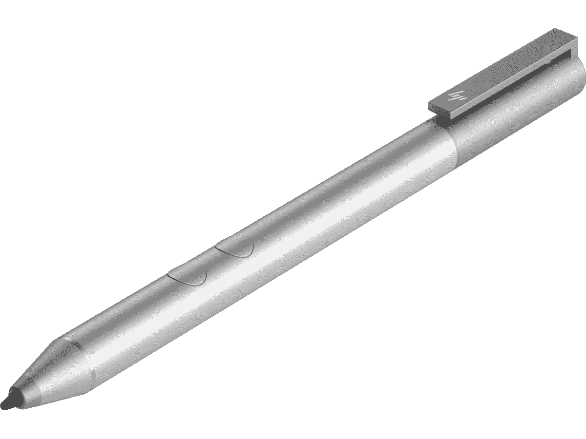

# 需要更换 Surface Pen 吗？惠普钢笔今天才 22 美元

> 原文：<https://www.xda-developers.com/need-a-surface-pen-replacement-the-hp-pen-is-just-22-today/>

自从微软十年前推出 Surface 平板电脑以来，PC 市场已经普及了许多新的外形，如可折叠、对开本等。正如我们所知，这些产品往往会带来额外的成本，无论是为你的 Surface Pro 购买键盘，还是为任何类型的敞篷车购买一支笔。毕竟他们很少带笔来。

当你花 1000 多美元买一台新电脑时，多花 100 美元买一支笔并不是最有吸引力的提议，尤其是如果你甚至不确定你会不会用它。我试图倡导的一个解决方案是等待交易。如果你第一天就不需要那支笔，或者你只是需要一支替换笔，那么今天就是申请这笔交易的日子。

惠普钢笔今天才 21.99 美元，比正常价格 65.99 美元低了 44 美元。这是一笔不错的交易，它支持 N-Trig，这意味着你不仅可以在惠普产品上使用它，还可以在 Surface 和大多数其他 Windows 机器上使用它。你只需要一个 AAAA 电池来供电，因为这个是不可充电的。

 <picture></picture> 

HP Pen

##### 惠普笔

惠普笔支持 N-Trig，可与大多数 Windows 变形本和平板电脑配合使用。

一支笔 22 美元的价格比 Surface Pen 的 99 美元要好得多，尤其是比你花 129.99 美元买一支微软的 Slim Pen 2 要好得多。

但是那些也是打折的。微软 Surface Pen 通常售价 99.99 美元，现在售价 45.99 美元，有冰蓝色、罂粟红色和铂金色。Surface Pen 可以与任何支持笔的 Surface 一起使用，从 Surface Pro 3 开始，所以 2014 年或之后发布的任何东西。

 <picture></picture> 

Surface Pen

##### 微软 Surface Pen

Surface Pen 有罂粟红、冰蓝色和铂金色，可以与所有现代 Surface 设备配合使用。

还有一件事。虽然上面的两种笔都可以在大多数支持笔功能的 Windows PCs 上使用，但如果你想要为新的 Surface Pro 平板电脑和 Surface Laptop Go 制作的笔，还有 Slim Pen 2。这款手机的折扣没有那么大，价格为 108.99 美元，而不是 129.99 美元，但它确实支持触觉反馈，让屏幕上的书写感觉更像在纸上书写。

 <picture></picture> 

Slim Pen 2

##### 微软 Surface 超薄笔 2

当它存放在 Surface Keyboard 内部时，Slim Pen 2 可以无线充电，并提供触觉反馈，使屏幕上的书写感觉更像纸。