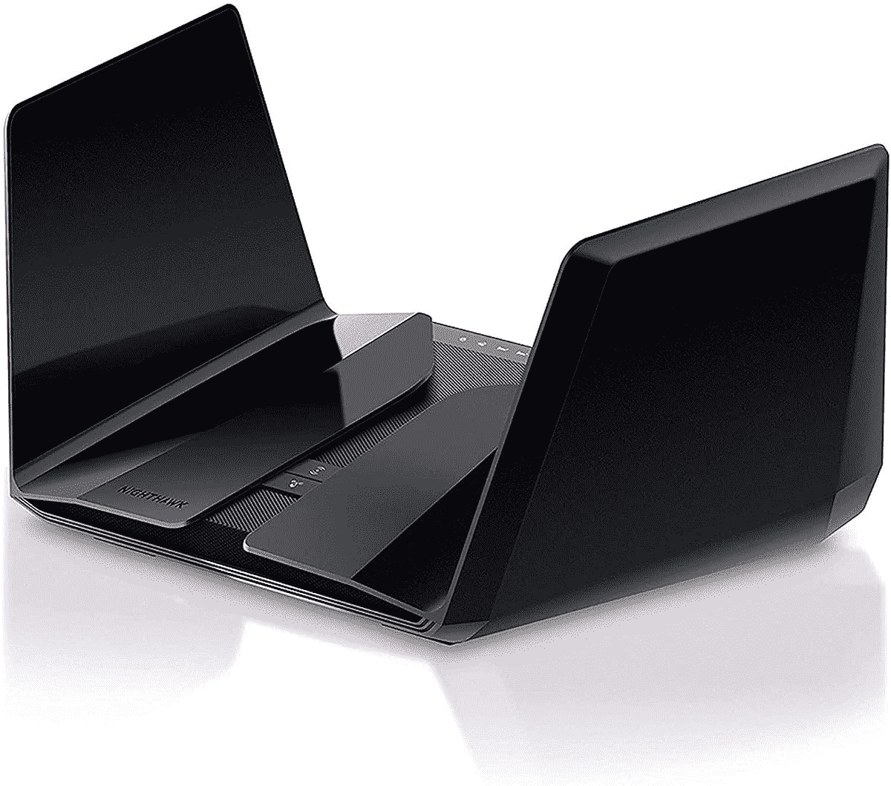
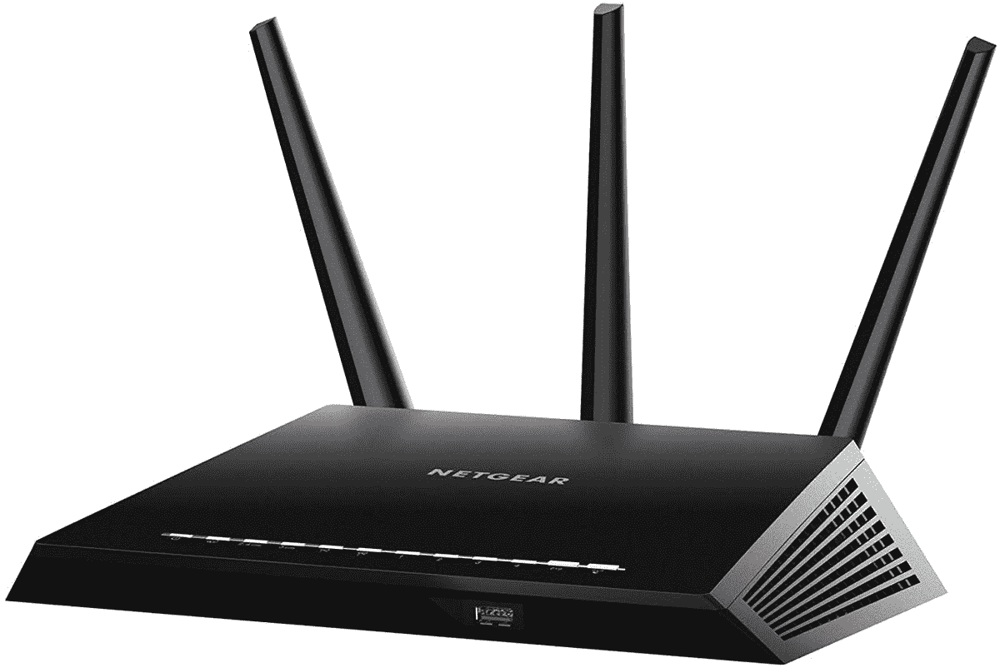
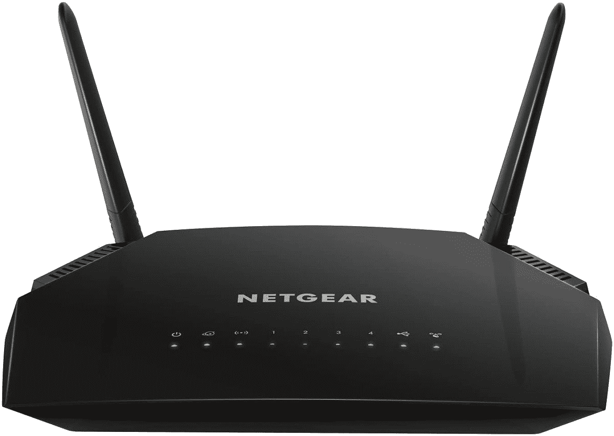
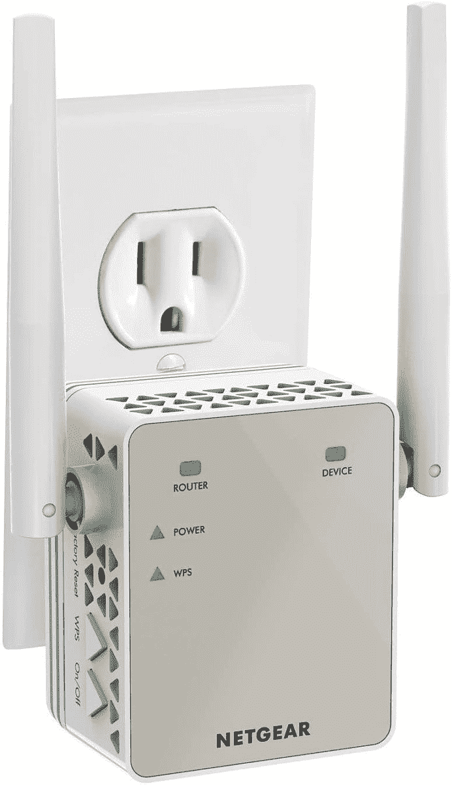

# 在网络星期一之前，Netgear Wi-Fi 路由器和扩展器最高可优惠 150 美元

> 原文：<https://www.xda-developers.com/netgear-routers-range-extenders-cyber-monday/>

如果您的家庭互联网需要升级，Netgear 产品的最新交易可能是购买一些新设备的正确时间。亚马逊在网络星期一之前正在进行网件路由器、范围扩展器和更多产品的大销售，其中许多交易都相当不错。

我们已经收集了更有趣的交易，以便您可以为自己购买一些东西，它们被组织到下面的类别中，以便更容易找到。

## Netgear Wi-Fi 路由器的早期网络星期一交易

如果你对 Wi-Fi 连接的性能不满意，不管是因为速度慢还是连接经常掉线，新的 Wi-Fi 路由器可能会为你解决这个问题。Netgear 有很多不同价格范围的产品，下面是你能买到的。Nighthawk 品牌是 Netgear 最前沿产品的所在地，但即使是更便宜的型号也可能值得购买。

 <picture></picture> 

NETGEAR Nighthawk 12-Stream Wifi 6 Router RAX200 ($150 off)

##### 网件夜鹰 RAX200 Wifi 6 路由器

这是目前最先进的 Wi-Fi 路由器之一，具有 8 根天线和三频设置，并支持 Wi-Fi 6。

 <picture></picture> 

NETGEAR Nighthawk Smart Wi-Fi Router R6900P ($40 off)

##### 网件夜鹰 R6900P 智能 Wi-Fi 路由器

这款路由器具有三根天线和双频网络，覆盖范围可达 1800 平方英尺和 30 台设备。

 <picture></picture> 

NETGEAR Wi-Fi Router R6230 ($30 off)

##### NETGEAR R6230 无线路由器

该路由器具有两个天线和双频网络，占地 1200 平方英尺，最多可连接 20 台设备。

如果你想看看其他选择，还有一些其他的 Wi-Fi 路由器交易:

## 早期网络星期一在 Netgear 系列扩展器上的交易

如果你的互联网速度足够快，但它不能到达你家的每个角落，范围扩展器可能更适合你。你现在能找到的最好的交易是 Netgear 的 EX6120 型号，它提供双频带无线连接，可以覆盖 1500 平方英尺和 25 个设备。他的模型通常卖 60 美元，但你现在只需 38 美元就能买到。

 <picture></picture> 

NETGEAR Wi-Fi Range Extender EX6120 ($22 off)

##### NETGEAR EX6120 Wi-Fi 范围扩展器

这款 Netgear Wi-Fi 范围扩展器可覆盖多达 25 台设备，覆盖面积可达 1200 平方英尺。它的速度也高达 1，200 MB/s

如果您想看看其他选项，请查看下面的其他 Netgreat Wi-Fi 范围扩展器:

### 网状网络扩展器:

### Netgear 电力线套件

也在销售的一个有趣的产品是 Netgear 的电力线套件。这是一对设备，使用您家中已有的电线来扩展有线互联网的覆盖范围。其工作方式是，将路由器或调制解调器连接到这些设备中的一个，并将其插入插座，然后将另一个设备插入家中不同的插座。然后，您可以使用另一根以太网电缆来连接您的设备，或者使用另一个 Wi-Fi 路由器来通过 Wi-Fi 共享该连接。通常，这个工具包的价格是 110 美元，但是你现在可以在亚马逊上以 75 美元买到它。

## 早期网络星期一在 Netgear 电缆调制解调器上的交易

最后，如果您想使用不同于 ISP 提供的调制解调器来设置互联网连接，Netgear DOCSIS 调制解调器也有销售。其中一些有内置的 Wi-Fi 路由器，而其他的则需要你有一个单独的 Wi-Fi 路由器。然而，这些调制解调器只与特定的 ISP 兼容，所以请确保您购买的是可以连接互联网的产品。

寻找本季的其他技术？查看我们的[网络星期一 PC deals](https://www.xda-developers.com/best-black-friday-pc-gaming-deals/) hub，找到各种以不同方式升级设备的交易。如果你对移动技术更感兴趣，我们也有一个专注于智能手机的[网络星期一](https://www.xda-developers.com/black-friday/)交易页面，你可以看看。