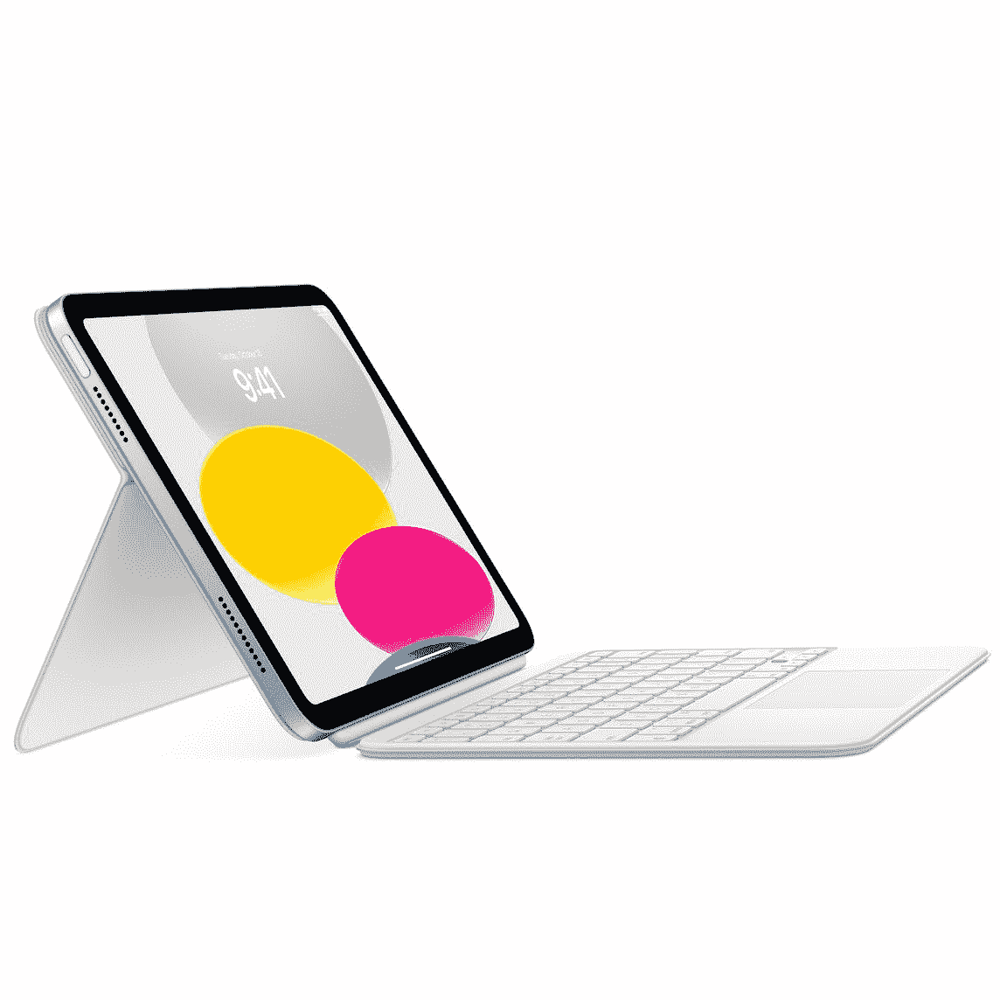
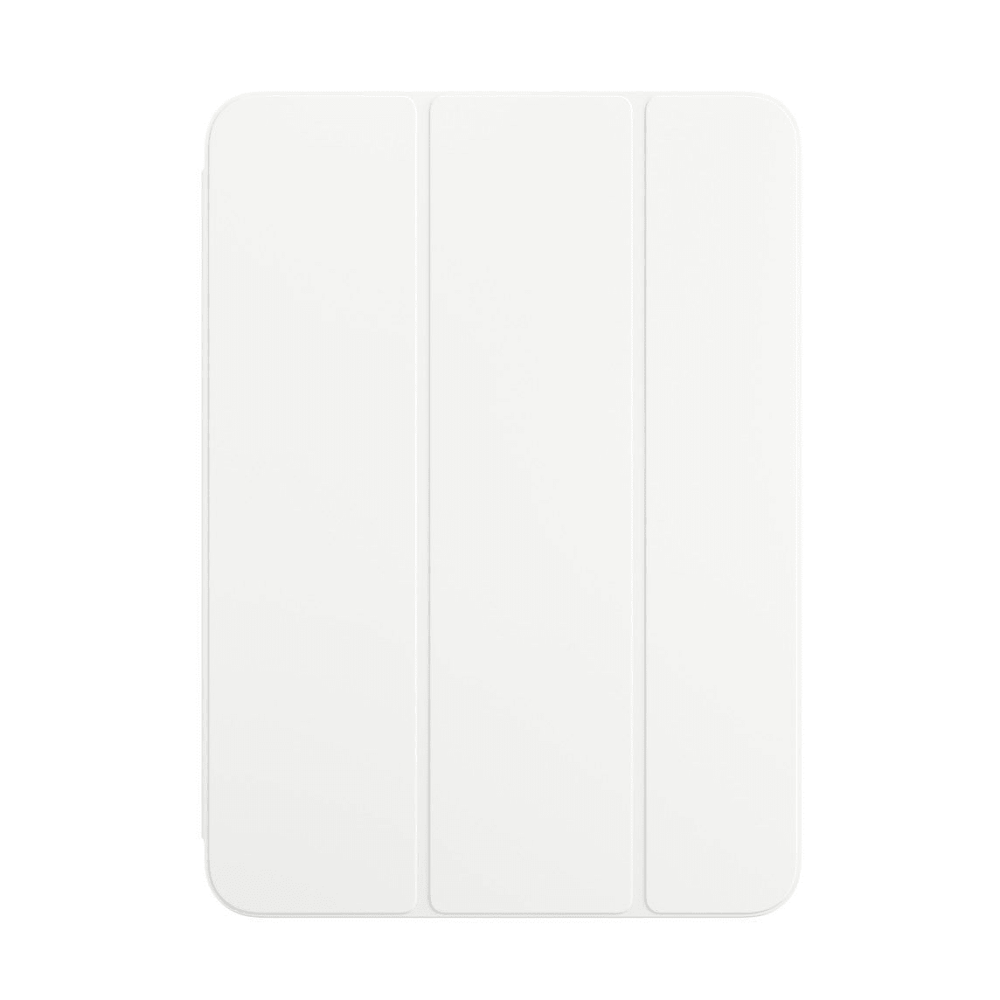
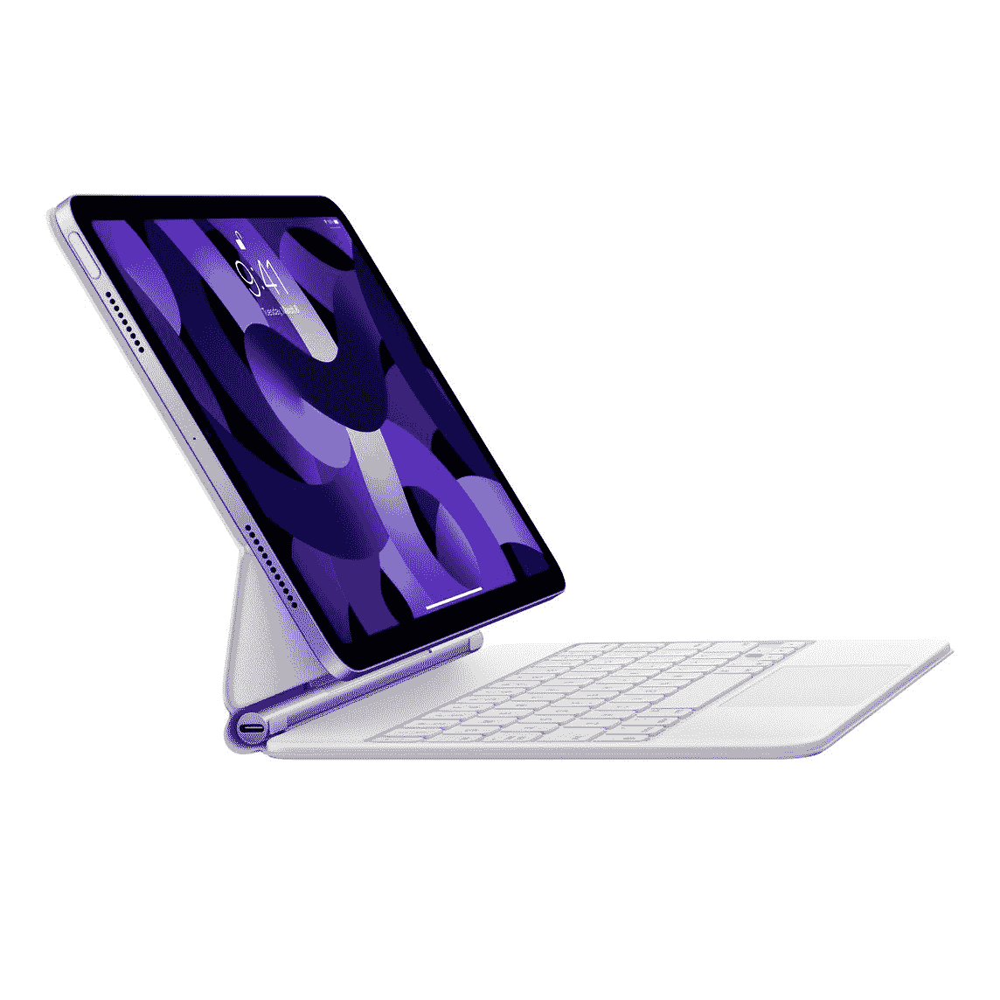
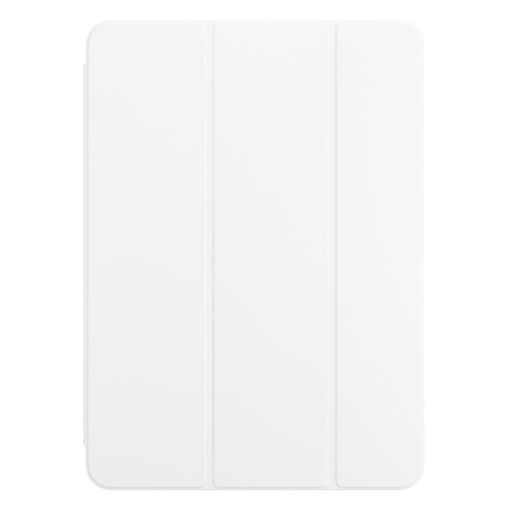

# 这些是新款 iPad 和 iPad Pro 的更新保护套

> 原文：<https://www.xda-developers.com/new-ipad-and-ipad-pro-covers-2022/>

今天，苹果公司推出了一些新产品，刷新了其 [iPad](https://www.xda-developers.com/apple-ipad-10-launch/) 、 [iPad Pro](https://www.xda-developers.com/apple-ipad-pro-m2-launch/) 、 [Apple TV](https://www.xda-developers.com/apple-tv-4k-2022-launch/) 阵容。除了宣布新的 iPad 和 iPad Pros，苹果还宣布了新的配件，新的 Magic Keyboard Folio，Smart Folio，和 Smart Magic Keyboards。所以，事不宜迟，让我们来看看所有可用的新配件。

## 适用于 iPad 的 magic Keyboard Folio(249 美元)

 <picture></picture> 

Magic Keyboard Folio

##### 魔法键盘对开本

Magic Keyboard Folio 通过其键盘和触控板附件提供保护和附加功能。

对于想要保护新 iPad 的人来说，Magic Keyboard Folio 保护套是一个很好的选择。封面分为两部分，分别保护正面和背面。除了保护，你还会得到一个键盘和触控板。对于最新的 iPad，Magic Keyboard Folio 只有一种颜色，白色，售价为 249 美元。

## 适用于 iPad 的 Smart Folio 美元)

 <picture></picture> 

Smart Folio

##### 智能对开

Smart Folio 有多种颜色，磁性附着，保护显示器。

Smart Folio 是 iPad 的经典之作，提供了一个超薄的设计，可以磁性附着并保护前面的显示屏。外壳还可以两种不同的方式折叠，提供不同的支架配置。新的 Smart Folio 有新的颜色，如白色、柠檬色、西瓜色和天空色。至于价格，它的价格是 79 美元。

## iPad Pro 11 英寸(299 美元)和 12.9 英寸(349 美元)的魔法键盘

 <picture></picture> 

Magic Keyboard

##### 魔法键盘

Magic Keyboard 提供保护、键盘和触控板。

对于那些想要苹果为他们的新 iPad Pro 提供最好的东西的人来说，Magic Keyboard case 是一个很好的选择。该保护套在正面和背面提供保护，并且还具有键盘和触控板。盖子也有一个浮动悬臂设计，使 iPad 能够调整到最佳视角。Magic Keyboard 还提供了一个用于直通充电的 USB C 端口，有黑色和白色两种颜色。然而，所有这些都不便宜，11 英寸的型号售价 299 美元，12.9 英寸的型号售价 349 美元。

## 用于 iPad Pro 11 英寸(179 美元)和 12.9 英寸(199 美元)的智能键盘

 <picture></picture> 

Smart Folio

##### 智能键盘对折

Smart Keyboard Folio 提供保护和您在旅途中高效工作所需的工具。

智能键盘 Folio 为 iPad Pro 的正面和背面提供了很大的保护。视角可以在两个位置调节，它也有一个舒适的键盘，但没有触控板。智能键盘 Folio 只有黑色，11 英寸的价格为 179 美元，12.9 英寸的价格为 199 美元。

## iPad Pro 11 英寸(79 美元)和 12.9 英寸(99 美元)的 Smart Folio

 <picture></picture> 

Smart Folio

##### 智能对开

iPad Pro 的 Smart Folio 为显示器提供保护，并可以转变为支架。

Smart Folio 是 iPad 的经典之作，也是 iPad Pro 的完美保护套。盖子通过磁性附着，保护正面显示屏。它还可以转换成支架，提供两种不同的配置。新款 79 美元的 Smart Folio 有多种颜色，如 11 英寸机型的黑色、白色、英国薰衣草色和海洋蓝色。12.9 英寸型号的 99 美元 Smart Folio 有相同的颜色，但也增加了绿头鸭绿和电橙。如果对上述任何案例感兴趣，请务必点击链接，在那里您将找到最新的价格。